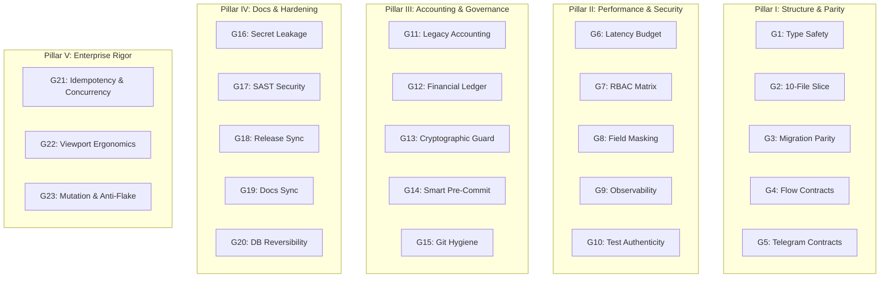

# Domain Rulebook 05: Quality Gates Taxonomy (G1–G23 Master Matrix)

> **Authority:** Derived from [`GEMINI.md`](../../GEMINI.md) Part 5 & [`docs/27-enterprise-ai-governance-and-quality-gates-constitution.md`](../../docs/27-enterprise-ai-governance-and-quality-gates-constitution.md).  
> **Status:** Supreme Quality & Governance Constitution.

---

## The 23 Canonical Quality Gates (G1–G23)

Every change, pull request, and commit must satisfy the complete 23 Quality Gates matrix before merging into `main`.

---

### Pillar I: Structure & Parity (G1–G5)
- **G1 (Type Safety):** Zero `any`, strict TypeScript configuration across entire monorepo (`pnpm typecheck`).
- **G2 (10-File Slice Architecture):** Every flow must contain the canonical 10 files (`flow.contract.json`, `index.ts`, `controller.ts`, `menu.builder.ts`, `action.handler.ts`, `service.ts`, `types.ts`, `validator.ts`, `error.handler.ts`, and test).
- **G3 (Migration Registry Parity):** Every migrated flow must be registered in `docs/19` with verified commit and path.
- **G4 (Flow Contracts):** `flow.contract.json` must be valid, declaring all states, actions, transitions, and RBAC roles.
- **G5 (Telegram Contracts):** Strict AST verification: <= 512 bytes for URLs, <= 64 bytes for callback data, anti-dynamic injection.

### Pillar II: Performance & Security (G6–G10)
- **G6 (Latency Budget):** Sub-300ms execution budget; no blocking `deleteMessage` or awaited `setMyCommands`.
- **G7 (RBAC Matrix & Role Immunity):** Strict role authorization; zero deprecated roles; immunity on administrative actions.
- **G8 (Compensation Field Masking):** Salary and compensation fields must be masked at repository and presentation layers.
- **G9 (Observability Contract):** Zero `console.error` or `console.log` in production code; all errors logged through `@alsaada/shared/logger`.
- **G10 (Test Authenticity):** Zero sham assertions (`expect(true).toBe(true)`), meaningful assertions on both status and payload.

### Pillar III: Accounting & Governance (G11–G15)
- **G11 (Legacy Accounting Invariants):** Strict mathematical parity with `F:\HR` accounting rules and deduction formulas.
- **G12 (Financial Ledger Double-Entry):** Triple clearing and balanced debit/credit ledgers for all financial transactions.
- **G13 (Cryptographic Tamper Guard):** Hash verification of all protected files via `governance.lock.json`.
- **G14 (Smart Pre-Commit Test Guard):** Automatic detection and execution of related tests on modified TypeScript files.
- **G15 (Git Hygiene):** Zero direct commits to `main`, proper branch naming taxonomy, no dangling merge conflicts.

### Pillar IV: Docs & Hardening (G16–G20)
- **G16 (Secret Leakage Prevention):** Zero exposed API keys, tokens, or credentials in tracked files.
- **G17 (SAST Security Scan):** Static application security testing passing without critical vulnerabilities.
- **G18 (Release Sync):** Clean semantic versioning and release synchronization across monorepo workspaces.
- **G19 (Documentation Sync & Parity):** Bidirectional sync between code contracts and documentation portal.
- **G20 (DB Migration Reversibility):** All Prisma migrations must include verified, tested down-migration strategies.

### Pillar V: Enterprise Rigor (G21–G23)
- **G21 (Idempotency & Concurrency Safety):** Unique idempotency keys on all state mutations, distributed locking on concurrent operations.
- **G22 (Mobile Viewport Ergonomics):** Telegram button budget (36/16/7/3) to prevent clipping on mobile devices; mandatory Mermaid state diagrams.
- **G23 (Mutation & Anti-Flake Coverage):** High-mutation survival score; tests pinned to `PINNED_BASE_TIME` without timing drift.
