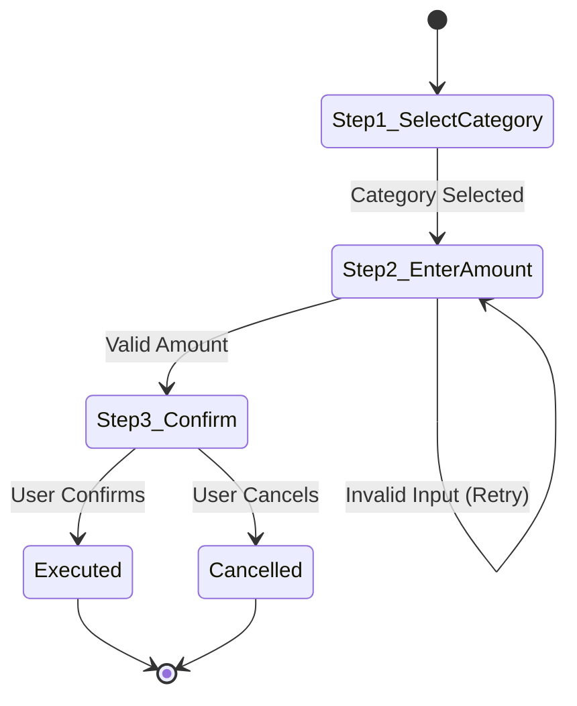

# Domain Rulebook 07: Telegram Mobile UX & Ergonomics Standard

> **Authority:** Derived from [`GEMINI.md`](../../GEMINI.md) Part 8 & [`docs/27`](../../docs/27-enterprise-ai-governance-and-quality-gates-constitution.md) (G5, G8, G22).  
> **Status:** Mandatory Sovereign Telegram Bot UX Standard.  
> **Enforcement:** Audited continuously by `/saleh` and automated governance suites (`tools/governance/saleh-audit-suite.ts`).

---

## 1. Mandatory Adoption of the Unified Presentation Library

To guarantee aesthetic consistency, mobile ergonomic integrity, and strict adherence to enterprise design standards, **all bot flows, wizards, and notification screens across `modules/*/src/flows/` must exclusively utilize the Unified Presentation Library**:

1. **Mandatory Canonical Imports:**
   - Text formatters: `@alsaada/core-components/formatting` (`formatBreadcrumbs`, `formatSpoiler`, `formatMonospace`, `formatExpandableQuote`, `formatClickToCopy`, `buildCopyTextButton`).
   - Regional formatters: `@alsaada/regional-engine` (`formatCurrency`, `formatDateDMY`, `normalizeDigits`).
   - Standard components: `@alsaada/core-components` (`ConfirmationCard`, `AmountPicker`, `DatePicker`, `InPlaceFlowManager`).
2. **Strict Ban on Raw Message Bypassing:**
   - Direct hardcoded calls to `ctx.reply("raw string")` or `ctx.editMessageText("raw string")` that bypass message definitions (`flow.messages.ts`) or formatters are **STRICTLY FORBIDDEN**.
   - Bypassing the presentation library immediately triggers failure in **Gate G5 (`TELEGRAM_CONTRACT_FAIL`)** and **Gate G22 (`VIEWPORT_ERGONOMICS_FAIL`)**, yielding an automated `[REJECT]` verdict from `/saleh`.

---

## 2. The 10 Rich Message Demo Primitives & Official Telegram Specs

All bot interactions must implement the 10 canonical Telegram Bot API Rich Message primitives:

| # | Primitive | Implementation Standard | Governed Risk / Benefit |
| :-: | :--- | :--- | :--- |
| **1** | **Formatted Text & Strict Syntax** | Use MarkdownV2 or HTML strictly with verified entity escaping. Bold headers, clean bullet hierarchy. | Eliminates parsing errors and raw unrendered markup leakage. |
| **2** | **Expandable Blockquotes** | Use `formatExpandableQuote(text)` / `<blockquote expandable>`. Collapses lengthy policies, terms, and audit details to 2 lines on mobile. | Prevents screen flooding; provides native tap-to-expand UX. |
| **3** | **Spoiler Masking** | Use `formatSpoiler(text)` / `<tg-spoiler>` / `\|\|...\|\|` for sensitive data, daily wages, and net salaries. | Protects financial confidentiality (Gate G8); reveals on intentional user tap. |
| **4** | **Monospace Tables** | Use `formatMonospace(table)` / ` ``` ` with fixed-width column alignment for financial ledgers, salary receipts, and quantities. | Guarantees perfect numerical column alignment on all device fonts. |
| **5** | **Content Protection (`protect_content: true`)** | Enable `protect_content: true` on all messages containing sensitive compensation, identity documents, or passwords. | Disables client-side forwarding, copying, and screenshots on mobile clients. |
| **6** | **Chunking & Character Budgets** | Strict message size ceiling: `< 4096 characters` for text messages, `< 1024 characters` for media captions. Auto-split long lists. | Prevents silent Telegram API rejections (`MESSAGE_TOO_LONG`). |
| **7** | **Mobile Keyboard Budget (36/16/7/3)** | Adhere to `36/16/7/3`: callback <=36 bytes, label <=16 chars, rows <=7, cols <=3. | Eliminates button label clipping on narrow viewports (e.g. iPhone SE, Android). |
| **8** | **Media Groups / Photo Collages** | Group multiple receipts, invoices, or identity cards via `sendMediaGroup` (up to 10 photos). | Replaces chat spam with compact native photo grid collages. |
| **9** | **In-Place Navigation & Stream Live Updates** | Update conversational state via `ctx.editMessageText` and animated progress indicators for background tasks. | Keeps chat history pristine and eliminates message spam. |
| **10** | **Arabic RTL & BiDi Layout Alignment** | Inject Unicode Right-to-Left Marks (`\u200F` / RLM) when mixing Arabic text with Latin codes, amounts, or currencies (`EGP`). | Fixes reversed punctuation, distorted numerals, and bracket inversion. |

---

## 3. Telegram Mobile Ergonomics & Viewport Budget (36/16/7/3)

To prevent text clipping, keyboard overflow, and poor user experience on mobile screens, all Telegram inline keyboards must adhere strictly to the **36/16/7/3 Budget**:

| Parameter | Limit | Rationale |
| :--- | :---: | :--- |
| **Max Callback Data** | `36 bytes` | Strict internal budget (Telegram API hard limit: 64 bytes). Prevents truncation in nested state handlers. |
| **Max Button Label** | `16 characters` | Prevents text wrapping or ellipsis truncation on narrow mobile viewports (e.g., iPhone SE, compact Android). |
| **Max Keyboard Rows** | `7 rows` | Prevents vertical viewport flooding; keeps message header and action buttons visible simultaneously. |
| **Max Buttons per Row** | `3 buttons` | Avoids cramped horizontal layout and accidental tap misfires. |

---

## 4. In-Place Navigation & Standard Controls

1. **In-Place Message Updates:**
   - Multi-step wizards must update the existing message using `ctx.editMessageText` rather than spamming new messages into the chat history.
   - Preserves clean conversational history and reduces chat clutter.
2. **Standard Navigation Controls:**
   - Every wizard step must include a standard back button: `[ ◀️ السابق ]` (`cb:back`).
   - The final confirmation step must clearly distinguish confirmation from cancellation:
     - `[ ✅ تأكيد ]` (`cb:confirm`)
     - `[ ❌ إلغاء ]` (`cb:cancel`)
3. **Safe Background Deletion:**
   - Use `safeDeleteBackground(ctx, messageId)` for non-blocking message deletion to maintain the sub-300ms latency budget (Gate G6).

---

## 5. Mandatory Mermaid State Diagrams in Walkthroughs

1. **Visual State Flow Requirement:** Every completed flow walkthrough (`walkthrough.md`) must include a rendered Mermaid `stateDiagram-v2`.
2. **Diagram Structure:**
   - Must visually depict each wizard step, branching condition, validation error loop, and terminal state (`Success` or `Cancelled`).
   - Example:


---

## 6. Automated Quality Gate Enforcement

Violations of this standard trigger automated governance rejection across two mandatory gates:

- **Gate G5 (`TELEGRAM_CONTRACT_FAIL`):** Triggered when callback data exceeds 36 bytes, URLs exceed 512 bytes, or buttons contain multiline labels.
- **Gate G22 (`VIEWPORT_ERGONOMICS_FAIL`):** Triggered when raw string bypasses are detected, button labels exceed 16 characters, keyboards exceed 7 rows or 3 columns, or the required `stateDiagram-v2` is absent.

Both gates are enforced programmatically via:
```bash
tsx tools/governance/saleh-audit-suite.ts --presentation
pnpm telegram-contracts:verify
```
