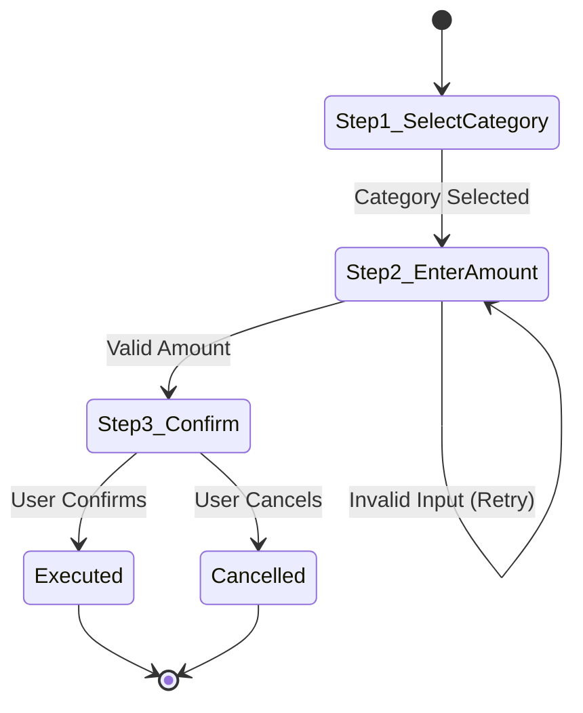

# Domain Rulebook 07: Telegram Mobile UX & Ergonomics Standard

> **Authority:** Derived from [`GEMINI.md`](../../GEMINI.md) Part 8 & [`docs/27`](../../docs/27-enterprise-ai-governance-and-quality-gates-constitution.md) (G5, G22).  
> **Status:** Mandatory Telegram Bot Standard.

---

## 1. Telegram Mobile Ergonomics & Viewport Budget (36/16/7/3)

To prevent text clipping, keyboard overflow, and poor user experience on mobile screens, all Telegram keyboards must adhere strictly to the **36/16/7/3 Budget**:

| Parameter | Limit | Rationale |
| :--- | :---: | :--- |
| **Max Callback Data** | `36 bytes` | Strict internal budget (Telegram API hard limit: 64 bytes). Prevents truncation in nested state handlers. |
| **Max Button Label** | `16 characters` | Prevents text wrapping or truncation on narrow mobile viewports (e.g., iPhone SE, compact Android). |
| **Max Keyboard Rows** | `7 rows` | Prevents vertical viewport flooding; keeps message and action buttons visible simultaneously. |
| **Max Buttons per Row** | `3 buttons` | Avoids cramped horizontal layout and accidental taps. |

---

## 2. In-Place Navigation & Message Editing

1. **In-Place Message Updates:**
   - Multi-step wizards must update the existing message using `ctx.editMessageText` rather than spamming new messages into the chat history.
   - Preserves clean conversational history and reduces chat clutter.
2. **Standard Navigation Controls:**
   - Every wizard step must include a standard back button: `[ ◀️ السابق ]` (`cb:back`).
   - The final confirmation step must clearly distinguish confirmation from cancellation:
     - `[ ✅ تأكيد ]` (`cb:confirm`)
     - `[ ❌ إلغاء ]` (`cb:cancel`)

---

## 3. Mandatory Mermaid State Diagrams in Walkthroughs

1. **Visual State Flow Requirement:** Every completed flow walkthrough (`walkthrough.md`) must include a rendered Mermaid `stateDiagram-v2`.
2. **Diagram Structure:**
   - Must visually depict each wizard step, branching condition, validation error loop, and terminal state (`Success` or `Cancelled`).
   - Example:

