# Domain Rulebook 08: Code Defect Lifecycle, Spec-First Dossier & Attestation Governance

> **Authority:** Derived from [`GEMINI.md`](../../GEMINI.md) Part 7, Work Plan 93, & [`docs/code-incidents/`](../../docs/code-incidents/).  
> **Status:** Mandatory Quality & Stability Protocol (Gate G14 / G15 / WP 93).  
> **Sovereign Auditor:** `/saleh` (Chief Forensic Reality Auditor).  
> **Scope:** Applies universally to any bug fix, regression repair, test failure, or incident resolution.

---

## 1. Constitutional Invariants for Defect Repair

Every defect resolution must strictly adhere to:
1. **Direct User Orders Precedence:** User orders override baseline defaults. Proactive inspection of `F:\HR` is suspended unless explicitly requested.
2. **Immediate Execution Freeze (Zero "Vibe-Fixing"):** If an automated test fails or a bug is detected, agents are strictly forbidden from making immediate ad-hoc edits to production code (`src/`).
3. **Spec-Before-Code Invariant:** No source code modification is permitted without an approved defect dossier in `docs/code-incidents/` and explicit approval formula.
4. **Dedicated Branch Isolation (OBOO):** Defect fixes must occur on a dedicated isolated branch created strictly from clean `main` via `pnpm branch:incident <slug>`. Mixing bug fixes into feature branches is strictly prohibited.
5. **Zero-Placeholder Invariant:** All incident dossiers must pass `pnpm incident:verify` with zero unfilled placeholders (`[...]`, `TODO`, `TBD`, etc.) and all referenced test/source file paths verified physically on disk.
6. **Permanent Regression Test:** Every repair mandates an authenticated regression test that fails first (Red) and permanently prevents regression recurrence.
7. **Zero Blast Radius:** Corrections must be surgical and strictly confined to the affected component. Modifying or skipping existing tests to force a pass is strictly prohibited (Anti-Cheating G10).
8. **Mandatory Attestation Card:** Every repair must conclude with the verbatim, untranslated attestation formula.

---

## 2. Six-Phase Defect Lifecycle & Two-Stage Documentation

```mermaid
flowchart TD
    subgraph P0["المرحلة 0: التجميد وصياغة الملف الجنائي المسبق (Spec-Before-Code)"]
        A1["1.1 تجميد الكود وحظر التعديل الفوري"] --> A2["1.2 فتح فرع الإصلاح: pnpm branch:incident"]
        A2 --> A3["1.3 تحرير الأقسام 1 و 2 و 3 في docs/code-incidents/"]
        A3 --> A4{"1.4 🛑 توقف إلزامي: اعتماد خطة الإصلاح من صالح"}
    end

    subgraph P1["المرحلة 1: فك الأقفال المشفرة للملفات المصابة (إن وجدت)"]
        B1["2.1 فحص الكيان وتوليد الرمز: pnpm unlock:request"] --> B2{"2.2 🛑 توقف إلزامي: انتظار رمز الفك في الشات"}
        B2 -->|«موافق على الفتح UNLOCK-XXXXXX»| B3["2.3 تأكيد الفك جنائياً: pnpm unlock:confirm"]
    end

    subgraph P2["المرحلة 2: اختبار التراجع الدائم والإصلاح الجراحي"]
        C1["3.1 كتابة اختبار التراجع الدائم (Permanent Regression Test)"] --> C2["3.2 إصلاح الكود المصدري بأقل أثر (Zero Blast Radius)"]
    end

    subgraph P3["المرحلة 3: الفحص الجنائي المزدوج وبوابات الجودة"]
        D1["4.1 التحقق الجنائي: pnpm incident:verify && pnpm test:incidents"] --> D2["4.2 فحص الأنواع وبوابات الجودة: pnpm ci:simulate"]
    end

    subgraph P4["المرحلة 4: إعادة القفل وتوثيق الإغلاق الجنائي"]
        E1["5.1 إعادة القفل التلقائية: pnpm lock"] --> E2["5.2 استكمال الأقسام 4 و 5 و 6 في الملف الجنائي"]
    end

    subgraph P5["المرحلة 5: التقرير الختامي وبطاقة الإقرار وبوابة الدمج"]
        F1["6.1 تسليم البطاقات الختامية + بطاقة الإقرار الجنائي الإلزامية"] --> F2{"6.2 🛑 توقف إلزامي: طلب إذن الدمج"}
        F2 -->|«ادمج الفرع»| F3["6.3 تنفيذ الدمج: git merge --no-ff"]
    end

    A4 -->|«موافق على خطة الإصلاح»| B1
    B3 --> C1
    C2 --> D1
    D2 --> E1
    E2 --> F1
```



### Phase 0: The Forensic Freeze & Spec Gate (Stage 1 Documentation)
1. Freeze execution immediately upon test failure or defect detection.
2. Create dedicated incident branch from clean `main`:
   ```bash
   pnpm branch:incident <slug>
   ```
   *(Branch format: `fix/inc-YYYYMMDD-<slug>`)*.
3. Author Stage 1 in `docs/code-incidents/INC-YYYYMMDD-<slug>.md` using `TEMPLATE.md`:
   - **Section 1 (Metadata & Scope):** Incident ID, date, branch, affected component, and test paths.
   - **Section 2 (Symptoms & Signatures):** Precise description, actual vs. expected terminal failure outputs, and failing test code.
   - **Section 3 (5 Whys RCA):** Deep 5-step causal chain identifying the root cause.
   - **Section 4 (Draft Fix Plan):** Surgical fix outline and proposed code diff.
4. **🛑 Hard Stop 1:** Stop completely. Await verbatim approval from user:
   > **«موافق على خطة الإصلاح»** or **«موافق على تعديل الكود المصدري»**

### Phase 1: Dynamic OTP Unlocking (If Target Files Are Locked)
1. Request unlock nonce: `pnpm unlock:request <target> --reason="<justification>"`.
2. **🛑 Hard Stop 2:** Await user authorization in chat:
   > **«موافق على الفتح <UNLOCK-XXXXXX>»** or **«نعم موافق على التعديل <UNLOCK-XXXXXX>»**
3. Confirm unlock: `pnpm unlock:confirm <target>`.

### Phase 2: Permanent Regression Test & Surgical Fix
1. Author permanent regression test in target test suite reproducing the failure (TDD Red).
2. Execute test and confirm it fails on unmodified source code.
3. Apply surgical fix to production source code (`src/`) with zero blast radius.
4. Re-execute test and confirm it turns green. Zero modification of existing tests allowed.

### Phase 3: Forensic Verification Gate
1. Execute incident verifiers:
   ```bash
   pnpm incident:verify
   pnpm test:incidents
   ```
   Ensures zero placeholders (`[...]`, `TODO`, `TBD`) and physical reality of all disk paths.
2. Execute full quality gates simulation:
   ```bash
   pnpm preflight:fix && pnpm typecheck && pnpm test && pnpm ci:simulate
   ```

### Phase 4: Re-Locking & Stage 2 Documentation
1. Re-lock target entity immediately: `pnpm lock <target>`.
2. Complete Stage 2 in `docs/code-incidents/INC-YYYYMMDD-<slug>.md`:
   - **Section 4 (Final Resolution):** Exact code diff and OCR review output.
   - **Section 5 (Regression Proof):** Regression test snippet and real terminal execution log with Exit Code 0.
   - **Section 6 (Preventive Measures):** Concrete structural safeguards to prevent recurrence.

### Phase 5: Direct User-Facing Completion Report (The Attestation Card)
Deliver the structured completion report in chat:
1. **Lock Card:** `«✅ تم قفل الوظيفة [س] برمجياً وتشفيرها بنجاح»`.
2. **Pre-Flight 10-Point Card:** Full checklist verification.
3. **Quality Gates Card:** 23/23 gates passed.
4. **Incident Verification Card:** Confirmation of `pnpm incident:verify` and `pnpm test:incidents` pass.
5. **Defect Summary:** Symptoms, root cause, resolution, and link to dossier.
6. **Mandatory Attestation Card (Work Plan 93):**
   > **«✅ تم توثيق وحل الخلل بالكامل في مجلد المشاكل [INC-YYYYMMDD-SLUG] داخل الفرع المنعزل واجتياز الفحص الجنائي»**

### Phase 6: Merge Gate
1. **🛑 Hard Stop 3:** Await verbatim merge command from user:
   > **«ادمج الفرع»**
2. Execute merge: `git merge --no-ff`.

---

## 3. Circuit Breakers & Instant Reject Triggers
An automatic `[REJECT]` verdict is issued if:
- Modifying production code before incident dossier approval.
- Any placeholders (`TODO`, `[...]`) present in incident report.
- Fixing defect without a failing-first permanent regression test.
- Modifying defect on feature branch or on `main`.
- Leaving entities unsealed before merge.
- Omitting the mandatory completion attestation card.
