# Domain Rulebook 11: Sovereign Standard for Modification Lifecycle (SSML)

> **Authority:** Derived from [`GEMINI.md`](../../GEMINI.md) Part 1, 3, 4, 6 & [`Rulebook 02`](02-autonomous-execution-and-checkpoints.md), [`Rulebook 10`](10-ai-agent-discipline-and-preflight.md).  
> **Status:** Mandatory Enterprise Operational Standard.  
> **Sovereign Auditor:** `/saleh` (Chief Forensic Reality Auditor).  
> **Scope:** Applies to any modification of files, functions, or modules across the monorepo.

---

## 1. Constitutional Invariants for Modifications

Every modification request (file, function, or module) must strictly adhere to:
1. **Direct User Orders Precedence:** User orders override baseline defaults. Proactive inspection of `F:\HR` is suspended unless explicitly requested.
2. **Strict Main Immunity:** Zero direct modifications or commits on `main`.
3. **One Branch, One Objective (OBOO):** Dedicated isolated branch from clean `main` (`pnpm branch:feature <name>`).
4. **Zero Blast Radius:** Modifications must strictly touch approved files only.
5. **Spec-Before-Code:** No code edits permitted before implementation plan approval.
6. **Zero Raw Text Policy:** Telegram messages must strictly use `@alsaada/core-components/rich-message` and pass `assertRichMessage(msg)`.
7. **Predefined Script Execution:** Use predefined npm scripts (`pnpm <script>`) exclusively; no ad-hoc commands with dynamic flags.

---

## 2. Six-Phase Modification Lifecycle

```mermaid
flowchart TD
    subgraph P0["المرحلة 0: التخطيط والمواصفة (Spec-Before-Code)"]
        A1["1. استكشاف نطاق التعديل (Read-Only)"] --> A2["2. صياغة وثيقة الخطة implementation_plan.md"]
        A2 --> A3{"3. 🛑 توقف إلزامي: اعتماد الخطة من صالح"}
    end

    subgraph P1["المرحلة 1: العزل وفك الأقفال المشفرة (OTP Protocol)"]
        B1["4. تفريع فرع منعزل: pnpm branch:feature"] --> B2["5. فحص حالة القفل في governance.lock.json"]
        B2 --> B3["6. تشغيل طلب الفك: pnpm unlock:request"]
        B3 --> B4{"7. 🛑 توقف إلزامي: انتظار رمز الفك في الشات"}
        B4 -->|«موافق على الفتح UNLOCK-XXXXXX»| B5["8. تأكيد الفك جنائياً: pnpm unlock:confirm"]
    end

    subgraph P2["المرحلة 2: التطوير والتنفيذ المنضبط"]
        C1["9. كتابة/تحديث الاختبار أولاً (TDD Red)"] --> C2["10. تعديل الكود المصدري (Rich Message + 10-File)"]
    end

    subgraph P3["المرحلة 3: الفحص والتحقق الفيزيائي"]
        D1["11. التنسيق الذاتي: pnpm preflight:fix"] --> D2["12. فحص الأنواع والاختبارات pnpm typecheck && pnpm test"]
        D2 --> D3["13. محاكاة خط الإنتاج: pnpm ci:simulate"]
    end

    subgraph P4["المرحلة 4: إعادة القفل وتوثيق الإنجاز"]
        E1["14. إعادة القفل التلقائية: pnpm lock"] --> E2["15. توثيق الجولة في walkthrough.md"]
    end

    subgraph P5["المرحلة 5: التقرير الختامي المباشر وبوابة الدمج"]
        F1["16. عرض البطاقات الخمس الختامية في الشات"] --> F2{"17. 🛑 توقف إلزامي: طلب إذن الدمج"}
        F2 -->|«ادمج الفرع»| F3["18. تنفيذ الدمج: git merge --no-ff"]
    end

    A3 -->|موافقة صالح| B1
    B5 --> C1
    C2 --> D1
    D3 --> E1
    E2 --> F1
```

### Phase 0: Planning & Specification (The Spec Gate)
1. Read-only inspection of affected files (`view_file`, `grep_search`).
2. Identify core invariants and document proposed diff in `implementation_plan.md`.
3. **🛑 Hard Stop 1:** Stop completely. Await explicit plan approval before touching code or creating branches.

### Phase 1: Isolation & Dynamic OTP Unlocking
1. Create dedicated branch: `pnpm branch:feature <feature-slug>`.
2. Inspect `governance.lock.json` for target locks.
3. If locked, request unlock token: `pnpm unlock:request <target> --reason="<justification>"`.
4. **🛑 Hard Stop 2:** Stop immediately. Await user authorization in chat:
   > **«موافق على الفتح <UNLOCK-XXXXXX>»** or **«نعم موافق على التعديل <UNLOCK-XXXXXX>»**
5. Confirm unlock: `pnpm unlock:confirm <target>`.

### Phase 2: TDD & Targeted Implementation
1. Write/update failing test first (TDD Red).
2. Modify source code strictly within the targeted scope.
3. For Telegram bot flows: enforce `@alsaada/core-components/rich-message`, `assertRichMessage`, and 36/16/7/3 ergonomics budget.
4. For logging: use `@alsaada/shared/logger` exclusively (zero console.log/console.error).

### Phase 3: Physical Verification
1. Self-healing format: `pnpm preflight:fix`.
2. Typecheck & unit tests: `pnpm typecheck` && `pnpm test`.
3. Comprehensive 23-gate simulation: `pnpm ci:simulate`.
4. Independent audit: `pnpm audit:saleh`.

### Phase 4: Mandatory Auto Re-Lock & Walkthrough
1. Re-lock target entity immediately: `pnpm lock <target>`.
2. Verify zero unsealed entities: `pnpm lock:verify`.
3. Document terminal outputs and changes in `walkthrough.md`.

### Phase 5: Direct User-Facing Completion Report (The 5 Report Cards)
The agent must deliver the structured 5-card completion report directly in chat:
1. **Lock Card:** `«✅ تم قفل الوظيفة [اسم/معرف الوظيفة] برمجياً وتشفيرها بنجاح»` with SHA-256 hash.
2. **Pre-Flight 10-Point Card:** Table showing verification commands and results.
3. **CI Quality Gates Card:** 23/23 gates passed, zero test failures, exit code 0.
4. **Zero Blast Radius Card:** `git diff --stat` showing only authorized files modified.
5. **Pointer & Merge Request Card:** Link to `walkthrough.md` and call to action.

### Phase 6: Merge Gate
1. **🛑 Hard Stop 3:** Await verbatim merge command from user:
   > **«ادمج الفرع»**
2. Execute merge: `git merge --no-ff`.

---

## 3. Circuit Breakers & Instant Reject Triggers
An automatic `[REJECT]` verdict is issued if:
- Modifying code before plan approval.
- Modifying files outside approved scope.
- Self-generating approval phrases or OTP tokens.
- Bypassing rich message formatters with raw text.
- Weakening or skipping existing tests.
- Leaving entities unsealed before merge.
