# Domain Rulebook 12: Sovereign Standard for New Creation Lifecycle (SSCL)

> **Authority:** Derived from [`GEMINI.md`](../../GEMINI.md) Part 1, 2, 8, 10 & [`Rulebook 02`](02-autonomous-execution-and-checkpoints.md), [`Rulebook 10`](10-ai-agent-discipline-and-preflight.md), [`docs/27`](../../docs/27-enterprise-ai-governance-and-quality-gates-constitution.md), [`docs/19`](../../docs/19-legacy-to-enterprise-master-feature-migration-registry.md).  
> **Status:** Mandatory Enterprise Operational Standard.  
> **Sovereign Auditor:** `/saleh` (Chief Forensic Reality Auditor).  
> **Scope:** Applies to any creation of new flows, modules, packages, or major capabilities across the monorepo.

---

## 1. Constitutional Invariants for New Creation

Every new creation request (flow, module, or package) must strictly adhere to:
1. **Direct User Orders Precedence:** User orders override baseline defaults. Proactive inspection of `F:\HR` is suspended unless explicitly requested.
2. **Strict Main Immunity:** Zero direct creations or commits on `main`.
3. **One Branch, One Objective (OBOO):** Dedicated isolated feature branch from clean `main` (`pnpm branch:feature <name>`).
4. **Mandatory Scaffolding Suite:** Manual assembly of vertical slices is strictly prohibited. Standard 10-file slices must be generated via `pnpm make:flow`.
5. **Strict 10-File Vertical Slice Standard:** Every bot flow under `modules/<name>/src/flows/<code-slug>/` must contain exactly the 10 standard architectural files.
6. **Zero Raw Text Policy:** Telegram messages must strictly use `@alsaada/core-components/rich-message` and pass `assertRichMessage(msg)`.
7. **First-Time Sealing Invariant:** Every new component must be cryptographically sealed in `governance.lock.json` with SHA-256 upon completion before requesting merge.
8. **Master Migration Registry Sync:** Every flow must be logged in [`docs/19`](../../docs/19-legacy-to-enterprise-master-feature-migration-registry.md) with `🟢 مكتمل وموثق 100%`.
9. **Mandatory 4-Component Module Database Standard (Work Plan 117):** Every module requiring persistent storage must maintain a dedicated `modules/<name>/database/` containing all 4 canonical components: `schema.prisma`, `relations.contract.json`, `erd.mermaid`, and `migrations/`.
10. **Strict Loose Coupling & Zero Physical Cross-Module Foreign Keys:** AI agents are strictly forbidden from writing cross-module `@relation` foreign keys between models of different modules. All inter-module references must strictly use Indexed Loose Scalars (e.g. `workerId String @db.Uuid`, `targetAdminId String? @db.Uuid` with `@index`). Central shared kernel (`packages/database/prisma/schema.prisma`) is permanently restricted to 14 core infrastructure entities; zero business domain tables may be added to core. Agents must run `pnpm db:reconcile` and pass Gate G20 (`pnpm db:parity:verify`).

---

## 2. Six-Phase New Creation Lifecycle

```mermaid
flowchart TD
    subgraph P0["المرحلة 0: المواصفة السداسية الأركان (The 6-Pillar Spec Gate)"]
        A1["1.1 استكشاف الطوبولوجيا ومكتبات إعادة الاستخدام"] --> A2["1.2 صياغة الملخص السداسي implementation_plan.md"]
        A2 --> A3{"1.3 🛑 توقف إلزامي: اعتماد الخطة من صالح"}
    end

    subgraph P1["المرحلة 1: العزل والتوليد الهيكلي الآلي (Scaffolding Gate)"]
        B1["2.1 إنشاء فرع منعزل: pnpm branch:feature"] --> B2["2.2 التوليد الآلي للشريحة: pnpm make:flow"]
    end

    subgraph P2["المرحلة 2: التطوير والتنفيذ المنضبط (TDD & Implementation)"]
        C1["3.1 كتابة اختبارات الفشل أولاً (TDD Red)"] --> C2["3.2 استكمال ملفات الشريحة الـ 10 (Rich Message + Zod)"]
    end

    subgraph P3["المرحلة 3: الفحص والتحقق الفيزيائي (Verification Gate)"]
        D1["4.1 التنسيق: pnpm preflight:fix"] --> D2["4.2 فحص الأنواع والاختبارات: pnpm typecheck && pnpm test"]
        D2 --> D3["4.3 فحص المعمارية والعقود: pnpm arch:verify"]
        D3 --> D4["4.4 محاكاة خط الإنتاج الكامل: pnpm ci:simulate"]
    end

    subgraph P4["المرحلة 4: التشفير الأولي وتوثيق السجلات (First-Time Sealing)"]
        E1["5.1 القفل التشفيري الأولي: pnpm lock"] --> E2["5.2 تحديث سجل الترحيل docs/19"]
        E2 --> E3["5.3 إعداد وثيقة الجولة walkthrough.md"]
    end

    subgraph P5["المرحلة 5: التقرير الختامي المباشر وبوابة الدمج"]
        F1["6.1 تسليم البطاقات الخمس الختامية في الشات"] --> F2{"6.2 🛑 توقف إلزامي: طلب إذن الدمج"}
        F2 -->|«ادمج الفرع»| F3["6.3 تنفيذ الدمج: git merge --no-ff"]
    end

    A3 -->|موافقة صالح| B1
    B2 --> C1
    C2 --> D1
    D4 --> E1
    E3 --> F1
```



### Phase 0: The 6-Pillar Spec Gate
1. Inspect `.agents/topology.json` and shared packages (`@alsaada/shared/domain`, `@alsaada/core-components`) for reuse.
2. Author the **6-Pillar Spec-First Executive Brief** in `implementation_plan.md`:
   - Pillar 1: Functional Goal & User Scenario.
   - Pillar 2: 10-File Vertical Slice Scope.
   - Pillar 3: Mandatory Quality Gates (G1, G2, G4, G5, G8, G22).
   - Pillar 4: Invariants, Zod Validation & Concurrency Safety (`idempotencyKey`).
   - Pillar 5: Documentation Paths & Registry Entry in `docs/19`.
   - Pillar 6: Verification Checklist & Exact Test Commands.
3. **🛑 Hard Stop 1:** Stop completely. Await explicit user plan approval before touching code or creating branches.

### Phase 1: Isolation & Scaffolding
1. Create dedicated feature branch: `pnpm branch:feature <feature-slug>`.
2. Generate the 10-file vertical slice via scaffold suite:
   ```bash
   pnpm make:flow <module> <flow-code> <flow-slug>
   ```
   Generates all 10 standard slice files:
   `flow.contract.json`, `index.ts`, `controller.ts`, `menu.builder.ts`, `action.handler.ts`, `service.ts`, `types.ts`, `validator.ts`, `error.handler.ts`, and `<module>/tests/flows/<flow-code>.spec.ts`.

### Phase 2: TDD & Implementation
1. Write/update failing test first in `.spec.ts` (TDD Red).
2. Complete slice files with strict Zod validation schemas (zero `any`).
3. For Telegram bot flows: enforce `@alsaada/core-components/rich-message`, `assertRichMessage(msg)`, and 36/16/7/3 ergonomics budget.
4. For logging: use `@alsaada/shared/logger` exclusively (zero console.log/console.error).

### Phase 3: Physical Verification
1. Self-healing format: `pnpm preflight:fix`.
2. Typecheck & unit tests: `pnpm typecheck` && `pnpm test`.
3. Architecture & contracts verification: `pnpm arch:verify`, `pnpm telegram-contracts:verify`, `pnpm flow:check`.
4. Comprehensive 23-gate simulation: `pnpm ci:simulate`.
5. Independent audit: `pnpm audit:saleh`.

### Phase 4: First-Time Sealing & Documentation
1. First-time cryptographic sealing in `governance.lock.json`:
   ```bash
   pnpm lock <target>
   ```
2. Verify zero unsealed entities: `pnpm lock:verify`.
3. Update Master Migration Registry [`docs/19`](../../docs/19-legacy-to-enterprise-master-feature-migration-registry.md) with `🟢 مكتمل وموثق 100%`, commit hash, and paths.
4. Document visual state diagram (`stateDiagram-v2`) and terminal outputs in `walkthrough.md`.

### Phase 5: Direct User-Facing Completion Report (The 5 Report Cards)
The agent must deliver the structured 5-card completion report directly in chat:
1. **Lock Card:** `«✅ تم قفل الوظيفة [معرف الوظيفة الجديد] برمجياً وتشفيرها بنجاح»` with SHA-256 hash.
2. **Pre-Flight 10-Point Card:** Table showing verification commands and results.
3. **CI Quality Gates Card:** 23/23 gates passed, zero test failures, exit code 0.
4. **Created Files Card:** List of the 10 vertical slice files created.
5. **Pointer & Merge Request Card:** Link to `walkthrough.md` and call to action.

### Phase 6: Merge Gate
1. **🛑 Hard Stop 2:** Await verbatim merge command from user:
   > **«ادمج الفرع»**
2. Execute merge: `git merge --no-ff`.

---

## 3. Circuit Breakers & Instant Reject Triggers
An automatic `[REJECT]` verdict is issued if:
- Assembling flow files manually instead of using `pnpm make:flow`.
- Missing any of the 10 vertical slice files.
- Bypassing rich message formatters with raw text `ctx.reply("string")`.
- Exceeding Telegram ergonomics budget (36 bytes callback, 16 chars label, 7 rows, 3 cols).
- Adding business domain models to `packages/database/prisma/schema.prisma` instead of module's `database/schema.prisma`.
- Writing cross-module physical `@relation` foreign keys instead of Indexed Loose ID References.
- Creating a module database lacking any of the 4 canonical components (`schema.prisma`, `relations.contract.json`, `erd.mermaid`, `migrations/`).
- Failing Gate G20 `pnpm db:parity:verify` or skipping reconciliation `pnpm db:reconcile`.
- Omitting first-time sealing in `governance.lock.json`.
- Omitting registry update in `docs/19`.
