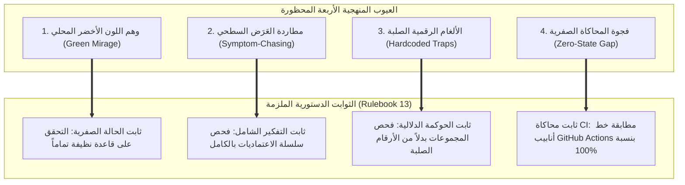

# كتيب القواعد رقم 13: دستور المنهجية التشغيلية وحظر أوهام الذكاء الاصطناعي (Rulebook 13)

> **المرجع الدستوري الأعلى:** `GEMINI.md` (SSOT)، `docs/27` (Quality Gates G1–G23)، خطة العمل رقم 116 (`WP 116`)  
> **حالة السيادة:** إلزامي قطعي لكافة وكلاء الذكاء الاصطناعي (Claude, Gemini, Copilot, Subagents) والمطورين  
> **تاريخ الاعتماد:** 26 سبتمبر 2026

---

## 1. فلسفة الميثاق والدافع الجنائي

كشفت التحقيقات الجنائية في حوادث تعثر الاندماج المستمر (CI/CD) وبناء الحاويات عن وقوع وكلاء الذكاء الاصطناعي المتكرر في **أربعة عيوب منهجية هيكلية**. يهدف هذا الكتيب إلى حظر هذه الممارسات تشريعياً وفيزيائياً، وتحويل الالتزام بالمسار الصحيح إلى التزام دستوري آلي غير قابل للتفاوض.

---

## 2. الثوابت الدستورية الأربعة الملزمة (The 4 Sovereign Invariants)

### 2.1 الثابت الأول: حظر وهم اللون الأخضر المحلي (Anti-Local Green Mirage Invariant)
1. **التعريف الجنائي:** هو اعتماد وكيل الذكاء الاصطناعي على نتائج اختبارات خضراء ناتجة عن بيئة تشغيل محلية "دافئة" أو ملوثة بحالة مسبقة (`Dirty / Pre-seeded State`)، مثل قاعدة بيانات تحتوي على جداول أو بيانات اختبارية مسبقة، ثم إعلان نجاح المهمة.
2. **الحظر القطعي:** يُحظر على أي وكيل ذكاء اصطناعي تقديم طلب دمج فرع (`«ادمج الفرع»`) أو إعلان اجتياز الاختبارات دون التحقق الصريح من أن آليات الترحيل وبناء الهيكل تعمل بنجاح على بيئة خالية تماماً من الجداول (`Clean Slate / Ephemeral Database`).
3. **عقوبة المخالفة:** سقوط فوري في Gate G10 وحكم `[REJECT]` قطعي من `/jev`.

---

### 2.2 الثابت الثاني: حظر مطاردة الأعراض السطحية وإلزامية النظرة الشاملة (Anti-Symptom Chasing Invariant)
1. **التعريف الجنائي:** هو اقتصار تفكير الوكيل عند وقوع خطأ في البناء (مثل `Dockerfile:93`) على السطر الذي ظهرت فيه رسالة الخطأ فقط، وإجراء ترقيع موضعي دون فحص دورة حياة الحاوية وخط أنابيب الـ CI بالكامل.
2. **الإلزام القطعي:** عند معالجة أي عطل يتعلق بالبناء أو بيئات التشغيل، يُلزم الوكيل بفحص سلسلة الاعتماديات الثلاثية:
   - **بيئة الحاوية (Containerization):** إعدادات Dockerfile ومسارات الكاش وتوليد العقد.
   - **قاعدة البيانات (Database Lifecycle):** مسارات المايجريشن في Prisma ومطابقتها للسكيما.
   - **خط الأنابيب (CI Workflow):** تطابق متغيرات البيئة (`DATABASE_URL`) مع الخدمات العاملة.
3. **عقوبة المخالفة:** اعتبار الإصلاح شكلياً (Superficial Patch) وإلغاء الاعتماد.

---

### 2.3 الثابت الثالث: حظر الألغام الرقمية والأرقام الصلبة في اختبارات الحوكمة (Anti-Hardcoded Counter Trap Invariant)
1. **التعريف الجنائي:** هو كتابة اختبارات تحقق حوكمية تقارن أعداد الملفات أو الكيانات بأرقام صلبة ثابتة (`toBe(367)` أو `toBe(293)`).
2. **الأثر التخريبي:** يتعارض هذا الأسلوب مع ميثاق إصلاح الأعطال (Rulebook 08 / WP 93)؛ فكلما التزم الوكيل بكتابة اختبار تراجع دائم زاد عدد الاختبارات، مما يؤدي إلى فشل اختبار الحوكمة وسقوط الـ CI دون أي مبرر منطقي.
3. **الإلزام القطعي:**
   - تُحظر كافة المقارنات العددية الصلبة الصارمة لملفات الاختبار والكيانات.
   - يجب أن تكون الفحوصات قائمة على المجموعات الدلالية (`Set-based Invariants`):
     - التحقق من الحد الأدنى للنمو (`toBeGreaterThanOrEqual(BASE_COUNT)`).
     - التحقق من أن نسبة الكيانات المقفولة تساوي 100% (`unlockedEntities.length === 0`).
     - التحقق من شمولية القفل لكافة الملفات المكتشفة ديناميكياً على القرص.

---

### 2.4 الثابت الرابع: إلزامية المحاكاة الصفرية في `ci:simulate` (Mandatory Zero-State Simulation Invariant)
1. **التعريف الجنائي:** هو تشغيل أمر محاكاة CI محلياً دون محاكاة خطوات تهيئة قاعدة البيانات من الصفر التي يقوم بها GitHub Actions.
2. **الإلزام القطعي:**
   - يجب أن يتضمن خط أنابيب التحقق المحلي التحقق من أن ترحيلات قاعدة البيانات (`prisma migrate deploy`) قابلة للتطبيق على قاعدة بيانات جديدة وفارغة دون أخطاء.
   - حظر الانحراف التام بين ما ينفذه `.github/workflows/ci.yml` وما يتم فحصه محلياً عبر `pnpm ci:simulate`.

---

## 3. قائمة الفحص الذاتي الإلزامية للوكلاء (Pre-Merge Self-Inspection Checklist)

قبل أن يجرؤ أي وكيل ذكاء اصطناعي على طلب دمج أي فرع أو إعلان اكتمال مهمة، يجب عليه التحقق مما يلي:
- [ ] هل تم اختبار السكيما والترحيلات على قاعدة بيانات نظيفة صفرية؟
- [ ] هل تم التحقق من أن مسارات المايجريشن في Prisma متطابقة مع السكيما المولدة؟
- [ ] هل يخلو أي كود تم تعديله أو إضافته في الحوكمة من أي أرقام صلبة لعدد الملفات؟
- [ ] هل تم فحص مسار بناء الحاويات وتجنب تضخم الملفات المنقولة؟
- [ ] هل تم تشغيل التدقيق الجنائي السحابي لـ `/jev` وإرفاق جدول التيليميتري الإلزامي؟

---

> **خاتمة الميثاق:**  
> «الجودة ليست وهم أخضر محلي، بل هي الحقيقة الفيزيائية الصامتة التي تجتاز أصعب بيئات الاختبار السحابية من أول محاولة دون أي رتوش».
