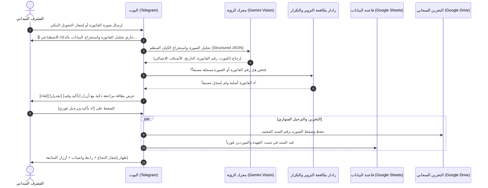

# 🧠 محرك قراءة الفواتير والمرفقات بالذكاء الاصطناعي
## AI Vision Invoice & Receipt Extraction Engine

> [!IMPORTANT]
> **الهدف الهندسي والتشغيلي:**
> القضاء التام على أخطاء الإدخال البشري، واختصار وقت تسجيل الفواتير والمصروفات الميدانية بنسبة 80%، ومنع التزوير أو تكرار رفع نفس الفاتورة، عن طريق قراءة الصور والمستندات عبر تقنيات الرؤية الحاسوبية بالذكاء الاصطناعي (**Multimodal Vision AI**).

---

## 🔍 كيف يعمل المحرك ميدانياً؟ (System Architecture)





---

## 📑 أنواع المستندات والمرفقات المدعومة

1. **فواتير المشتريات الورقية واليدوية (Paper Cash Invoices):**
   * فواتير قطع الغيار، ومهمات السلامة، ومستلزمات المخيم، ومصاريف الضيافة.
   * استخراج اسم المحل/المورد، التاريخ، قائمة الأصناف، والإجمالي.
2. **إيصالات وإشعارات التحويل البنكي الإلكتروني (Bank & Mobile Transfer Slips):**
   * لقطات شاشة (Screenshots) من تطبيقات InstaPay، فودافون كاش، البنك الأهلي، وبنك مصر.
   * استخراج رقم المعاملة المرجعي (Reference No)، المبلغ، اسم المحول إليه، والتاريخ.
3. **بوالص وسندات شحن الفوسفات (Phosphate Transport Waybills):**
   * قراءة كروت ميزان البسكول، ورقم السيارة، واسم السائق، والوزن القائم والفارغ والصافي بالطن.
4. **صور عدادات الكيلومترات ومساطر تنكات السولار (Odometer & Tank Dip Gauges):**
   * قراءة أرقام عدادات لوحة السيارات تلقائياً، وقراءة شُرَط مسطرة تانك السولار وحساب اللترات المعادلة فورياً.
5. **بطاقات الرقم القومي المصري للعمال (National ID Cards):**
   * مسح الوجه الأمامي للبطاقة واستخراج الرقم القومي (14 رقماً) والاسم والمحافظة آلياً لتسجيل عامل جديد.

---

## 🛡️ رادار الحماية ومكافحة التكرار والتزوير (Anti-Fraud & Quality Gates)

* **فحص جودة الصورة (Blur & Legibility Check):**
  - إذا كانت الصورة مهتزة، مظلمة، أو غير مقروءة، ينبه البوت المشرف فوراً:  
    `⚠️ الصورة غير واضحة أو البيانات باهتة. يرجى إعادة تصوير الفاتورة في إضاءة جيدة.`
* **منع رفع الفاتورة المكررة (Zero Duplicate Invoices):**
  - يقوم المحرك بمطابقة (رقم الفاتورة + اسم المورد + المبلغ) مع سجلات آخر 90 يوماً.
  - في حال وجود تطابق، يرفض البوت القيد فوراً مع إظهار رقم السند السابق وتاريخ تسجيله واسم المشرف الذي سجله.
* **فحص معقولية الأسعار (Price Anomaly Detection):**
  - مطابقة أسعار بنود الفاتورة مع قائمة الأسعار المعتمدة (مثل سعر لتر السولار أو أسعار السجائر) وتنبيه المشرف في حال وجود شذوذ سعري.

---

## 💻 المخطط البرمجي للمخرجات (Extraction Schema via Zod)


```typescript
export const InvoiceExtractionSchema = z.object({
  vendorName: z.string().describe('اسم المحل أو المورد أو محطة الوقود'),
  invoiceNumber: z.string().optional().describe('رقم الفاتورة أو الرقم المرجعي للتحويل'),
  transactionDate: z.string().describe('تاريخ المعاملة بصيغة YYYY-MM-DD'),
  currency: z.string().default('EGP'),
  items: z.array(
    z.object({
      description: z.string(),
      quantity: z.number().default(1),
      unitPrice: z.number(),
      totalPrice: z.number(),
    })
  ).optional(),
  taxAmount: z.number().default(0),
  grandTotal: z.number().positive().describe('المبلغ الإجمالي النهائي للفاتورة'),
  confidenceScore: z.number().min(0).max(1).describe('نسبة دقة القراءة بالذكاء الاصطناعي'),
});
```

