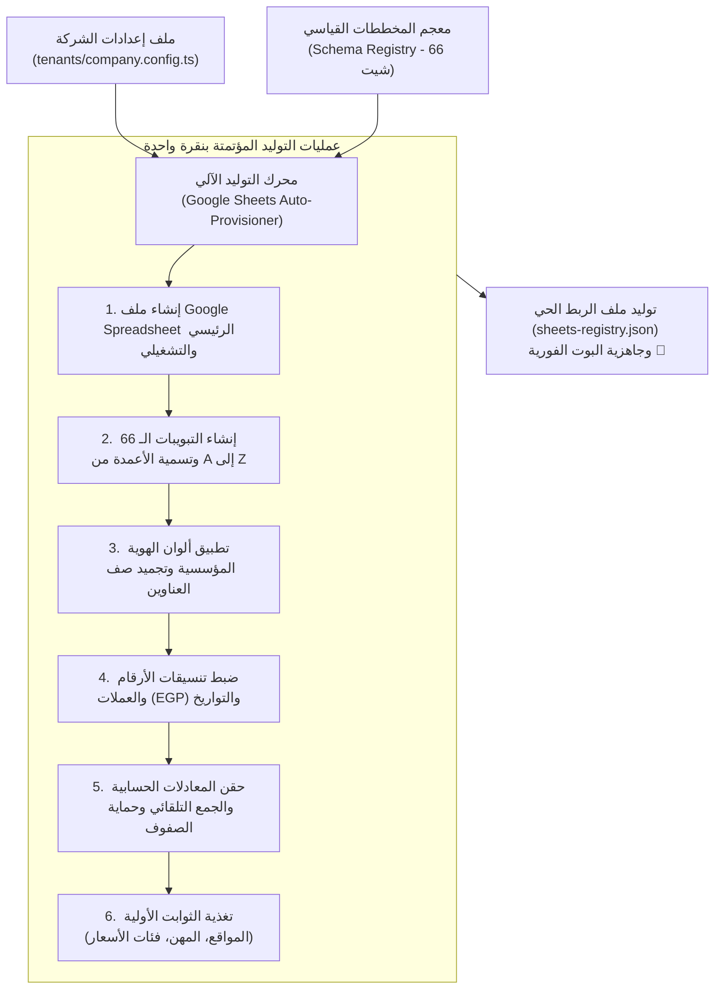

# 📊 محرك التوليد الآلي لقواعد البيانات وشيتات جوجل
## Google Sheets Auto-Provisioner & Schema Migration Engine

> [!IMPORTANT]
> **الهدف الاستراتيجي:**
> تحويل عملية إعداد النظام لأي شركة جديدة من عمل يدوي يستغرق أياماً إلى **أمر برمجي واحد يعمل تلقائياً في أقل من 3 دقائق (`npm run system:provision`)**، بحيث يُنشئ كامل ملفات الشيتات الـ 66 وتبويباتها وأعمدتها وتنسيقاتها وألوانها ومعادلاتها الحسابية آلياً عبر Google Sheets API.

---

## ⚙️ كيف يعمل محرك التوليد الآلي؟ (Architecture & Data Flow)



---

## 📐 معجم المخططات القياسي (The Schema Registry Contract)

يتم تعريف كل شيت في النظام ككائن برمجي معلن بدقة:

```typescript
export interface SheetColumnSchema {
  letter: string;          // A, B, C, ...
  headerName: string;      // اسم العمود (مثل: كود العامل)
  type: 'STRING' | 'NUMBER' | 'CURRENCY' | 'DATE' | 'FORMULA';
  width?: number;          // عرض العمود بالبكسل
  formulaTemplate?: string;// معادلة مسبقة (مثل: =SUM(D2:D))
  isProtected?: boolean;   // حماية العمود من التعديل اليدوي
}

export interface SheetDefinition {
  sheetId: string;         // المعرف البرمجي
  title: string;           // اسم التبويب بالعربية
  category: 'HR' | 'FINANCE' | 'OPERATIONS' | 'LOGISTICS';
  headerColor: string;     // كود لون رأس الجدول (Hex Color)
  columns: SheetColumnSchema[];
  seedData?: any[][];      // بيانات البداية الافتراضية
}
```

---

## 🚀 ما الذي يقوم به أمر `npm run system:provision`؟

عند تشغيل أمر التهيئة لشركة جديدة في المعمارية الهجينة الموحدة:

1. **التحقق من الاتصال والصلاحيات (Pre-flight Probing):**
   - فحص توكن تليجرام (`getMe`).
   - فحص قاعدة البيانات المحلية (SQLite) أو السحابية (PostgreSQL).
   - فحص حساب الخدمة السحابي ومجلد Google Drive المخصص للشركة.
2. **تهيئة قاعدة البيانات اللحظية وطابور المزامنة (Prisma Migrations):**
   - تشغيل `prisma migrate deploy` لإنشاء جداول الموديولات النشطة.
   - إنشاء جدول طابور المزامنة الخارجي (`outbox_events`) لترحيل المعاملات لحظياً إلى شيتات جوجل.
3. **الإنشاء الدفعي المجمع لشيتات جوجل (Batch Creation via API):**
   - إنشاء ملف/ملفات السبريدشيت وفق الطوبولوجيا المحددة (`SINGLE` أو `MULTI`).
   - إرسال طلبات `batchUpdate` مجمعة لإنشاء التبويبات الـ 66 وضبط اتجاه الشيت من اليمين إلى اليسار (`RTL: true`).
4. **تطبيق التصميم والتنسيق المحاسبي المؤسسي:**
   - تلوين صفوف العناوين وتجميد الصف الأول (`freezeRows: 1`).
   - ضبط الخطوط وتنسيق خلايا المبالغ المالية (`#,##0.00 "ج.م"`).
   - حقن الصيغ الحسابية وحماية الصفوف المحاسبية الحساسة.
5. **تغذية البيانات التأسيسية (Lookup Seeds):**
   - ملء شيت وجدول المواقع بالمواقع المعتمدة للشركة.
   - إضافة السوبر أدمن المعتمد في مصفوفة الصلاحيات (`BotAccessControl`).
6. **توليد خريطة الربط الفوري (`sheets-registry.json`):**
   - حفظ المعرفات الناتجة وتوليد حاوية الخدمات `container.ts` ليعمل البوت فوراً بأقصى سرعة واستقرار.
