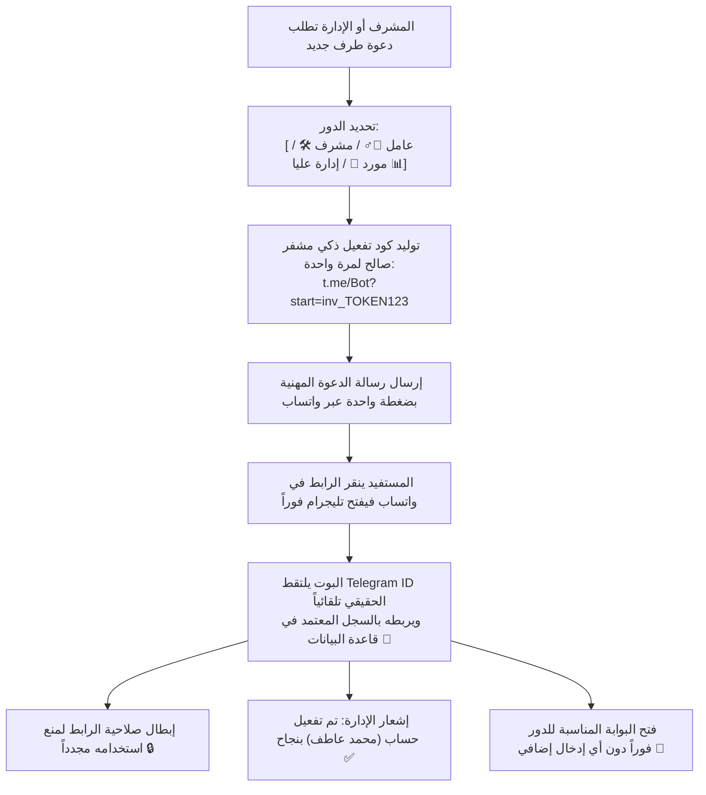

# 📨 محرك الدعوات الشامل وطلبات الانضمام لكافة الأدوار
## Universal Invitation Engine & Multi-Role Onboarding Architecture

> [!IMPORTANT]
> **القرار المعماري المعتمد:**
> تثبيت **معرف تليجرام (`telegram_id`) كحقل أساسي إلزامي ومعيار التحقق الدائم والوحيد** لكافة الحسابات، مع تزويد النظام بـ **محرك دعوات شامل (Universal Invitation Engine)** يتيح للإدارة إرسال دعوات تفعيل ذكية عبر واتساب لكافة فئات المنظومة (عمال، مشرفين، موردين، وإدارة عليا) بضغطة زر واحدة.

---

## 🏛️ 1. فلسفة محرك الدعوات الذكي (Smart Deep-Link Ingestion)

بدلاً من الروابط العامة المبهمة أو مشاركة أرقام الهواتف اليدوية التي تفشل باستمرار، يعتمد المحرك على **رموز التفعيل المشفرة ذات الاستخدام الواحد (`Single-Use Deep Link Tokens`)**:



---

## 👥 2. قوالب الدعوات الذكية بحسب الدور (Role-Based Invitation Templates)

### 1️⃣ دعوة عامل جديد (`WORKER`):
* **المسار:** موديول الموارد البشرية ⬅️ كارت العامل ⬅️ زر `[ 📲 إرسال دعوة تفعيل للعامل عبر واتساب ]`.
* **محتوى الرسالة في واتساب:**
  ```text
  *شركة السعادة للمقاولات العامة*
  أهلاً بك زميلنا/ محمد عاطف حسن (كود: #105)
  
  يسرنا تفعيل حسابك في بوت الخدمات الذاتية لمتابعة سلفك، مسحوباتك، كشف راتبك، وتسجيل إجازاتك.
  
  🔗 اضغط على الرابط التالي لتفعيل حسابك فوراً بضغطة واحدة:
  https://t.me/AlSaadaSmartBot?start=inv_w_87a9b12
  ```

### 2️⃣ دعوة مشرف أو أدمن ميداني (`FIELD_ADMIN`):
* **المسار:** السوبر أدمن ⬅️ إدارة المشرفين ⬅️ `[ ➕ تعيين مشرف موقع جديد ]`.
* **محتوى الرسالة في واتساب:**
  ```text
  *نظام إدارة العمليات - شركة السعادة*
  السيد المشرف/ م. مصطفى محمود (مشرف موقع المنيا)
  
  تم اعتمادكم كأدمن ميداني لإدارة عمليات الموقع (السلف، الكانتين، المحروقات، والعهد).
  
  🔗 يرجى تفعيل لوحة الإدارة الخاصة بكم عبر الرابط الآمن:
  https://t.me/AlSaadaSmartBot?start=inv_adm_3f42c8
  ```

### 3️⃣ دعوة مورد معتمد (`SUPPLIER`):
* **المسار:** موديول الموردين ⬅️ حساب المورد ⬅️ `[ 📲 إرسال رابط بوابة المورد ]`.
* **محتوى الرسالة في واتساب:**
  ```text
  *شركة السعادة للمقاولات العامة - إدارة المشتريات*
  السادة/ شركة الأهرام لتوريد المواد الغذائية (كود: #SUP-204)
  
  يمكنكم الآن متابعة كشف حسابكم، الفواتير المعتمدة، وسندات الصرف مباشرة عبر البوت.
  
  🔗 رابط الدخول المباشر لبوابة الموردين:
  https://t.me/AlSaadaSmartBot?start=inv_sup_99e120
  ```

### 4️⃣ دعوة عضو إدارة عليا (`EXECUTIVE`):
* **المسار:** السوبر أدمن ⬅️ `[ ➕ إضافة عضو إدارة عليا ]`.
* يولد رابطاً مخصصاً يفتح لوحة استخبارات الأعمال التجميعية ومؤشرات الأداء (KPIs) فور تفعيله.

---

## 📝 3. مسار طلب الانضمام الذاتي المحمي (`Fallback Join Request`)

إذا وصل مستخدم (عامل أو مورد) للبوت دون أن يستلم رابط دعوة مسبق:

1. يصنفه البوت تلقائياً كـ **`GUEST`** (حجب كامل للأزرار).
2. يضغط الزائر على زر: **`[ 📝 طلب ربط وتفعيل حسابي ]`**.
3. يسأله البوت خطوتين سريعتين:
   - "هل أنت: `[ عامل بالشركة 👷‍♂️ ]` أم `[ مورد معتمد 🚚 ]`؟"
   - "أدخل الكود الوظيفي / كود المورد الخاص بك:"
4. يرسل البوت **بطاقة اعتماد إدارية فورية** إلى جروب المشرفين والسوبر أدمن:
   ```text
   📥 طلب ربط وتفعيل حساب جديد
   👤 الاسم المدعى: محمد عاطف حسن
   🔢 الكود المطلوب: #105 (عامل بموقع المنيا)
   🆔 حساب تليجرام: @mohamed_atef (ID: 712345678)
   --------------------------------------------------
   [ ✅ اعتماد وربط الحساب فوراً ]    [ ❌ رفض الطلب ]
   ```
5. بمجرد نقر المشرف على `[ ✅ اعتماد ]`:
   - يقوم النظام بحفظ `telegram_id = 712345678` في قاعدة بيانات العامل فوراً.
   - يتغير دور المستخدم تلقائياً من `GUEST` إلى `WORKER`.
   - يصله إشعار تهنئة وتفتح له خدماته الذاتية تلقائياً.

---

## 🔒 4. جدول حماية وتتبع الدعوات (`Invitations Ledger`)

لضمان الأمان المحاسبي ومنع مشاركة الروابط مع غرباء، تسجل كافة الدعوات في جدول آمن بقاعدة البيانات:

```typescript
export interface BotInvitation {
  token: string;             // الرمز المشفر الفريد
  role: 'WORKER' | 'ADMIN' | 'SUPPLIER' | 'EXECUTIVE';
  targetEntityId: string;    // كود العامل أو المورد أو المشرف
  targetName: string;        // الاسم المعتمد
  targetPhone?: string;      // رقم الواتساب المرسل إليه
  createdById: string;       // معرف المشرف مصدر الدعوة
  createdAt: Date;
  expiresAt: Date;           // تاريخ انتهاء الصلاحية (افتراضي 48 ساعة)
  isUsed: boolean;           // هل تم التفعيل؟
  usedByTelegramId?: string; // معرف التليجرام الذي استهلك الدعوة
  usedAt?: Date;             // توقيت التفعيل
}
```

> [!TIP]
> بعد اكتمال التفعيل عبر الرابط أو عبر طلب الانضمام، يصبح **`telegram_id` هو المعيار الحصري الدائم للتعرف على المستخدم** مدى الحياة دون الحاجة لأي روابط أخرى.
