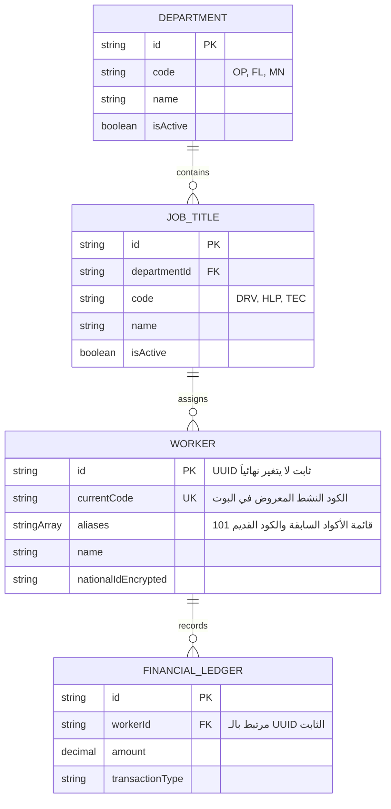
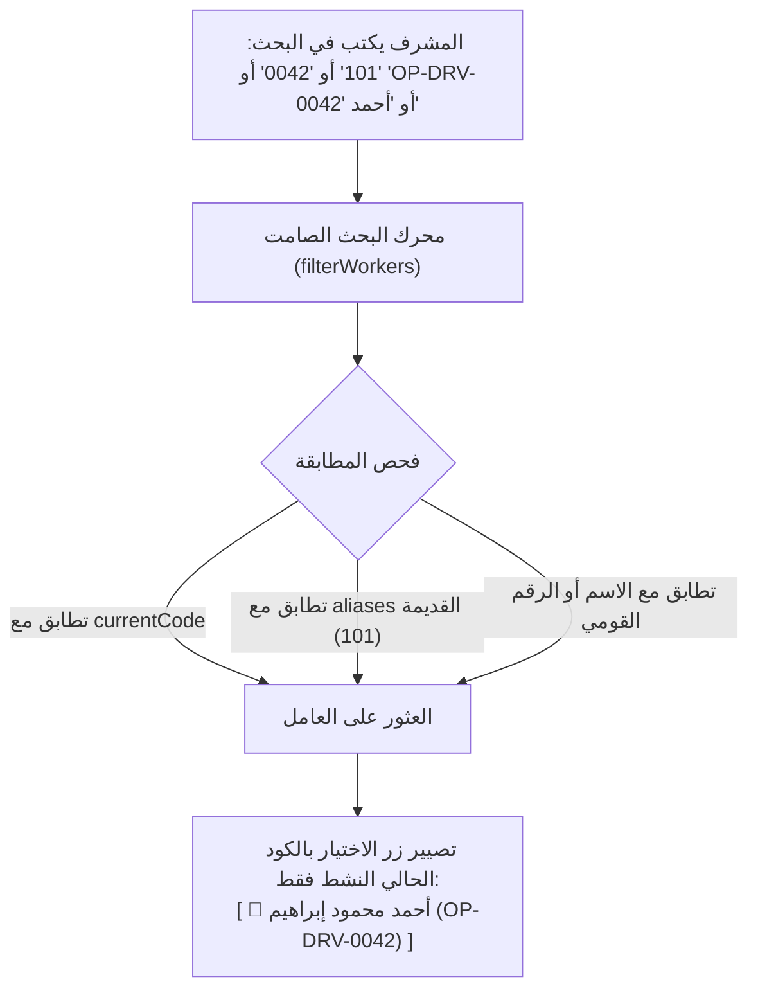

# 🪪 الدليل المعياري لتكويد العمال والربط الصامت بالأكواد التاريخية
## Structured Worker Coding, Department Hierarchy & Silent Alias Resolution Standard

> [!IMPORTANT]
> **المبدأ المعماري الحاكم:**
> * يُفصل فصلاً تاماً بين **الهوية الرقمية الثابتة للعامل (Immutable Entity UUID)** وبين **كود العمل المتغير (Display Business Code)**.
> * شاشات البوت على الموبايل تعرض حصراً **الاسم والكود الحالي النشط فقط**؛ ويُحظر تماماً إظهار الأكواد القديمة أو أي نصوص طمأنة زائدة في الواجهة لمنع تكديس المعلومات (`Zero UI Clutter`).
> * المعالجة التاريخية وربط الأكواد القديمة والجديدة تتم **خلفياً وصامتاً بنسبة 100% (Silent Backend Resolution)**.

---

### 1️⃣ الهيكل المعياري لكود العامل الجديد (`Structured Worker Code`)

يتكون كود العامل من 3 مقاطع مفصولة بشرطة:  
`[كود القسم]-[كود الوظيفة]-[الرقم المسلسل]`


```
       OP    -    DRV    -    0042
       │           │           └── الرقم المسلسل للعامل في هذه الوظيفة (4 خانات تبدأ بـ 0001)
       │           └────────────── كود الوظيفة المعتمد (2 إلى 3 أحرف إنجليزية أو رقمية)
       └────────────────────────── كود القسم المعتمد (2 إلى 3 أحرف إنجليزية أو رقمية)
```


---

### 2️⃣ منظومة إدارة الأقسام والوظائف للسوبر أدمن (In-Bot Master Data Console)

يوفر البوت لوحة تحكم حصرية للسوبر أدمن لتهيئة الهيكل الوظيفي للشركة دون الحاجة لفتح قاعدة البيانات:

#### 1. إدارة الأقسام (`Department Management`):
* إضافة قسم جديد:
  * اسم القسم: (مثال: `قسم التشغيل والعمليات`، `أسطول المعدات`، `الصيانة والورشة`، `الإدارة العامة`).
  * كود القسم المعتمد: (مثال: `OP`, `FL`, `MN`, `AD`).
* إمكانية تفعيل/تعطيل القسم أو تعديل اسمه.

#### 2. إدارة الوظائف والربط بالأقسام (`Job Title & Code Management`):
* يتم ربط كل وظيفة بقسمها التابع تلقائياً:
  * تحديد القسم التابع له الوظيفة.
  * اسم الوظيفة: (مثال: `سائق لودر`، `سائق قلاب`، `فني هيدروليك`، `عامل موقع`).
  * كود الوظيفة المعتمد: (مثال: `DRV`, `TRK`, `HYD`, `HLP`).
* **خريطة استرشادية قياسية للمقاولات:**

| كود القسم | اسم القسم | كود الوظيفة | مسمى الوظيفة | مثال الكود التلقائي |
| :--- | :--- | :--- | :--- | :--- |
| **`OP`** | التشغيل والعمليات | **`HLP`** | عامل تشغيل عادي | `OP-HLP-0001` |
| **`OP`** | التشغيل والعمليات | **`FOR`** | فورمان / ملاحظ موقع | `OP-FOR-0002` |
| **`FL`** | أسطول المعدات | **`DRV`** | سائق لودر / معدة | `FL-DRV-0012` |
| **`FL`** | أسطول المعدات | **`TRK`** | سائق قلاب مرسيدس | `FL-TRK-0005` |
| **`MN`** | الصيانة والورشة | **`TEC`** | فني ميكانيكا ديزل | `MN-TEC-0003` |
| **`MN`** | الصيانة والورشة | **`ELE`** | كهربائي معدات ثقيلة | `MN-ELE-0001` |
| **`AD`** | الشؤون الإدارية | **`OFF`** | إداري موقع / كاتب | `AD-OFF-0002` |

#### 3. التوليد التلقائي للمسلسل (`Auto-Sequence Engine`):
* عند تسجيل عامل جديد واختيار القسم والوظيفة:
  * يستعلم النظام تلقائياً عن أعلى رقم مسلسل مسجل لهذا التكوين (`OP-HLP-*`).
  * يولد المسلسل التالي فوراً مع الحشو الرباعي: `0001`، `0002`، ... إلخ.

---

### 3️⃣ معمارية قاعدة البيانات والربط الصامت (Database Schema & Aliases)





#### القواعد الهندسية الصارمة:
1. **الربط الحصري بـ `worker.id` (UUID):**
   * كافة السلف، مسحوبات السجائر، المشتريات العينية، الإجازات، وبوالص الشحن تُربط داخلياً بـ `worker_id` (UUID).
   * لا تعتمد أي عملية مالية على كود العامل كنص.
2. **مصفوفة الأكواد البديلة الصامتة (`aliases`):**
   * يحمل سجل العامل حقلاً مصفوفياً مفهرساً: `aliases: String[]`.
   * يضم هذا الحقل:
     - الكود القديم في النظام السابق (مثل: `"101"`).
     - أي أكواد سابقة شغلها العامل في تاريخه (مثل: `"OP-HLP-0015"`).
3. **حظر إعادة التدوير:**
   * أي كود يدخل مصفوفة الـ `aliases` أو `currentCode` يُقفل على مستوى النظام بالكامل، ويُمنع منحه لأي عامل آخر مدى الحياة.

---

### 4️⃣ محرك البحث والتصفية الصامت في البوت (`Silent Multi-Code Resolver`)

في مكون `UniversalWorkerPicker` ومحركات البحث في البوت:





* **تجربة المستخدم على الموبايل (Mobile UX):**
  * إذا كتب المشرف كود العامل القديم `101` (لأنه معتاد عليه):
    - يظهر له العامل فوراً باسمه وكوده الحالي: `👤 أحمد محمود إبراهيم (OP-DRV-0042)`.
  * لا تظهر أي عبارات توضيحية أو تفاصيل قديمة، مما يحافظ على هدوء الشاشة وسرعة الاختيار.

---

### 5️⃣ دورة ترقية وتعديل كود العامل (Promotion & Code Evolution)

عند ترقية عامل من وظيفة لأخرى (مثلاً: من عامل عادي `OP-HLP-0015` إلى سائق لودر `FL-DRV-0042`):
1. يستدعي الأدمن إجراء: `[ 🔄 تغيير الوظيفة وتحديث الكود ]`.
2. يختار القسم الجديد والوظيفة الجديدة.
3. يقوم النظام آلياً بـ:
   * نقل الكود الحالي `OP-HLP-0015` إلى مصفوفة `aliases`.
   * توليد الكود الجديد وتعيينه في `currentCode = 'FL-DRV-0042'`.
4. **الأثر الواقعي الفوري:**
   * لا تتأثر أي معاملة مالية سابقة (لأنها مرتبطة بـ `worker.id`).
   * رصيد سلف ومسحوبات العامل التراكمية يظل كاملاً وسليماً بنسبة 100%.
   * المعاملات الجديدة تُسجل بالكود الجديد تلقائياً.
