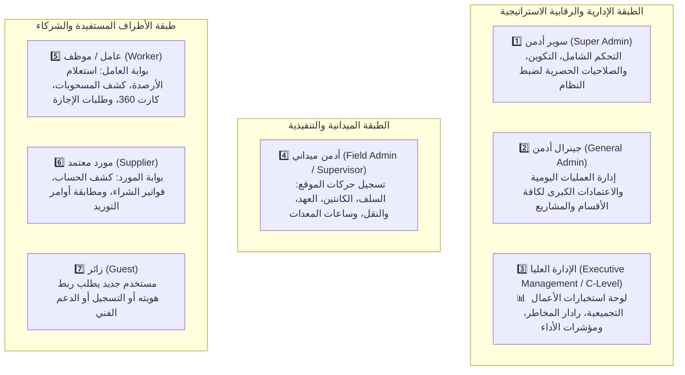

# 🔐 مصفوفة الصلاحيات السباعية ودور الإدارة العليا
## 7-Tier Universal RBAC & Executive Management Architecture

> [!IMPORTANT]
> **الهدف الهندسي:**
> تأسيس نظام تحكم بالصلاحيات صارم يعتمد على الأذونات الذرية (`Granular Permission-Based RBAC`)، مع التطبيق الحتمي للقاعدة الذهبية: **"لا وظيفة ولا زر يُعرض في البوت لمن ليس له صلاحية مسبقة (Strict Pre-Render UI Masking)"**، وتوفير دور مخصص ومستقل للإدارة العليا يركز حصراً على التقارير واستخبارات الأعمال اللحظية.

---

## 🏛️ 1. مصفوفة الطبقات السباعية المعتمدة (The 7-Tier RBAC Hierarchy)





### توصيف الأدوار ومسؤولياتها:

| # | المعرف البرمجي (`RoleKey`) | التسمية العربية | نطاق الصلاحيات والمسؤوليات | طبيعة الواجهة المعروضة في تليجرام |
| :--- | :--- | :--- | :--- | :--- |
| 1 | **`SUPER_ADMIN`** | **سوبر أدمن (مالك النظام)** | السيطرة الكاملة على النظام، ضبط وتعديل مصفوفة الصلاحيات، إعادة تشغيل الخدمات، إدارة مفاتيح الربط، وحذف أو استعادة البيانات الحساسة. | واجهة شاملة + قسم أدوات المطورين والتحكم بالنظام (`DevOps & System Admin`). |
| 2 | **`GENERAL_ADMIN`** | **جينرال أدمن (المدير العام)** | إدارة كافة العمليات التشغيلية، اعتماد السلف والمصروفات الكبرى، تعديل تسعير الأصناف، وإصدار قرارات النقل والخصم. | لوحة التحكم التشغيلية لكافة قطاعات الشركة دون الوصول للإعدادات التقنية. |
| 3 | **`EXECUTIVE`** | **الإدارة العليا (مجلس الإدارة)** | **للقراءة والاستعراض فقط (Read-Only Aggregated BI):** متابعة مؤشرات الأداء، الأرصدة التجميعية، رادار المخاطر المالية، وتقارير المشاريع. | واجهة تنفيذية مجردة من أي أزرار إدخال أو تسجيل ميداني. |
| 4 | **`FIELD_ADMIN`** | **أدمن ميداني (مشرف الموقع)** | تسجيل الحركات الميدانية اليومية (سلف، مقصف، محروقات، عهد، بوالص) بحسب موقعه وقسمه المخصص. | أزرار الإدخال اليومي + كشوفات الموقع الخاص به فقط. |
| 5 | **`WORKER`** | **عامل / موظف** | بوابة الخدمة الذاتية للعامل (`Self-Service`): رصيد السلف، كشف مسحوبات الكانتين، بطاقة 360، وتقديم طلبات الإجازة. | واجهة شخصية معزولة تماماً؛ محظور عليه رؤية أي زر إداري أو مالي لغيره. |
| 6 | **`SUPPLIER`** | **مورد معتمد** | بوابة الموردين: كشف الحساب المالي، مطابقة الفواتير، ومتابعة سندات الصرف الصادرة له. | واجهة المورد الخاصة بفواتيره وحركاته حصراً. |
| 7 | **`GUEST`** | **زائر / مستخدم جديد** | أي مستخدم يدخل البوت لأول مرة؛ يتيح له طلب الربط برقم قومي أو كود وظيفي للتفعيل. | شاشة ترحيبية وزر طلب التحقق أو تسجيل الدخول. |

---

## 📊 2. المواصفات الهندسية لدور "الإدارة العليا" (`EXECUTIVE`)

أعضاء مجلس الإدارة والمديرون التنفيذيون يحتاجون واجهة نظيفة ومباشرة تخلو تماماً من إزعاج الإدخالات اليومية:

### المكونات الحصرية للوحة الإدارة العليا:
1. **📊 نبض الشركة اللحظي (`Executive KPI Snapshot`):**
   - إجمالي منصرفات اليوم عبر كافة المواقع والمشاريع.
   - إجمالي سلف الشهر مقارنة بسقف الرواتب التقديري.
   - عدد العمال الفعليين المتواجدين في المواقع اليوم ومعدل الحضور والانصراف.
2. **💰 رادار السيولة والمخاطر المالية (`Financial Risk Radar`):**
   - إجمالي العهد النقدية المفتوحة مع المشرفين الميدانيين التي لم تُصفَّ بعد.
   - تنبيهات الانحراف (مثل: مواقع تجاوزت ميزانية السولار، أو عمال تجاوزت سلفهم النسبة الآمنة).
   - مستحقات الموردين المؤجلة وقوائم الفواتير المستحقة.
3. **📈 كشوفات الـ Excel المجمعة بنقرة واحدة (`Instant BI Export`):**
   - زر لتحميل ملف Excel تجميعي فوري يحتوي الحسابات الختامية والأرصدة.
   - زر لتوليد تقرير تحليلي للمواقع بتنسيق PDF.
4. **🏢 محدد المواقع والمشاريع التجميعي:**
   - إمكانية التبديل بين مواقع العمل لاستعراض أداء موقع محدد (دون الدخول في تفاصيل المعاملات الفردية).

---

## 🛡️ 3. محرك الحجب المسبق الصارم (Strict Pre-Render UI Masking)

### المعمارية البرمجية:
كل زر أو تدفق في البوت يرتبط بـ **إذن ذري (`PermissionKey`)**:


```typescript
export enum Permission {
  // صلاحيات الإدارة العليا والتقارير
  REPORTS_EXECUTIVE_VIEW = 'reports:executive:view',
  REPORTS_FINANCIAL_RADAR = 'reports:financial_radar:view',
  REPORTS_EXCEL_EXPORT = 'reports:excel:export',

  // صلاحيات العمليات الميدانية
  OPERATIONS_ADVANCE_CREATE = 'operations:advance:create',
  OPERATIONS_CANTEEN_RECORD = 'operations:canteen:record',
  OPERATIONS_CUSTODY_EXPENSE = 'operations:custody:expense',

  // صلاحيات الإدارة والتحكم
  SYSTEM_RBAC_MANAGE = 'system:rbac:manage',
  SYSTEM_CONFIG_UPDATE = 'system:config:update',

  // صلاحيات العمال
  WORKER_SELF_VIEW = 'worker:self:view',
}
```


### آلية تصفية الأزرار قبل الإرسال (Pre-render Pipeline):
1. عند استدعاء أي لوحة مفاتيح (`InlineKeyboard`)، يتم تمرير مصفوفة الأزرار لمحرك الحجب (`RBACGuard`).
2. يقوم المحرك بفحص أذونات المستخدم الحالي (`ctx.session.user.permissions`).
3. أي زر لا يمتلك المستخدم إذناً صريحاً له، يتم **حذفه تماماً من المصفوفة قبل إرسال الرسالة إلى تليجرام**.
4. **الضمان الأمني:** لن يرى أي مستخدم زراً غير مصرح له به ثم يتلقى رسالة "عفواً لا تملك صلاحية"، بل يختفي الزر كلياً من عالمه.

---

## 📌 4. سجل النقاط المفتوحة للنقاش والمتابعة (Open Issues Register)

تثبيتاً لرغبة الإدارة في استكمال النقاش، تم حصر النقاط التالية في سجل المراجعة للمناقشة لاحقاً:

1. **واجهة السوبر أدمن لتخصيص تقارير كل مدير:**
   - دراسة أفضل طريقة لتمكين السوبر أدمن من تحديد التقارير المعروضة لكل عضو إدارة عليا (عبر ملف التكوين أو قائمة بوت مخصصة).
2. **بروتوكول تفويض الصلاحيات المؤقت (Delegation Protocol):**
   - كيفية منح صلاحيات جينرال أدمن لمشرف ميداني أثناء الإجازات الرسمية.
3. **آلية التحقق من هوية العامل والمورد (Worker/Supplier Onboarding):**
   - هل يتم التحقق برمز OTP عبر رسائل SMS / واتساب، أم بربط مباشر مع الرقم القومي وكود العامل المعتمد في جوجل شيت؟
4. **قواعد سقف الاعتمادات المالية التلقائية:**
   - تحديد الحد المالي الذي يحتاج اعتماداً تلقائياً من الجينرال أدمن أو السوبر أدمن قبل الصرف.
