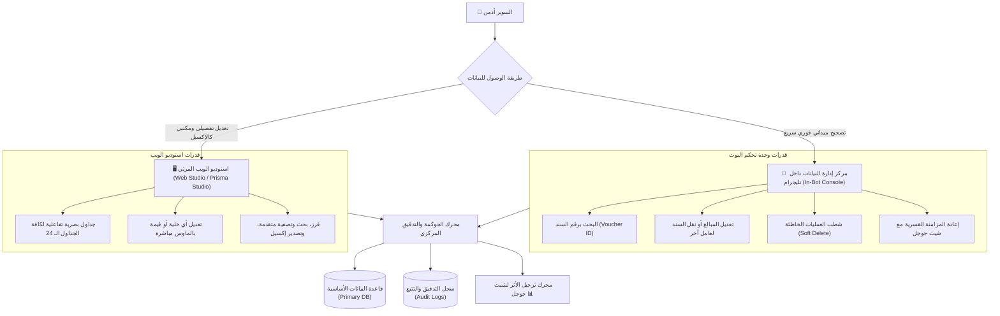

# 🛠️ حوكمة وتعديل بيانات قاعدة البيانات ووحدة تحكم السوبر أدمن
## Database Governance, Web Studio & In-Bot SuperAdmin Console

> [!IMPORTANT]
> **الهدف الهندسي والرقابي:**
> ضمان السيطرة والرقابة المحاسبية الكاملة للسوبر أدمن والمشرفين على كافة البيانات المسجلة في قاعدة البيانات دون الحاجة لأي خبرة برمجية، عبر واجهتين متكاملتين: **لوحة الاستوديو المرئية بالمتصفح (`Web Studio`)**، و**مركز تصحيح العمليات الفوري من داخل واجهة البوت (`In-Bot Console`)** مع الالتزام الصارم بسجل التدقيق والحذف الآمن (`Audit Trail & Soft Delete`).

---

## 🏛️ 1. المعمارية المزدوجة لإدارة وتصحيح البيانات (Dual Governance Architecture)





---

## 🖥️ 2. استوديو الويب المرئي السريع (`Web Visual Studio`)

توفير واجهة متصفح سهلة تشبه **جداول Google Sheets و Excel تماماً**، تمكّن الإدارة من تصفح وتعديل ملايين السجلات في أجزاء من الثانية:

### المزايا التشغيلية:
1. **الوصول الآمن:** رابط مشفر ومحمي بكلمة سر وحساب السوبر أدمن (`https://studio.company.com` أو عبر `npx prisma studio`).
2. **تعديل مباشر بالماوس:** النقر المزدوج على أي حقل (اسم عامل، مبلغ سلفة، تاريخ، رقم فاتورة) وكتابة القيمة الجديدة فوراً.
3. **التصفية والبحث المتقدم:** البحث برقم الهاتف، كود العامل، التاريخ، أو نوع الحركة وعرض النتائج فورياً.
4. **التراجع والإلغاء:** إمكانية فحص السجلات المعلقة أو المكررة وتصحيحها بضغطة زر.

---

## 📱 3. مركز تصحيح البيانات الميداني داخل البوت (`In-Bot SuperAdmin Console`)

قسم خفي ومحمي بصلاحية `SUPER_ADMIN` الصارمة يظهر في القائمة الرئيسية تحت عنوان:  
`[ 🛠️ مركز تصحيح وإدارة البيانات ]`

### التدفقات والوظائف الحصرية المتوفرة للسوبر أدمن:

#### أ. البحث والتصحيح برقم السند (`Voucher Quick Lookup & Edit`):
* يُدخل السوبر أدمن رقم السند مباشرة (مثال: `#ADV-2026-0042` أو `#CAN-1052`).
* يعرض البوت **كارت تفاصيل المعاملة** مع الأزرار التالية:
  1. `[ ✏️ تعديل المبلغ ]`: إدخال المبلغ الصحيح وتحديثه لحظياً.
  2. `[ 👤 نقل السند لعامل آخر ]`: في حال أخطأ المشرف في الميدان واختار عاملاً بالخطأ، ينقل السوبر أدمن السند للعامل الصحيح في ثانية واحدة.
  3. `[ ❌ شطب المعاملة ]`: إلغاء العملية بالكامل واعتبارها لاغية.
  4. `[ 🔄 إعادة المزامنة مع الشيت ]`: إجبار النظام على إعادة كتابة السطر في Google Sheets لتصحيح أي اختلاف.

#### ب. استعراض وتصحيح سجلات عامل محدد:
* اختيار كود العامل ⬅️ عرض آخر 5 حركات مسجلة له (سلف، مقصف، جزاءات) ⬅️ اختيار أي حركة وتعديلها أو إلغاؤها فوراً.

---

## 🔒 4. مبادئ النزاهة المالية والحذف الآمن (Audit Trail & Soft Delete Standards)

لمنع الفوضى المحاسبية والتلاعب بالأرقام، يلتزم النظام بقاعدتين هندسيتين صارمتين:

### 1️⃣ الحذف المنطقي الآمن (Strict Soft Delete Standard):
* **يُمنع نهائياً مسح أي سجل محاسبي فيزيائياً من قاعدة البيانات (`NO Hard Deletes`).**
* عند طلب شطب معاملة:
  - يُحدث الحقل إلى: `is_deleted = true`.
  - يُسجل تاريخ الإلغاء ومن قام به: `deleted_at = NOW()`, `deleted_by = 'SUPER_ADMIN_ID'`.
  - تُستبعد المعاملة فوراً من كشوفات الحسابات وأرصدة العمال، وتُلوّن في شيت جوجل باللون الرمادي المشطوب أو تُنقل لتبويب الملغيات.

### 2️⃣ سجل التدقيق والتتبع التلقائي (Immutable Audit Log):
كل عملية تعديل أو شطب يقوم بها السوبر أدمن يتم توثيقها تلقائياً في جدول رقابي دائم:


```typescript
export interface AuditLogRecord {
  id: string;
  tableName: string;         // اسم الجدول (مثل: advances)
  recordId: string;          // معرف السند
  action: 'CREATE' | 'UPDATE' | 'SOFT_DELETE' | 'TRANSFER';
  performedBy: string;       // معرف السوبر أدمن
  previousValues: Record<string, any>; // القيم القديمة قبل التعديل
  newValues: Record<string, any>;      // القيم الجديدة بعد التعديل
  reason?: string;           // سبب التعديل المدخل من السوبر أدمن
  timestamp: Date;           // التوقيت الدقيق بالمللي ثانية
}
```


---

## 🔄 5. انعكاس التعديلات على Google Sheets (Automatic Bi-directional Reflection)

* بمجرد قيام السوبر أدمن بتعديل أو شطب أي معاملة في قاعدة البيانات (سواء عبر لوحة الويب أو عبر البوت):
  1. يقوم محرك التحديث بإرسال حدث فوري لطابور المزامنة (`Outbox Event`).
  2. يقوم العامل الخلفي بتحديد الصف المقابل لهذا السند في Google Sheets بدقة وتحديث قيمته فوراً.
  3. تظل شيتات جوجل متطابقة بنسبة 100% مع قاعدة البيانات دون أي انحراف.
