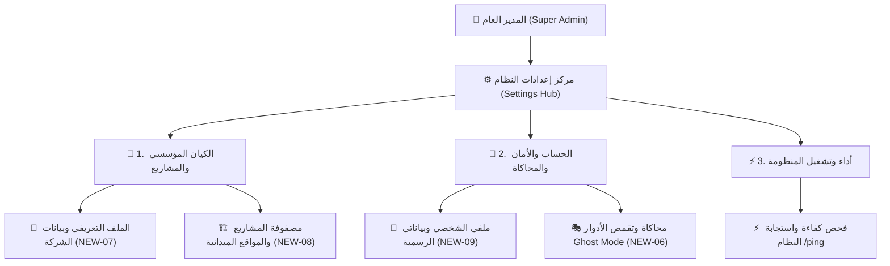

# ⚙️ مركز إعدادات المنظومة والتحكم السيادي للمدير العام
## Super Admin Settings Hub, Corporate Identity, Sites & Profile Governance

> [!IMPORTANT]
> **المرجع المعماري والتشغيلي المعتمد (SSOT):**
> تم نقل وتوحيد كافة تكوينات المنظومة وإدارتها إلى **قاعدة بيانات PostgreSQL 16 وكاش Redis**، مع إتاحة التحكم الكامل والمباشر للمدير العام (Super Admin) من داخل شاشات البوت الموضعية دون الحاجة للمس ملفات السيرفر أو الاعتماد على شيتات إكسيل.

---

## 🗂️ 1. هيكلة مركز الإعدادات والتصنيفات الفرعية الثلاثة (Settings Sub-Categories)

تم تنظيم لوحة الإعدادات المركزية (`[ ⚙️ إعدادات النظام ]` / `/settings`) إلى 3 تصنيفات فرعية رئيسية تمنع تكدس الأزرار وتضمن تجربة تنقل موضعية سلسة (Zero Dead Ends):

---

## 🏢 2. باب الكيان المؤسسي والمشاريع (`Corporate & Sites Hub`)

### أ. الملف التعريفي وبيانات الشركة الرسمية (`NEW-07`)
* **الجدول المعتمد:** `company_profiles` في PostgreSQL 16.
* **الحقول الثمانية القابلة للتعديل اللحظي من البوت:**
  1. `legalName`: اسم الشركة القانوني في العقود والمستندات.
  2. `tradeName`: الاسم التجاري المعتمد والمختصر.
  3. `commercialRegistrationNumber`: رقم السجل التجاري.
  4. `taxRegistrationNumber`: رقم البطاقة الضريبية.
  5. `headquartersAddress`: المقر الإداري والرئيسي.
  6. `primaryPhone`: هاتف الإدارة والتواصل الميداني.
  7. `officialEmail`: البريد الإلكتروني الرسمي.
  8. `baseCurrency`: العملة الأساسية والمعتمدة (`EGP`).
* **آلية التعديل:** النقر على زر أي حقل ⬅️ إرسال القيمة الجديدة في رسالة نصية ⬅️ التحقق منها وتحديث قاعدة البيانات فوراً ⬅️ حذف رسالة الإدخال تلقائياً (`Silent Clean Input`) ⬅️ إعادة تصيير البطاقة موضعياً مع إشعار نجاح أخضر.

### ب. مصفوفة المشاريع والفروع والمواقع الميدانية (`NEW-08`)
* **الجداول المعتمدة:** `projects` و `sites` في PostgreSQL 16.
* **الاستعراض اللحظي:** سحب فوري لكافة المواقع مع إظهار أيقونة الحالة وعدد العمالة المسكنة بكل موقع:
  * `🟢 موقع منجم فوسفات أسوان / السباعية (SITE-PHOS-01) — 👥 42 عامل`
* **التحكم والعمليات:**
  * **تبديل الحالة بنقرة واحدة:** `[ 🔄 تعطيل الموقع (إيقاف) ]` ⇄ `[ 🟢 تنشيط الموقع ]`.
  * **معالج إضافة فرع / موقع ميداني جديد (3 خطوات):** اسم الموقع ⬅️ الكود الهيكلي الفريد بالإنجليزية ⬅️ المحافظة التابع لها الموقع.

---

## 👤 3. باب الحساب الشخصي والأمان والمحاكاة (`Identity & Ghost Mode`)

### أ. ملف المدير العام الشخصي (`NEW-09`)
* **الجدول المعتمد:** `users` في PostgreSQL 16.
* **البيانات المعروضة:** الاسم الرسمي، المعرف الرقمي، اسم المستخدم، ورقم الهاتف المعتمد.
* **تشفير الهاتف السيادي:** تشفير رقم هاتف المدير العام بأعلى معايير التشفير الصناعي (`AES-256-GCM`) وتوليد الفهرس الأعمى (`Blind Index`) لضمان الخصوصية والبحث الآمن.
* **التعديل الموضعي:** إمكانية تعديل الاسم الرسمي المسجل ورقم الهاتف في أي وقت مع حذف رسالة الإدخال بصمت.

### ب. محرك محاكاة وتقمص الأدوار للمدير العام (`Ghost Mode Engine - NEW-06`)
* **مخزن الجلسات:** Redis Cache مفتاح `impersonate:user:${telegramId}` بـ TTL 24 ساعة دون أي مساس ببيانات المستخدم في قاعدة البيانات.
* **التحول الموضعي الفوري:** التحول الفوري لتجربة واجهة أي دور من الأدوار الستة:
  1. `EXECUTIVE` (الإدارة التنفيذية والمالية).
  2. `FIELD_ADMIN` (مشرف الموقع والميدان).
  3. `WORKER` (بوابة العامل والخدمة الذاتية).
  4. `SUPPLIER` (المورد ومقاول الباطن).
  5. `GUEST` (الزائر والمستخدم الجديد).
* **ضمانة الاستثناء السيادي والهروب الدائم (Sovereign Escape Hatch):**
  - زر دائم يرافق السوبر أدمن أسفل كل شاشة متقمصة: `[ 🎭 إنهاء وضع المحاكاة (العودة كمدير عام) ]`.
  - أمر طوارئ مباشر: `/exit_ghost` ينهي المحاكاة فورياً ويعيد الواجهة الأصلية.

---

## ⚡ 4. باب أداء وتشغيل المنظومة (`System Health & APM`)
* **فحص كفاءة واستجابة النظام (`/ping`):**
  - قياس زمن استعلام قاعدة البيانات PostgreSQL بالمللي ثانية.
  - قياس زمن استجابة محرك البوت.
  - استهلاك الذاكرة العشوائية (RAM Heap) ومدة تشغيل الحاوية الميدانية (Uptime).
  - إمكانية إعادة الفحص موضعياً دون إرسال رسائل جديدة.

---

## 📁 5. مصفوفة الأوامر والمسارات البرمجية المعتمدة

| الأمر السريع | الإجراء والوظيفة | المسار البرمجي المعتمد |
|:---:|---|---|
| `/settings` | فتح مركز إعدادات النظام العام بالتصنيفات الثلاثة | `apps/bot-server/src/handlers/settings.handler.ts` |
| `/company` | فتح بطاقة الملف التعريفي وبيانات الشركة مباشرة | `apps/bot-server/src/handlers/company-profile.handler.ts` |
| `/sites` | فتح مصفوفة المشاريع والفروع والمواقع الميدانية | `apps/bot-server/src/handlers/sites-hub.handler.ts` |
| `/profile` أو `/me` | فتح بطاقة الملف الشخصي للمدير العام وتعديل بياناته | `apps/bot-server/src/handlers/admin-profile.handler.ts` |
| `/exit_ghost` | إنهاء وضع المحاكاة فورياً والعودة السيادية كمدير عام | `apps/bot-server/src/handlers/settings.handler.ts` |
| `/ping` | تقرير فحص سرعة واستجابة المحرك وقاعدة البيانات | `apps/bot-server/src/handlers/ping.handler.ts` |
