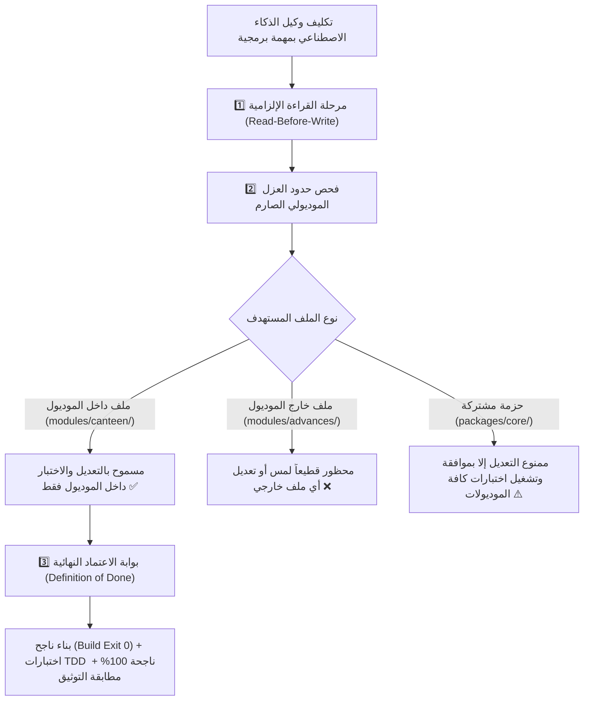

# 🤖 ميثاق حوكمة وكلاء الذكاء الاصطناعي وقواعد التعامل مع الملفات البرمجية
## AI Agent Engineering Governance, Blast Radius Isolation & File Safety Protocol

> [!IMPORTANT]
> **الهدف الهندسي الصارم:**
> القضاء التام على مشكلة **"تعديل ميزة جديدة يؤدي إلى كسر أو تغيير ميزات سابقة تم اختبارها"**، عبر فرض قواعد عزل مادي صارمة (`Blast Radius Containment`)، ومنع لمس الملفات خارج نطاق الموديول المستهدف، وتأطير أداء وكلاء الذكاء الاصطناعي بمعايير مهنية واختبارات آلية وبوابة خروج إلزامية (`Definition of Done`).

---

## 🏛️ 1. المبادئ الحاكمة للتعامل مع الكود المصدري



---

## 🧱 2. قواعد العزل المادي وحماية الملفات (Blast Radius Isolation)

### 1️⃣ قاعدة العزل الموديولي التام (Vertical Slice Isolation):
* عند العمل على موديول (مثل: `modules/canteen`):
  * **يُمنع منعاً باتاً فتح أو تعديل أو حذف أي ملف في موديول آخر** (مثل `modules/advances` أو `modules/custody` أو `modules/workforce`).
  * كل موديول يعتبر كأنه مشروع مستقل بذاته؛ يحتوي على:
    - مساراته وواجهاته الخاصة (`handlers/`).
    - نماذج البيانات الخاصة به (`types.ts`).
    - خدماته التشغيلية (`services/`).
    - اختباراته الآلية الخاصة (`tests/`).

### 2️⃣ قاعدة حماية النواة والحزم المشتركة (`packages/` Protection):
* الحزم المتواجدة في `packages/` (مثل `core-components`, `ai-vision-engine`, `sheets-provisioner`):
  * هي حزم عامة لخدمة كافة قطاعات الشركة.
  * **يُحظر تماماً تعديل أي كود في الحزم المشتركة لحل مشكلة خاصة بموديول فردي**.
  * في حال استلزم الأمر إضافة ميزة عامة في حزمة مشتركة، يلتزم الوكيل البرمجي بتشغيل حزمة اختبارات كافة الموديولات والتأكد من عدم كسر أي ميزة مستهلكة لها.

### 3️⃣ بروتوكول القراءة قبل التعديل (Read-Before-Write):
* يُمنع الاستبدال الأعمى لمحتوى الملفات.
* يجب قراءة محتوى الملف كاملاً، وفهم دواله والأنواع المعرفة به، واستهداف الأسطر المراد تعديلها حصراً دون المساس بباقي الملف.
* الحفاظ على كافة التعليقات والشروح البرمجية الموجودة في الملفات.

### 4️⃣ ميثاق النظافة الشاملة والشفافية الصارمة عند التأجيل (Zero-Tolerance Clutter & Mandatory Postponement Transparency):
* **القاعدة الحتمية:** **"دائماً يجب أن يبقى المشروع نظيفاً ومتبعاً للمنهجية بشكل كامل، وفي حالة تأجيل أي شيء يجب التنبيه على ذلك بشكل واضح وظاهر وتوثيق ذلك في التوثيقات بدون أي تكاسل عن ذلك"**.
* **نظافة المسار الرئيسي والمشروع:**
  * يُحظر تماماً على وكيل الذكاء الاصطناعي إنشاء أو ترك أي ملفات اختبارية أو سكريبتات تجريبية مؤقتة (مثل `test.ts`, `verify.ts`, `scratch.ts`, `temp.json`) في المسار الرئيسي للمشروع (Root Directory).
  * حظر تراكم الأكواد القديمة الميتة (`Dead Code`): بمجرد نقل أو تفكيك أي معالج قديم إلى الموديولات المستقلة، يجب فوراً تنظيف الملفات القديمة واختباراتها دون تأجيل غير موثق.
* **كل ملف في المشروع له موضع إلزامي دائم ومحدد:**
  - اختبارات الموديولات: تُوضع داخل `modules/<module_name>/tests/` حصراً.
  - اختبارات الحزم: تُوضع داخل `packages/<package_name>/tests/` حصراً.
  - الاختبارات الشاملة (E2E): تُوضع داخل `tests/e2e/` حصراً.
  - سكريبتات التجارب والتصحيح المؤقتة الخاصة بالوكيل: تُحفظ حصراً خارج الكود المصدري في مجلد الـ scratch المؤقت.
* **التحقق الدوري:** التحقق الدوري من نظافة المستودع بنسبة 100% عبر `git status -s`، ويُعتبر وجود أي ملف مهمل أو غير متبع في جذر المشروع خرقاً هندسياً يمنع اعتماد المهمة.

### 5️⃣ قاعدة الإلزام الحتمي باستيراد الحزم المشتركة وحظر إعادة كتابة الأكواد (Mandatory Shared Component Reuse):
* **المبدأ الإلزامي:** يُحظر تماماً على أي أداة ذكاء اصطناعي إعادة بناء أو تكرار منطق برمجي متاح بالفعل في حزم النواة (`packages/*`).
* **خريطة الاستيراد الإلزامية لكل موديول وتدفق:**
  1. **اختيار العمال والبحث والتصفية:** استيراد `UniversalWorkerPicker` و `filterWorkers` من `@alsaada/core-components`. يُحظر كتابة أزرار اختيار عمال مخصصة.
  2. **المدخلات المالية والمبالغ:** استيراد `UniversalAmountPicker` و `validateAmount` و `checkDuplicatePaymentRisk` من `@alsaada/core-components`.
  3. **الكميات ووحدات القياس:** استيراد `UniversalQuantityPicker` و `validateQuantity` من `@alsaada/core-components`.
  4. **التواريخ والفترات الميدانية:** استيراد `UniversalDatePicker` و `parseRegionalDate` و `calculateDateRange` من `@alsaada/core-components`.
  5. **بطاقات المراجعة والتأكيد المالي:** استيراد `formatConfirmationCard` و `buildConfirmationKeyboard` من `@alsaada/core-components`.
  6. **لوحة أزرار ما بعد الإنجاز (Section 5.2):** استيراد `buildCompletionKeyboard` و `buildWhatsAppLink` من `@alsaada/core-components`. يُمنع كتابة أزرار إنهاء يدوية تخالف الترتيب الرباعي.
  7. **توجيه الإشعارات للتوبيكات:** استيراد `resolveTopicId` من `@alsaada/core-components`.
  8. **الهوية الوطنية المصرية:** استيراد `parseEgyptianNationalId` من `@alsaada/national-id-engine`.
  9. **التوقيت والعملات والأرقام المشرقية:** استيراد `normalizeDigits`, `formatCurrency`, `formatDateTime` من `@alsaada/regional-engine`.
  10. **الأمان والتشفير وقاعدة البيانات:** استيراد عميل قاعدة البيانات وأدوات التشفير والهاش التراكمي من `@alsaada/database`.
  11. **المقاصة الثلاثية وتخفيض التكاليف للمسحوبات:** استيراد `TripleBalanceClearingEngine` و `calculateClearingSettlement` من `@alsaada/core-components`.
  12. **صمام أمان العهد والمطابقة المالية اللحظية:** استيراد `UniversalCustodyGate` و `verifyCustodyBalance` من `@alsaada/core-components`.
  13. **جدولة الأقساط والاستقطاعات الذكية:** استيراد `UniversalInstallmentEngine` و `calculateEqualInstallments` من `@alsaada/core-components`.
  14. **معالجة وحفظ المرفقات الميدانية:** استيراد `UniversalAttachmentPipeline` و `saveAttachmentBuffer` من `@alsaada/core-components`.
  15. **مسار الموافقات متعدد المستويات والتوقيع:** استيراد `UniversalApprovalWorkflow` و `createApprovalTicket` من `@alsaada/core-components`.
  16. **محرك الورديات وحساب رصيد الإجازات:** استيراد `UniversalShiftAccrualEngine` و `calculateShiftCycle` و `calculateLeaveBalance` من `@alsaada/core-components`.
  17. **طابور المزامنة الخلفية الصامتة مع Google Sheets:** استيراد `TransactionalOutboxQueue` من `@alsaada/core-components`.
* **العقوبة الهندسية عند المخالفة:** أي كود يتضمن تكراراً لمنطق متاح بالنواة المشتركة يُرفض فوراً كعيب برمجي جسيم (`Anti-Pattern / Code Duplication FAIL`).

### 6️⃣ بروتوكول الفحص المسبق واستدعاء النواة عند نقل أو بناء أي وظيفة (Pre-Flight Audit Protocol):
* **القاعدة الذهبية الحاكمة:** قبل كتابة أي سطر كود أو نقل وظيفة من المشروع المرجعي القديم (`F:\HR`) إلى المنظومة الجديدة، يلتزم وكيل الذكاء الاصطناعي (AI Agent) بتنفيذ 3 خطوات تدقيق إلزامية:
  1. **الفحص التوثيقي الشامل (Comprehensive Documentation Audit):**
     * مراجعة توثيق الوظيفة في المشروع القديم (`F:\HR`) لفهم سلوك التدفق، والشاشات، ومصفوفة الـ Callbacks، والشيتات المتأثرة.
     * مراجعة الوثائق المعمارية في `docs/` ذات الصلة بالوظيفة (خاصة وثائق 00، 02، 08، 13، 14، 15، 16).
  2. **جرد واستدعاء المكونات المشتركة مسبقاً (Pre-Emptive Component Inventory Check):**
     * البحث والفحص داخل `packages/*` لاستخراج كافة المكونات الجاهزة وتحديد قائمة الـ Imports منها بدقة، ومنع إعادة برمجة أي جزء منها.
  3. **التطبيق الصارم للتقسيم الثلاثي للمسحوبات والمعالجة المالية المغلقة:**
     * مسحوبات السجائر (عينية، مخزون كانتين، 0 كاش، مقاصة تخفيض تكلفة الموقع).
     * مسحوبات المشتريات العينية (مقترحات ذكية، 0 كاش، مقاصة تخفيض مشتريات الموردين).
     * السلف النقدية (إلزامية تحديد مصدر الأموال من العهد المفتوحة أو الخزينة الرئيسية، وفحص كفاية الرصيد، وخروج نقدية فعلي).

### 7️⃣ إلزامية أداة توليد التدفقات المعيارية ومعمارية الفحص ذات المستويين (Mandatory Scaffolding & Two-Tier Verification):
* **توليد التدفقات المعيارية آلياً:** يلتزم وكيل الذكاء الاصطناعي والمطور حصراً بإنشاء أي تدفق جديد عبر أمر:  
  `pnpm make:flow <module-name> <flow-name> [title] [--template=<type>]`  
  مع دعم الأنماط الأربعة (`cash-outflow`, `in-kind-clearing`, `approval-request`, `excel-export`) لضمان الالتزام الصارم بالهيكل المعزول للوثيقة 21 (< 350 سطراً، عقود JSON، الأنواع الصارمة، واختبارات المحاكاة).
* **معمارية الفحص ذات المستويين للتسريع الصارم:**
  - **المستوى الأول (الفحص الموضعي السريع):** تشغيل `pnpm flow:check <flow-path>` أثناء العمل للحصول على نتيجة فورية في أقل من ثانيتين لفحص التايب سكريبت والاختبارات وسقف الأسطر للتدفق المعدل حصراً.
  - **المستوى الثاني (أتمتة الإغلاق والتوثيق):** تشغيل `pnpm flow:finish <flow-code>` لتحديث سجل الترحيل `docs/19`، وتوليد ملف الإثبات، وتحديث قفل الحوكمة تلقائياً دون أخطاء تنسيق.
* **خطافات Git المحلية والبوابات الشاملة (Pre-Commit Hooks):** تفعيل واستخدام `.githooks/pre-commit` لضمان عدم تمرير أي كود يخالف الأنواع أو يتجاوز سقف الأسطر أو يخرق عقود تليجرام عند تنفيذ الـ Commit.
* **حظر الاستدعاء الشبكي المباشر للشيتات في المعالجات:** حظر استدعاء Google Sheets تزامناً داخل المعالجات، واستخدام `TransactionalOutboxQueue` حصراً للترحيل في الخلفية.

---

## ⚖️ 3. معايير الجودة ومكافحة التراجع (Zero-Regression Protocol)

1. **التايب سكريبت الصارم (Strict TypeScript 5.9+):**
   - خلو الكود تماماً من أي خطأ تجميع.
   - التحقق دائماً بتشغيل: `pnpm build` والتأكد من خروج الأمر بـ `Exit 0`.
2. **التطوير الموجه بالاختبارات (TDD):**
   - كل تدفق أو ميزة يُكتب لها اختبار تفاعلي يحاكي أزرار المحادثة والردود وسجل العمليات.
   - التحقق دائماً بتشغيل: `pnpm test` واجتياز كافة الاختبارات دون أي فشل.

---

## 🚪 4. بوابة الاعتماد النهائية للمهام (Definition of Done - DoD)

لا تُعتبر أي مهمة برمجية منجزة ومقبولة للتسليم إلا بعد استيفاء الشروط الخمسة بالترتيب:

| # | معيار الاعتماد الإلزامي | وسيلة التحقق | النتيجة المطلوبة |
| :--- | :--- | :--- | :--- |
| 1 | **سلامة البناء البرمجي** | `pnpm build` | `Exit Code 0` بدون أي تحذيرات أو أخطاء تجميع. |
| 2 | **نجاح الاختبارات الآلية** | `pnpm test` | اجتياز 100% من الاختبارات دون أي كسر لوظائف سابقة. |
| 3 | **المطابقة التوثيقية الكاملة** | مراجعة `docs/` و `README.md` | تحديث التوثيق ليعكس الواقع البرمجي الحالي دون أي فجوة. |
| 4 | **حفظ التعديلات في Git** | `git status -s` و `git commit` | التزام بمعيار Conventional Commits ونظافة المستودع. |
| 5 | **تقديم الدليل المادي الصارم** | تقرير الاختبار والمخرجات | عرض النتيجة الفعلية للمستخدم دون أي تخمين أو افتراض. |

---

> [!NOTE]
> تم دمج هذه القواعد رسمياً كدستور دائم وملزم لكافة أدوات الذكاء الاصطناعي في الملفين السياديين:  
> [`AGENTS.md`](/foundations/14-ai-agent-governance-and-file-rules/) و [`GEMINI.md`](/foundations/14-ai-agent-governance-and-file-rules/).

---

## ملحق حاكم: معيار الموديولات وبوابات الاعتماد الصارمة

ابتداءً من اعتماد وثيقة `docs/21-mandatory-module-architecture-and-gates.md`، يصبح المبدأ المعماري الحاكم هو: **نظام الموديولات والفصل التام لكل وظيفة بكل ملفاتها وطبقاتها**.

أي وظيفة جديدة أو مُرحّلة يجب أن تعيش داخل:

```text
modules/<module-name>/src/flows/<flow-code>-<flow-slug>/
```

ولا يجوز اعتبار أي وظيفة مكتملة أو مقبولة ما لم تجتاز بوابات G1 إلى G10 الموثقة في الوثيقة الحاكمة بنسبة 100%، مع تقرير إثبات داخل `docs/ai-execution-evidence/`.

أي تعارض بين هذه القاعدة وأي مسارات قديمة أو انتقالية يُحسم لصالح وثيقة `docs/21-mandatory-module-architecture-and-gates.md`.

## قاعدة حماية بوابات الحوكمة

يجب الرجوع إلى `docs/21-mandatory-module-architecture-and-gates.md` قبل أي تعديل في قواعد أو سكربتات الحوكمة. تعديل أو تعطيل أو حذف أي بوابة لا يُنفذ إلا بوجود موافقة المستخدم الحرفية:

```text
موافق على التعديل او الايقاف او الحذف
```

أي طلب لا يحتوي هذه العبارة يُعامل كطلب محجوب `BLOCKED` بالنسبة لملفات الحوكمة.
