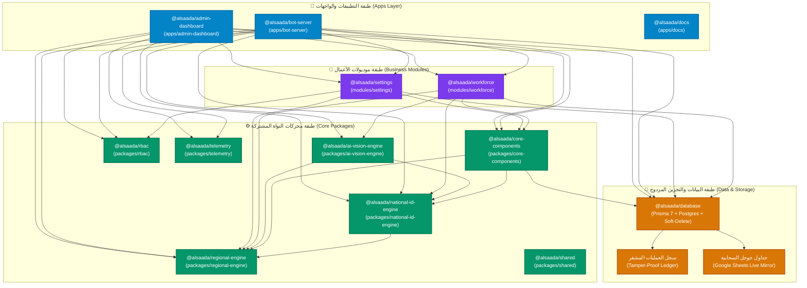

توضح هذه الصفحة **خريطة المعمارية الحية (Living Architecture Map)** لمنظومة السعادة سمارت بوت، المستخرجة آلياً من اعتماديات حزم وموديولات الـ Monorepo.

:::tip[ميزة التكبير والتحريك (Interactive Pan & Zoom)]
يمكنك استخدام عجلة الفأرة أو أزرار التحكم في الشريط العلوي لتكبير وتصغير المخطط، والسحب بالفأرة للتحرك داخل أي جزء من الخريطة.
:::

---

## 📦 جرد حزم وموديولات المنظومة (13 حزم وموديولات معتمدة)

| اسم الحزمة / الموديول | المسار البرمجي | الدور المعماري الرئيسي |
| :--- | :--- | :--- |
| **`@alsaada/admin-dashboard`** | `apps/admin-dashboard` | apps/admin-dashboard |
| **`@alsaada/bot-server`** | `apps/bot-server` | apps/bot-server |
| **`@alsaada/docs`** | `apps/docs` | apps/docs |
| **`@alsaada/settings`** | `modules/settings` | modules/settings |
| **`@alsaada/workforce`** | `modules/workforce` | modules/workforce |
| **`@alsaada/ai-vision-engine`** | `packages/ai-vision-engine` | packages/ai-vision-engine |
| **`@alsaada/core-components`** | `packages/core-components` | packages/core-components |
| **`@alsaada/database`** | `packages/database` | packages/database |
| **`@alsaada/national-id-engine`** | `packages/national-id-engine` | packages/national-id-engine |
| **`@alsaada/rbac`** | `packages/rbac` | packages/rbac |
| **`@alsaada/regional-engine`** | `packages/regional-engine` | packages/regional-engine |
| **`@alsaada/shared`** | `packages/shared` | packages/shared |
| **`@alsaada/telemetry`** | `packages/telemetry` | packages/telemetry |

