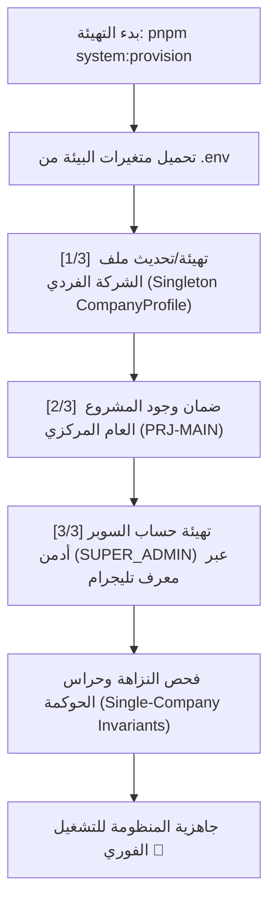

# 🏢 دليل ومنهجية تهيئة ملف الشركة وإعداد المنظومة
## Single-Company Enterprise Profile Setup & Automated Provisioning Engine

> [!IMPORTANT]
> **الهدف الهندسي الصارم (Single-Company Architecture):**
> منظومة `Al-Saada Smart Bot` مصممة ومبنية حصراً لإدارة العمليات الميدانية والمالية والموارد البشرية لـ **شركة السعادة للمقاولات العامة**.
> يعتمد النظام ملف الشركة الفردي الموحد (Singleton `CompanyProfile`) وقاعدة بيانات **PostgreSQL 16** حصراً دون أي دعم لتعدد الشركات أو قواعد البيانات البديلة مثل SQLite.
> كافة عمليات الإعداد والتهيئة التأسيسية مؤتمتة عبر أمر التهيئة المركزي `pnpm system:provision`.

---

## 🏛️ 1. المبادئ المعمارية لمنهجية التهيئة (Core Architectural Principles)

1. **الكيان المؤسسي الفردي (Singleton Company Profile):**
   - تعتمد المنظومة نموذج `CompanyProfile` الفردي في قاعدة البيانات المركزية، ويحظر وجود جداول مستأجرين (`model Tenant`) أو حقول ارتباط مستأجرين (`tenantId`).
   - كافة تفاصيل الشركة (الاسم القانوني، الاسم التجاري، السجل التجاري، البطاقة الضريبية، العنوان، العملة الأساسية، الهوية البصرية) تُخزن وتُدار ككيان موحد مركزي.

2. **التنفيذ التراكمي الآمن (Idempotent & Safe Provisioning):**
   - محرك التهيئة `pnpm system:provision` (`scripts/provision.ts`) يتمتع بخاصية الإرجاع التراكمي الآمن (`Safe Re-run`).
   - في حال تشغيل الأمر عدة مرات، يقوم بتحديث ملف الشركة الفردي وضمان وجود المشروع الأساسي (`PRJ-MAIN`) وحساب المدير العام دون تكرار أو مساس بالبيانات المالية.

3. **معمارية التخزين المعتمدة (PostgreSQL 16 + Google Sheets):**
   - المحرك الأساسي الدائم: قاعدة بيانات علائقية متقدمة **PostgreSQL 16** مع تشفير الحقول الحساسة (AES-256-GCM) وسلاسل الهاش الجنائية التراكمية (Cumulative Hash Chain).
   - محرك المزامنة السحابي (Transactional Outbox): ترحيل المعاملات والعمليات إلى جداول Google Sheets التشغيلية لدعم المتابعة الحية ومحاسبة العمليات.

---

## 🧭 2. مسار التهيئة والإطلاق (Single-Company Provisioning Workflow)

التهيئة تتم عبر خطوة واحدة واضحة ومباشرة:

### الأمر المركزي المعتمد:
```bash
pnpm system:provision
```



---

## 📋 3. تفاصيل خطوات محرك البناء والتهيئة

يقوم سكربت `scripts/provision.ts` بالخطوات التالية:

### الخطوة 1️⃣: ملف وهوية المنشأة (Company Profile)
- جلب بيانات الهوية الرسمية من `packages/database/prisma/seed-data/company-profile.json` أو من متغيرات البيئة (`COMPANY_LEGAL_NAME`, `COMPANY_TRADE_NAME`, `COMPANY_BASE_CURRENCY`).
- إنشاء أو تحديث سجل `CompanyProfile` الفردي في PostgreSQL.
- تعيين العملة الأساسية الافتراضية: `EGP` (الجنيه المصري).

### الخطوة 2️⃣: المشروع التشغيلي الافتراضي (Default Project)
- التأكد من وجود المشروع المركزي `PRJ-MAIN` ("المشروع العام والعمليات المركزية").
- ربط العمليات التأسيسية به لضمان عدم تعطل تسجيل المواقع أو العمليات الميدانية.

### الخطوة 3️⃣: حساب السوبر أدمن (Super Admin)
- في حال تمرير المعرف الرقمي `SUPER_ADMIN_TELEGRAM_ID` في ملف `.env`:
  - التأكد من إنشاء أو تفعيل المستخدم بصلاحية `SUPER_ADMIN`.
  - ربطه مباشرة بالقائمة الرئيسية ولوحة التحكم التشغيلية للبوت.

---

## 🔒 4. الضمانات الهندسية ومكافحة الانحراف (Anti-Drift Guards)

1. **حارس الشركة الواحدة (Single-Company Invariant Sentinel):**
   - يتم التحقق آلياً عبر `pnpm single-tenant:verify` (`tools/governance/verify-single-tenant-invariants.ts`).
   - يفحص `schema.prisma` وكافة ملفات `apps/` و `modules/` للتأكد التام من خلوها من أي أثر لـ `Tenant` أو `tenantId`.

2. **حارس نقاء خادم البوت (Bot Server Purity Sentinel):**
   - يتم التحقق آلياً عبر `pnpm bot-purity:verify` (`tools/governance/verify-bot-server-purity.ts`).
   - يفحص شجرة AST لملف `apps/bot-server/src/bot.ts` ويمنع استعلام الجداول التشغيلية المباشر أو استخدام النصوص المجردة.

3. **حارس مطابقة التوثيق والواقع الفيزيائي (Doc Reality Parity Sentinel):**
   - يتم التحقق آلياً عبر `pnpm doc-parity:verify` (`tools/governance/verify-doc-reality-parity.ts`).
   - يمنع أي ادعاء غير حقيقي بوجود محركات متعددة أو خوادم غير مستخدمة ويضمن تطابق التوثيق مع واقع الشفرة المصدرية.

---

## 🚀 5. بدء تشغيل المنظومة بعد التهيئة

بعد اكتمال `pnpm system:provision` بنجاح:
```bash
# تشغيل خادم البوت الرئيسي
pnpm --filter @alsaada/bot-server dev

# أو تشغيل لوحة الإدارة التشغيلية
pnpm --filter @alsaada/admin-dashboard dev
```
