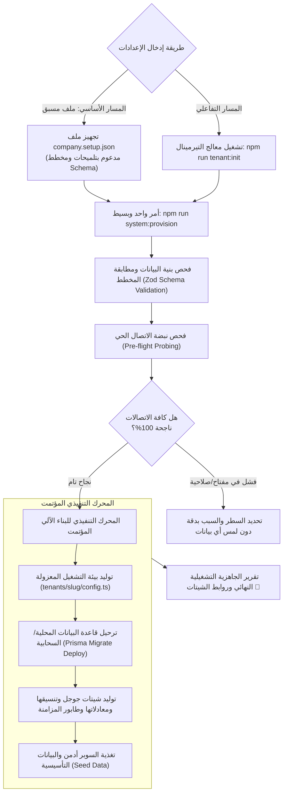

# 🛠️ دليل ومنهجية إعداد وبناء البوت للمنشآت
## Enterprise Multi-Tenant Onboarding & Automated Provisioning CLI Engine

> [!IMPORTANT]
> **الهدف الهندسي الصارم:**
> توفير معمارية برمجية تفاعلية ومؤتمتة بالكامل تتيح للمهندس أو مسؤول التشغيل بناء وتهيئة نسخة مستقلة كاملة من البوت لأي منشأة أو شركة جديدة خلال دقائق معدودة عبر سطر الأوامر التفاعلي (`CLI Wizard`) دون الحاجة لكتابة كود برمجي جديد، مع دعم ثلاث معمارِيات تخزين قابلة للتبديل (`SHEETS_ONLY` / `DB_ONLY` / `HYBRID`).

---

## 🏛️ 1. المبادئ المعمارية لمنهجية البناء (Core Architectural Principles)

1. **فصل الكود البرمجي عن إعدادات المنشأة (Strict Code & Tenant Decoupling - 12-Factor App):**
   - كود البوت والموديولات (`modules/`, `apps/bot-server/`) كود موحد وغير مرتبط بأي بيانات ثابتة تخص شركة بعينها.
   - كافة المتغيرات (اسم الشركة، العملة، الشيتات، التوكنات، قواعد العمل، الموديولات النشطة) تُستمد ديناميكياً من ملف تعريف المنشأة (`tenants/<company_slug>/config.ts`).

2. **التنفيذ التراكمي المقاوم للانهيار (Idempotent & Resilient Provisioning):**
   - محرك البناء قادر على إعادة التشغيل دون تدمير البيانات القائمة (`Safe Re-run`).
   - في حال انقطاع الاتصال أثناء بناء الشيتات أو الجداول، يسجل المحرك حالة التقدم (`.provision-state.json`) لاستئناف العملية من النقطة التي توقفت عندها دون تكرار.

3. **الفحص الاستباقي للاتصال والاعتماديات (Pre-Flight Connectivity Probing):**
   - لا يبدأ بناء أي جدول أو شيت قبل إجراء فحص اتصالي حي وفوري لكافة المفاتيح (توكن تليجرام، صلاحيات حساب جوجل، اتصال قاعدة البيانات، ومفتاح الذكاء الاصطناعي).

---

## 🧭 2. طريقتان متكاملتان للإعداد والتهيئة (Dual Provisioning Modes)

النظام يوفر طريقتين متطابقتين وظيفياً لاختيار الأنسب لبيئة العمل:

### 🌟 المسار الأساسي والمعياري: ملف الإعداد المُعلن المسبق (Declarative File-Driven Setup)
وهو المسار الموصى به للعمل المؤسسي؛ حيث يقوم المدير أو المحاسب أو المشغل بتعبئة ملف إعداد جاهز ومُعلّق بالكامل (`company.setup.json`)، ثم تشغيل أمر واحد وبسيط في التيرمينال دون الحاجة لأي تفاعل أثناء التنفيذ:

```bash
npm run system:provision
# أو لتحديد ملف مخصص:
npm run system:provision -- --config=./my-company.setup.json
```


### ⚡ المسار الثانوي: المعالج التفاعلي في التيرمينال (Interactive CLI Wizard)
لمن يفضل الإجابة عن الأسئلة خطوة بخطوة بالطرفية لتوليد ملف الإعداد آلياً:

```bash
npm run tenant:init
```





---

## 📋 3. تفاصيل خطوات معالج التهيئة (Step-by-Step CLI Wizard)

### الخطوة 1️⃣: هوية وبيانات المنشأة (Company Profile & Localization)
يسأل المعالج الأسئلة التالية مع التحقق من صحة المدخلات:
* **اسم المنشأة باللغة العربية:** (مثال: `شركة السعادة للمقاولات العامة`).
* **اسم المنشأة باللغة الإنجليزية:** (مثال: `Al-Saada Contracting Co.`).
* **المعرف البرمجي الفريد (Company Slug):** رمز باللغة الإنجليزية بدون مسافات (مثال: `alsaada` أو `delta_logistics`).
* **النطاق الزمني التشغيلي (Timezone):** قائمة للاختيار (الافتراضي: `Africa/Cairo` - توقيت القاهرة).
* **عملة المعاملات المالية (Currency Code & Symbol):** 
  - كود العملة: `EGP`, `SAR`, `AED`, `USD`.
  - الرمز المعروض: `ج.م`, `ر.س`, `د.إ`, `$`.

---

### الخطوة 2️⃣: مصفوفة الموديولات التشغيلية (Active Modules Selection)
تظهر قائمة خيارات متعددة (Multi-select Checkbox) لتحديد الموديولات المطلوبة لهذه الشركة:
* `[X] إدارة العمال والموظفين (Workforce & HR)`: كروت 360، الرواتب، الغياب، والإنذارات.
* `[X] السلف والعهد المالية للموظفين (Advances & Loans)`: طلب السلف، حدود الخصم، والأقساط.
* `[X] المقصف وبوفيه الموقع (Canteen & Buffets)`: مسحوبات السجائر، المشروبات، وتوريدات الموردين.
* `[X] العهد العينية والمصروفات النثرية (Custody & Petty Cash)`: عهد المشرفين، تصفية الفواتير بالـ AI.
* `[X] اللوجستيات وحركات النقل (Logistics & Fleet)`: كروت النقل، تتبع التوريد، الفوسفات، والكسارات.
* `[X] المعدات الثقيلة وصيانتها (Heavy Machinery)`: ساعات التشغيل، أذون الخروج، وسجلات الصيانة.
* `[X] المحروقات والمضخات (Diesel & Fuel Tracking)`: رصيد الخزانات، تزويد السيارات، ومحطات الديزل.
* `[X] الموردين وفواتير الشراء (Suppliers & Purchasing)`: أرصدة الموردين، أوامر التوريد، والمسحوبات.

> [!NOTE]
> اختيار الموديولات يحدد آلياً الجداول والشيتات التي سيتم بناؤها لاحقاً؛ فلا يتم استهلاك كوتا جوجل أو إنشاء جداول لموديول لم تختره الشركة.

---

### الخطوة 3️⃣: معمارية التخزين الموحدة (Unified Native Hybrid Architecture)
يعتمد النظام معمارية **المحرك الهجين المزدوج (Hybrid Architecture)** كمعيار موحد وثابت لكافة المنشآت لتحقيق أعلى سرعة ميدانية وأقصى استقرار:

* **المحرك الأساسي اللحظي (Primary Engine):**
  - قاعدة بيانات فائقة السرعة (SQLite مدمجة بدون أي تكاليف استضافة للمنشآت الفردية، أو PostgreSQL للشركات الكبرى).
  - زمن استجابة الحفظ والاستعلام للمستخدم في تليجرام أقل من `15ms`.
* **محرك المزامنة التلقائي (Transactional Outbox Sync Worker):**
  - ترحيل العمليات دورياً ولحظياً إلى Google Sheets لتظهر للمديرين والمحاسبين بكامل معادلاتها.
  - حماية تامة من انقطاع الإنترنت أو مشاكل كوتا جوجل (`Rate Limits`).
* **طوبولوجيا الشيتات (Sheets Topology):**
  - يختار المشغل بين ملف سبريدشيت واحد مجمع (`SINGLE_SPREADSHEET`) أو 4 ملفات قطاعية مستقلة (`MULTI_SPREADSHEET`).

---

### الخطوة 4️⃣: إدخال مفاتيح الربط والفحص الحي الفوري (Pre-flight Checks)
يطلب المعالج المفاتيح والملفات، ويجري عليها **اختبار نبضة حي (Live Heartbeat)** قبل الانتقال للخطوة التالية:

1. **مفتاح البوت (Telegram Bot Token):**
   - يدخل المستخدم التوكن.
   - *الفحص الفوري:* استدعاء `https://api.telegram.org/bot<TOKEN>/getMe`.
   - *النتيجة المعروضة بالـ CLI:* ✅ `تم التحقق بنجاح: تم الربط مع البوت @AlSaadaOperationBot (ID: 712345678)`.

2. **المعرف الشخصي لمدير النظام (Super Admin Telegram ID):**
   - يطلب إدخال الـ ID الخاص بالسوبر أدمن للتسجيل التلقائي في مصفوفة الصلاحيات.

3. **قاعدة البيانات المحلية أو السحابية (Database Connection):**
   - يدخل المشغل مسار ملف SQLite (افتراضي: `file:./data/tenant.db`) أو رابط PostgreSQL.
   - *الفحص الفوري:* تنفيذ `SELECT 1;` واختبار إنشاء الجداول.
   - *النتيجة المعروضة بالـ CLI:* ✅ `الاتصال بقاعدة البيانات ناجح، والمساحة التخزينية جاهزة`.

4. **بيانات الربط مع جوجل شيت (Google Service Account & Drive):**
   - يطلب المعالج: مسار ملف المفتاح السحابي `service_account.json` ومُعرف مجلد Google Drive المشترك (`Drive Folder ID`).
   - *الفحص الفوري:* الاتصال بـ `google.drive('v3')` والتأكد من امتلاك حساب الخدمة صلاحية إنشاء ملفات داخل هذا المجلد بالذات.
   - *النتيجة المعروضة بالـ CLI:* ✅ `تم الوصول لمجلد Google Drive الخاص بالشركة بنجاح (المساحة والصلاحيات معتمدة)`.

5. **مفتاح الذكاء الاصطناعي (Gemini Vision API Key):**
   - *الفحص الفوري:* استدعاء نبضة سريعة (Token ping) لموديل `gemini-2.5-flash` للتأكد من فاعلية المفتاح لقراءة الفواتير والمرفقات.

---

### الخطوة 5️⃣: المحرك التنفيذي للبناء الآلي (Automated Infrastructure Engine)
بمجرد تأكيد البيانات ونجاح كافة الفحوصات، يقوم المعالج بتنفيذ العمليات التالية آلياً مع شريط تقدم (Progress Spinner):


```bash
[1/5] 📝 توليد ملفات التكوين والبيئة (tenants/alsaada/config.ts & .env.alsaada)... تم ✅
[2/5] 🗄️ تهيئة قاعدة البيانات وتشغيل الهجرات (Prisma Migrate Deploy)... تم ✅ (تم إنشاء 24 جدولاً)
[3/5] 📊 توليد شيتات جوجل (66 تبويباً، 480 عموداً، وتطبيق التنسيقات والألوان)... تم ✅ (استغرق 42 ثانية)
[4/5] 🔐 حقن الصلاحيات والمستخدم الافتراضي (Super Admin ID: 12345678)... تم ✅
[5/5] 🧪 تشغيل الفحص الذاتي للخدمات (End-to-End Self Test)... تم ✅ (كافة الخدمات جاهزة 100%)
```


#### تفاصيل بناء الشيتات الدفعي الآمن (Safe Batch Provisioning):
لتفادي قيود الكوتا في جوجل (`Rate Limits`):
- يجمع المحرك طلبات إنشاء التبويبات وتنسيق الأعمدة في حزم (`Batches`) بحد أقصى 10 تبويبات لكل طلب `batchUpdate`.
- يتم تطبيق تنسيق اتجاه الورقة من اليمين لليسار (`rightToLeft: true`) وتجميد الصف الأول (`frozenRowCount: 1`).
- يتم تطبيق الصيغ الحسابية الأساسية (`=SUM(...)`, `=COUNTIF(...)`) تلقائياً.

---

### الخطوة 6️⃣: تقرير الجاهزية التشغيلية النهائي (Deployment Readiness Report)

يطبع المعالج في سطر الأوامر بطاقة الإطلاق الرسمية:


```text
================================================================================
🎉 اكتمل بناء وتهيئة بوت المنشأة بنجاح!
================================================================================
🏢 المنشأة: شركة السعادة للمقاولات العامة (alsaada)
🤖 معرف البوت: @AlSaadaOperationBot
💾 معمارية التخزين: المحرك الهجين (HYBRID: PostgreSQL + Google Sheets)
📊 رابط جوجل شيت التشغيلي: https://docs.google.com/spreadsheets/d/1aBcDeFgHiJkLmNoP...
📁 ملف التكوين المولد: tenants/alsaada/tenant.config.ts
🔐 السوبر أدمن المعتمد: ID: 12345678
📦 الموديولات المفعلة: [Workforce, Advances, Canteen, Custody, Logistics, Fuels]
================================================================================
🚀 لبدء تشغيل البوت فوراً في بيئة الإنتاج:
   pnpm start:tenant --tenant=alsaada
   
🐳 أو لتشغيل الحاوية الميدانية الخاصة بهذه الشركة:
   docker compose -f docker-compose.alsaada.yml up -d
================================================================================
```


---

## 🔒 4. التعامل مع حالات الخطأ والانقطاع (Failure Modes & Idempotency)

| سيناريو الفشل المحتمل | السلوك البرمجي المعالج (Failure Handling) | الضمان الهندسي |
| :--- | :--- | :--- |
| **انقطاع الإنترنت أثناء توليد الشيتات الـ 66** | يقوم المحرك بتخزين التبويبات المكتملة في `.provision-state.json`. عند إعادة تشغيل الأمر، يستأنف المحرك من التبويب غير المكتمل. | **Zero Duplicate Sheets** (لا يتم إنشاء تبويبات مكررة). |
| **فشل الاتصال بقاعدة البيانات أثناء الهجرة** | إيقاف العملية فوراً قبل لمس جوجل شيت وطباعة سبب الخطأ (بيانات اعتماد غير صالحة أو المنفذ مغلق). | **No Partial Infrastructure** (منع إنشاء بنية هجينة غير مكتملة). |
| **تجاوز كوتا جوجل شيت (HTTP 429 Quota Exceeded)** | يقوم المحرك بتفعيل التراجع الأسي المجدول (`Exponential Backoff with Jitter`) والانتظار لمدة 30 ثانية ثم إعادة المحاولة تلقائياً. | **Auto-Recovery** دون الحاجة لتدخل بشري. |

---

## 📁 5. هيكلية ملفات تكوين المنشأة (Tenant Folder Architecture)

كل منشأة يتم بناؤها يكون لها مجلد مستقل بالكامل داخل النظام:


```text
Alsaada-Smart-Bot/
├── config/
│   └── schema-registry/        # المخطط القياسي الـ 66 شيت والـ 24 جدولاً (SSOT)
├── tenants/
│   ├── alsaada/                # المنشأة الأولى (شركة السعادة)
│   │   ├── tenant.config.ts    # الإعدادات، الموديولات، والخيارات
│   │   ├── sheets-registry.json# روابط ومعرفات الشيتات الفعلية المولدة
│   │   ├── .env.alsaada        # المتغيرات السرية المشفرة
│   │   └── docker-compose.yml  # ملف تشغيل الحاوية المستقلة
│   └── delta_logistics/        # منشأة ثانية تم بناؤها بنفس المحرك
│       ├── tenant.config.ts
│       ├── sheets-registry.json
│       └── .env.delta_logistics
```


> [!TIP]
> هذه الهيكلية تحقق العزل التام بين بيانات كل شركة، وتسمح بتشغيل مئات الشركات من نفس الكود المصدري إما في عمليات منفصلة (`Container per Tenant`) أو في نظام متعدد المستأجرين موحد (`Multi-Tenant Process`).
