# 📜 دستور ومعايير هندسة وظائف وتدفقات المنظومة (المواصفات الشاملة الموحدة)
## Enterprise Feature & Flow Master Specification Standard (Universal SSOT)

> [!IMPORTANT]
> **المرجعية المعمارية والحوكمية الإلزامية (Universal Architecture & UX SSOT):**
> تمثل هذه الوثيقة **المواصفات الفنية الشاملة والمعايير الإلزامية غير القابلة للاستثناء** لأي وظيفة، تدفق، أو معالج يتم بناؤه في بوت وتطبيقات منظومة السعادة.
> يلتزم بها كافة مطوري ووكلاء الذكاء الاصطناعي (AI Agents)، ويُعد أي نقص أو خرق لأي بند من هذه المعايير سبباً فورياً لرفض الميزة واعتبارها غير مقبولة هندسياً وتجريبياً (`FAIL`).

---

## 🧭 خريطة المعايير الـ 14 الحاكمة لأي تدفق (The 14 Pillars of Universal Flow UX)

```mermaid
graph TD
    Flow["أي وظيفة أو تدفق بالبوت (Universal Flow)"] --> B1["1️⃣ مسار التتبع وتسلسل الخطوات في الوصف (Breadcrumbs & Step Sequence)"]
    Flow --> B2["2️⃣ دورة حياة الرسالة الواحدة والتعديل الموضعي (In-Place Single Message)"]
    Flow --> B3["3️⃣ الحذف التلقائي الصامت لمدخلات المستخدم (Silent User Input Deletion)"]
    Flow --> B4["4️⃣ أزرار التنقل والرجوع التراجعي (Back Stack & Cancellation)"]
    Flow --> B5["5️⃣ مصفوفة حصانة التنقل والشفاء الذاتي (Navigation Immunity & Auto-Healing)"]
    Flow --> B6["6️⃣ كنس المخلفات والتدفقات العالقة (Garbage Collection on Context Switch)"]
    Flow --> B7["7️⃣ شاشة وبطاقة المراجعة قبل الحفظ (Mandatory Review Gate)"]
    Flow --> B8["8️⃣ لوحة أزرار ما بعد الإنجاز القياسية (Completion Keyboard)"]
    Flow --> B9["9️⃣ خلود سند العملية وكارت الإنجاز (Receipt Permanence)"]
    Flow --> B10["🔟 حظر إدخال أو عرض الأجر اليومي (Daily Wage UI Prohibition)"]
    Flow --> B11["1️⃣1️⃣ الحجب المسبق الصارم للصلاحيات (Pre-Render RBAC Masking)"]
    Flow --> B12["1️⃣2️⃣ الاستدعاء الحتمي لمكونات النواة المشتركة (Shared Kernel Usage)"]
    Flow --> B13["1️⃣3️⃣ المعمارية الهجينة وطابور المزامنة الخلفي (Hybrid Outbox Architecture)"]
    Flow --> B14["1️⃣4️⃣ العمارة النظيفة وسقف الأسطر والاختبارات (< 350 Lines & TDD)"]
```



---

### 1️⃣ مسار التتبع وتسلسل التدفق في الوصف (Breadcrumbs & Step Sequence)

#### أ. القاعدة الإلزامية:
يُحظر تماماً عرض رسالة أو خطوة للمستخدم دون بيان **مسار التتبع الشجري (Breadcrumbs)** و **تسلسل الخطوة الحالية من إجمالي خطوات المعالج (Step Sequence)**.

#### ب. المواصفة الفنية لصياغة نصوص الخطوات:
كل رسالة خطوة في أي معالج يجب أن تتكون من الأجزاء الأربعة التالية بالترتيب:
1. **شريط مسار التتبع الشجري في السطر الأول:**
   يتم استدعاء `formatBreadcrumbs([...])` المعياري من `@alsaada/core-components` ليعرض المسار مثل:
   `🏠 الرئيسية ⬅️ 📁 شؤون العاملين ⬅️ ➕ تسجيل وتعيين عامل جديد`
2. **عنوان الخطوة ورقم التسلسل الإجمالي:**
   يُكتب العنوان بنمط بارز موضحاً رقم الخطوة الحالية من إجمالي الخطوات:
   `➕ *تسجيل وتعيين عامل جديد — الخطوة 3 من 12: الاسم الرباعي*`
3. **الشريط الفاصل المعياري الموحد:**
   `────────────────────────────`
4. **المتن والإرشادات ومثال توضيحي:**
   صياغة السؤال بوضوح، مع توضيح الصيغة المطلوبة ومثال عملي بين قوسين.
5. **شريط الأخطاء التفاعلي (عند الخطأ):**
   في حال إدخال قيمة غير صالحة، تُعدل نفس الرسالة موضعياً مع إبراز رسالة التحذير `⚠️ [سبب الخطأ]` مع زر `[ 🔄 إعادة الإدخال ]` وزر `[ ◀️ رجوع ]` دون إرسال رسالة جديدة.

```typescript
// مثال تطبيقي معياري
export function formatNamePrompt(): string {
  return (
    formatBreadcrumbs(['📁 الموارد البشرية', '👥 شؤون العاملين', '➕ تعيين عامل جديد', 'الاسم']) +
    `👤 *تسجيل عامل جديد — الخطوة 3 من 12: الاسم الرباعي*\n` +
    `────────────────────────────\n` +
    `💬 *يرجى إرسال الاسم الرسمي للعامل كاملاً (ثلاثياً أو رباعياً كما هو مدون بالبطاقة):*\n` +
    `(مثال: أحمد محمد مصطفى إبراهيم)`
  );
}
```

---

### 2️⃣ دورة حياة الرسالة الواحدة والتعديل الموضعي (In-Place Single Message Lifecycle)

* **المبدأ:** المعاملة بالكامل — مهما بلغت خطواتها — تعيش وتتطور داخل **رسالة تليجرام واحدة فقط**.
* **الآلية:**
  - كل خطوة تستبدل سابقتها موضعياً عبر محرك `renderInPlaceWizardStep` في الحزمة المشتركة `@alsaada/core-components`.
  - يتم تتبع وتخزين `activeMessageId` و `chatId` في مسودة الكاش السريع (`Redis`).
  - في حال تعذر التعديل الموضعي لأسباب خارجية (مثل قيام المستخدم بحذف الرسالة يدوياً)، يقوم المحرك تلقائياً بإرسال رسالة جديدة وتحديث `activeMessageId` في المسودة بصمت (`onMessageIdUpdated`).

---

### 3️⃣ الحذف الصامت التلقائي لمدخلات المستخدم (Silent User Input Deletion)

* **المبدأ:** الحفاظ على شات تليجرام نظيفاً وخالياً تماماً من الفوضى وتراكم الرسائل.
* **الآلية:**
  - فور إرسال المستخدم لأي نص، رقم، صورة، موقع جغرافي، أو مستند تفاعلي استجابة لخطوة بالمعالج؛ يتولى المحرك الحذف الفوري والصامت لرسالة المستخدم الواردة عبر `deleteUserInputMessage(ctx)` / `cleanupIncomingUserMessage(ctx)`.
  - النتيجة الميدانية: لا يرى المستخدم في المحادثة سوى رسالة البوت الوحيدة وهي تتحدث وتنتقل بسلاسة أمامه.

---

### 4️⃣ أزرار التنقل والرجوع التراجعي (Back Stack Navigation & Cancellation)

* **زر الرجوع الإلزامي (`[ ◀️ السابق ]`):**
  - إلزامي في كل خطوة من خطوات المعالج.
  - يعتمد على مكدس الحالات التاريخي (`historyStack` / `popStep`) في المسودة.
  - العودة للخطوة السابقة **تحتفظ بكافة البيانات التي تم إدخالها مسبقاً** لتمكين المستخدم من تصحيح اختياره دون الحاجة لإعادة كتابة الحقول الأخرى.
* **زر التخطي السريع (`[ ⏭️ تخطي ]`):**
  - إلزامي في كافة الخطوات الاختيارية (مثل: صور البطاقات، رخص القيادة، هاتف الطوارئ، الملاحظات).
* **زر الإلغاء الشامل (`[ ❌ إلغاء ]`):**
  - إلزامي في كافة الخطوات؛ يقوم بتفريغ المسودة فوراً من الذاكرة وإعادة المستخدم موضعياً للشاشة التابعة للقسم.

---

### 5️⃣ مصفوفة حصانة التنقل والشفاء الذاتي (Navigation Immunity & Auto-Healing)

* **المشكلة التي يعالجها:** نقر المستخدم على أزرار رجوع أو إلغاء أو أقسام رئيسية لرسائل قديمة سابقة كانت متروكة في الشات.
* **المعيار الحاكم:**
  - كافة أزرار التنقل، الرجوع، الإلغاء، والانتقال بين الأقسام، وترقيم الصفحات يجب أن تكون مسجلة في **مصفوفة حصانة التنقل (`NAVIGATION_IMMUNITY_PATTERNS`)** في `ScreenFlowService`.
  - **آلية الشفاء الذاتي (`Auto-Healing`):**  
    عند نقر زر محصن، يُحظر إظهار رسالة الخطأ `⚠️ هذه الرسالة منتهية الصلاحية`؛ بل يقوم البوت بـ:
    1. حذف أي رسالة لتدفق سابق غير مكتمل فورياً من الشات.
    2. استرجاع الرسالة المنقور عليها كرسالة نشطة وتحديث الـ Active Message في الـ Redis فورياً.
    3. تنفيذ الإجراء أو التنقل المطلوب بسلاسة مطلقة.

---

### 6️⃣ كنس المخلفات والتدفقات العالقة عند التبديل (Garbage Collection on Context Switch)

* إذا كان المستخدم بداخل معالج غير مكتمل، وقام فجأة بالنقر على زر في الكيبورد السفلي الدائم (مثل: `[ 🏠 القائمة الرئيسية ]`، `[ ⚙️ إعدادات النظام ]`، `[ 🖥️ فتح لوحة التحكم ]`)، أو إرسال أمر نصي مثل `/start` أو `/cancel`:
  - يتولى خطاف الكنس المركزي (`Central Garbage Collection Hook`) في `bot.ts` استدعاء:
    ```typescript
    await screenFlowService.cleanupUnfinishedFlow(ctx);
    ```
  - تُحذف رسالة التدفق غير المكتمل تماماً من الشات دون أي أثر لمنع تراكم الشاشات المعلقة.

---

### 7️⃣ شاشة وبطاقة المراجعة قبل الحفظ (Mandatory Review Gate)

* **المبدأ:** يُحظر تماماً حفظ أي عملية تشغيلية أو مالية فور إدخال آخر حقل.
* **الشرط الإلزامي:** التوقف عند شاشة مراجعة نهائية قبل التنفيذ:
  - استدعاء `formatConfirmationCard` المعياري لعرض ملخص منسق لكافة البيانات المدخلة.
  - إظهار أي تحذيرات ذكية (مثل: وجود هاتف مكرر، أو رصيد غير كافٍ).
  - لوحة الأزرار تحتوي فقط على:
    - `[ ✅ تأكيد وحفظ العملية ]`
    - `[ ◀️ رجوع لتعديل البيانات ]`
    - `[ ❌ إلغاء العملية بالكامل ]`

---

### 8️⃣ لوحة أزرار ما بعد الإنجاز القياسية (Universal Completion Keyboard)

* **المبدأ:** استدعاء دالة `buildCompletionKeyboard` المعيارية من `@alsaada/core-components` حصراً.
* **الأزرار الأربعة بالترتيب الإلزامي الصارم:**
  1. **زر الإجراء الميداني المباشر:** رابط واتساب إلكتروني مشفر أو تحميل مستند (`[ 📲 إرسال إشعار / دعوة للعامل عبر واتساب ]`).
  2. **زر إعادة تنفيذ نفس المعاملة:** (`[ ➕ تسجيل ... آخر ]`) لبدء نفس التدفق فوراً بضغطة واحدة.
  3. **زر العودة لقسم الوظيفة:** (`[ 🔙 العودة لقسم ... ]`) للرجوع للقائمة الوسيطة للقسم.
  4. **زر العودة للقائمة الرئيسية:** (`[ 🏠 القائمة الرئيسية ]` -> `action:main_menu`).

---

### 9️⃣ خلود سند العملية وكارت الإنجاز (Receipt Permanence)

* **المبدأ:** بطاقة إتمام المعاملة وسند القيد المالي تُمثل **مستنداً رسمياً دائماً**.
* **الآلية المعمارية:**
  - يتم استدعاء `renderInPlaceCompletion` بعلم `isCompleted: true`.
  - هذه الرسالة **لا تُحذف أبداً** من الشات وتبقى كأرشيف دائم في محادثة المستخدم.
  - عند نقر المستخدم على أي زر تنقل بعدها (مثل العودة للقائمة الرئيسية أو بدء تسجيل آخر)، **يُحظر تعديل رسالة الإنجاز موضعياً**؛ بل تُجرد فقط من أزرارها التفاعلية لمنع التكرار، وتُفتح الشاشة الجديدة كرسالة جديدة في الشات.

---

### 🔟 حظر إدخال أو عرض الأجر اليومي (Daily Wage UI Prohibition)

* **المبدأ:** الأجر اليومي (`dailyWage`) ليس حقل إدخال ولا يُعرض في أي واجهة مستخدم (سواء في البوت أو لوحة التحكم).
* **القاعدة:**
  - الراتب يُحدد كـ: **راتب أساسي (`basicSalary`) + راتب إضافي (`additionalSalary`) + بدلات ثابتة مسماة (`allowances`)**.
  - الأجر اليومي هو **معامل اشتقاق محاسبي داخلي بحت** يُحسب برمجياً خلف الكواليس وفق المعادلة:
    $$\text{dailyWage} = \frac{\text{basicSalary} + \text{additionalSalary}}{30}$$

---

### 1️⃣1️⃣ الحجب المسبق الصارم للصلاحيات (Strict Pre-Render RBAC Masking)

* **القاعدة:** *"لا وظيفة ولا زر يُعرض في البوت لمن ليس له صلاحية مسبقة"*.
* تُصفى مصفوفة الأزرار برمجياً قبل تصييرها بناءً على دور المستخدم الفعلي (`ctx.effectiveRole`).
* يُمنع منعاً باتاً عرض الزر لغير المصرح له ثم تنبيهه بـ "عذراً لا تملك صلاحية"؛ المعيار الوحيد هو **الاختفاء التام للزر**.

---

### 1️⃣2️⃣ الاستدعاء الحتمي لمكونات النواة المشتركة (Shared Kernel Usage)

* يُحظر تماماً إعادة اختراع العجلة أو كتابة منطق مكرر داخل الموديولات:
  - اختيار وتصفية العمال: `buildWorkerPickerKeyboard`, `filterWorkers`, `getWorkerDisplayName`.
  - عرض اسم الشهرة حصراً في كافة القوائم: `getWorkerDisplayName` / `formatWorkerPickerLabel`.
  - المدخلات المالية ورادار التكرار: `UniversalAmountPicker`, `validateAmount`, `checkDuplicatePaymentRisk`.
  - التواريخ والمدد: `UniversalDatePicker`, `parseRegionalDate`.
  - المحافظات والأقاليم: `GovernoratePicker`, `formatGovernorateCard`.
  - المواقع الجغرافية والخرائط: `LocationPicker`, `formatLocationPromptCard`.
  - صمامات الأمان والمقاصة: `TripleBalanceClearingEngine`, `UniversalCustodyGate`.
  - الأرقام والعملات: `normalizeDigits`, `formatCurrency`, `formatDateTime`.

---

### 1️⃣3️⃣ المعمارية الهجينة وطابور المزامنة الخلفي (Hybrid Outbox Architecture)

* قاعدة البيانات اللحظية (PostgreSQL / SQLite) هي المصدر الأساسي للحفظ السريع في الميدان في **أقل من `15ms`**.
* **حظر الاستدعاء المباشر لـ Google Sheets في المعالجات:**
  - يُحظر تماماً إجراء أي اتصال شبكي تزامني مع Google Sheets API داخل `flow.handler.ts`.
  - تُقيد كافة العمليات التزامنية كأحداث في جدول `OutboxEvent` وتُرحل للشيتات بصمت عبر `TransactionalOutboxQueue`.

---

### 1️⃣4️⃣ العمارة النظيفة وسقف الأسطر والاختبارات الشاملة (Clean Architecture & TDD)

* **بنية ملفات التدفق الرأسي (`Vertical Slice`):**
  - `flow.contract.json`: عقد التدفق ونقاط التفاعل.
  - `flow.types.ts`: الأنواع الصارمة وحالات المسودة.
  - `flow.messages.ts`: نصوص ورسائل الخطوات مع مسارات التتبع.
  - `flow.keyboard.ts`: لوحات الأزرار المعيارية مع أزرار الرجوع والإلغاء والتخطي.
  - `flow.service.ts`: منطق الأعمال وقواعد الحسابات.
  - `flow.repository.ts`: الاستعلامات الذرية وقيد المعاملات.
  - `flow.handler.ts`: المعالج التفاعلي — **ملتزم بسقف أقصى 350 سطراً وخالٍ تماماً من نوع `any`**.
  - `tests/`: 4 ملفات اختبار آلية (Unit, Contract, UX, Integration).
* **بوابة الفحص السريع:** اجتياز `pnpm flow:check <flow-path>` بنجاح تام بنسبة 100%.

---

## 📋 مصفوفة المراجعة السريعة لأي تدفق (Pre-Flight Flow Checklist)

قبل اعتماد أو تسليم أي تدفق وظيفي جديد، يجب التحقق من استيفاء الـ 10 أسئلة الذهبية التالية:

| # | معيار التحقق | نعم / لا |
| :-: | :--- | :---: |
| 1 | هل تحتوي كل رسالة على شريط مسار التتبع `formatBreadcrumbs` ورقم التسلسل `[الخطوة X من Y]`؟ | [ ] |
| 2 | هل المعالج بالكامل يعيش داخل رسالة واحدة موضعية عبر `renderInPlaceWizardStep`؟ | [ ] |
| 3 | هل يتم حذف رسائل المستخدم النصية والوسائط فوراً بصمت لإبقاء الشات نظيفاً؟ | [ ] |
| 4 | هل يوجد زر `[ ◀️ السابق ]` في كل خطوة مع دعم استرجاع البيانات السابقة عبر `popStep`؟ | [ ] |
| 5 | هل يوجد زر `[ ⏭️ تخطي ]` في كافة الخطوات غير الإلزامية؟ | [ ] |
| 6 | هل أزرار التدفق مدرجة في `NAVIGATION_IMMUNITY_PATTERNS` وتدعم الشفاء الذاتي والكنس التلقائي؟ | [ ] |
| 7 | هل تتوقف العملية عند بطاقة مراجعة نهائية قبل الحفظ عبر `formatConfirmationCard`؟ | [ ] |
| 8 | هل تحتوي بطاقة الإتمام على لوحة `buildCompletionKeyboard` الرباعية المعيارية؟ | [ ] |
| 9 | هل بطاقة سند الإنجاز باقية دائماً في الشات بعلم `isCompleted: true` ومحمية من الحذف؟ | [ ] |
| 10 | هل ملف المعالج أقل من 350 سطراً وخالٍ من `any` ويجتاز `pnpm flow:check` بنجاح؟ | [ ] |
