# 📜 دستور المرجعية وميثاق إعادة الهيكلة والتصحيح المعماري
## The Baseline SSOT Charter & Clean Modernization Protocol

> [!IMPORTANT]
> **المبدأ التأسيسي الحاكم (The Foundational Rule):**
> 1. هذا المشروع الجديد (`F:\Alsaada-Smart-Bot`) هو **إعادة هيكلة شاملة وتصحيح معماري وتطوير حديث** لمنظومتنا الحالية (`F:\HR`).
> 2. **المشروع الحالي (`F:\HR`) يمثل مصدر الحقيقة المطلقة والكاملة (The Definitive Functional Baseline & SSOT)** لكافة الوظائف التشغيلية، والتدفقات الـ 126 المعتمدة، وقواعد الحساب، والشيتات الـ 66، وسجلات الصلاحيات والعمليات الميدانية.
> 3. **تجميد المشروع الحالي دون أي تعديلات:** يظل المشروع الحالي يعمل بكامل طاقته الميدانية في بيئة الإنتاج كما هو تماماً لخدمة مواقع العمل، ويُحظر إجراء أي تعديلات هيكلية عليه، بل يُستخدم كمرجع حي ومكتبي لمطابقة كل رقم، وشاشة، وتدفق.
> 4. **إعادة البناء في المشروع الجديد:** تتم إعادة بناء كل وظيفة من وظائف المشروع الحالي واحدة تلو الأخرى وفق المعمارية الموديولية المعزولة الحديثة، وبحيث تتفوق على الأصل في الجودة، والعزل، والأتمتة، والسرعة، دون تكرار أي عيوب سابقة.

---

## 🏛️ خريطة العلاقة بين المشروعين (The Two-Repository Architecture)

```mermaid
flowchart LR
    subgraph Baseline [المشروع الحالي F:\HR - المرجع الوظيفي الكامل]
        OldCode["منظومة العمليات الحالية<br/>(126 تدفقاً تشغيلياً معتمداً)"]
        OldSheets["66 شيت سحابي ومصفوفات حسابية"]
        OldRules["قواعد العمل والصلاحيات الميدانية"]
        OldDocs["موسوعة التدفقات الـ 126 (10-Pillar Audit)"]
    end

    subgraph Target [المشروع الجديد F:\Alsaada-Smart-Bot - إعادة الهيكلة النظيفة]
        NewCore["نواة مشتركة مجهزة مسبقاً<br/>(عمال، مبالغ، كميات، تواريخ، تأكيدات)"]
        NewVision["محرك قراءة الفواتير والمرفقات الموحد<br/>(صور عادية + ملفات PDF بالذكاء الاصطناعي)"]
        NewAutoProv["محرك التوليد التلقائي للشيتات والمعادلات<br/>(Google Sheets Auto-Provisioner)"]
        NewModular["موديولات رأسية معزولة تماماً (Vertical Slices)<br/>(جلسات محكومة + صفر تداخل + صفر تكرار)"]
        NewWhiteLabel["جاهزية لجميع الشركات (White-Label Multi-Tenant)"]
    end

    Baseline -.->|نقل المنطق ومطابقة المواصفات 100%| Target
```

---

## 📋 ميثاق الالتزام الهندسي (Engineering Commitments)

### 1. لا تعديل على المشروع الحالي (`F:\HR`):
* يُمنع التعديل أو الحذف أو إعادة التوزيع داخل مجلد `F:\HR`.
* يظل البوت القديم يعمل على حاوية الدوكر الحالية لخدمة العمل اليومي للمشرفين والعمال دون أي انقطاع (**Zero Operational Downtime**).
* يمثل `F:\HR` "المختبر المرجعي المفتوح" للرجوع إلى:
  - نصوص الرسائل والأزرار المعتمدة.
  - أسماء أعمدة وخلايا ومعادلات الشيتات الـ 66.
  - معايير فحص الأداء وصلاحيات الـ RBAC.

### 2. المواصفات الكاملة مستمدة من المشروع المرجعي:
* لا يتم تخمين أو ابتداع أي وظيفة أو منطق حسابي من الصفر في المشروع الجديد؛ بل يتم استخراج مواصفات كل تدفق مباشرة من ملفات التوثيق الماسي في `F:\HR\docs\10-pillar-audit/` والأكواد المقابلة لها.
* عند نقل أي موديول (مثل الكانتين أو السلف)، يُطابق الموديول الجديد ما كان يفعله القديم بنسبة 100%، ولكن بهيكل برمجي نقي ومعزول.

### 3. ما الذي يضيفه المشروع الجديد عن المشروع القديم؟
1. **القضاء التام على تكرار الكود (DRY):** استدعاء مكونات النواة المشتركة (WorkerPicker, AmountPicker, etc.) بدلاً من كتابتها في كل تدفق.
2. **محرك موحد للصور وملفات الـ PDF بالـ AI:** قراءة كافة المرفقات (فواتير، بوالص، تحويلات، كشوف عهد) بصيغة صور أو ملفات PDF مباشرة.
3. **محرك التوليد التلقائي للشيتات (Auto-Provisioner):** بناء الشيتات الـ 66 بضغطة زر واحدة لأي شركة في دقيقتين بدلاً من الإعداد اليدوي.
4. **جلسات معزولة صارمة (Scoped Sessions):** منع `(ctx.session as any)` وحظر أي تداخل بين التدفقات لمنع التراجعات البرمجية نهائياً.
5. **إطار عمل عام (White-Label):** إمكانية تشغيل المنظومة لأي شركة بتغيير ملف إعدادات واحد.
