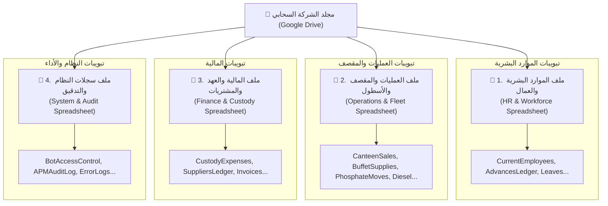

# 📑 طوبولوجيا ملفات جوجل شيت ومحرك التوجيه السحابي
## Google Sheets Topology & Dynamic Registry Resolver

> [!IMPORTANT]
> **الهدف الهندسي:**
> إتاحة المرونة التامة للشركات لاختيار كيفية هيكلة ملفات Google Sheets الخاصة بها عند التأسيس، مع عزل كود البوت تماماً عن معرفة ما إذا كانت التبويبات مجمعة في ملف واحد أو مقسمة عبر ملفات قطاعية متعددة، عبر محرك توجيه موحد (`Dynamic SheetRegistryResolver`).

---

## 🎛️ 1. أنماط الطوبولوجيا المدعومة (Supported Topologies)

يتم تحديد النمط في ملف الإعداد `company.setup.json` عبر الحقل `storage.sheetsTopology`:

### 1️⃣ النمط الأول: الملف الشامل الموحد (`SINGLE_SPREADSHEET`)
* **الآلية:** يتم توليد ملف سبريدشيت واحد يحتوي على كافة التبويبات المفعلة (حتى 66 تبويباً).
* **الملف المنشأ في Google Drive:**
  - `[اسم الشركة] - المنظومة التشغيلية الشاملة`
* **حالات الاستخدام الأنسب:** الشركات الصغيرة التي يديرها مالك واحد أو محاسب مركزي يفضل التنقل بين كافة التبويبات عبر رابط واحد.

---

### 2️⃣ النمط الثاني: الملفات القطاعية المعزولة (`MULTI_SPREADSHEET`) - *الموصى به مؤسسياً*
* **الآلية:** يتم توليد **4 ملفات سبريدشيت مستقلة** داخل مجلد Google Drive المخصص للشركة، ويتم توزيع التبويبات الـ 66 عليها حسب المجال الوظيفي (`Domain-Driven Segregation`):



* **جدول توزيع المجالات الوظيفية:**

| المعرف القطاعي (`Domain`) | اسم الملف المنشأ في Drive | أهم التبويبات التابعة له | الصلاحية الإدارية المقترحة |
| :--- | :--- | :--- | :--- |
| **`HR_WORKFORCE`** | `[الشركة] - الموارد البشرية والعمال` | `CurrentEmployees`, `AdvancesLedger`, `WorkerInstallments`, `AttendanceLog`, `LeavesRegistry`, `ViolationsLog` | مدير الموارد البشرية والرواتب |
| **`OPERATIONS_FLEET`** | `[الشركة] - العمليات والأسطول والمقصف` | `CanteenSales`, `BuffetSupplies`, `PhosphateLogistics`, `DieselTanks`, `EquipmentLog`, `SiteInventory` | المشرفون الميدانيون ومسؤولو الموقع |
| **`FINANCE_CUSTODY`** | `[الشركة] - المالية والمشتريات والعهد` | `CustodyExpenses`, `SuppliersAccounts`, `MaterialReceipts`, `PurchasingOrders` | المدير المالي والمحاسب العام |
| **`SYSTEM_AUDIT`** | `[الشركة] - سجلات النظام والأداء` | `BotAccessControl`, `BotPerformanceAuditLog`, `SecurityEvents`, `SystemConfig` | السوبر أدمن ومدير تكنولوجيا المعلومات |

---

## 🧭 2. محرك التوجيه البرمجي الموحد (`SheetRegistryResolver`)

### العقد البرمجي لمحرك التوجيه (Interface Contract):

```typescript
export enum SheetDomain {
  HR_WORKFORCE = 'HR_WORKFORCE',
  OPERATIONS_FLEET = 'OPERATIONS_FLEET',
  FINANCE_CUSTODY = 'FINANCE_CUSTODY',
  SYSTEM_AUDIT = 'SYSTEM_AUDIT',
}

export interface SheetTargetResolution {
  spreadsheetId: string; // المعرف الفعلي لملف جوجل
  sheetName: string;     // اسم التبويب داخل الملف
  domain: SheetDomain;   // القطاع الوظيفي
}

export interface ISheetRegistryResolver {
  resolve(sheetKey: string): SheetTargetResolution;
}
```

### كيف يضمن المحرك عدم تأثر كود البوت؟
* عند كتابة أو قراءة أي معاملة (مثل تسجيل سلفة لعامل):
  ```typescript
  // كود الموديول لا يهتم مطلقاً بالطوبولوجيا المختارة
  const target = sheetRegistry.resolve('ADVANCES_LEDGER');
  
  // في نمط SINGLE: target.spreadsheetId = 'unified_file_id'
  // في نمط MULTI:  target.spreadsheetId = 'hr_workforce_file_id'
  // target.sheetName = 'AdvancesLedger' دائماً
  await sheetsService.appendRow(target.spreadsheetId, target.sheetName, rowData);
  ```

---

## 🔒 3. المزايا الأمنية والتشغيلية لدعم الطوبولوجيا المزدوجة

1. **التحكم بصلاحيات Google Drive على مستوى الملفات (Least Privilege Security):**
   * في نمط `MULTI_SPREADSHEET`، تستطيع إدارة الشركة مشاركة ملف العمليات مع المشرف الميداني على إيميله الخاص بجوجل، دون منحه أي وصول لملف الرواتب أو المالية، مما يقضي تماماً على خطر تسريب بيانات الأجور.
2. **استقرار الأداء ومنع تجمد المتصفح (Browser Performance Guarantee):**
   * تقسيم الـ 66 تبويباً إلى ملفات رشيقة يمنع مشكلة بطء جوجل كروم ويضمن فتح كل ملف في أقل من ثانيتين للمحاسبين.
3. **عدم كسر التوافق مع الأنظمة القائمة (Backward Compatibility):**
   * بالنسبة لمن يفضل نمط ملف السعادة الحالي الموحد (`F:\HR`)، يمكنه اختيار `SINGLE_SPREADSHEET` ليعمل النظام بنفس الطريقة المألوفة دون أي تغيير.
