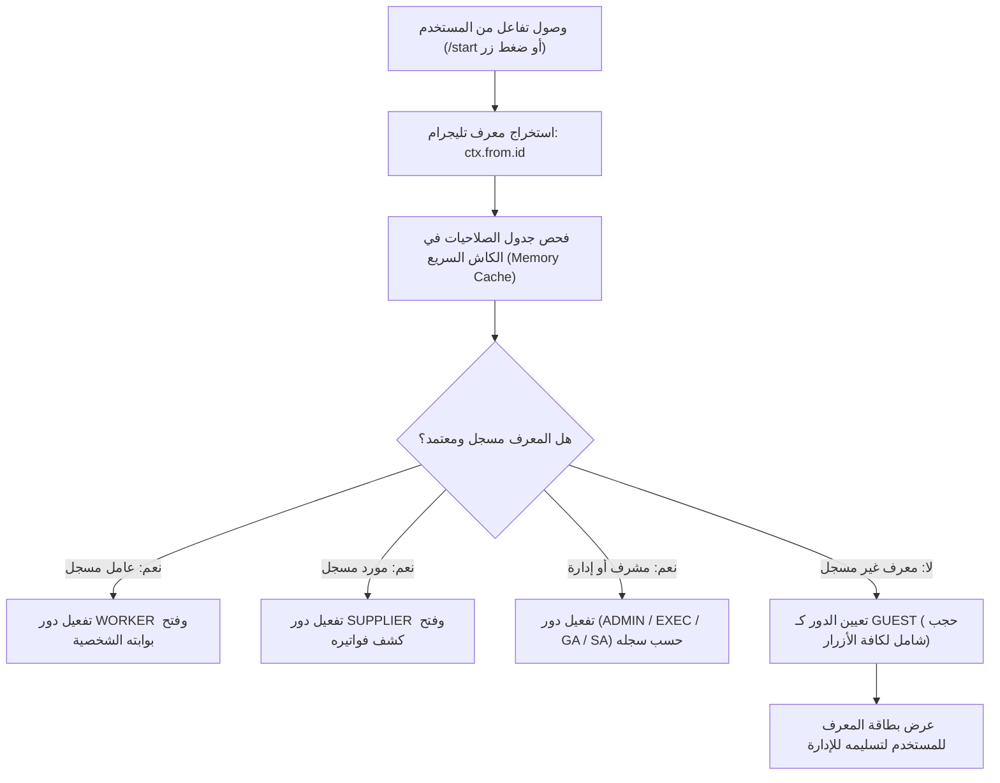

# 🆔 بروتوكول التحقق من الهوية بحساب تليجرام الحصري
## Zero-Trust Telegram ID Identity & Access Verification Protocol

> [!IMPORTANT]
> **القرار المعماري المعتمد:**
> إلغاء كافة آليات تسجيل الدخول التقليدية (الأرقام السرية، رموز OTP، أو طلب الرقم القومي في المحادثة)، والاعتماد الحصري والقطعي على **معرف تليجرام الرقمي المشفر (`ctx.from.id`)** كمصدر وحيد لإثبات هوية كافة الأطراف (سوبر أدمن، جينرال أدمن، مشرف، عامل، ومورد).

---

## 🔒 1. المزايا الأمنية للتحقق عبر Telegram ID

1. **استحالة التزوير أو الانتحال (Cryptographic Non-Repudiation):**
   - المعرف الرقمي الصادر من خوادم تليجرام (`Telegram User ID`) ثابت وغير قابل للتغيير أو التزييف عبر برمجة البوت.
2. **تجربة استخدام بصفر احتكاك (Zero-Friction UX):**
   - المستخدم لا يضطر لحفظ أي كلمات سر أو كتابة أرقام في كل مرة؛ بمجرد فتح البوت يتعرف عليه النظام فورياً.
3. **العزل التام والإسقاط اللحظي للصلاحيات (Instant Revocation):**
   - بمجرد تفريغ حقل `telegram_id` من سجل العامل أو المشرف، يفقد الحساب وصوله فوراً في نفس اللحظة وتتحول واجهته إلى شاشة حجب كاملة (`Guest`).

---

## 🧭 2. آلية التحقق عند بدء المحادثة (Lifecycle Flow)



---

## 📱 3. شاشات الواجهة للمستخدمين (UI Specifications)

### أ. المستخدم المعتمد (عامل / مورد / إداري):
* ترحيب شخصي بالاسم والصفة فورياً:  
  `"أهلاً بك يا [الاسم] 👷‍♂️ | كود: [105] | موقع: [المنيا]"`
* تصفية القوائم والأزرار تلقائياً بناءً على الدور المرتبط بهذا المعرف مسبقاً.

### ب. المستخدم غير المسجل (`GUEST`):
* إخفاء تام لكافة أزرار البوت دون أي تسريب لأي خيار إداري أو مالي.
* رسالة نظام موحدة ومباشرة:
  ```text
  🔒 عفواً، حساب التليجرام الخاص بك غير مرتبط بمنظومة الشركة.
  
  🆔 معرف حسابك هو: 712345678
  
  يرجى نسخ هذا المعرف وتزويد المشرف الإداري في موقعك به لربطه بملفك المعتمد.
  ```
* الأزرار المعروضة حصراً للزائر:
  1. `[ 📋 نسخ المعرف ]` (Copy Callback).
  2. `[ 📲 مشاركة المعرف مع الإدارة عبر واتساب ]` (رابط wa.me مباشر).

---

## 🛠️ 4. طرق تسجيل وربط المعرف (`Binding Workflow`)

يتم ربط معرف تليجرام بحساب العامل أو المورد بإحدى 3 طرق آمنة وسهلة:

1. **عبر واجهة البوت للمشرفين (`Field Admin / Super Admin`):**
   * المشرف يفتح كارت العامل ⬅️ يضغط زر `[ 🔗 ربط حساب تليجرام ]` ⬅️ يرسل المعرف فيتم الربط وتأكيد الحساب فوراً.
2. **عبر استوديو الويب (`Web Studio`):**
   * الدخول على جدول العمال أو الموردين ولصق رقم المعرف في حقل `telegram_id`.
3. **عبر Google Sheets:**
   * إدخال رقم المعرف في عمود `Telegram_ID` في شيت العاملين أو الموردين، فيقوم محرك الكاش بمزامنته في غضون ثوانٍ.
