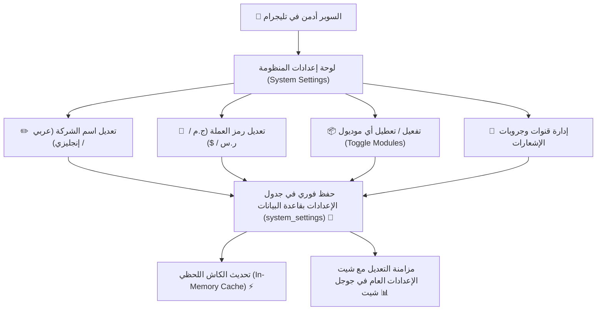

# ⚙️ هندسة التكوين التأسيسي والإدارة الديناميكية من البوت
## Minimal Bootstrap Configuration & Dynamic In-Bot Settings Management

> [!IMPORTANT]
> **القرار المعماري والتجاري الصارم:**
> 1. حصر ملف الإعداد الأولي (`company.setup.json`) حصراً في **بيانات التأسيس العامة ومفاتيح الربط التقني فقط**، ومنع حشو أي قواعد أو محددات تشغيلية داخله.
> 2. إتاحة **التحكم والتعديل الكامل في هذه الإعدادات لاحقاً من داخل واجهة البوت مباشرة** للسوبر أدمن دون الحاجة للمس الملفات بالسيرفر.
> 3. **إلغاء أي سقوف مالية تعسفية على التسجيل؛** فالعمليات الميدانية تسجل مباشرة بسلاسة تامة، وتُطبق الرقابة عبر الشفافية اللحظية وسجل التدقيق والتقارير الرقابية.

---

## 🗂️ 1. الحدود الصارمة لملف التأسيس (`company.setup.json`)

يقتصر هذا الملف فقط على ما يلزم لتشغيل البوت لأول مرة (`Bootstrap Credentials & Identity`):

```json
{
  "$schema": "./schemas/company-setup.schema.json",
  "company": {
    "nameAr": "شركة السعادة للمقاولات العامة",
    "nameEn": "Al-Saada Contracting Co.",
    "slug": "alsaada",
    "timezone": "Africa/Cairo",
    "currency": {
      "code": "EGP",
      "symbol": "ج.م"
    }
  },
  "storage": {
    "sheetsTopology": "SINGLE_SPREADSHEET"
  },
  "modules": {
    "workforce": true,
    "advances": true,
    "canteen": true,
    "custody": true,
    "logistics": true,
    "heavyMachinery": true,
    "fuels": true,
    "suppliers": true
  },
  "credentials": {
    "telegramBotToken": "712345678:AAHxxxxxxxxxxxxxxxxxxxxxxxxx",
    "superAdminTelegramId": 123456789,
    "googleServiceAccountPath": "./credentials/service_account.json",
    "googleDriveFolderId": "1aBcDeFgHiJkLmNoPqrStuVwxyz",
    "databaseUrl": "file:./data/alsaada.db",
    "geminiApiKey": "AIzaSyDxxxxxxxxxxxxxxxxxxxxxxxxxxxx"
  }
}
```

> [!NOTE]
> لا يحتوي هذا الملف على: مواعيد رواتب، أو نسب خصم، أو سقوف مالية، أو حدود صرف؛ فالكود التشغيلي نظيف ومتحرر من أي قيود جامدة.

---

## 📱 2. وحدة التحكم في إعدادات المنشأة من البوت (`In-Bot Settings Console`)

يستطيع السوبر أدمن في أي وقت ومن هاتفه عبر تليجرام فتح:  
`[ ⚙️ إعدادات المنظومة وهوية الشركة ]` لتعديل أي بند:



* **الميزة التشغيلية:** لا يحتاج السوبر أدمن للدخول إلى السيرفر أو تعديل ملفات JSON لتغيير اسم أو عملة أو تفعيل موديول إضافي؛ كل شيء يتم بنقرة زر من داخل البوت.

---

## 🚫 3. إلغاء السقوف المالية التقييدية (Operational Simplicity Standard)

بناءً على التوجيه الميداني المعتمد:
1. **انسيابية التسجيل الميداني (Frictionless Operations):**
   * المشرف المعتمد يسجل السلفة، مسحوبات المقصف، أو مصروفات العهد بالقيمة الفعلية مباشرة دون أن يعترضه البوت برسائل رفض مثل: *"عفواً لقد تجاوزت الحد الأقصى المسموح"*.
   * مواقع العمل والمشاريع تتطلب مرونة وسرعة في تلبية متطلبات العمال والتشغيل دون تعطيل البوت للمهام الميدانية.
2. **الرقابة البَعدية والشفافية بدلاً من المنع المسبق:**
   * الحوكمة المالية لا تتم عبر تعطيل الصرف، بل عبر:
     - **الإشعار اللحظي:** وصول إشعار فوري بكافة التفاصيل لإدارة الشركة.
     - **رادار المخاطر في لوحة الإدارة العليا:** إظهار أي عامل تجاوزت سلفه رقماً كبيراً في مؤشرات المتابعة.
     - **وحدة تصحيح السوبر أدمن:** إمكانية تعديل أو إلغاء أي سند خاطئ في أي وقت.
