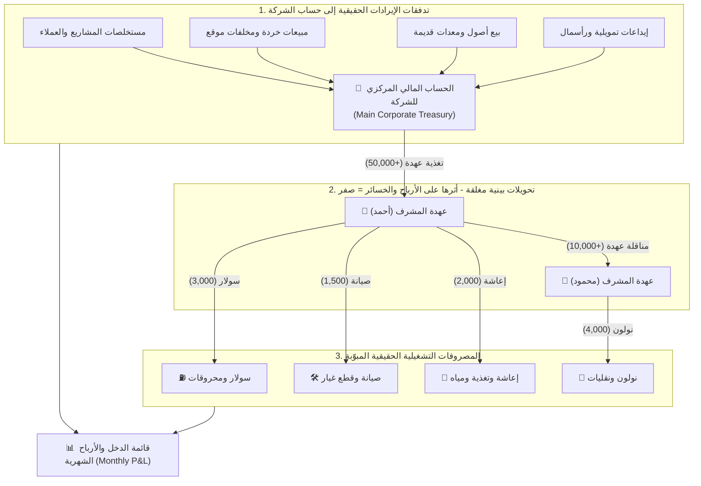

# 💰 المنظومة المالية المحاسبية المغلقة وقائمة الدخل والأرباح
## Closed-Loop Corporate Financial, P&L Engine & Cost Centers

> [!IMPORTANT]
> **الهدف الهندسي والمحاسبي الاستراتيجي:**
> تحويل المنظومة من مجرد دفتر لتسجيل العمليات إلى **محرك مالي ومحاسبي مؤسسي مغلق (Closed-Loop Financial Core)** يضمن دقة الأرقام بنسبة 100%، ويمنع دبلرة المصروفات أو تكرار القيود، ويوفر قائمة دخل وأرباح شهرية حقيقية للشركة بضغطة زر واحدة، مدعوماً برادار كشف الفواتير المكررة ومراكز تكلفة المعدات.

---

## 🏛️ 1. فلسفة الدائرة المالية المغلقة ومنع الدبلرة (Anti-Duplication Protocol)

القاعدة المحاسبية الذهبية لمنع تضخيم أو تكرار المصروفات:
* **تحويلات العهد (Internal Transfers):** نقل الأموال من بنك الشركة إلى عهدة المشرف أحمد، أو من عهدة أحمد إلى عهدة محمود، **هو تحويل بين أصول الشركة وأثره على الأرباح والمصروفات = 0 (Zero P&L Impact)**.
* **المصروف الفعلي (Operational Expense):** لا يُسجل المصروف الذي يؤثر على أرباح الشركة إلا عند خروج المال الفعلي مقابل خدمة أو سلعة في الموقع (شراء سولار، إيجار معدة، قطع غيار).



---

## 📑 2. شجرة تبويب المصروفات والتدفقات المعتمدة (14 بنداً تشغيلياً)

تنقسم كافة المصروفات والتدفقات المالية الخارجة في النظام إلى **4 مجموعات معيارية محكمة**:

### المجموعة الأولى: تكاليف التشغيل والأسطول والمعدات المباشرة (Heavy Fleet & Operations)
1. **⛽ سولار ومحروقات (Diesel & Fuels):**
   * سولار المعدات الثقيلة، بنزين سيارات الخدمة، سولار المولدات ومحطات المياه.
2. **🛢️ زيوت وشحوم وفلاتر (Lubricants & Filters):**
   * زيوت محركات، زيت هيدروليك، زيت فتيس، شحوم تروس، وفلاتر هواء وزيت وسولار.
3. **🛠️ صيانة وقطع غيار (Maintenance & Spare Parts):**
   * قطع غيار ميكانيكية وكهربائية، خراطيم هيدروليك، بطاريات وكاوتش، أجور فنيين وخراطة ولحام خارجي.
4. **🚜 إيجار معدات وسيارات خارجية (Equipment Rentals):**
   * إيجار لوادر، حفارات، كباشات، جرارات، أو تنكات مياه مؤجرة بالمشروع من الغير باليوم أو بالساعة.

### المجموعة الثانية: الإعاشة وسكن الموقع واللوجستيات (Site Camp & Logistics)
5. **🍖 إعاشة وتغذية وبوفيه (Catering & Food Supplies):**
   * وجبات العمال والمشرفين، خضار ولحوم المطبخ، مستلزمات البوفيه والشاي، مياه شرب ومياه غسيل.
6. **🏠 إسكان ومرافق الموقع (Camp Utilities & Housing):**
   * إيجار استراحات وسكن العمال والمهندسين، شحن كروت كهرباء، أسطوانات غاز، مستلزمات نظافة وتطهير.
7. **🚚 نولون ونقليات ومصاريف طريق (Freight & Road Tolls):**
   * نولون سيارات شحن البضائع والفوسفات، كارتات الطرق والجيش، رسوم الموازين، وبدلات سفر السائقين.
8. **🦺 مهمات سلامة وأدوات مستهلكة (PPE & Consumables):**
   * خوذ، أحذية أمان، سترات فسفورية، حبال وسلاسل، كشافات، مهمات لحام، وأدوات يدوية مستهلكة.

### المجموعة الثالثة: المصروفات الحكومية والإدارية والعمومية (G&A & Government)
9. **🏛️ مصروفات حكومية وتراخيص وتأمينات (Government, Taxes & Licenses):**
   * رسوم تراخيص معدات وسيارات، تصاريح طرق ومحاجر، تأمينات اجتماعية للمشروع، ضرائب دمغة وكشوف رسمية.
10. **☕ نثريات وضيافة وانتقالات إدارية (Petty Cash & Admin):**
    * كروت شحن وإنترنت، تصوير مستندات ورسومات هندسية، مواصلات وتكاسي للمشرفين، وضيافة مهندسي الاستشاري.
11. **💳 عمولات ومصروفات تحويل بنكية ومحافظ (Bank & Wallet Fees):**
    * رسوم سحب فودافون كاش (1%)، عمولات إنستاباي والتحويلات البنكية، رسوم دفاتر شيكات وتوثيق.
12. **💊 إسعافات ورعاية طبية طارئة (Medical & First Aid):**
    * صيدلية الموقع، مسكنات وأدوية طوارئ، وتكاليف كشف أو علاج طارئ لعامل في مستشفى قريب.

### المجموعة الرابعة: المعالجة المحاسبية الخاصة (مسحوبات الإدارة وسلف العمال)
13. **👑 مسحوبات الإدارة العليا والملاك (Executive / Owner Drawings):**
    * **القاعدة المحاسبية:** مسحوبات المالك ليست مصروفاً تشغيلياً على المشروع، بل توزيع أرباح من رأس المال (`Equity Distribution`)؛ فتخصم من حساب البنك دون أن تدخل في تكلفة المشاريع حتى لا تشوه الأرباح.
14. **💵 سلف ورواتب العاملين (Worker Advances & Payroll):**
    * السلفة النقدية أو مسحوبات الكانتين تسجل كمديونية على العامل (أصل متداول)، بينما المصروف الفعلي الذي يدخل قائمة الدخل هو **"إجمالي الأجور المستحقة للمشروع"** في مسير الرواتب الشهري.

---

## 🚀 3. خمسة مقترحات تحسينية مؤسسية لرفع كفاءة المنظومة

### المقترح الأول: ربط المصروفات بمراكز التكلفة والمعدات (`Equipment Cost Tagging`)
* عند تسجيل فاتورة صيانة، سولار، أو قطع غيار، يسأل البوت خطوة سريعة: `[ 🚜 تحديد المعدة المستفيدة ]` (مثل: لودر كوماتسو #01، أو سيارة مرسيدس #04).
* **المردود الاستراتيجي:** يولد النظام **"كارت تكلفة المعدة الحقيقي (Equipment Lifecycle Ledger)"**؛ فيعرف المالك بالضبط: كم استهلك هذا اللودر سولار وصيانة مقارنة بعدد ساعات عمله، وهل يحقق أرباحاً أم يتطلب البيع والاستبدال!

### المقترح الثاني: رادار كشف الفواتير المكررة والمشبوهة بالـ AI (`Duplicate Invoice Radar`)
* عند تصوير أي فاتورة، يستخرج محرك الـ AI Vision: (اسم المورد، رقم الفاتورة التسلسلي، التاريخ، والمبلغ).
* يبحث المحرك فورياً: هل سُجلت فاتورة بنفس الرقم لنفس المورد خلال آخر 90 يوماً؟
* في حال التطابق، يرفض البوت التسجيل فوراً ويطلق تنبيهاً أحمر للإدارة:  
  `"⚠️ تنبيه رقابي: هذه الفاتورة مسجلة مسبقاً بالسند رقم #INV-402 بتاريخ 15 أغسطس!"`

### المقترح الثالث: نبضة الإغلاق المالي اليومي التلقائي للموقع (`Daily Sunset Push`)
* في تمام الساعة 09:00 مساءً كل يوم، يرسل البوت ملخصاً للمشرف:  
  `"ملخص موقع المنيا اليوم: إجمالي المنصرف 4,200 ج.م (سولار: 2,500، بوفيه: 700، سلف: 1,000). رصيد عهدتك المتبقي: 12,300 ج.م. هل تؤكد الإغلاق؟"`
* ضغطة زر `[ ✅ تأكيد الإغلاق ]` تقفل اليومية وتمنع تراكم الأخطاء حتى نهاية الشهر.

### المقترح الرابع: كشف حساب المورد الذكي مع إرسال PDF عبر واتساب (`Vendor Statement`)
* يتيح البوت توليد كشف حساب تفصيلي للمورد (إجمالي التوريدات المستلمة - المدفوعات النقدية المسددة = الرصيد المتبقي له).
* زر مباشر: `[ 📲 إرسال كشف الحساب للمورد عبر واتساب كملف PDF رسمي ]` لحسم أي مطالبات مالية بلحظات.

### المقترح الخامس: دورة التصفية والتغذية التلقائية للعهدة (`Smart Custody Replenishment`)
* عندما يقل رصيد عهدة المشرف عن حد الأمان (مثلاً: أقل من 2,000 ج.م):  
  يُظهر البوت إشعاراً: `"⚠️ رصيد عهدتك قارب على النفاد. هل ترغب في تقديم طلب تغذية عهدة؟"`.
* بنقرة زر يرفع المشرف طلب التغذية مرفقاً به ملخص تصفية العهدة السابقة للإدارة المالية للاعتماد والتحويل الفوري.

---

## 📊 4. نموذج قائمة الدخل الشهرية الناتجة تلقائياً (Automated Monthly P&L)

```text
================================================================================
📊 قائمة الدخل والأرباح التشغيلية - شركة السعادة (سبتمبر 2026)
================================================================================
💰 إيرادات مستخلصات المشاريع ومبيعات الخردة:          1,250,000 ج.م
--------------------------------------------------------------------------------
المصروفات التشغيلية المباشرة المبوّبة:
  ⛽ 1. سولار ومحروقات:                              (180,000 ج.م)
  🛢️ 2. زيوت وشحوم وفلاتر:                           (25,000 ج.م)
  🛠️ 3. صيانة وقطع غيار:                             (65,000 ج.م)
  🚜 4. إيجار معدات وسيارات خارجية:                  (110,000 ج.م)
  🍖 5. إعاشة وتغذية ومياه:                          (90,000 ج.م)
  🏠 6. إسكان عمال ومرافق موقع:                      (30,000 ج.م)
  🚚 7. نولون ونقليات ومصاريف طريق:                  (75,000 ج.م)
  🦺 8. مهمات سلامة وأدوات موقع:                     (15,000 ج.م)
  🏛️ 9. مصروفات حكومية وتراخيص وتأمينات:                (45,000 ج.م)
  ☕ 10. نثريات وضيافة ومطبوعات:                     (12,000 ج.م)
  💳 11. عمولات ومصروفات تحويل بنكية:                 (3,500 ج.م)
  💊 12. إسعافات ورعاية طبية طارئة:                  (2,500 ج.م)
  👷‍♂️ 13. إجمالي أجور ورواتب العمالة المستحقة:         (220,000 ج.م)
--------------------------------------------------------------------------------
📉 إجمالي تكاليف ومصروفات التشغيل:                   (873,000 ج.م)
================================================================================
💎 صافي الأرباح التشغيلية للمشاريع:                   +377,000 ج.م
================================================================================
👑 مسحوبات الملاك والإدارة العليا (توزيع أرباح):    (150,000 ج.م)
💼 صافي السيولة النقدية الفائضة المتبقية بالبنك:     +227,000 ج.م
================================================================================
```
