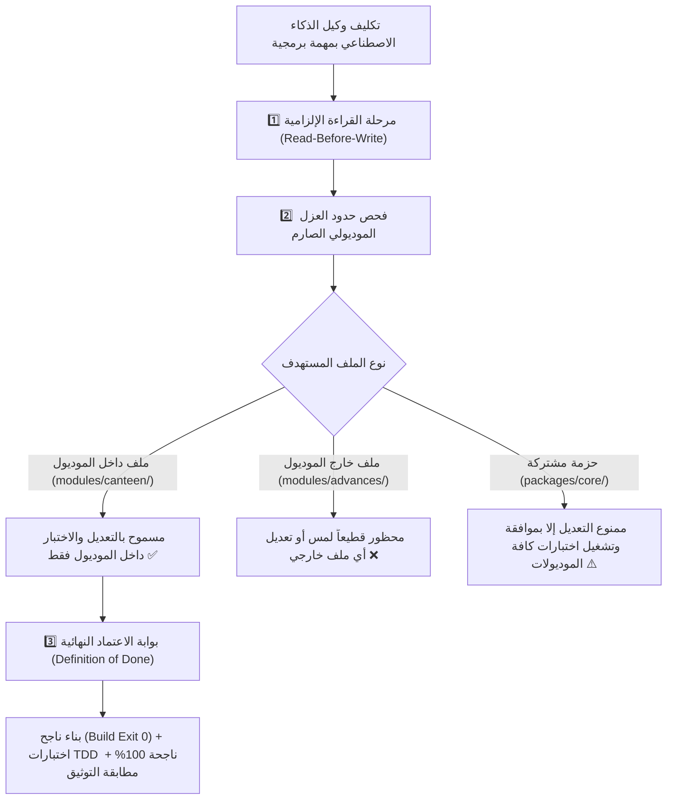

# 🤖 ميثاق حوكمة وكلاء الذكاء الاصطناعي وقواعد التعامل مع الملفات البرمجية
## AI Agent Engineering Governance, Blast Radius Isolation & File Safety Protocol

> [!IMPORTANT]
> **الهدف الهندسي الصارم:**
> القضاء التام على مشكلة **"تعديل ميزة جديدة يؤدي إلى كسر أو تغيير ميزات سابقة تم اختبارها"**، عبر فرض قواعد عزل مادي صارمة (`Blast Radius Containment`)، ومنع لمس الملفات خارج نطاق الموديول المستهدف، وتأطير أداء وكلاء الذكاء الاصطناعي بمعايير مهنية واختبارات آلية وبوابة خروج إلزامية (`Definition of Done`).

---

## 🏛️ 1. المبادئ الحاكمة للتعامل مع الكود المصدري

---

## 🧱 2. قواعد العزل المادي وحماية الملفات (Blast Radius Isolation)

### 1️⃣ قاعدة العزل الموديولي التام (Vertical Slice Isolation):
* عند العمل على موديول (مثل: `modules/canteen`):
  * **يُمنع منعاً باتاً فتح أو تعديل أو حذف أي ملف في موديول آخر** (مثل `modules/advances` أو `modules/custody` أو `modules/workforce`).
  * كل موديول يعتبر كأنه مشروع مستقل بذاته؛ يحتوي على:
    - مساراته وواجهاته الخاصة (`handlers/`).
    - نماذج البيانات الخاصة به (`types.ts`).
    - خدماته التشغيلية (`services/`).
    - اختباراته الآلية الخاصة (`tests/`).

### 2️⃣ قاعدة حماية النواة والحزم المشتركة (`packages/` Protection):
* الحزم المتواجدة في `packages/` (مثل `core-components`, `ai-vision-engine`, `sheets-provisioner`):
  * هي حزم عامة لخدمة كافة قطاعات الشركة.
  * **يُحظر تماماً تعديل أي كود في الحزم المشتركة لحل مشكلة خاصة بموديول فردي**.
  * في حال استلزم الأمر إضافة ميزة عامة في حزمة مشتركة، يلتزم الوكيل البرمجي بتشغيل حزمة اختبارات كافة الموديولات والتأكد من عدم كسر أي ميزة مستهلكة لها.

### 3️⃣ بروتوكول القراءة قبل التعديل (Read-Before-Write):
* يُمنع الاستبدال الأعمى لمحتوى الملفات.
* يجب قراءة محتوى الملف كاملاً، وفهم دواله والأنواع المعرفة به، واستهداف الأسطر المراد تعديلها حصراً دون المساس بباقي الملف.
* الحفاظ على كافة التعليقات والشروح البرمجية الموجودة في الملفات.

### 4️⃣ قاعدة نظافة المسار الرئيسي وحظر الملفات المؤقتة والعشوائية (Strict Root Cleanliness):
* **يُحظر تماماً على وكيل الذكاء الاصطناعي إنشاء أو ترك أي ملفات اختبارية أو سكريبتات تجريبية مؤقتة (مثل `test.ts`, `verify.ts`, `scratch.ts`, `temp.json`) في المسار الرئيسي للمشروع (Root Directory).**
* كل ملف في المشروع له موضع إلزامي دائم ومحدد:
  - اختبارات الموديولات: تُوضع داخل `modules/<module_name>/tests/` حصراً.
  - اختبارات الحزم: تُوضع داخل `packages/<package_name>/tests/` حصراً.
  - الاختبارات الشاملة (E2E): تُوضع داخل `tests/e2e/` حصراً.
  - سكريبتات التجارب والتصحيح المؤقتة الخاصة بالوكيل: تُحفظ حصراً خارج الكود المصدري في مجلد الـ scratch المؤقت.
* التحقق الدوري من نظافة المستودع بنسبة 100% عبر `git status -s`، ويُعتبر وجود أي ملف مهمل أو غير متبع في جذر المشروع خرقاً هندسياً يمنع اعتماد المهمة.

---

## ⚖️ 3. معايير الجودة ومكافحة التراجع (Zero-Regression Protocol)

1. **التايب سكريبت الصارم (Strict TypeScript 5.9+):**
   - خلو الكود تماماً من أي خطأ تجميع.
   - التحقق دائماً بتشغيل: `pnpm build` والتأكد من خروج الأمر بـ `Exit 0`.
2. **التطوير الموجه بالاختبارات (TDD):**
   - كل تدفق أو ميزة يُكتب لها اختبار تفاعلي يحاكي أزرار المحادثة والردود وسجل العمليات.
   - التحقق دائماً بتشغيل: `pnpm test` واجتياز كافة الاختبارات دون أي فشل.

---

## 🚪 4. بوابة الاعتماد النهائية للمهام (Definition of Done - DoD)

لا تُعتبر أي مهمة برمجية منجزة ومقبولة للتسليم إلا بعد استيفاء الشروط الخمسة بالترتيب:

| # | معيار الاعتماد الإلزامي | وسيلة التحقق | النتيجة المطلوبة |
| :--- | :--- | :--- | :--- |
| 1 | **سلامة البناء البرمجي** | `pnpm build` | `Exit Code 0` بدون أي تحذيرات أو أخطاء تجميع. |
| 2 | **نجاح الاختبارات الآلية** | `pnpm test` | اجتياز 100% من الاختبارات دون أي كسر لوظائف سابقة. |
| 3 | **المطابقة التوثيقية الكاملة** | مراجعة `docs/` و `README.md` | تحديث التوثيق ليعكس الواقع البرمجي الحالي دون أي فجوة. |
| 4 | **حفظ التعديلات في Git** | `git status -s` و `git commit` | التزام بمعيار Conventional Commits ونظافة المستودع. |
| 5 | **تقديم الدليل المادي الصارم** | تقرير الاختبار والمخرجات | عرض النتيجة الفعلية للمستخدم دون أي تخمين أو افتراض. |

---

> [!NOTE]
> تم دمج هذه القواعد رسمياً كدستور دائم وملزم لكافة أدوات الذكاء الاصطناعي في الملفين السياديين:  
> [`AGENTS.md`](file:///F:/Alsaada-Smart-Bot/AGENTS.md) و [`GEMINI.md`](file:///F:/Alsaada-Smart-Bot/GEMINI.md).
