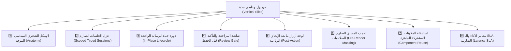

# 📐 الدستور المعياري لبناء الموديولات والتدفقات الوظيفية
## Universal Vertical-Slice Module & Flow Engineering Standard

> [!IMPORTANT]
> **قاعدة الامتثال الصارم (Mandatory Module Compliance):**
> هذه الوثيقة تمثل **المواصفات القياسية الإلزامية غير القابلة للاستثناء** لأي وظيفة أو موديول يتم بناؤه في هذا المشروع.
> يلتزم بها كافة مطوري ووكلاء الذكاء الاصطناعي (AI Agents)، ويُعد أي خرق لأي ركن من الأركان الثمانية التالية سبباً فورياً لرفض الميزة واعتبارها غير مقبولة هندسياً (`FAIL`).

---

## 🏛️ الأركان الثمانية الإلزامية لبناء أي موديول (The 8 Mandatory Pillars)



---

### 1️⃣ الهيكل الشجري السداسي المعياري للموديول (Standard Anatomy)
لكل موديول داخل مجلد `modules/<feature>/` بنية رأسية معزولة تتضمن الستة ملفات التالية حصراً:

```text
modules/canteen/
├── canteen.types.ts           # تعريف أنواع البيانات وجلسة الموديول الخاصة حصراً
├── canteen.service.ts         # منطق الأعمال، الحسابات، والتعامل مع قاعدة البيانات
├── canteen.handlers.ts        # استقبال أزرار التفاعل (Callbacks)، الأوامر، والاتصال السريع
├── canteen.conversation.ts    # معالج التدفق خطوة بخطوة بالاعتماد على المكونات المشتركة
├── canteen.menu.ts            # لوحات المفاتيح والأزرار مع التصفية المسبقة للصلاحيات
└── tests/
    └── canteen.spec.ts        # اختبارات الوحدة والتدفق التكاملي بمحاكاة المحادثة
```

* **الضابط الهندسي:** يُمنع خلط كود الواجهات (UI) مع كود الخدمات (Services)؛ فملف `service.ts` لا يعرف شيئاً عن `BotContext` أو تليجرام.

---

### 2️⃣ عزل الجلسات الصارم ومنع التداخل (Scoped Typed Sessions)
* **المبدأ:** لكل موديول كائن جلسة خاص به ومحكوم بالأنواع الصارمة داخل `ctx.session.<feature>`.
* **قاعدة منع التعديل المتبادل:**  
  يُحظر تماماً على أي موديول قراءة أو تعديل جلسة موديول آخر (كود الإجازات لا يلمس `ctx.session.canteen` إطلاقاً).
* **التنظيف الذاتي الفوري:**  
  عند اكتمال العملية بنجاح أو عند الضغط على زر الإلغاء، يلتزم الموديول بتفريغ جلسته فوراً لمنع تلوث الذاكرة:
  ```typescript
  delete ctx.session.canteen;
  ```

---

### 3️⃣ دورة حياة الرسالة الواحدة والتنقل الموضعي (In-Place Single Message Lifecycle)
* **التعديل الموضعي الصارم:**  
  كل خطوة في المعالج تستبدل سابقتها في نفس الرسالة موضعياً (`renderWizardStep` / `editMessageText`)؛ ويُمنع إرسال رسائل جديدة متراكمة تشوه المحادثة.
* **زر الرجوع الإلزامي (`[ ◀️ السابق ]`):**  
  إلزامي في كل خطوة بالمعالج لتمكين المستخدم من العودة للخطوة السابقة وتصحيح اختياره دون فقد مدخلاته ودون الحاجة لإلغاء المعاملة والبدء من الصفر.
* **زر الإلغاء الإلزامي (`[ ❌ إلغاء ]`):**  
  إلزامي في كل خطوة؛ يقوم بتنظيف الجلسة فوراً وإعادة المستخدم للشاشة الرئيسية للقسم دون ترك أي أثر في قاعدة البيانات أو الشيت.
* **منع الضغط المزدوج (Anti-Double Tap & Debouncing):**  
  إبطال ومعالجة الـ Callback فور النقر لمنع تكرار القيد في حال بطء شبكة المستخدم.

---

### 4️⃣ شاشة المراجعة والتأكيد قبل الحفظ (Mandatory Review Gate)
* **المبدأ:** يُمنع نهائياً حفظ أي عملية مالية أو تسجيل حركة بمجرد إدخال الرقم.
* **الشرط الإلزامي:** يجب أن تتوقف المحادثة عند **"شاشة مراجعة نهائية"** تعرض كارت ملخص كامل:
  ```text
  📋 مراجعة وتأكيد صرف سلفة نقدية
  --------------------------------------------------
  👤 العامل: محمد عاطف حسن (كود: #105)
  💵 المبلغ المطلوب: 500.00 ج.م
  💼 طريقة الصرف: من عهدة المشرف (أحمد محمود)
  📅 التاريخ: 07 سبتمبر 2026
  --------------------------------------------------
  💡 يرجى مراجعة البيانات بعناية قبل التأكيد النهائي:
  ```
* وتحتوي اللوحة فقط على: `[ ✅ تأكيد وحفظ السند ]` | `[ ❌ إلغاء العملية ]`.

---

### 5️⃣ لوحة أزرار ما بعد الإنجاز الموحدة الإلزامية (Universal Post-Action Completion Keyboard)
عند اكتمال المعاملة بنجاح، يُلزم النظام باحتواء لوحة الأزرار الختامية حصراً على **4 عناصر مرتبة هندسياً بالترتيب التالي**:
1. **زر التفاعل الميداني المباشر:** مثل رابط إرسال إشعار السند للعامل عبر واتساب (`[ 📲 إرسال إشعار السلفة للعامل عبر واتساب ]`) أو زر التحميل/المعاينة إن وُجد.
2. **زر إعادة تنفيذ نفس العملية فوراً:** مثل (`[ ➕ تسجيل سلفة أخرى ]` أو `[ ➕ تسجيل مسحوب آخر ]`) لبدء تدفق جديد بضغطة واحدة.
3. **زر العودة لقسم الوظيفة التابع لها:** مثل (`[ 🔙 العودة لقسم السلف ]` أو `[ 🔙 العودة لقسم المقصف ]`).
4. **زر العودة للقائمة الرئيسية:** دائماً وأبداً (`[ 🏠 القائمة الرئيسية ]` -> `action:main_menu`) لمنع وصول المستخدم لأي طريق مسدود.

---

### 6️⃣ الحجب المسبق للواجهات ومنع تسريب الأزرار (Strict Pre-Render RBAC Masking)
* **القاعدة الذهبية:** *"لا وظيفة ولا أمر يُعرض في البوت لمن ليس له صلاحية له"*.
* تُصفى مصفوفة الأزرار برمجياً قبل تصييرها في الرسالة بناءً على الدور الفعلي للمستخدم (`ctx.session.user.role`).
* **مخالفة أمنية جسيمة (`SECURITY_FAIL`):** عرض الزر لغير المصرح له ثم إظهار رسالة رفض ("🔒 هذه الصلاحية للمشرفين فقط"). شرط القبول الوحيد هو **اختفاء الزر تماماً من الواجهة**.

---

### 7️⃣ استدعاء المكونات المشتركة ومنع إعادة اختراع العجلة (Component Reuse)
يُحظر على أي مبرمج أو وكيل ذكاء اصطناعي إعادة كتابة كود لاختيار عامل أو إدخال مبلغ أو معالجة مرفق؛ بل يلتزم باستدعاء المكونات المجهزة مسبقاً في `packages/core-components`:
* عند اختيار عامل ⬅️ استدعاء `WorkerPicker` (بحث ذكي + تقسيم صفحات).
* عند إدخال مبلغ مالي ⬅️ استدعاء `CurrencyAmountPicker` (أزرار سريعة + آلة حاسبة).
* عند قراءة فاتورة أو إيصال ⬅️ استدعاء `UniversalDocumentVisionEngine` (صور و PDF).
* عند إرسال بطاقة اعتماد إدارية ⬅️ استدعاء `UniversalApprovalCard`.
* عند رسم لوحة الأزرار الختامية ⬅️ استدعاء `PostActionKeyboard`.

---

### 8️⃣ معايير الأداء والسرعة الصارمة (Performance SLA)
* أزرار التنقل العادية بين القوائم والمعالج: **أقل من `800ms`**.
* الحفظ في قاعدة البيانات وطابور المزامنة: **أقل من `50ms`**.
* استدعاء القوائم المتكررة (قائمة العمال، كتالوج الأصناف، إعدادات النظام): يتم من الكاش السريع بالذاكرة في **أقل من `5ms`**.

---

## 🛡️ المعايير الخمسة للمقاومة الميدانية للأخطاء والانهيار (Fault-Tolerance Hardening)

يُلزم وكيل الذكاء الاصطناعي بتطبيق المعايير الدفاعية الخمسة التالية في كافة التدفقات التشغيلية:

### 1. حماية الأزرار القديمة والـ Callbacks المنتهية (Stale Token & Expired Button Guard):
* كل زر ينفذ إجراءً مالياً أو إدارياً يجب أن يحمل رمز تحقق زمني أو فحصاً لحالة السند (`State Check`).
* إذا نقر المستخدم على رسالة قديمة من أيام سابقة تمت معالجتها، لا ينهار البوت، بل يظهر تنبيه منبثق لطيف (`answerCallbackQuery`):  
  `"⚠️ هذه المعاملة تم البت فيها مسبقاً بتاريخ سابق، ولا يمكن تكرار تنفيذها."`

### 2. معيار استعادة المسودات عند انقطاع الشبكة (Draft Auto-Recovery):
* حفظ حالة المعالج متعدّد الخطوات كمسودة مؤقتة في الكاش السريع (`Draft State`).
* في حال انقطاع الشبكة الميدانية في الموقع وعودة المستخدم للبوت، يُتاح له فوراً:  
  `[ 🔄 استكمال المعاملة السابقة ]` أو `[ 🗑️ إلغاء والبدء من جديد ]`.

### 3. صمام الأمان المزدوج للعمليات التدميرية (Two-Step Safety Lock):
* أي عملية شطب مالي، تعديل رصيد، أو إلغاء قيد محاسبي تُلزم بـ:
  - شاشة تحذير باللون الأحمر توضح أثر التعديل على الحسابات.
  - إلزام المستخدم بكتابة كلمة تأكيد يدوياً في الشات (مثل: `"تأكيد الشطب"`) لمنع الضغط بالخطأ أثناء الحركة في الميدان.

### 4. منع التضارب والتزامن اللحظي (Concurrency & Double-Booking Lock):
* استخدام قفل التزامن البرمجي المتفائل (`Optimistic Concurrency Control`).
* في حال محاولة مشرفين تسجيل حركة على نفس الرصيد المحدود في نفس الثانية؛ تنجح العملية الأولى وتُحجب الثانية مع إشعار فوري بالمستجدات.

### 5. مرونة الإشعارات والبديل التلقائي عبر واتساب (Notification Resilience & WhatsApp Fallback):
* كافة إشعارات تليجرام تكون معزولة بحاجز أخطاء (`Error Boundary`).
* في حال تعذر إرسال الإشعار لتليجرام لعدم اشتراك العامل أو حظره للبوت، يقوم البوت فوراً وبشكل تلقائي بتوليد **رابط واتساب مباشر مشفر** للمشرف لإرسال الإيصال بضغطة زر واحدة دون تعطل التسجيل.
