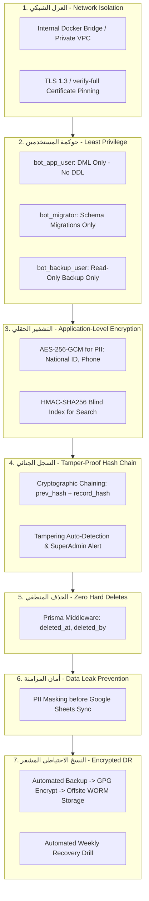

# 🛡️ ميثاق أمان قواعد البيانات وحوكمة القيود الجنائية (PostgreSQL Security & Forensic Ledger)
## Enterprise Database Security, Field-Level Encryption & Tamper-Proof Audit Protocol

> [!IMPORTANT]
> **المرجعية المعمارية لقواعد البيانات:**
> * المحرك المعتمد رسمياً للمنظومة هو **PostgreSQL (v16+)**.
> * تُطبق المنظومة معايير بنكية صارمة في أمان قواعد البيانات وحماية الخصوصية ومكافحة التلاعب المالي استناداً إلى مبدأ **الدفاع في العمق (Defense-in-Depth)**.
> * يُحظر تحت أي ظرف إجراء استعلامات مباشرة غير مفحوصة، أو ربط قاعدة البيانات بالشبكة العامة، أو الحذف الفعلي للبيانات المالية.

---

### 1️⃣ المعمارية الهندسية للمحرك (Engine Architecture)

1. **محرك قاعدة البيانات:** **PostgreSQL 16+** عبر حاوية Docker مخصصة أو خدمة مدارة سحابياً (Managed Cloud SQL / RDS / Supabase).
2. **طبقة التعامل البرمجي (ORM):** **Prisma ORM 7** مع تفعيل نمط التحقق الصارم من الأنواع (Strict Type Safety) ومنع الاستعلامات النصية الحرة غير المعلمة (`$queryRawUnsafe` محظورة كلياً).
3. **نمط العمل الهجين (Native Hybrid Architecture):**
   * قاعدة بيانات PostgreSQL هي مصدر الحقيقة الأول والمباشر لكافة عمليات البوت، محققة زمن استجابة فوري للمستخدم (`< 15ms`).
   * يتم الترحيل والتزامن مع جداول Google Sheets عبر نمط صندوق الصادر التبادلي المضمون (**Transactional Outbox Pattern**) لخدمة الإدارة والمحاسبين دون التأثير على سرعة أو استقرار البوت.

---

### 2️⃣ مستويات الأمان السبعة (The 7 Layers of Database Security)



---

### 3️⃣ تفاصيل الضوابط الأمنية الصارمة

#### 🔒 الضابط 1: العزل الشبكي التام (Zero Public Exposure)
1. **حظر الربط العام (No 0.0.0.0):** يُمنع منعاً باتاً فتح منفذ PostgreSQL (`5432`) على الشبكة العامة.
   * في بيئة Docker: يتم ربط قاعدة البيانات عبر شبكة داخلية معزولة (`internal: true`).
   * في البيئات السحابية: يتم الاتصال عبر Virtual Private Cloud (VPC) أو عبر شبكة نفقية مشفرة (WireGuard / Tailscale).
2. **التشفير الإلزامي أثناء النقل (In-Transit Encryption):**
   * عند الاتصال بقاعدة بيانات سحابية، يجب ضبط `sslmode=verify-full` مع تزويد التطبيق بالشهادة الجذرية الموثوقة (CA Certificate) لمنع هجمات اعتراض البيانات (Man-in-the-Middle).

#### 🔐 الضابط 2: التشفير الحقلي على مستوى التطبيق (Application-Level Encryption - ALE)
لحماية بيانات العمال والشركة في حال تسرب نسخة من قاعدة البيانات:
1. **خوارزمية التشفير:** **AES-256-GCM** مع مفتاح تشفير ديناميكي وتوليد متجه تهيئة فريد (IV: Initialization Vector) لكل قيمة.
2. **الحقول الخاضعة للتشفير الإلزامي:**
   * الأرقام القومية للعمال (`national_id_encrypted`).
   * أرقام الهواتف الشخصية للعمال والمقاولين (`phone_encrypted`).
   * أرقام الحسابات البنكية والمحافظ الإلكترونية (`bank_account_encrypted`).
   * مفاتيح وتوكنات الربط الخارجية (`service_account_private_key_encrypted`).
3. **الفهرسة العمياء للبحث السريع (Blind Indexing):**
   * للبحث بالرقم القومي أو رقم الهاتف دون تخزينهما كنص صريح، يتم حساب تجزئة مشفرة بمفتاح مالح مستقل (Salted HMAC-SHA256):
     ```typescript
     national_id_bindex = HMAC_SHA256(normalized_national_id, BLIND_INDEX_KEY)
     ```
   * يتم البحث والاستعلام في قاعدة البيانات عبر حقل `national_id_bindex` بدقة متناهية وسرعة قياسية دون فك تشفير البيانات المخزنة.

#### ⛓️ الضابط 3: سلسلة الهاش الجنائية ومكافحة التلاعب المالي (Tamper-Proof Financial Ledger)
كافة الجداول المالية (السلف، المصروفات، العهد، التوريدات، مسحوبات الشركاء) تخضع لبروتوكول الهاش التراكمي:
1. **بنية السجل المالي:**
   * `previous_hash`: هاش القيد المالي السابق في نفس الدفتر.
   * `record_hash`: ناتج تجزئة `SHA-256`:
     ```
     record_hash = SHA256(id + previous_hash + created_at + amount + currency + transaction_type + source_account + destination_account + actor_id)
     ```
2. **آلية كشف التلاعب (Tamper Detection):**
   * يوفر النظام وظيفة تدقيق دورية (`npm run audit:ledger`) تفحص سلامة السلسلة التراكمية بالكامل.
   * في حال حاول أي شخص (حتى لو كان يملك صلاحيات وصول مباشرة لقاعدة البيانات) تعديل رقم سلفة، أو تغيير مبلغ مصروف، أو مسح قيد، تنكسر السلسلة الرياضية عند ذلك الصف وتصدر إشارة إنذار فوري مع تجميد الحركات المالية المشبوهة وإشعار السوبر أدمن.
3. **الحصانة الحسابية مع محول pg في Prisma 7 (Driver Adapter Decimal Determinism):**
   * تعيد مكتبة `pg` أرقام `NUMERIC/DECIMAL` كسلاسل نصية (`string`).
   * لضمان ثبات بصمة SHA-256 وعدم كسر السلاسل التاريخية، يتم تمرير مبالغ الحركات عبر المعالج المعياري `Prisma.Decimal.toFixed(2)` بدقة حتمية 100% تمنع أي تباين في التجزئة المشفرة.

#### 🚫 الضابط 4: سياسة منع الحذف الفعلي نهائياً (Absolute Zero Hard Deletes)
1. **الحظر الهيكلي:** تُحظر أوامر `DELETE` كلياً على الجداول المالية والتشغيلية وسجلات العمال.
2. **الاعتراض عبر Prisma Middleware:**
   * أي استدعاء لـ `prisma.advance.delete()` أو `prisma.expense.delete()` يتم اعتراضه برمجياً وتحويله آلياً إلى تحديث:
     ```typescript
     {
       is_deleted: true,
       deleted_at: new Date(),
       deleted_by: actorTelegramId,
       deletion_reason: reason
     }
     ```
   * كافة استعلامات `findMany` و `findFirst` تستثني تلقائياً السجلات المحذوفة منطقياً ما لم يُطلب صراحة استعراض الأرشيف بواسطة السوبر أدمن.

#### 👥 الضابط 5: مبدأ الامتياز الأدنى للمستخدمين (Principle of Least Privilege - PoLP)
يتم إنشاء 3 مستخدمين في قاعدة بيانات PostgreSQL بمهام محددة بدقة:
1. **`bot_app_user` (حساب تشغيل البوت اليومي):**
   * الصلاحيات: `SELECT`, `INSERT`, `UPDATE` فقط.
   * الممنوعات: ممنوع تماماً من `DROP`, `ALTER`, `TRUNCATE`, `CREATE TABLE`.
2. **`bot_migrator` (حساب ترحيل الهياكل والتطوير):**
   * يُستخدم حصراً أثناء عمليات النشر (CI/CD) وتنفيذ `pnpm prisma migrate deploy`.
   * لا تملك خدمة البوت الحية كلمة المرور الخاصة بهذا الحساب.
3. **`bot_backup_user` (حساب النسخ الاحتياطي):**
   * صلاحية قراءة حصرية (`SELECT`) للنسخ وأخذ اللقطات، دون أي صلاحية تعديل أو كتابة.

#### ☁️ الضابط 6: عزل بيانات شيتات جوجل (Data Leak Prevention - DLP)
1. **عدم تصدير الأسرار:** يُمنع ترحيل أي حقل يحتوي على تشفير، أو هاش جنائي، أو توكن أمان، أو بيانات شخصية غير مخصصة للإدارة إلى Google Sheets.
2. **التنقيح والترميز (Data Masking):** يتم تنقيح الأرقام القومية في الشيتات ليظهر منها آخر 4 أرقام فقط (مثال: `**********1234`) لحماية خصوصية العمال ومطابقة معايير الامتثال المؤسسي.

#### 💾 الضابط 7: النسخ الاحتياطي الآلي المشفر والمستودع المنيع (Encrypted WORM Backups)
1. **الجدولة الدورية:**
   * لقطة كاملة (`pg_dump`) يومياً في الساعة 02:00 صباحاً بتوقيت القاهرة.
   * لقطات تفاضلية (WAL Archiving) كل 60 دقيقة.
2. **التشفير المتماثل فائق القوة:**
   * يتم ضغط ملف النسخة وتشفيره فورياً باستخدام `AES-256` أو `GPG` بمفتاح خارجي قبل مغادرة السيرفر.
3. **التخزين المنيع غير القابل للتعديل (WORM Storage):**
   * تُرفع النسخ المشفرة إلى مخزن سحابي آمن (AWS S3 Glacier أو Cloudflare R2) مفعل عليه خاصية **Object Lock (Compliance Mode)** لمدة 90 يوماً.
   * لا يمكن لأي مستخدم، ولا حتى صاحب الحساب السحابي نفسه، حذف أو تعديل ملف النسخة الاحتياطية قبل انقضاء فترة الحفظ المعتمدة (حماية كاملة من برمجيات الفدية Ransomware).
4. **اختبار الاستعادة التلقائي الدوري (Automated Recovery Drill):**
   * تشغيل اختبار استعادة أسبوعي مجدول في بيئة معزولة، للتأكد من قابلية النسخة للاسترجاع والعمل خلال أقل من دقيقتين.

---

### 4️⃣ بنية حزمة قاعدة البيانات في المنظومة (`packages/database`)

```
packages/database/
├── prisma/
│   ├── schema.prisma              # المخطط الهيكلي لقاعدة بيانات PostgreSQL
│   └── migrations/                # سجل هجرات الهيكل الموثقة عبر Git
├── src/
│   ├── client.ts                  # تهيئة عميل Prisma مع الاعتراضات الأمنية
│   ├── crypto/
│   │   ├── cipher.ts              # محرك تشفير وفك تشفير AES-256-GCM
│   │   └── blind-index.ts         # محرك التجزئة والبحث الأعمى HMAC-SHA256
│   ├── ledger/
│   │   ├── hash-chain.ts          # محرك حساب وتدقيق السلسلة الجنائية للمعاملات
│   │   └── audit-verifier.ts      # أداة الفحص التلقائي لكشف التلاعب
│   ├── interceptors/
│   │   └── soft-delete.ts         # وسيط منع الحذف الفعلي وتطبيق الحذف المنطقي
│   └── index.ts                   # نقطة التصدير الموحدة للحزمة
├── tests/
│   ├── cipher.spec.ts             # اختبارات التشفير والفك والفهرسة العمياء
│   ├── hash-chain.spec.ts         # اختبارات السلسلة الجنائية واكتشاف التلاعب
│   └── soft-delete.spec.ts        # اختبارات منع الحذف الفعلي
├── package.json
└── tsconfig.json
```

---

### 5️⃣ قواعد الامتثال والإلزام للمطورين وأدوات الذكاء الاصطناعي
1. يُمنع منعاً باتاً تخزين أي رقم قومي أو هاتف بصيغة نصية مكشوفة (Plaintext) في أي جدول.
2. يُمنع استدعاء أي استعلام مباشر يتجاوز عميل Prisma المعتمد المحمي بالوسطاء الأمنيين.
3. أي تعديل في هياكل الجداول المالية يتطلب إضافة فحص السلسلة الجنائية في اختبارات الـ Unit Tests المقابلة.
4. يجب اجتياز كافة اختبارات حزمة `@alsaada/database` بنسبة نجاح 100% كشرط إلزامي للدمج (DoD).

---

### 6️⃣ ميثاق سجلات التعديل والتاريخ المالي المعزول للمشروع (Universal System-Wide Logging & Domain Ledger Charter)

بناءً على التوجيهات الهندسية الصارمة، تعتمد المنظومة **6 مبادئ حاكمة ودائمة للتعامل مع البيانات وسجلات التعديل في كافة موديولات ووظائف المنظومة الـ 12**:

#### 1. حظر السجلات العامة المجمعة والعزل الموديولي الصارم (Anti-Monolithic / Strict Domain Isolation)
* **يُحظر تماماً** إنشاء أو الاعتماد على جدول سجل عام مجمع (مثل `UniversalChangeLog` أو `GlobalAuditLog`) يتم إلقاء كافة بيانات وتعديلات وموديولات المشروع فيه.
* **القاعدة:** لكل موديول ولكل وظيفة رئيسية في النظام جداول السجلات التاريخية الخاصة بها حصراً داخل نطاقها المعماري (`Vertical Slice Architecture`)، لمنع تضخم الجداول وضمان الفهرسة العالية وسرعة الاستعلام وعزل التأثير (`Zero Blast Radius`).

#### 2. المعمارية الثنائية للسجلات داخل كل موديول (The Dual-Ledger Pattern per Domain)
يحتوي كل موديول على مسارين منفصلين ومستقلين تماماً من السجلات:
1. **السجل التاريخي المالي التراكمي للوظيفة (Domain Financial Ledger - Append-Only):**
   - مخصص حصرياً للحركات المالية والمحاسبية الخاصة بذلك الموديول (مثال: `SalaryHistory` للرواتب والأجور في العمالة، `CustodyDisbursementHistory` للعهد في المالية، `AdvanceInstallmentHistory` للسلف، `SupplierPaymentHistory` للموردين، `CanteenStockHistory` للكانتين).
   - **قاعدة الصرامة المحاسبية:** جداول تراكمية لا تقبل التعديل أو المسح نهائياً (`Append-Only / Zero Overwrites / Zero Deletes`).
   - معالجة أي خطأ مالي تتم حصراً عبر "قيود تسوية أو قيود عكسية" موثقة برقم القيد الأصلي ومبرر التسوية وهوية المعتمد.
   - إلزامية وجود **تاريخ السريان المحاسبي (`Effective Date`)** لكافة الحركات المالية لضمان سلامة الأثر الرجعي وحماية الفترات المحاسبية المقفلة.
2. **سجل التعديلات الإدارية والتشغيلية المنفصل للكيان (Domain Entity ChangeLog):**
   - جدول مستقل ومخصص لكل كيان رئيسي في الموديول (مثل: `WorkerChangeLog` للعامل، `EquipmentChangeLog` للمعدة، `SiteChangeLog` للموقع، `SupplierChangeLog` للمورد، `CanteenItemChangeLog` لأصناف الكانتين).
   - يرصد كل حقل يتغير بمفرده موثقاً: (كود التعديل الفريد، الحقل المعدل، القيمة السابقة الصريحة والمقروءة، القيمة الجديدة الصريحة والمقروءة، هوية المسؤول القائم بالتعديل ورتبته، التوقيت بالثانية، ومبرر التعديل).

#### 3. الضمانة الذرية التامة ومنع الإفلات (Atomic Transaction Guarantee)
* **يُحظر تحت أي ظرف** تحديث أو تعديل أي صف في جدول رئيسي دون قيد حركته التاريخية في جدول الـ `ChangeLog` التابع له داخل **معاملة ذرية واحدة (`tx.$transaction`)**.
* إما أن ينجح تعديل البيان وقيد اللوج معاً، أو يفشل كلاهما، مما يضمن استحالة حدوث أي تعديل أعمى بدون أثر تاريخي موثق.

#### 4. الحظر المطلق للحذف الفعلي نهائياً (Absolute Zero Hard Deletes)
* تُحظر أوامر `DELETE` كلياً على كافة الجداول التشغيلية والمالية في كامل المشروع.
* يطبق الحذف المنطقي الإلزامي (`Soft Delete`): `isDeleted: true`, `deletedAt`, `deletedBy`, `deletionReason` لحفظ السجلات الجنائية والتاريخية للمنظومة مدى الحياة.

#### 5. الشفافية والرقابة الفورية للسوبر أدمن على تليجرام (Universal Administrative Visibility)
* تلتزم كافة كروت وبطاقات العرض في البوت (Worker 360, Equipment Card, Site Card, Supplier Card) بتوفير أزرار استعراض تفاعلية مستقلة:
  - زر استعراض السجل المالي التاريخي (مثل `[ 💰 سجل تدرج الرواتب ]`).
  - زر استعراض سجل التعديلات الإدارية (مثل `[ 📜 سجل تعديلات ملف العامل ]`).
* يستعرض السوبر أدمن بضغطة زر كشفاً زمنياً مرتباً وشفافاً بكافة الحركات والتغييرات ومبرراتها.

#### 6. التثبيت الدستوري في مرجعيات التوثيق والحوكمة
* توثيق هذه المبادئ الستة رسمياً في ملفات الحوكمة وتطبيقها الصارم كمعيار أساسي لاجتياز بوابات الجودة والـ Definition of Done (DoD).

