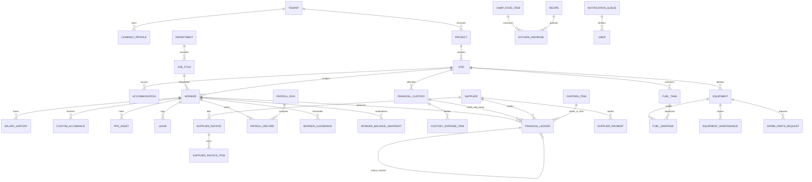

# 🏛️ المعمارية الهندسية الشاملة لقاعدة بيانات PostgreSQL ونموذج الكيانات والعلاقات (ERD)
## Al-Saada Enterprise Relational Schema & Entity-Relationship Architecture

> **تاريخ الاعتماد والمطابقة:** سبتمبر 2026  
> **حالة المطابقة:** 🟢 **مطابقة تامة بنسبة 100% مع كافة تدفقات المنظومة الـ 126 وشيتات النظام القديم الـ 66**  
> **محرك البيانات:** PostgreSQL 16 + Prisma 7.10.0 (Driver Adapter Engine: @prisma/adapter-pg + pg)  
> **العملة المعتمدة:** الجنيه المصري (EGP - ج.م) حصراً في كافة الحسابات والفواتير والقيود  
> **المرجع الوظيفي:** `f:\HR\docs\01-architecture\live-sheet-registry.md` & `full-sheet-field-dictionary.md`

---

## 1️⃣ المبادئ الهندسية الصارمة للتصميم (Engineering Invariants)

1. **العملة الموحدة الصارمة (Single Sovereign Currency):**
   - كافة المعاملات المالية، السلف، مسير الرواتب، فواتير الموردين، ومصروفات العهد مقومة **بالجنيه المصري (EGP)** حصراً، ولا يتم التعامل بأي عملة أجنبية في النظام.
2. **سلسلة الهاش التشفيرية المانعة للتلاعب (Cryptographic Hash Chaining):**
   - كل قيد مالي في `financial_ledgers` يحمل بصمة تجزئة متسلسلة (`previousHash` + `recordHash`) تعتمد على خوارزمية **SHA-256**.
   - لا يُسمح بتعديل أو حذف أي قيد مالي مطلقاً؛ وأي تصحيح يتم حصراً عبر **قيد تسوية عكسي (Reversal Entry)** برقم سند جديد وارتباط بالقيد الأصلي.
3. **القفل التفاؤلي ومنع سباق العمليات (Optimistic Locking):**
   - الجداول التي تدير أرصدة نقدية أو مخزونية (`financial_custodies`, `fuel_tanks`, `canteen_items`, `company_treasuries`) مزودة بحقل `version Int @default(1)` لمنع التعديل المتزامن وسحب رصيد غير موجود (Preventing Double-Spending).
4. **الحذف الناعم والتاريخ الأبدي (Strict Soft Delete & 360° Life Cycle):**
   - لا يتم حذف أي سجل عمالي، أو قيد مالي، أو أصل، أو مورد من قاعدة البيانات نهائياً. يتم استخدام أعلام الحذف الناعم (`isDeleted`, `deletedAt`, `deletedBy`).
5. **تشفير البيانات الحساسة والفهرسة العمياء (ALE & Blind Indexing):**
   - الأرقام القومية، أرقام الهواتف، والحسابات البنكية تُشفر بمفتاح التطبيق **AES-256-GCM**، مع توليد فهارس عمياء **HMAC-SHA256** للبحث اللحظي الدقيق دون فك التشفير.
6. **بصمة التجزئة للمرفقات لمنع التكرار (Attachment Deduplication via SHA-256):**
   - كل صورة إيصال، فاتورة مورد، أو مستند يتم رفعها، يُحسب لها تجزئة `sha256Checksum` لمنع تكرار قيد نفس الفاتورة مرتين.
7. **طابور الإشعارات المقيد بمعدل التيليجرام (Rate-Limited Notification Queue):**
   - تجنب حظر البوت عبر طابور مجدول مقسم حسب الأولوية (`CRITICAL_ALERT`, `RECEIPT`, `GENERAL_UPDATE`).
8. **محرك البيانات والمولد الحديث (Prisma 7.10.0 Client Generator):**
   - يعتمد المولد `provider = "prisma-client"` ومسار التوليد الموحد `src/generated/client`.
   - مركزية إعدادات الاتصال عبر `packages/database/prisma.config.ts` بدلاً من خواص الـ schema القديمة.

---

## 2️⃣ مخطط الكيانات والعلاقات العام (Enterprise Entity-Relationship Diagram)

---

## 3️⃣ النطاقات الوظيفية الـ 12 وتفصيل الجداول والحقول

### النطاق 1: إدارة المؤسسة والشركات والمشاريع والمواقع (Corporate & Projects Domain)
*يستبدل: `AppSettings`, `CompanyDocumentsVault`, `📑_دليل_الشيتات_والفهرس`*

#### 1. جدول المستأجرين (`tenants`)
- `id`: المعرف الفريد (UUID PK).
- `code`: كود المستأجر الفريد (مثل: `ALSAADA`).
- `name`: اسم المؤسسة.
- `isActive`: حالة الحساب.
- `createdAt`, `updatedAt`.

#### 2. جدول بيانات الشركة (`company_profiles`)
- `id`: المعرف الفريد (UUID PK).
- `tenantId`: ربط بالمستأجر (FK).
- `legalName`: الاسم القانوني المسجل.
- `tradeName`: الاسم التجاري المعروف.
- `taxRegistrationNumber`: البطاقة الضريبية.
- `commercialRegistrationNumber`: السجل التجاري.
- `headquartersAddress`: عنوان المقر الرئيسي.
- `primaryPhone`: الهاتف الأساسي.
- `officialEmail`: البريد الرسمي.
- `baseCurrency`: "EGP" (افتراضي ودائم).
- `settings`: إعدادات النظام العامة (JSON).
- `createdAt`, `updatedAt`.

#### 3. جدول المشاريع (`projects`)
- `id`: المعرف الفريد (UUID PK).
- `tenantId`: ربط بالمستأجر (FK).
- `code`: كود المشروع الفريد (مثل: `PRJ-PHOS-01`).
- `name`: اسم المشروع (مثل: مشروع استخراج خام الفوسفات).
- `clientName`: الجهة المالكة / العميل (مثل: هيئة الثروة المعدنية).
- `startDate`: تاريخ بدء العمل التعاقدي.
- `endDate`: تاريخ الانتهاء المخطط.
- `estimatedBudget`: الميزانية التقديرية (Decimal بالجنيه المصري).
- `status`: حالة المشروع (`PLANNING`, `ACTIVE`, `SUSPENDED`, `COMPLETED`).
- `description`: وصف نطاق الأعمال.
- `createdAt`, `updatedAt`.

#### 4. جدول المواقع الميدانية (`sites`)
- `id`: المعرف الفريد (UUID PK).
- `projectId`: ربط بالمشروع (FK).
- `code`: كود الموقع (مثل: `STE-KHA`, `STE-ASW`).
- `name`: اسم الموقع الميداني (مثل: قطاع مناجم الخارجة - الوادي الجديد).
- `governorateCode`: كود المحافظة المعتمد.
- `latitude`, `longitude`: الإحداثيات الجغرافية للموقع.
- `geofenceRadiusMeters`: نطاق السياج الجغرافي المسموح به للمطابقة الميدانية.
- `siteManagerId`: مدير الموقع المسؤول (يرتبط بـ `users` أو `workers`).
- `status`: الحالة (`ACTIVE`, `INACTIVE`).
- `createdAt`, `updatedAt`.

#### 5. جدول كرفانات وتسكين الموقع (`site_accommodations`)
*يستبدل: شيت 37 `SiteAccommodation`*
- `id`: المعرف الفريد (UUID PK).
- `siteId`: الموقع التابع له (FK).
- `unitNumber`: رقم الكرفان أو الاستراحة (مثل: `CRV-04`).
- `unitType`: نوع الوحدة (`ENGINEER_CABIN`, `WORKER_BARRACKS`, `VIP_GUEST`).
- `capacity`: سعة الأسرة المتاحة.
- `currentOccupancy`: عدد النزلاء الحاليين.
- `supervisorName`: المشرف المسؤول عن الكرفان.
- `isActive`: الحالة.
- `createdAt`, `updatedAt`.

#### 6. جدول تسكين العمال في الكرفانات (`site_accommodation_assignments`)
- `id`: المعرف الفريد (UUID PK).
- `accommodationId`: الكرفان (FK).
- `workerId`: العامل النزيل (FK).
- `bedNumber`: رقم السرير / الدولاب.
- `checkInDate`: تاريخ التسكين.
- `checkOutDate`: تاريخ المغادرة الفعلي (اختياري).
- `status`: الحالة (`ACTIVE`, `CHECKED_OUT`).
- `notes`: ملاحظات.

#### 7. جدول خزينة وثائق الشركة (`company_documents`)
*يستبدل: شيت 65 `CompanyDocumentsVault`*
- `id`: المعرف الفريد (UUID PK).
- `tenantId`: ربط بالمؤسسة (FK).
- `docNumber`: رقم الوثيقة أو الترخيص.
- `title`: اسم الوثيقة (مثل: ترخيص مقلع رقم 12).
- `category`: التصنيف (`LEGAL_REGISTRATION`, `QUARRY_LICENSE`, `EQUIPMENT_TITLE`, `LEASE_CONTRACT`, `TAX_RECORD`).
- `issueDate`: تاريخ الإصدار.
- `expiryDate`: تاريخ انتهاء الصلاحية.
- `fileUri`: مسار الملف المؤرشف.
- `sha256Checksum`: بصمة تجزئة الملف لمنع التكرار والتلاعب.
- `fileSizeBytes`: حجم الملف بالبايت.
- `alertDaysBeforeExpiry`: عدد الأيام للتنبيه المسبق قبل الانتهاء (افتراضي: 30).
- `createdAt`, `updatedAt`.

---

### النطاق 2: الهيكل التنظيمي وسجل العمالة الشامل 360° (Workforce & HR 360 Domain)
*يستبدل: شيت 4 `CurrentEmployees`, شيت 5 `FormerEmployees`, شيت 8 `History360`, شيت 63 `SalaryHistoryLog`, شيت 64 `WorkerCustomAllowances`, شيت 20 `ToolsAndPPEAssets`, شيت 21 `DisciplinaryAndBonusHub`, شيت 22 `ClearanceAndSettlement`*

#### 1. جدول الإدارات (`departments`)
- `id`: المعرف الفريد (UUID PK).
- `code`: كود الإدارة (مثل: `OP` تشغيل، `FL` معدات وسيارات، `MN` صيانة، `AD` إدارة).
- `name`: اسم الإدارة.
- `isActive`: الحالة.
- `createdAt`, `updatedAt`.

#### 2. جدول المسميات والوظائف (`job_titles`)
- `id`: المعرف الفريد (UUID PK).
- `departmentId`: الإدارة التابعة لها (FK).
- `code`: كود الوظيفة (مثل: `DRV` سائق، `HLP` مساعد، `TEC` فني، `ENG` مهندس).
- `name`: اسم المسمى الوظيفي.
- `baseWageGuideline`: الأجر الاسترشادي اليومي (Decimal).
- `isActive`: الحالة.
- `createdAt`, `updatedAt`.

#### 3. السجل المركزي الموحد للعاملين (`workers`)
- `id`: المعرف الفريد (UUID PK).
- `tenantId`: ربط بالمؤسسة (FK).
- `code`: الكود الهيكلي النشط (`[DEP]-[JOB]-[SEQ]`، مثل: `OP-DRV-0042`).
- `aliases`: مصفوفة الأكواد القديمة والبديلة (`String[]`، مثل: `["106", "101", "OP-HLP-0015"]`).
- `name`: الاسم الرباعي المعتمد.
- `nationalIdEncrypted`: الرقم القومي المصري مشفر (AES-256-GCM).
- `nationalIdBlindIndex`: الفهرس الأعمى للرقم القومي (HMAC-SHA256 فريد للبحث اللحظي).
- `birthDate`: تاريخ الميلاد المحسوب آلياً.
- `gender`: النوع (`MALE`, `FEMALE`).
- `governorateCode`: كود محافظة الإقامة.
- `departmentId`: ربط بالإدارة (FK).
- `jobTitleId`: ربط بالمسمى الوظيفي (FK).
- `siteId`: الموقع الميداني المخصص للعمل (FK).
- `hireDate`: تاريخ بدء العمل والتعاقد الأول بالشركة.
- `contractType`: طبيعة التعاقد (`DAILY_LABOR`, `SEASONAL`, `PERMANENT`).
- `shiftSystem`: نظام العمل والراحة (مثل: `24_WORK_6_REST`).
- `dailyWage`: الأجر اليومي المحسوب (Decimal).
- `basicSalary`: الراتب الأساسي الشهري (Decimal).
- `fixedAllowances`: البدلات الثابتة الشهرية (Decimal).
- `paymentMethod`: طريقة استلام المستحقات (`CASH_SITE`, `VODAFONE_CASH`, `INSTAPAY`, `BANK_TRANSFER`).
- `accountNumberEncrypted`: رقم المحفظة أو الحساب البنكي مشفر (AES-256-GCM).
- `canteenCigarettePolicy`: سياسة السجائر (`ONE_PACK_DAILY`, `FULL_COVERAGE`, `NONE`, `CUSTOM`).
- `phoneEncrypted`: رقم الهاتف مشفر (AES-256-GCM).
- `phoneBlindIndex`: الفهرس الأعمى لرقم الهاتف.
- `emergencyContactName`: اسم جهة اتصال الطوارئ.
- `emergencyPhoneEncrypted`: هاتف الطوارئ مشفر.
- `bloodType`: فصيلة الدم (اختياري).
- `telegramId`: معرف التيليجرام الرقمي الموثق (BigInt فريد).
- `status`: الحالة التشغيلية (`ACTIVE`, `ON_LEAVE`, `TERMINATED`, `RESIGNED`).
- `terminationDate`: تاريخ ترك العمل (اختياري للعمالة السابقة).
- `terminationReason`: سبب إنهاء الخدمة (استقالة، انتهاء مشروع، فصل إداري).
- `isDeleted`: علم الحذف الناعم (true للعمالة السابقة والمحذوفة).
- `deletedAt`: تاريخ الحذف/الأرشفة.
- `deletedBy`: معرف المستخدم الذي نفذ الإجراء.
- `createdAt`, `updatedAt`.

#### 4. جدول تاريخ تعديلات الأجور والترقيات (`salary_histories`)
*يستبدل: شيت 63 `SalaryHistoryLog`*
- `id`: المعرف الفريد (UUID PK).
- `workerId`: ربط بالعامل (FK).
- `previousWage`: الأجر قبل التعديل (Decimal).
- `newWage`: الأجر الجديد بعد التعديل (Decimal).
- `effectiveDate`: تاريخ سريان التعديل.
- `reason`: سبب التعديل (ترقية، علاوة سنوية، تعديل دوري).
- `approvedByUserId`: معرف المدير المعتمد للتعديل.
- `createdAt`.

#### 5. جدول البدلات المخصصة للعامل (`worker_custom_allowances`)
*يستبدل: شيت 64 `WorkerCustomAllowances`*
- `id`: المعرف الفريد (UUID PK).
- `workerId`: ربط بالعامل (FK).
- `allowanceType`: نوع البدل (`HARDSHIP_ALLOWANCE`, `RISK_ALLOWANCE`, `NIGHT_SHIFT`, `HOUSING_STIPEND`).
- `amount`: قيمة البدل اليومي أو الشهري (Decimal بالجنيه المصري).
- `isRecurring`: هل يصرف شهرياً أم لمرة واحدة؟
- `startDate`: تاريخ البدء.
- `endDate`: تاريخ الانتهاء (اختياري).
- `isActive`: الحالة.
- `notes`: ملاحظات ومبررات الصرف.
- `createdAt`, `updatedAt`.

#### 6. جدول مهمات الوقاية والسلامة الشخصية (`ppe_assets`)
*يستبدل: شيت 20 `ToolsAndPPEAssets`*
- `id`: المعرف الفريد (UUID PK).
- `voucherId`: رقم إذن الصرف (`#PPE-YYYY-XXX`).
- `workerId`: ربط بالعامل (FK).
- `assetType`: نوع المهمة (`SAFETY_HELMET`, `SAFETY_SHOES`, `HI_VIS_VEST`, `SAFETY_GOGGLES`, `HARNESS`).
- `brandModel`: الماركة والموديل.
- `issueDate`: تاريخ التسليم للعامل.
- `scheduledReplacementDate`: تاريخ التبديل الدوري المستهدف.
- `costPrice`: تكلفة المهمة بالجنيه المصري (Decimal).
- `condition`: حالة العهدة (`NEW`, `GOOD`, `DAMAGED_NATURAL`, `LOST_NEGLIGENT`).
- `returnDate`: تاريخ الإرجاع الفعلي (اختياري).
- `isDeductedFromWorker`: هل تم تحميل قيمتها على العامل عند الإتلاف أو الإهمال؟
- `createdAt`, `updatedAt`.

#### 7. جدول المكافآت والجزاءات الإدارية (`disciplinary_and_bonuses`)
*يستبدل: شيت 21 `DisciplinaryAndBonusHub`*
- `id`: المعرف الفريد (UUID PK).
- `recordNumber`: رقم السند (`#DISC-YYYY-XXX` أو `#BON-YYYY-XXX`).
- `workerId`: ربط بالعامل (FK).
- `type`: التصنيف (`BONUS_CASH`, `BONUS_DAYS`, `PENALTY_CASH`, `PENALTY_DAYS`).
- `amount`: المبلغ بالجنيه المصري إن كان نقدياً (Decimal).
- `daysEquivalent`: عدد الأيام المعادلة إن كان خصماً أو مكافأة أيام.
- `reason`: السبب الإداري أو الفني الصريح للقرار.
- `decisionDate`: تاريخ صدور القرار.
- `appliedToMonth`: شهر المسير المالي المطبق عليه الخصم/المكافأة (`YYYY-MM`).
- `approvedByUserId`: المسؤول المعتمد.
- `createdAt`.

#### 8. جدول مخالصات نهاية الخدمة الشاملة (`worker_clearances`)
*يستبدل: شيت 22 `ClearanceAndSettlement` وشيت 12 `DebtSettlement`*
- `id`: المعرف الفريد (UUID PK).
- `clearanceNumber`: رقم وثيقة المخالصة (`#CLR-YYYY-XXX`).
- `workerId`: ربط بالعامل (FK).
- `terminationDate`: تاريخ إنهاء العلاقة التعاقدية.
- `serviceDurationDays`: إجمالي أيام الخدمة بالشركة.
- `accruedLeaveDays`: رصيد الإجازات المستحقة نقداً.
- `endOfServiceGratuity`: مكافأة نهاية الخدمة بالجنيه المصري (Decimal).
- `totalUnpaidSalaries`: الرواتب المتأخرة المستحقة له (Decimal).
- `totalOutstandingAdvances`: إجمالي السلف والديون المتبقية عليه (Decimal).
- `custodiesReturned`: تأكيد تصفية وإرجاع كافة العهد النقدية (Boolean).
- `ppeReturned`: تأكيد إرجاع مهمات الوقاية والأصول (Boolean).
- `netSettlementAmount`: صافي المبلغ النهائي (دائن أو مدين بالجنيه المصري).
- `paymentVoucherNumber`: رقم سند صرف/استلام التسوية النهائية.
- `receiptPhotoUri`: رابط صورة المخالصة الموقعة وبصمة الإبهام.
- `sha256Checksum`: بصمة صورة المخالصة.
- `status`: حالة المخالصة (`DRAFT`, `AUDITED`, `APPROVED`, `EXECUTED`).
- `settledAt`: تاريخ الإغلاق المالي.
- `createdAt`, `updatedAt`.

#### 9. جدول لقطات الأرصدة المالية السريعة للعامل (`worker_balance_snapshots`)
- `id`: المعرف الفريد (UUID PK).
- `workerId`: ربط بالعامل (FK فريد).
- `totalEarnedAllTime`: إجمالي كافة مستحقاته منذ تعيينه (Decimal).
- `totalPaidAllTime`: إجمالي ما استلمه نقداً ومحافظ وبنوك (Decimal).
- `currentMonthAdvances`: إجمالي سلف ومسحوبات الشهر الجاري (Decimal).
- `outstandingLoansBalance`: رصيد أقساط القروض الطويلة المتبقية (Decimal).
- `lastUpdatedLedgerHash`: بصمة آخر قيد مالي تم حسابه في اللقطة.
- `updatedAt`.

---

### النطاق 3: الإجازات والتشغيل الميداني (Leaves & Field Operations)
*يستبدل: شيت 16 `LeavesLedger`, شيت 18 `LeaveRequests`, شيت 11 `LeaveAllowances`, شيت 13 `OverstayApprovals`, شيت 55 `DailyOperationsDutyRoster`, شيت 35 `SiteTasksAndFieldNotes`*

#### 1. جدول الإجازات المركزي (`leaves`)
- `id`: المعرف الفريد (UUID PK).
- `leaveNumber`: كود الإجازة الفريد (`#LV-YYYY-XXXX`).
- `workerId`: ربط بالعامل (FK).
- `siteId`: الموقع الميداني التابع له (FK).
- `leaveType`: نوع الإجازة (`ANNUAL`, `CASUAL`, `MISSION`, `SICK`, `UNPAID`).
- `requestDate`: تاريخ تقديم الطلب.
- `departureDate`: تاريخ بدء الإجازة / النزول الفعلي.
- `expectedReturnDate`: تاريخ العودة المخطط.
- `actualReturnDate`: تاريخ العودة الفعلي المسجل عند الحضور.
- `status`: الحالة التشغيلية (`PENDING`, `APPROVED`, `REJECTED`, `ACTIVE_ON_LEAVE`, `RESUMED`, `OVERDUE`).
- `overdueDays`: عدد أيام التأخير الفعلية المحسوبة.
- `penaltyDaysCalculated`: أيام الجزاء الإداري المطبقة بموجب سياسة ($N+2$).
- `deductionAmount`: مبلغ الخصم المالي المقدر بالجنيه المصري (Decimal).
- `isOverstayPardoned`: هل تم العفو عن التأخير وقبول العذر؟ (Boolean).
- `overstayPardonReason`: سبب قبول العذر الإداري.
- `supervisorNotes`: ملاحظات المشرف الميداني.
- `approvedByUserId`: المسؤول المعتمد.
- `createdAt`, `updatedAt`.

#### 2. جدول بدلات ومصاريف الإجازات (`leave_allowances`)
*يستبدل: شيت 11 `LeaveAllowances`*
- `id`: المعرف الفريد (UUID PK).
- `leaveId`: ربط بالإجازة (FK).
- `workerId`: ربط بالعامل (FK).
- `travelStipend`: بدل الانتقال ومصاريف السفر (Decimal بالجنيه المصري).
- `disbursedFromCustodyId`: العهدة الميدانية المنصرف منها البدل (FK اختياري).
- `disbursementDate`: تاريخ صرف البدل.
- `voucherNumber`: رقم سند الصرف.
- `createdAt`.

#### 3. جدول النوباتجيات والتشغيل اليومي (`duty_rosters`)
*يستبدل: شيت 55 `DailyOperationsDutyRoster`*
- `id`: المعرف الفريد (UUID PK).
- `dutyDate`: تاريخ يوم التشغيل.
- `siteId`: الموقع (FK).
- `workerId`: العامل المشغل (FK).
- `equipmentId`: المعدة المسندة إليه للعمل اليومي (FK اختياري).
- `shiftType`: الوردية (`DAY_SHIFT`, `NIGHT_SHIFT`).
- `hoursWorked`: ساعات التشغيل الفعلية.
- `status`: التواجد (`PRESENT`, `ABSENT_UNEXCUSED`, `REST_DAY`, `ON_DUTY_MISSION`).
- `latitude`, `longitude`: إحداثيات موقع تسجيل الحضور (اختياري للتحقق).
- `recordedByUserId`: المشرف الميداني القائم بالتسجيل.
- `createdAt`.

#### 4. جدول التكليفات والمهام الهندسية بالموقع (`site_tasks`)
*يستبدل: شيت 35 `SiteTasksAndFieldNotes`*
- `id`: المعرف الفريد (UUID PK).
- `taskNumber`: رقم التكليف (`#TSK-YYYY-XXX`).
- `siteId`: الموقع (FK).
- `title`: عنوان المهمة أو الملاحظة الهندسية.
- `description`: التفاصيل الفنية للمهمة.
- `assignedToWorkerId`: العامل أو الفني المكلف (FK اختياري).
- `priority`: الأولوية (`LOW`, `MEDIUM`, `HIGH`, `URGENT_SAFETY`).
- `status`: الحالة (`OPEN`, `IN_PROGRESS`, `COMPLETED`, `CANCELLED`).
- `dueDate`: الموعد النهائي للإنجاز.
- `completedAt`: تاريخ الإنجاز الفعلي.
- `attachmentUri`: رابط الصور أو المستندات المرفقة.
- `sha256Checksum`: بصمة الملف المرفق.
- `createdAt`, `updatedAt`.

---

### النطاق 4: الخزائن والعهد المالية الميدانية (Treasury & Custodies Domain)
*يستبدل: شيت 32 `FinancialCustodyLedger`, شيت 33 `CustodyExpensesBreakdown`, شيت 42 `CustodySettlementRequests`, شيت 26 `HospitalityLedger`*

#### 1. جدول خزائن الشركة والحسابات المركزية (`company_treasuries`)
- `id`: المعرف الفريد (UUID PK).
- `tenantId`: ربط بالمؤسسة (FK).
- `name`: اسم الخزينة (مثل: الخزينة النقدية المركزية، حساب البنك الأهلي المصري).
- `accountType`: نوع الحساب (`MAIN_CASH_VAULT`, `BANK_ACCOUNT`, `VODAFONE_CASH_WALLET`, `INSTAPAY_WALLET`).
- `bankName`: اسم البنك إن وجد.
- `accountNumber`: رقم الحساب البنكي أو رقم المحفظة.
- `currentBalance`: الرصيد اللحظي الفعلي بالجنيه المصري (Decimal).
- `version`: رقم الإصدار للقفل التفاؤلي (`Int @default(1)`).
- `isActive`: الحالة.
- `createdAt`, `updatedAt`.

#### 2. جدول العهد المالية الميدانية والتنفيذية (`financial_custodies`)
*يستبدل: شيت 32 `FinancialCustodyLedger`*
- `id`: المعرف الفريد (UUID PK).
- `custodyNumber`: كود العهدة الفريد (`#FC-YYYY-XXX` للميدانية أو `#EX-YYYY-XXX` للتنفيذية).
- `siteId`: الموقع الميداني التابع له (FK).
- `custodianWorkerId`: المشرف أو المهندس أمين العهدة المستلم (FK).
- `initialAmount`: رأس مال العهدة المنصرف بالجنيه المصري (Decimal).
- `currentBalance`: الرصيد المتبقي نقداً في يد المشرف بالجنيه المصري (Decimal).
- `totalLiquidatedExpenses`: إجمالي الفواتير والمصروفات المفرغة والمعتمدة (Decimal).
- `totalCashAdvancesDisbursed`: إجمالي السلف النقدية المنصرفة للعمال من هذه العهدة (Decimal).
- `purpose`: الغرض التشغيلي المحدد للعهدة.
- `status`: حالة العهدة (`ACTIVE`, `SETTLEMENT_PENDING`, `CLOSED`).
- `disbursedAt`: تاريخ استلام المشرف للعهدة.
- `closedAt`: تاريخ الإغلاق والتصفية النهائية.
- `disbursedFromTreasuryId`: الخزينة المنصرف منها رأس المال (FK).
- `version`: رقم الإصدار للقفل التفاؤلي (`Int @default(1)`).
- `createdAt`, `updatedAt`.

#### 3. جدول تفريغ فواتير ومصروفات العهد (`custody_expense_items`)
*يستبدل: شيت 33 `CustodyExpensesBreakdown`*
- `id`: المعرف الفريد (UUID PK).
- `custodyId`: العهدة المصروف منها (FK).
- `itemSequence`: رقم تسلسلي للبند داخل كشف العهدة.
- `expenseCategory`: تصنيف المصروف (`SPARE_PARTS`, `EQUIPMENT_MAINTENANCE`, `FOOD_CATERING`, `FUEL_OILS`, `LABOR_ALLOWANCE`, `HOSPITALITY`, `TRANSPORT_FREIGHT`, `SITE_CONSUMABLES`, `GOVERNMENT_FEES`).
- `amount`: قيمة الفاتورة بالجنيه المصري (Decimal).
- `vendorName`: اسم التاجر، الورشة، أو المحل.
- `receiptDate`: تاريخ الفاتورة/الإيصال.
- `description`: تفاصيل المشتروات أو الخدمة المؤداة.
- `receiptImageUri`: مسار صورة الفاتورة المؤرشفة.
- `sha256Checksum`: بصمة الصورة لمنع تكرار تقديم نفس الفاتورة في عهدة أخرى.
- `ocrExtractedData`: البيانات المستخرجة ذكياً عبر OCR (JSON).
- `isApproved`: حالة الاعتماد المالي من السوبر أدمن (Boolean).
- `createdAt`.

#### 4. جدول دورات تصفية العهد الميدانية (`custody_settlements`)
*يستبدل: شيت 42 `CustodySettlementRequests`*
- `id`: المعرف الفريد (UUID PK).
- `settlementNumber`: رقم طلب التصفية (`#SET-YYYY-XXX`).
- `custodyId`: العهدة المراد تصفيتها (FK).
- `closingTotalInvoices`: إجمالي الفواتير المرفقة (Decimal).
- `closingTotalAdvances`: إجمالي السلف المنصرفة للعمال ومحولة لذمتهم (Decimal).
- `remainingCashReturned`: المتبقي نقداً المورد لخزينة الشركة (Decimal).
- `settlementDisposition`: مسار تسوية المتبقي (`REFUND_TO_TREASURY`, `ROLLOVER_NEW_CUSTODY`, `DEDUCT_AS_ADVANCE_ON_CUSTODIAN`).
- `settlementSheetPhotoUri`: رابط صورة كشف التصفية المجمع الموقع.
- `status`: الحالة (`PENDING_AUDIT`, `APPROVED`, `REJECTED`).
- `auditedByUserId`: المحاسب أو السوبر أدمن المعتمد للتصفية.
- `settledAt`: تاريخ الاعتماد النهائي.
- `createdAt`, `updatedAt`.

#### 5. جدول مصاريف الضيافة واستقبال الموقع (`hospitality_expenses`)
*يستبدل: شيت 26 `HospitalityLedger`*
- `id`: المعرف الفريد (UUID PK).
- `voucherId`: رقم الإذن (`#HOSP-YYYY-XXX`).
- `siteId`: الموقع (FK).
- `amount`: المبلغ المنصرف بالجنيه المصري (Decimal).
- `guestNameOrEntity`: اسم الضيف، الوفد، أو الجهة الزائرة.
- `occasion`: سبب الضيافة (لجنة تفتيش، وفد جهة حكومية، ضيافة استشارية).
- `sourceCustodyId`: العهدة التي تم الصرف منها (FK).
- `disbursedByWorkerId`: المشرف القائم بالضيافة (FK).
- `receiptPhotoUri`: صورة الإيصال (اختياري).
- `sha256Checksum`: بصمة صورة الإيصال.
- `createdAt`.

---

### النطاق 5: السلف والمسحوبات ودفتر الأستاذ المشفر بسلسلة الهاش (Advances & Cryptographic Ledger)
*يستبدل: شيت 6 `AdvancesLedger`, شيت 19 `AdvanceRequests`, شيت 27 `AdvanceInstallments`*

#### 1. جدول طلبات السلف (`advance_requests`)
*يستبدل: شيت 19 `AdvanceRequests`*
- `id`: المعرف الفريد (UUID PK).
- `requestNumber`: رقم الطلب (`#ARQ-YYYY-XXXX`).
- `workerId`: ربط بالعامل (FK).
- `amountRequested`: المبلغ المطلوب بالجنيه المصري (Decimal).
- `purpose`: سبب طلب السلفة والظرف الطارئ.
- `installmentMonths`: عدد أشهر التقسيط المقترحة.
- `status`: الحالة (`PENDING`, `APPROVED`, `REJECTED`).
- `rejectionReason`: سبب الرفض إن وجد.
- `approvedAmount`: المبلغ المعتمد بعد دراسة الموقف المالي للعامل.
- `approvedByUserId`: المسؤول المعتمد.
- `createdAt`, `updatedAt`.

#### 2. دفتر الأستاذ المالي العام المشفر بسلسلة الهاش (`financial_ledgers`)
*يستبدل: شيت 6 `AdvancesLedger` والقيود المالية في كافة المنظومة*
- `id`: المعرف الفريد (UUID PK).
- `voucherNumber`: رقم السند المحاسبي الفريد المولد آلياً (`#ADV-YYYY-XXXX`, `#PAY-YYYY-XXXX`, `#VND-YYYY-XXXX`, `#SET-YYYY-XXXX`).
- `previousHash`: بصمة تجزئة السجل المالي السابق في السلسلة (SHA-256 لمنع التلاعب والتعديل العكسي).
- `recordHash`: بصمة تجزئة هذا القيد (`SHA256(voucherNumber + amount + sourceAccount + destinationAccount + timestamp + previousHash)`).
- `transactionType`: نوع المعاملة المالية:
  - `ADVANCE_CASH`: صرف سلفة نقدية لعامل (يتطلب إلزاماً تحديد `sourceCustodyId` أو الخزينة الرئيسية).
  - `WITHDRAWAL_CIGARETTES`: صرف سجائر عينية لعامل من الكانتين (0 كاش، تسوية تكلفة الإعاشة).
  - `WITHDRAWAL_PURCHASES`: مشتريات عينية لعامل من مورد (0 كاش، تسوية رصيد المورد).
  - `SALARY_PAYOUT`: صرف راتب شهري لعامل.
  - `SUPPLIER_PAYMENT`: سداد دفعة لمورد أو ورشة.
  - `CUSTODY_DISBURSEMENT`: تمويل عهدة من خزينة الشركة.
  - `CUSTODY_REFUND`: توريد متبقي عهدة لخزينة الشركة.
  - `GENERAL_EXPENSE`: مصروف تشغيلي عام.
- `amount`: المبلغ الصافي بالجنيه المصري حصراً (Decimal).
- `sourceAccount`: الحساب المصدر للأموال (كود العهدة، أو كود الخزينة، أو كود مخزن الكانتين، أو كود المورد).
- `destinationAccount`: الحساب المستقبل للأموال (كود العامل، أو كود المورد، أو حساب المصروفات).
- `sourceCustodyId`: معرف العهدة النقدية الميدانية في حالة الصرف النقدي (FK اختياري).
- `workerId`: العامل المستفيد أو المدين بالحركة (FK اختياري).
- `supplierId`: المورد الدائن بالحركة (FK اختياري).
- `canteenItemId`: صنف الكانتين المنصرف (FK اختياري في مسحوبات السجائر).
- `inKindDetails`: تفريغ الأصناف العينية المشتراة والكميات والأسعار (JSON).
- `description`: البيان والوصف التفصيلي للقيد.
- `accountingMonth`: شهر الاستحقاق المحاسبي للتسوية على الراتب (`YYYY-MM`).
- `isReversal`: هل هذا قيد تسوية عكسي لتصحيح حركة خاطئة؟ (Boolean @default(false)).
- `reversalOfVoucherId`: رقم سند الحركة الأصلية الملغاة في حالة القيد العكسي.
- `actorTelegramId`: معرف التيليجرام للمشرف/المستخدم منفذ العملية (BigInt).
- `receiptPhotoUri`: مسار صورة السند الورقي أو إيصال الصرف.
- `sha256Checksum`: بصمة صورة الإيصال.
- `isDeleted`: علم الحذف الناعم (لا يتم استخدامه مالياً إلا بضوابط التدقيق).
- `deletedAt`, `deletedBy`, `deletionReason`.
- `syncedToSheets`: حالة الترحيل لشيتات جوجل في المعمارية الهجينة (Boolean).
- `syncedAt`: توقيت الترحيل الناجح.
- `createdAt`.

#### 3. جدول أقساط السلف الكبرى (`advance_installments`)
*يستبدل: شيت 27 `AdvanceInstallments`*
- `id`: المعرف الفريد (UUID PK).
- `workerId`: ربط بالعامل (FK).
- `originalVoucherNumber`: رقم سند السلفة الأصلية المنصرفة (FK).
- `installmentSequence`: رقم القسط (مثلاً: 1 من 6).
- `dueMonth`: شهر الاستحقاق (`YYYY-MM`).
- `installmentAmount`: قيمة القسط الشهري بالجنيه المصري (Decimal).
- `status`: حالة القسط (`PENDING`, `DEDUCTED_FROM_PAYROLL`, `WAIVED_BY_ADMIN`).
- `deductedInPayrollRunId`: دورة مسير الرواتب التي تم خصم القسط فيها (FK اختياري).
- `createdAt`, `updatedAt`.

---

### النطاق 6: الموردين والورش والمشتريات (Suppliers & Procurement Domain)
*يستبدل: شيت 56 `SuppliersDirectory`, شيت 57 `SupplierTransactions`, شيت 58 `SupplierPayments`, شيت 59 `SupplierInvoiceBreakdown`*

#### 1. دليل الموردين والورش المعتمد (`suppliers`)
*يستبدل: شيت 56 `SuppliersDirectory`*
- `id`: المعرف الفريد (UUID PK).
- `tenantId`: ربط بالمؤسسة (FK).
- `code`: كود المورد الفريد (`#VND-XXX` أو `#EX-VND-XXX`).
- `name`: اسم المورد أو الشركة أو الورشة.
- `category`: النشاط التجاري (`WORKSHOPS_MACHINING`, `SPARE_PARTS`, `FOOD_CATERING`, `FUEL_OILS`, `EQUIPMENT_RENTAL`, `GENERAL_SUPPLIES`).
- `phoneEncrypted`: هاتف المورد مشفر (AES-256-GCM).
- `phoneBlindIndex`: الفهرس الأعمى لرقم الهاتف.
- `taxNumber`: الرقم الضريبي أو السجل التجاري.
- `openingBalance`: الرصيد الافتتاحي بالجنيه المصري (Decimal دائن/مدين).
- `totalInvoiced`: إجمالي الفواتير الصادرة له بالجنيه المصري (Decimal).
- `totalPaid`: إجمالي الدفعات المسددة له بالجنيه المصري (Decimal).
- `currentBalance`: صافي الرصيد المستحق اللحظي له بالجنيه المصري (Decimal).
- `scope`: نطاق المورد (`FIELD` موقع ميداني / `EXECUTIVE` إدارة عليا).
- `siteId`: الموقع المرتبط به المورد (FK اختياري).
- `telegramId`: معرف التيليجرام للمورد إن كان يستخدم بوابة الموردين (BigInt اختياري).
- `status`: الحالة (`ACTIVE`, `SUSPENDED`).
- `version`: رقم الإصدار للقفل التفاؤلي (`Int @default(1)`).
- `createdAt`, `updatedAt`.

#### 2. جدول فواتير وأوامر شغل الموردين (`supplier_invoices`)
*يستبدل: شيت 57 `SupplierTransactions`*
- `id`: المعرف الفريد (UUID PK).
- `invoiceNumber`: رقم الفاتورة أو أمر الشغل (`#WO-YYYY-XXXX` أو رقم فاتورة المورد الضريبية).
- `supplierId`: المورد (FK).
- `siteId`: الموقع الميداني المستفيد (FK).
- `equipmentId`: المعدة التي تمت صيانتها أو شراء قطع غيار لها (FK اختياري).
- `invoiceDate`: تاريخ الفاتورة.
- `subtotalAmount`: القيمة قبل الضريبة بالجنيه المصري (Decimal).
- `taxAmount`: ضريبة القيمة المضافة أو الخصم الضريبي (Decimal).
- `totalAmount`: إجمالي الفاتورة الصافي بالجنيه المصري (Decimal).
- `paidAmount`: المبلغ المسدد منها حتى الآن (Decimal).
- `remainingBalance`: المتبقي من الفاتورة (Decimal).
- `paymentStatus`: حالة السداد (`UNPAID`, `PARTIALLY_PAID`, `PAID_FULL`).
- `description`: بيان الأعمال وسبب الشراء.
- `invoicePhotoUri`: رابط صورة الفاتورة الضريبية.
- `sha256Checksum`: بصمة صورة الفاتورة لمنع التكرار.
- `createdAt`, `updatedAt`.

#### 3. جدول تفريغ بنود فواتير الموردين (`supplier_invoice_items`)
*يستبدل: شيت 59 `SupplierInvoiceBreakdown`*
- `id`: المعرف الفريد (UUID PK).
- `invoiceId`: الفاتورة الرئيسية (FK).
- `itemSequence`: رقم البند التسلسلي.
- `itemDescription`: وصف الصنف أو الخدمة المشتراة.
- `quantity`: الكمية الموردة (Decimal).
- `unit`: وحدة القياس (قطعة، طقم، لتر، ساعة عمل).
- `unitPrice`: سعر الوحدة بالجنيه المصري (Decimal).
- `totalPrice`: إجمالي البند بالجنيه المصري (`quantity * unitPrice`).
- `createdAt`.

#### 4. جدول سندات سداد دفعات الموردين (`supplier_payments`)
*يستبدل: شيت 58 `SupplierPayments`*
- `id`: المعرف الفريد (UUID PK).
- `paymentNumber`: رقم سند الصرف (`#SPAY-YYYY-XXXX`).
- `supplierId`: المورد (FK).
- `invoiceId`: الفاتورة المحددة المسددة (FK اختياري للربط المباشر).
- `amount`: المبلغ المسدد بالجنيه المصري (Decimal).
- `paymentMethod`: طريقة السداد (`CASH_CUSTODY`, `BANK_TRANSFER`, `CHEQUE`, `TREASURY_CASH`).
- `disbursedFromTreasuryId`: الخزينة المصدر (FK اختياري).
- `disbursedFromCustodyId`: العهدة المصدر (FK اختياري).
- `transactionReference`: رقم الحوالة البنكية أو الشيك أو إذن الصرف.
- `receiptPhotoUri`: صورة سند الاستلام موقعاً من المورد.
- `sha256Checksum`: بصمة صورة السند.
- `paymentDate`: تاريخ السداد الفعلي.
- `createdAt`.

---

### النطاق 7: أسطول المعدات والمحروقات والصيانة (Fleet & Fuel Management Domain)
*يستبدل: شيت 54 `SiteEquipmentMaster`, شيت 53 `SiteFuelTanksMaster`, شيت 51 `FuelTanksAndDispenseLog`, شيت 52 `EquipmentMaintenanceLog`, شيت 62 `EquipmentSparePartsRequests`*

#### 1. ماستر أسطول المعدات والسيارات (`equipments`)
*يستبدل: شيت 54 `SiteEquipmentMaster`*
- `id`: المعرف الفريد (UUID PK).
- `tenantId`: ربط بالمؤسسة (FK).
- `code`: كود المعدة الفريد (مثل: `EQ-01`, `EQ-02`).
- `name`: اسم ووصف المعدة (مثل: لودر كوماتسو WA470).
- `type`: نوع المعدة (`LOADER`, `EXCAVATOR`, `DUMP_TRUCK`, `BULLDOZER`, `GENERATOR`, `WATER_TANKER`, `PICKUP_TRUCK`).
- `brand`: الماركة المصنعة (كاتربيلر، كوماتسو، مرسيدس).
- `modelYear`: سنة الصنع والموديل.
- `plateNumber`: رقم اللوحات المعدنية إن وجدت.
- `chassisNumber`: رقم الشاسيه.
- `siteId`: الموقع الميداني المتواجدة به المعدة حالياً (FK).
- `assignedWorkerId`: السائق أو المشغل الأساسي المسؤول عنها (FK اختياري).
- `meterType`: نوع العداد (`HOURS` ساعات تشغيل، `KILOMETERS` كيلومتر).
- `currentMeterReading`: قراءة العداد الحالية المسجلة (Decimal).
- `currentFuelLevelPercentage`: تقدير مستوى السولار الحالي في تنك المعدة.
- `technicalStatus`: الحالة الفنية (`OPERATIONAL`, `NEEDS_MAINTENANCE`, `BROKEN_DOWN_STOPPED`).
- `lastMaintenanceDate`: تاريخ آخر صيانة تمت للمعدة.
- `nextScheduledMaintenanceMeter`: قراءة العداد المستهدفة للصيانة الدورية القادمة.
- `createdAt`, `updatedAt`.

#### 2. جدول خزانات السولار والوقود بالموقع (`fuel_tanks`)
*يستبدل: شيت 53 `SiteFuelTanksMaster`*
- `id`: المعرف الفريد (UUID PK).
- `siteId`: الموقع الميداني (FK).
- `code`: كود الخزان الفريد (مثل: `TNK-01`, `TNK-02`).
- `name`: اسم أو موضع التنك (مثل: خزان المحطة الرئيسية، تنك الكسارة).
- `fuelType`: نوع الوقود (`DIESEL_SOLAR`, `GASOLINE_80`, `GASOLINE_92`).
- `totalCapacityLiters`: السعة الاستيعابية القصوى باللتر (Decimal).
- `currentStockLiters`: الرصيد اللحظي الفعلي المتبقي باللتر (Decimal).
- `minSafetyThresholdLiters`: حد الأمان الأدنى للتنبيه قبل نفاد الوقود.
- `supervisorWorkerId`: المشرف أمين الخزان المسؤول عن قياس الطلمبة (FK).
- `status`: الحالة (`ACTIVE`, `MAINTENANCE`, `DECOMMISSIONED`).
- `version`: رقم الإصدار للقفل التفاؤلي (`Int @default(1)`).
- `createdAt`, `updatedAt`.

#### 3. جدول سجل صرف السولار للمعدات (`fuel_dispense_logs`)
*يستبدل: شيت 51 `FuelTanksAndDispenseLog`*
- `id`: المعرف الفريد (UUID PK).
- `dispenseNumber`: رقم إذن التفويل (`#FL-YYYY-XXXX`).
- `tankId`: الخزان المصدر المنصرف منه (FK).
- `equipmentId`: المعدة المستلمة للسولار (FK).
- `operatorWorkerId`: السائق المستلم للوقود (FK).
- `litersDispensed`: عدد اللترات المنصرفة فعلياً (Decimal).
- `meterReadingAtDispense`: قراءة عداد ساعات/كيلومترات المعدة لحظة التفويل (Decimal).
- `unitCostPerLiter`: تكلفة لتر السولار بالجنيه المصري (Decimal).
- `totalCost`: التكلفة الإجمالية للوقود المنصرف بالجنيه المصري (Decimal).
- `latitude`, `longitude`: إحداثيات موقع التفويل للتأكد من التواجد الميداني.
- `dispensedByUserId`: المشرف القائم بالتسجيل وتأكيد العداد.
- `timestamp`: توقيت التفويل الفعلي.
- `createdAt`.

#### 4. جدول سجل صيانة المعدات والزيوت (`equipment_maintenances`)
*يستبدل: شيت 52 `EquipmentMaintenanceLog`*
- `id`: المعرف الفريد (UUID PK).
- `maintenanceNumber`: رقم إذن الصيانة (`#MNT-YYYY-XXXX`).
- `equipmentId`: المعدة التي تمت صيانتها (FK).
- `maintenanceType`: نوع الصيانة (`OIL_AND_FILTER_CHANGE`, `HYDRAULIC_SYSTEM`, `TIRES_AND_TRACKS`, `ENGINE_OVERHAUL`, `ELECTRICAL_SYSTEM`, `PREVENTIVE_PERIODIC`).
- `meterReading`: قراءة العداد عند تنفيذ الصيانة (Decimal).
- `supplierId`: الورشة أو مقاول الصيانة المنفذ إن وجد (FK اختياري).
- `totalCost`: إجمالي تكلفة قطع الغيار والمصنعيات بالجنيه المصري (Decimal).
- `description`: تفاصيل الأعطال التي تم علاجها وقطع الغيار التي تم استبدالها.
- `nextDueMeterReading`: قراءة العداد المستهدفة للصيانة القادمة.
- `performedAt`: تاريخ تنفيذ الصيانة.
- `approvedByUserId`: المشرف المعتمد للصيانة.
- `createdAt`.

#### 5. جدول طلبات شراء قطع غيار المعدات (`spare_parts_requests`)
*يستبدل: شيت 62 `EquipmentSparePartsRequests`*
- `id`: المعرف الفريد (UUID PK).
- `requestNumber`: رقم الطلب (`#SPR-YYYY-XXX`).
- `equipmentId`: المعدة المطلوبة لها قطع الغيار (FK).
- `partName`: اسم قطعة الغيار المطلوبة ورقمها الأصلي (Part Number).
- `quantity`: الكمية المطلوبة.
- `urgency`: درجة الاستعجال (`ROUTINE`, `URGENT_MACHINE_DOWN`).
- `estimatedCost`: التكلفة التقديرية بالجنيه المصري (Decimal).
- `status`: الحالة (`PENDING_APPROVAL`, `APPROVED`, `PURCHASED`, `INSTALLED_ON_MACHINE`, `REJECTED`).
- `invoiceId`: فاتورة المورد التي تم الشراء بموجبها (FK اختياري).
- `createdAt`, `updatedAt`.

---

### النطاق 8: الإعاشة والكانتين والمطبخ المركزي (Camp, Catering & Canteen Domain)
*يستبدل: شيت 43 `CanteenInventory`, شيت 44 `CampFoodInventory`, شيت 45 `FoodInboundShipments`, شيت 46 `DishesAndRecipesCatalog`, شيت 47 `KitchenMealDispenseLog`, شيت 48 `FoodWasteAndOptimizationLog`, شيت 49 `MealSurveysAndAnalytics`, شيت 50 `MarketPriceBenchmarks`*

#### 1. جدول مخزون كانتين الموقع (`canteen_items`)
*يستبدل: شيت 43 `CanteenInventory`*
- `id`: المعرف الفريد (UUID PK).
- `siteId`: الموقع الميداني (FK).
- `code`: كود الصنف الفريد (مثل: `CAN-CIG-01`, `CAN-TEA-02`).
- `name`: اسم الصنف (مثل: سجائر كليوباترا، شاي العروسة، عصير جهينة).
- `category`: التصنيف (`CIGARETTES`, `SNACKS_AND_FOOD`, `BEVERAGES`, `PERSONAL_CARE`).
- `costPrice`: سعر شراء الصنف بالجنيه المصري (Decimal).
- `sellingPrice`: سعر صرفه أو بيعه للعامل بالجنيه المصري (Decimal).
- `currentStock`: الرصيد المتبقي بالمخزن (Int/Decimal).
- `reorderThreshold`: حد إعادة الشراء الأدنى للتنبيه.
- `isActive`: الحالة.
- `version`: رقم الإصدار للقفل التفاؤلي (`Int @default(1)`).
- `createdAt`, `updatedAt`.

#### 2. جدول مخزن الأغذية الخام للمطبخ المركزي (`camp_food_items`)
*يستبدل: شيت 44 `CampFoodInventory`*
- `id`: المعرف الفريد (UUID PK).
- `siteId`: الموقع (FK).
- `code`: كود الصنف الغذائي (مثل: `FOD-RICE`, `FOD-BEEF`, `FOD-OIL`).
- `name`: اسم الصنف (مثل: أرز مصري، لحم بقري مجمد، زيت عباد).
- `unit`: وحدة القياس (`KG`, `LITER`, `CARTON`, `BAG`).
- `currentStock`: الكمية المتوفرة بالمخزن (Decimal).
- `weightedAverageCost`: متوسط التكلفة المرجح بالجنيه المصري (WAC - Weighted Average Cost Decimal).
- `reorderThreshold`: حد الأمان الأدنى بالمخزن.
- `createdAt`, `updatedAt`.

#### 3. جدول شحنات توريد الأغذية للمخيم (`food_inbound_shipments`)
*يستبدل: شيت 45 `FoodInboundShipments`*
- `id`: المعرف الفريد (UUID PK).
- `shipmentNumber`: رقم الشحنة (`#FSH-YYYY-XXX`).
- `siteId`: الموقع (FK).
- `supplierId`: مورد الأغذية (FK).
- `deliveryDate`: تاريخ الاستلام بالمطبخ.
- `totalInvoiceAmount`: إجمالي الفاتورة بالجنيه المصري (Decimal).
- `qualityInspectionStatus`: نتيجة فحص الصلاحية والجودة (`ACCEPTED_FULL`, `PARTIAL_REJECTION`, `REJECTED`).
- `receivedByWorkerId`: الشيف أو أمين المخزن المستلم (FK).
- `createdAt`.

#### 4. كتالوج الوجبات والوصفات القياسية (`recipes`)
*يستبدل: شيت 46 `DishesAndRecipesCatalog`*
- `id`: المعرف الفريد (UUID PK).
- `name`: اسم الوجبة القياسية (مثل: وجبة غداء - لحم وخضار وأرز).
- `mealCategory`: نوع الوجبة (`BREAKFAST`, `LUNCH`, `DINNER`, `NIGHT_SHIFT_MEAL`).
- `standardPortionGrams`: وزن وجبة الفرد بالجرام.
- `ingredientsBreakdown`: مكونات مقادير الوجبة للفرد الواحد (JSON: كميات الأرز، الزيت، اللحم المطلوبة للفرد).
- `targetCostPerMeal`: التكلفة المعيارية المستهدفة للوجبة بالجنيه المصري (Decimal).
- `isActive`: الحالة.
- `createdAt`, `updatedAt`.

#### 5. جدول صرف وجبات المطبخ اليومية (`kitchen_meal_dispenses`)
*يستبدل: شيت 47 `KitchenMealDispenseLog`*
- `id`: المعرف الفريد (UUID PK).
- `dispenseDate`: تاريخ يوم الصرف.
- `siteId`: الموقع الميداني (FK).
- `recipeId`: الوجبة المجهزة (FK).
- `mealType`: التوقيت (`BREAKFAST`, `LUNCH`, `DINNER`).
- `servingsCount`: إجمالي عدد الوجبات المنصرفة للعمال والمهندسين.
- `totalIngredientsCost`: إجمالي تكلفة المقادير المستهلكة بالجنيه المصري (Decimal).
- `actualCostPerServing`: تكلفة الوجبة الفعلية بالجنيه المصري (`totalIngredientsCost / servingsCount`).
- `chefWorkerId`: الشيف المسؤول عن التحضير (FK).
- `createdAt`.

#### 6. جدول مراقبة هالك الأغذية والترشيد (`food_waste_logs`)
*يستبدل: شيت 48 `FoodWasteAndOptimizationLog`*
- `id`: المعرف الفريد (UUID PK).
- `siteId`: الموقع (FK).
- `logDate`: تاريخ تسجيل الهالك.
- `foodItemCode`: كود الصنف الغذائي التالف أو الفائض.
- `wasteQuantityKg`: وزن الهالك بالكيلوجرام (Decimal).
- `wasteReason`: سبب الهالك (`EXPIRED_SPOILAGE`, `PREPARATION_WASTE`, `LEFTOVER_DISPOSAL`, `STORAGE_FAILURE`).
- `estimatedLossCost`: تكلفة الخسارة بالجنيه المصري (Decimal).
- `supervisorNotes`: توجيهات الترشيد والإجراء التصحيحي.
- `createdAt`.

#### 7. جدول استطلاعات جودة الإعاشة (`meal_surveys`)
*يستبدل: شيت 49 `MealSurveysAndAnalytics`*
- `id`: المعرف الفريد (UUID PK).
- `siteId`: الموقع (FK).
- `workerId`: العامل المقيم (FK).
- `surveyDate`: تاريخ الاستطلاع.
- `rating`: التقييم من 1 إلى 5 نجوم.
- `comment`: ملاحظات العامل على جودة الأكل والطهي.
- `createdAt`.

#### 8. جدول أسعار السوق الاسترشادية للأغذية (`market_price_benchmarks`)
*يستبدل: شيت 50 `MarketPriceBenchmarks`*
- `id`: المعرف الفريد (UUID PK).
- `itemName`: اسم الصنف (مثل: كرتونة بيض، أرز معبأ).
- `unit`: الوحدة.
- `benchmarkPrice`: سعر السوق المعتمد استرشادياً بالجنيه المصري (Decimal).
- `surveyDate`: تاريخ رصد الأسعار.
- `createdAt`.

---

### النطاق 9: إنتاج وتعدين خام الفوسفات (Mining & Phosphate Operations)
*يستبدل: شيت 38 `PhosphateProductionLedger`, شيت 39 `PhosphateExtractsSettlement`, شيت 40 `OperationsRadar`*

#### 1. بونات استخراج وتحميل خام الفوسفات (`phosphate_production_slips`)
*يستبدل: شيت 38 `PhosphateProductionLedger`*
- `id`: المعرف الفريد (UUID PK).
- `slipNumber`: رقم البون الورقي أو الإلكتروني الفريد (`#SLP-YYYY-XXXX`).
- `siteId`: الموقع الميداني / منجم الاستخراج (FK).
- `truckPlateNumber`: رقم لوحات سيارة النقل أو المقطورة.
- `driverName`: اسم سائق الشاحنة.
- `transportCompany`: اسم شركة المقاولات أو أسطول النقل.
- `oreGrade`: درجة ونقاوة خام الفوسفات (`GRADE_A_CONCENTRATE`, `GRADE_B`, `RUN_OF_MINE`).
- `grossWeightTons`: الوزن القائم بالشاحنة بالطن (Decimal).
- `tareWeightTons`: الوزن الفارغ للشاحنة بالطن (Decimal).
- `netWeightTons`: صافي وزن الخام المورد بالطن (`gross - tare`).
- `destination`: جهة التوريد (الميناء، مصنع الأسمدة، الكسارة المركزية).
- `slipPhotoUri`: رابط صورة بون الميزان البسكول المعتمد.
- `sha256Checksum`: بصمة صورة البون لمنع التكرار.
- `loadingTimestamp`: توقيت التحميل والانطلاق.
- `recordedByUserId`: المشرف القائم على ميزان البسكول.
- `createdAt`.

#### 2. جدول مستخلصات التعدين والتسوية المالية (`phosphate_extracts`)
*يستبدل: شيت 39 `PhosphateExtractsSettlement`*
- `id`: المعرف الفريد (UUID PK).
- `extractNumber`: رقم المستخلص التجاري (`#EXT-YYYY-XXX`).
- `projectId`: المشروع التابع له (FK).
- `clientEntityName`: الجهة المالكة المحاسبة (مثل: شركة فوسفات مصر).
- `periodStartDate`: تاريخ بداية دورة المستخلص.
- `periodEndDate`: تاريخ نهاية دورة المستخلص.
- `totalTonnageDelivered`: إجمالي الأطنان المعتمدة بالمستخلص (Decimal).
- `contractRatePerTon`: الفئة التعاقدية للطن بالجنيه المصري (Decimal).
- `grossExtractValue`: إجمالي قيمة الأعمال بالجنيه المصري (`tonnage * rate`).
- `deductionsAndRetentions`: الاستقطاعات وتأمين الأعمال والضرائب بالجنيه المصري (Decimal).
- `netPayableAmount`: صافي المبلغ المستحق صرفه للشركة بالجنيه المصري (Decimal).
- `paymentStatus`: حالة التحصيل (`SUBMITTED`, `UNDER_REVIEW`, `APPROVED_BY_CLIENT`, `COLLECTED_FULL`).
- `collectionDate`: تاريخ تحصيل الشيك أو الحوالة في خزينة الشركة.
- `createdAt`, `updatedAt`.

---

### النطاق 10: مسير الرواتب والاستحقاقات المحاسبية (Payroll & Financial Settlements)
*يستبدل: شيت 7 `Transfers`, شيت 9 `Payroll`, شيت 10 `Payouts`, شيت 14 `MonthlySummary`, شيت 17 `PeriodReports`*

#### 1. جدول دورات مسير الرواتب الشهرية (`payroll_runs`)
- `id`: المعرف الفريد (UUID PK).
- `tenantId`: ربط بالمؤسسة (FK).
- `runNumber`: كود الدورة (`#PAYROLL-YYYY-MM`).
- `year`: السنة المالية (Int).
- `month`: الشهر المحاسبي (Int من 1 إلى 12).
- `siteId`: الموقع التابع له الدورة (اختياري، إن كان المسير موقعياً).
- `totalContractedPayroll`: إجمالي الأجور التعاقدية (Decimal).
- `totalGrossEarnings`: إجمالي الاستحقاقات الفعلية المكتسبة (Decimal).
- `totalDeductions`: إجمالي كافة الاستقطاعات والسلف والجزاءات (Decimal).
- `totalNetSalariesPayable`: صافي المرتبات المستحقة للصرف بالجنيه المصري (Decimal).
- `status`: حالة الدورة (`DRAFT_CALCULATING`, `AUDITED_BY_HR`, `APPROVED_BY_EXECUTIVE`, `DISBURSED_CLOSED`).
- `approvedByUserId`: السوبر أدمن المعتمد للمسير.
- `disbursedAt`: تاريخ وتوقيت اعتماد صرف المسير.
- `createdAt`, `updatedAt`.

#### 2. سجل الراتب الفردي للعامل (`payroll_records`)
*يستبدل: شيت 7 `Transfers` وشيت 9 `Payroll`*
- `id`: المعرف الفريد (UUID PK).
- `payrollRunId`: دورة المسير التابع لها السجل (FK).
- `workerId`: العامل المستحق (FK).
- `daysWorked`: عدد أيام العمل الفعلية المسجلة بالشهر.
- `daysAbsent`: عدد أيام الغياب بدون إذن.
- `daysOnLeave`: عدد أيام الإجازات الرسمية/المعتمدة.
- `baseDailyWage`: أجر اليوم المعتمد للحساب (Decimal).
- `earnedBasicSalary`: أجر الحضور والعمل الفعلي المستحق بالجنيه المصري (Decimal).
- `overtimeAmount`: إجمالي أجر الساعات الإضافية (Decimal).
- `bonusesAmount`: المكافآت والحوافز المعتمدة بالشهر (Decimal).
- `customAllowancesAmount`: البدلات المخصصة المستحقة للشهر (Decimal).
- `grossEarnings`: إجمالي المستحقات قبل الاستقطاعات (`earned + overtime + bonuses + allowances`).
- `cashAdvancesDeduction`: إجمالي السلف النقدية المخصومة للشهر (Decimal).
- `cigaretteWithdrawalsDeduction`: إجمالي مسحوبات السجائر المخصومة (Decimal).
- `purchaseWithdrawalsDeduction`: إجمالي مسحوبات المشتريات العينية المخصومة (Decimal).
- `penaltiesDeduction`: جزاءات التأخير وغرامات الغياب (Decimal).
- `loanInstallmentDeduction`: أقساط السلف الكبرى المجدولة (Decimal).
- `otherDeductions`: استقطاعات أخرى معتمدة (Decimal).
- `totalDeductions`: إجمالي الاستقطاعات (`advances + cigarettes + purchases + penalties + loans + other`).
- `netSalaryPayable`: صافي الراتب المستحق للصرف بالجنيه المصري (`grossEarnings - totalDeductions`).
- `paymentStatus`: حالة الصرف للعامل (`PENDING`, `DISBURSED`, `HELD_DISPUTED`).
- `payoutMethod`: طريقة الصرف المعتمدة (`CASH_ENVELOPE`, `VODAFONE_CASH`, `INSTAPAY`, `BANK_DEPOSIT`).
- `payoutReference`: الرقم المرجعي للحوالة أو إيصال التوقيع.
- `disbursedAt`: توقيت استلام العامل لمستحقاته.
- `createdAt`, `updatedAt`.

---

### النطاق 11: الأمان والصلاحيات ومراقبة الأداء والمسودات (RBAC, Audit & APM Domain)
*يستبدل: شيت 23 `BotAccessControl`, شيت 34 `BotMenuSettings`, شيت 31 `BotFeaturesDirectory`, شيت 66 `BotPerformanceAuditLog`, شيت 41 `ApprovalsHub`, شيت 25 `TransactionModificationRequests`*

#### 1. جدول المستخدمين ومصفوفة الأمان (`users`)
*يستبدل: شيت 23 `BotAccessControl`*
- `id`: المعرف الفريد (UUID PK).
- `tenantId`: المؤسسة (FK اختياري).
- `telegramId`: معرف التيليجرام الرقمي غير القابل للتكرار (BigInt unique).
- `username`: اسم المستخدم على تليجرام (`@username`).
- `fullName`: الاسم الشخصي المعتمد.
- `role`: الدور المعتمد في المنظومة:
  - `SUPER_ADMIN`: المدير العام والإدارة المالية العليا (صلاحيات مطلقة).
  - `EXECUTIVE`: الإدارة العليا ومجلس الإدارة (استعراض وتقارير BI فقط).
  - `FIELD_ADMIN`: المشرف الميداني وأمين العهد والموقع.
  - `ACCOUNTANT`: المحاسب المالي ومراجع الحسابات.
  - `SITE_ENGINEER`: المهندس الميداني ومسؤول العمليات.
  - `WORKER`: العامل المعتمد (بوابة الخدمة الذاتية وقسائم الرواتب).
  - `SUPPLIER`: المورد المعتمد (كشف حسابه وفواتيره).
  - `GUEST`: حساب زائر غير موثق الهوية.
- `workerId`: ربط بملف العامل إذا كان المستخدم عاملاً (FK اختياري).
- `supplierId`: ربط بملف المورد إذا كان المستخدم مورداً (FK اختياري).
- `assignedSiteId`: الموقع الميداني المخصص لإشرافه (FK اختياري).
- `phoneEncrypted`: رقم الهاتف الموثق مشفر (AES-256-GCM).
- `phoneBlindIndex`: الفهرس الأعمى لرقم الهاتف.
- `isActive`: تفعيل الحساب.
- `isBanned`: هل الحساب محظور؟
- `approvedBySuperAdminId`: السوبر أدمن الذي منح التفويض.
- `isDeleted`: الحذف الناعم.
- `createdAt`, `updatedAt`.

#### 2. جدول تخصيص القوائم والأزرار المسموحة (`bot_menu_permissions`)
*يستبدل: شيت 34 `BotMenuSettings` وشيت 31 `BotFeaturesDirectory`*
- `id`: المعرف الفريد (UUID PK).
- `role`: الدور التشغيلي.
- `featureKey`: معرف الميزة أو الزر (مثل: `action:advances_menu`, `action:register_new_worker`).
- `isEnabled`: هل الزر مفعل ويظهر في القائمة؟ (Boolean).
- `displayOrder`: ترتيب ظهور الزر في لوحة المفاتيح.
- `createdAt`, `updatedAt`.

#### 3. سجل التدقيق الأمني الشامل (`audit_logs`)
- `id`: المعرف الفريد (UUID PK).
- `actorTelegramId`: معرف التيليجرام للقائم بالحركة (BigInt).
- `action`: نوع الإجراء (مثل: `APPROVE_ADVANCE`, `EDIT_WORKER_SALARY`, `CREATE_SUPPLIER_INVOICE`, `SOFT_DELETE_WORKER`).
- `entityType`: الكيان المتأثر (مثل: `Worker`, `FinancialLedger`, `Leave`).
- `entityId`: معرف السجل المتأثر.
- `beforePayload`: لقطة البيانات قبل التعديل (JSON).
- `afterPayload`: لقطة البيانات بعد التعديل (JSON).
- `ipAddress`: عنوان IP أو معرف البيئة إن وجد.
- `timestamp`: توقيت العملية الدقيق بالمللي ثانية.

#### 4. سجل مراقبة الأداء اللحظي والـ APM (`bot_performance_logs`)
*يستبدل: شيت 66 `BotPerformanceAuditLog`*
- `id`: المعرف الفريد (UUID PK).
- `actorTelegramId`: المستخدم الذي أرسل الأمر (BigInt).
- `callbackQueryOrCommand`: نص الأمر أو زر الـ Callback المنفذ.
- `executionTimeMs`: زمن استجابة ومعالجة البوت بالمللي ثانية (Int).
- `dbQueryCount`: عدد استعلامات قاعدة البيانات المنفذة في هذا الطلب.
- `performanceTier`: تصنيف السرعة (`GREEN_FAST` < 800ms, `YELLOW_ACCEPTABLE` 800-1500ms, `RED_SLOW` > 1500ms).
- `memoryUsageMb`: استهلاك الذاكرة لحظة التنفيذ (Decimal).
- `errorMessage`: رسالة الخطأ إن حدث تعثر في المعالجة.
- `timestamp`: التوقيت.

#### 5. مركز التذاكر والاعتمادات الإدارية المعلقة (`approval_tickets`)
*يستبدل: شيت 41 `ApprovalsHub` وشيت 25 `TransactionModificationRequests`*
- `id`: المعرف الفريد (UUID PK).
- `ticketNumber`: كود التذكرة الفريد (`#TCK-YYYY-XXXX`).
- `ticketType`: نوع الاعتماد المطلوب (`LEAVE_REQUEST`, `ADVANCE_REQUEST`, `TRANSACTION_MODIFICATION`, `WORKER_EDIT`, `PPE_REPLACEMENT`, `SPARE_PARTS_PURCHASE`, `CUSTODY_LIQUIDATION`, `END_OF_SERVICE_CLEARANCE`).
- `entityId`: معرف الكيان المراد اعتماده في جدوله الأصلي.
- `requestedByTelegramId`: المشرف أو العامل مقدم الطلب (BigInt).
- `status`: حالة التذكرة (`PENDING`, `APPROVED`, `REJECTED`).
- `reviewDecisionNotes`: ملاحظات ومبررات السوبر أدمن عند اتخاذ القرار.
- `reviewedByTelegramId`: السوبر أدمن المعتمد.
- `reviewedAt`: توقيت اتخاذ القرار.
- `createdAt`, `updatedAt`.

#### 6. مسودات المعالجات متعددة الخطوات (`user_wizard_drafts`)
- `id`: المعرف الفريد (UUID PK).
- `telegramId`: المستخدم صاحب المسودة (BigInt unique).
- `wizardName`: اسم المعالج (مثل: `ADVANCE_WIZARD`, `NEW_WORKER_WIZARD`, `CUSTODY_EXPENSE_WIZARD`).
- `currentStep`: رقم أو كود الخطوة الحالية التي توقف عندها المستخدم.
- `draftData`: مصفوفة البيانات المدخلة حتى الآن (JSON).
- `expiresAt`: تاريخ انتهاء صلاحية المسودة (تلقائياً بعد 24 ساعة).
- `updatedAt`.

#### 7. طابور توزيع الإشعارات المقيد بمعدل التيليجرام (`notification_dispatch_queues`)
- `id`: المعرف الفريد (UUID PK).
- `recipientTelegramId`: معرف التيليجرام للمستلم (BigInt).
- `priority`: درجة الأولوية (`CRITICAL_SECURITY`, `FINANCIAL_RECEIPT`, `GENERAL_ALERT`).
- `messageText`: نص الرسالة المراد إرسالها (Markdown).
- `inlineKeyboard`: لوحة المفاتيح التفاعلية المرفقة (JSON).
- `status`: الحالة (`PENDING`, `DISPATCHING`, `DELIVERED`, `FAILED_RETRYING`, `EXHAUSTED`).
- `retryCount`: عدد المحاولات (Int @default(0)).
- `scheduledFor`: التوقيت المجدول للإرسال لمنع تجاوز 30 رسالة/ثانية.
- `deliveredAt`: توقيت التسليم الناجح.
- `errorMessage`: سبب التعثر إن وجد.
- `createdAt`.

---

### النطاق 12: المزامنة غير المتزامنة والأحداث الموثوقة (Transactional Outbox Domain)
*يضمن المزامنة الصارمة مع جوجل شيتس كنسخة احتياطية سحابية دون تعطيل سرعة استجابة البوت*

#### 1. طابور أحداث الـ Outbox (`outbox_events`)
- `id`: المعرف الفريد (UUID PK).
- `eventType`: نوع الحدث المالي أو التشغيلي (مثل: `FINANCIAL_LEDGER_CREATED`, `WORKER_REGISTERED`, `LEAVE_LOGGED`).
- `aggregateId`: معرف الكيان الأصلي (مثل: رقم السند أو كود العامل).
- `payload`: حمولة البيانات الكاملة المراد مزامنتها (JSON).
- `status`: الحالة (`PENDING`, `PROCESSING`, `COMPLETED`, `FAILED_RETRY`).
- `retryCount`: عدد محاولات إعادة الإرسال (Int @default(0)).
- `errorMessage`: سبب فشل التزامن الأخير.
- `createdAt`: توقيت توليد الحدث بالتزامن الذري مع قيد قاعدة البيانات (ACID Transaction).
- `processedAt`: توقيت اكتمال المزامنة الناجحة.

---

## 4️⃣ مصفوفة التقابل والمطابقة الشاملة (66 Sheets ➡️ PostgreSQL Mapping Matrix)

| # | شيت جوجل القديم (GID) | الجدول المقابل في PostgreSQL | نوع التحويل الهندسي والقيمة المضافة |
|:---:|---|---|---|
| 1 | `📑_دليل_الشيتات_والفهرس` | `tenants`, `company_profiles` | تحول لثوابت وميتاداتا مهيكلة داخل التطبيق |
| 2 | `Dashboard` | `executive_analytics` Views | استعلامات تجميعية لحظية فائقة السرعة بدلاً من معادلات شيت ثقيلة |
| 3 | `AppSettings` | `company_profiles` | إعدادات مركزية مدعومة بأنواع تايب سكريبت صارمة |
| 4 | `CurrentEmployees` | `workers` (الحاليين: `isDeleted=false`) | تشفير الرقم القومي والهواتف، أكواد هيكلية، فهارس عمياء |
| 5 | `FormerEmployees` | `workers` (المستقيلين: `isDeleted=true`) | دمج تاريخي كامل تحت نفس السجل مع الحفظ الأبدي لتاريخ العمل |
| 6 | `AdvancesLedger` | `financial_ledgers` (3-way split) | سلسلة هاش تشفيرية SHA-256، قيد عكسي، إلزام بمصدر الصرف |
| 7 | `Transfers` | `payroll_records` | ربط ذري بحسابات البنوك والمحافظ بدون تكرار إدخال |
| 8 | `History360` | `worker_balance_snapshots` + Relations | استعلام كامل لدورة حياة العامل بضغطة زر دون دالات `QUERY` |
| 9 | `Payroll` | `payroll_records` | قسيمة راتب مشفرة ومحسوبة تلقائياً مع تفصيل الاستقطاعات |
| 10 | `Payouts` | `financial_ledgers` (`SALARY_PAYOUT`) | سندات صرف موثقة بطريقة الاستلام والرقم المرجعي |
| 11 | `LeaveAllowances` | `leave_allowances` | ربط مباشر بسجل الإجازة والعهدة المصروف منها |
| 12 | `DebtSettlement` | `worker_clearances` | مخالصة نهائية تدمج السلف المتبقية ومكافأة نهاية الخدمة |
| 13 | `OverstayApprovals` | `leaves` (`penaltyDays`, `deductions`) | تطبيق آلي لمعادلة ($N+2$) مع خيار العفو الإداري الصريح |
| 14 | `MonthlySummary` | Materialized Views over `financial_ledgers` | لقطات مالية شهرية تترحل تلقائياً |
| 15 | `SiteInventory` | `canteen_items` | جرد إلكتروني وقفل تفاؤلي للأرصدة |
| 16 | `LeavesLedger` | `leaves` | تاريخ النزول، العودة الفعلية، وأيام التأخير المحسوبة |
| 17 | `PeriodReports` | Materialized Views | تقارير دورية لحظية |
| 18 | `LeaveRequests` | `leaves` (`status=PENDING`) + `approval_tickets` | دورة اعتماد واضحة مع إشعارات آلية |
| 19 | `AdvanceRequests` | `advance_requests` + `approval_tickets` | دراسة الموقف المالي للعامل قبل الموافقة |
| 20 | `ToolsAndPPEAssets` | `ppe_assets` | تتبع عهد مهمات السلامة وتواريخ إحلالها وتكلفة الإتلاف |
| 21 | `DisciplinaryAndBonusHub` | `disciplinary_and_bonuses` | سجل تاريخي للمكافآت والجزاءات يربط بمسير الرواتب تلقائياً |
| 22 | `ClearanceAndSettlement` | `worker_clearances` | توثيق استلام العهد والديون وبصمة إبراء الذمة |
| 23 | `BotAccessControl` | `users` | أمان مبني على التيليجرام والفهارس العمياء والـ RBAC الصارم |
| 24 | `AppealsAndGrievances` | `worker_appeals` + `approval_tickets` | تظلمات سرية للعاملين ترفع للإدارة العليا |
| 25 | `TransactionModificationRequests` | `approval_tickets` (`TRANSACTION_MODIFICATION`) | تدقيق وموافقة مسبقة قبل أي قيد عكسي |
| 26 | `HospitalityLedger` | `hospitality_expenses` | مصاريف الضيافة بالاسم والمناسبة والربط بالعهدة الميدانية |
| 27 | `AdvanceInstallments` | `advance_installments` | جدولة آلية لخصم الأقساط من مسير الرواتب شهرياً |
| 28 | `WorkerEditRequests` | `approval_tickets` (`WORKER_EDIT`) | حوكمة تعديل البيانات والرواتب بموافقة السوبر أدمن |
| 29 | `BotKnowledgeBase` | `knowledge_base_faqs` | لوائح الشركة وإجابات الأسئلة الشائعة |
| 30 | `WorkerInquiriesHub` | `worker_inquiries` | استفسارات العاملين وتذاكر الدعم |
| 31 | `BotFeaturesDirectory` | `bot_menu_permissions` | إدارة الأزرار والصلاحيات ديناميكياً |
| 32 | `FinancialCustodyLedger` | `financial_custodies` | عهد نقدية ميدانية وتنفيذية برصيد لحظي وقفل تفاؤلي |
| 33 | `CustodyExpensesBreakdown` | `custody_expense_items` | تفريغ فواتير العهد مدعوم بـ AI OCR وبصمة التجزئة |
| 34 | `BotMenuSettings` | `bot_menu_permissions` | منع تسريب أي زر غير مصرح به مسبقاً (Zero RBAC UI Leak) |
| 35 | `SiteTasksAndFieldNotes` | `site_tasks` | مهام هندسية ميدانية مع إحداثيات ومرفقات وصور |
| 36 | `ExecutiveAnalytics` | Analytics Aggregate Queries | مؤشرات الأداء والربحية المباشرة |
| 37 | `SiteAccommodation` | `site_accommodations` + `assignments` | كرفانات، سعة الأسرة، وسجل تسكين كل عامل |
| 38 | `PhosphateProductionLedger` | `phosphate_production_slips` | بونات ميزان بسكول، أوزان صافية، صور البونات ببصمة تجزئة |
| 39 | `PhosphateExtractsSettlement` | `phosphate_extracts` | مستخلصات توريد الخام الشهرية والتحصيلات |
| 40 | `OperationsRadar` | Real-Time Query Aggregation | رادار العمليات الميدانية وتنبيهات التوقف |
| 41 | `ApprovalsHub` | `approval_tickets` | مركز معلقات موحد للسوبر أدمن مع خاصية الاعتماد المجمع بنقرة واحدة |
| 42 | `CustodySettlementRequests` | `custody_settlements` | طلبات تصفية العهد وتوريد المتبقي أو ترحيله |
| 43 | `CanteenInventory` | `canteen_items` | مخزون الكانتين، تسوية مسحوبات السجائر العينية |
| 44 | `CampFoodInventory` | `camp_food_items` | مخزن الأغذية الخام بتقييم WAC اللحظي |
| 45 | `FoodInboundShipments` | `food_inbound_shipments` | شحنات الأغذية الواردة وتكلفة التوريد |
| 46 | `DishesAndRecipesCatalog` | `recipes` | معايير الوجبات، مقادير الفرد الواحد، والتكلفة المستهدفة |
| 47 | `KitchenMealDispenseLog` | `kitchen_meal_dispenses` | صرف وجبات المطبخ اليومية وعدد المستفيدين |
| 48 | `FoodWasteAndOptimizationLog` | `food_waste_logs` | مراقبة وترشيد الهالك الغذائي بالمخيم |
| 49 | `MealSurveysAndAnalytics` | `meal_surveys` | استطلاعات رضا العمال عن الوجبات |
| 50 | `MarketPriceBenchmarks` | `market_price_benchmarks` | أسعار السوق الاسترشادية للسلع لمقارنة الموردين |
| 51 | `FuelTanksAndDispenseLog` | `fuel_dispense_logs` | صرف السولار للمعدات بقراءة العداد والإحداثيات |
| 52 | `EquipmentMaintenanceLog` | `equipment_maintenances` | سجل الصيانات والزيوت والفلاتر وتكلفة الإصلاح |
| 53 | `SiteFuelTanksMaster` | `fuel_tanks` | خزانات السولار الميدانية برصيد لحظي وقفل تفاؤلي |
| 54 | `SiteEquipmentMaster` | `equipments` | ماستر أسطول المعدات والسيارات وساعات التشغيل |
| 55 | `DailyOperationsDutyRoster` | `duty_rosters` | سجل الورديات وتشغيل المعدات والتواجد اليومي |
| 56 | `SuppliersDirectory` | `suppliers` | دليل الموردين والورش وحساباتهم الجارية |
| 57 | `SupplierTransactions` | `supplier_invoices` | فواتير المشتريات وأوامر الشغل `#WO-` |
| 58 | `SupplierPayments` | `supplier_payments` | سندات سداد الدفعات النقدية والبنكية للموردين |
| 59 | `SupplierInvoiceBreakdown` | `supplier_invoice_items` | التفريغ الدقيق لبنود فواتير الموردين وأسعارها |
| 60 | `WorkerPollsMaster` | `worker_polls` | استطلاعات رأي العمال المركزية |
| 61 | `WorkerPollVotes` | `worker_poll_votes` | تصويتات العمال المشفرة لمنع كشف الأصوات |
| 62 | `EquipmentSparePartsRequests` | `spare_parts_requests` | طلبات شراء قطع الغيار وتتبع توريدها وتركيبها |
| 63 | `SalaryHistoryLog` | `salary_histories` | تاريخ كل زيادة أو تعديل في أجر العامل منذ تعيينه |
| 64 | `WorkerCustomAllowances` | `worker_custom_allowances` | البدلات الخاصة والمشقة والمخاطر |
| 65 | `CompanyDocumentsVault` | `company_documents` | وثائق الشركة وتراخيصها وتنبيهات انتهاء الصلاحية |
| 66 | `BotPerformanceAuditLog` | `bot_performance_logs` | مراقبة سرعة استجابة البوت والـ APM بالمللي ثانية |

---

## 5️⃣ خلاصة الحوكمة والضمانات التشغيلية

1. **لا فقدان للبيانات إطلاقاً:** كل صف في الشيتات القديمة يجد مكانه بدقة في قاعدة البيانات الجديدة، مع الحفاظ على الأكواد القديمة في حقل `aliases: String[]`.
2. **عزل الصلاحيات ومنع التسريب (Zero RBAC UI Leak):** واجهات البوت تستعلم جدول `bot_menu_permissions` قبل تصيير الرسالة، مما يضمن اختفاء أي خيار أو زر غير مصرح به للمستخدم نهائياً.
3. **أمان مالي غير مسبوق:** سلسلة الهاش المتسلسلة تضمن استحالة تعديل أو حذف أي قيد مالي دون أن تنكسر السلسلة وتنكشف العملية فوراً في الفحص الأمني.
4. **توسعية مستقرة (Future-Proof):** أي جدول أو وظيفة جديدة تضاف مستقبلاً تتم عبر هجرات إضافية (`Additive Migrations`) دون لمس أو قفل البيانات التاريخية المسجلة.
