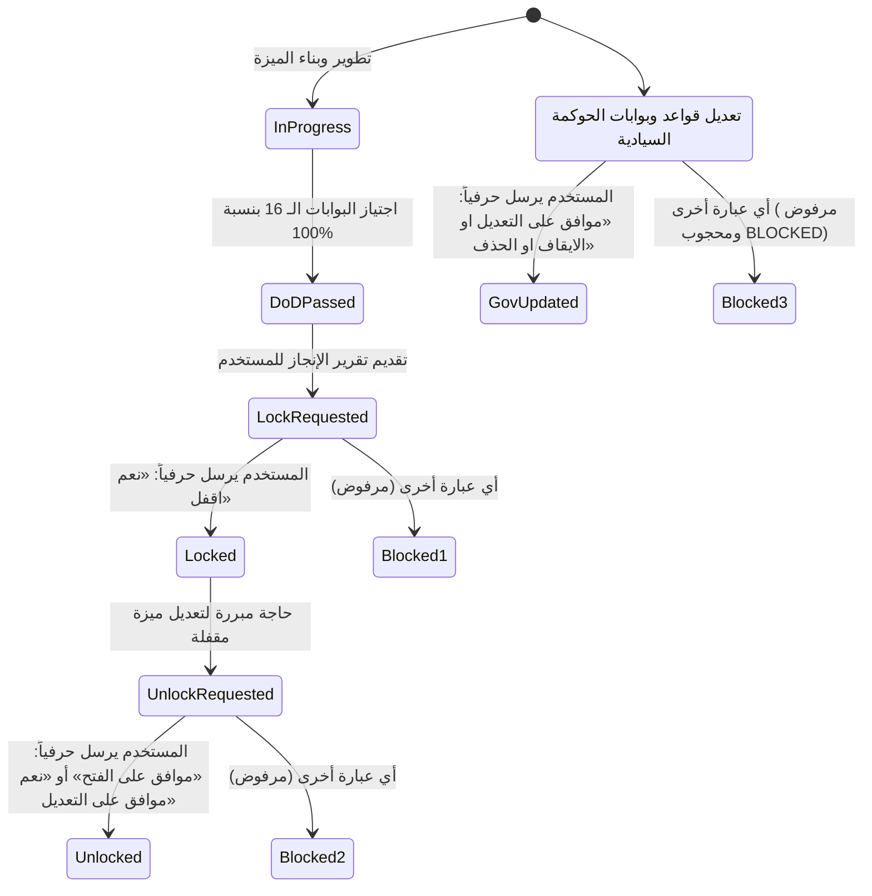

# 📜 دستور حوكمة الذكاء الاصطناعي وبوابات الجودة المؤسسية الموحدة
## 27 - Enterprise AI Governance, Cryptographic Rigor & Unified Quality Gates Master Constitution

> [!IMPORTANT]
> **المرجعية الدستورية العليا وحل أي تعارض (Supreme Constitutional SSOT):**  
> تمثل هذه الوثيقة **الدستور الشامل والنهائي الحاكم لكافة أعمال البرمجة، التطوير، المراجعة، الحوكمة، وبوابات الاعتماد في مشروع منظومة السعادة سمارت بوت**.  
> **أي تعارض أو تكرار أو صياغة مجتزأة بين هذه الوثيقة وأي وثيقة أقدم (بما فيها وثائق `00`، `14`، `15`، `21`) يُحسم لصالح هذه الوثيقة حصراً**. وتلتزم بها كافة أدوات ووكلاء الذكاء الاصطناعي والمطورين دون أي استثناء.

---

## 🧭 الفهرس العام للميثاق الدستوري
1. [الميثاق الأول: المرجعية الوظيفية الحرفية ومطابقة التوثيق الميداني](#1-الميثاق-الأول-المرجعية-الوظيفية-الحرفية-ومطابقة-التوثيق-الميداني)
2. [الميثاق الثاني: حوكمة التغيير وإلزامية خطط العمل المسبقة](#2-الميثاق-الثاني-حوكمة-التغيير-وإلزامية-خطط-العمل-المسبقة)
3. [الميثاق الثالث: الحصانة التشفيرية وصيغ الموافقة الحرفية الثلاثية](#3-الميثاق-الثالث-الحصانة-التشفيرية-وصيغ-الموافقة-الحرفية-الثلاثية)
4. [الميثاق الرابع: المنظومة الموحدة لبوابات الجودة الـ 16 (G1 إلى G16)](#4-الميثاق-الرابع-المنظومة-الموحدة-لبوابات-الجودة-الـ-16-g1-إلى-g16)
5. [الميثاق الخامس: التدابير والمقترحات الثمانية الملزمة لمحاصرة انحرافات الذكاء الاصطناعي](#5-الميثاق-الخامس-التدابير-والمقترحات-الثمانية-الملزمة-لمحاصرة-انحرافات-الذكاء-الاصطناعي)
6. [الميثاق السادس: العزل المعماري وحظر الدوال الموازية وسيادة النواة المشتركة](#6-الميثاق-السادس-العزل-المعماري-وحظر-الدوال-الموازية-وسيادة-النواة-المشتركة)
7. [الميثاق السابع: معايير تجربة المستخدم وهندسة البوت الميداني والشفافية](#7-الميثاق-السابع-معايير-تجربة-المستخدم-وهندسة-البوت-الميداني-والشفافية)
8. [الميثاق الثامن: النزاهة المالية والحسابية المغلقة ومنع الدبلرة](#8-الميثاق-الثامن-النزاهة-المالية-والحسابية-المغلقة-ومنع-الدبلرة)
9. [الميثاق التاسع: بروتوكول النقد الذاتي الحاد قبل التسليم النهائي](#9-الميثاق-التاسع-بروتوكول-النقد-الذاتي-الحاد-قبل-التسليم-النهائي)
10. [الميثاق العاشر: النظافة الشاملة للمستودع وحوكمة Git والشفافية عند التأجيل](#10-الميثاق-العاشر-النظافة-الشاملة-للمستودع-وحوكمة-git-والشفافية-عند-التأجيل)

---

## 1. الميثاق الأول: المرجعية الوظيفية الحرفية ومطابقة التوثيق الميداني

1. **المشروع المرجعي السابق (`F:\HR`) هو الأساس لكافة الوظائف والتدفقات الـ 126:**
   - مشروعنا السابق [`F:\HR`](file:///F:/HR) هو المرجع الحصري لكافة الوظائف والخيارات والشاشات وقواعد العمل المحاسبية.
   - **المطابقة في الوظائف وليس الأكواد القديمة (Functional Parity, Clean Architecture):**
     * جميع الوظائف المنفذة يجب أن تكون مطابقة تماماً لسلوكها، خياراتها، نتائجها، وحساباتها في النظام السابق.
     * يُحظر نقل الأكواد القديمة الترقيعية، بل يُلزم بناؤها وفق المعمارية الحديثة (Clean Architecture, Strict TypeScript 5.9+, Modular Engine).
2. **حظر تغيير خطوات التدفق أو الشاشات دون إذن صريح (Zero Unauthorized Flow Divergence):**
   - يُحظر تماماً على أي وكيل ذكاء اصطناعي تعديل أو اختصار أي خطوة في معالجات البوت، أو حذف أي خيار، أو تغيير تسلسل الشاشات من تلقاء نفسه.
   - **الاستثناء الحصري:** وجود **طلب وتوجيه صريح ومباشر من المستخدم (`Explicit User Request`)**. أي اجتهاد منفرد يُعد مخالفة جسيمة تسقط اعتماد الوظيفة فورياً بقرار `FAIL`.
3. **التوثيق الحتمي المتزامن ومكافحة الانحراف التوثيقي (`Zero Documentation Drift`):**
   - لا يُعتبر أي كود برمجي مكتملاً إلا بتحديث كافة الوثائق ذات الصلة في مجلد `docs/` وفهرس `README.md`.
   - التحديث الفوري والإلزامي لسجل الترحيل الرئيسي [`docs/19-legacy-to-enterprise-master-feature-migration-registry.md`](file:///F:/Alsaada-Smart-Bot/docs/19-legacy-to-enterprise-master-feature-migration-registry.md) إلى `🟢 مكتمل وموثق 100%` وتدوين مسار التدفق وتاريخ ورقم الـ Commit.
   - أي وظيفة مستحدثة تُقيد فوراً في قسم *"الوظائف والتحسينات المستحدثة (Novel Enterprise Features)"*.

---

## 2. الميثاق الثاني: حوكمة التغيير وإلزامية خطط العمل المسبقة

1. **القاعدة الحتمية الدائمة:**
   > **«دائماً العمل بيننا فقط عن طريق الخطط؛ أي تعديل يطلبه المستخدم أو سنقوم بتنفيذه لا بد أن يسبقه خطة موثقة بنفس المنهجية المطلوبة في `docs/work-plans/`، وهذه قاعدة إلزامية لا يوجد أي تعديلات إلا بوثيقة خطة عمل.»**
2. **بروتوكول مسودة الخطة والاعتماد:**
   - تُودع مسودة الخطة في `docs/work-plans/<number>-plan-<slug>.md` قبل البدء في التنفيذ.
   - توضح الخطة: نطاق العمل، الملفات المتأثرة بدقة، التصميم المعماري، بوابات الفحص، والجدول الزمني التتابعي.
   - تُحدث الخطة دورياً بتوثيق ما تم إنجازه وما تم تأجيله وأسباب التعديل بكل أمانة وشفافية.

---

## 3. الميثاق الثالث: الحصانة التشفيرية وصيغ الموافقة الحرفية الثلاثية

تخضع المنظومة لبروتوكول قفل تشفيري صارم تديره ملفات `governance.lock.json` وأداة `tools/governance/verify-governance-tamper.ts`.  
**يُحظر تماماً قبول أي عبارات مبهمة (مثل: "تمام", "نفذ", "موافق", "اوك", "توكل على الله")**، وتقتصر الموافقات حصراً على الصيغ الثلاث التالية:



1. **صيغة قفل الوظائف والميزات المنجزة تشفيرياً:**
   - بعد اجتياز الوظيفة لبوابات الفحص بنسبة 100%، يسأل الوكيل:  
     *«تم الانتهاء بنجاح من بناء واختبار وظيفة [اسم الوظيفة]. هل نقفل ونحمى هذه الوظيفة تشفيرياً ضد أي تعديل؟ لإتمام القفل، يرجى الرد بالصيغة المعتمدة حصراً: «نعم اقفل»»*.
   - **الصيغة الحصرية:** **«نعم اقفل»**.
2. **صيغة فك قفل ميزة مقفلة مسبقاً بغرض التعديل:**
   - يوضح الوكيل سبب التعديل وحدود الملفات المتأثرة، ويطلب الموافقة بالصيغة الحرفية:
   - **الصيغة الحصرية:** **«موافق على الفتح»** أو **«نعم موافق على التعديل»**.
3. **صيغة تعديل أو إيقاف أو تخفيف أي بوابة حوكمة أو ملف سيادي:**
   - يُحظر لمس ملفات الحوكمة (`AGENTS.md`, `GEMINI.md`, `docs/14`, `docs/15`, `docs/21`, `docs/27`, `package.json`, `tools/governance/`) إلا باستلام النص المطابق حرفياً:
   - **الصيغة الحصرية:** **«موافق على التعديل او الايقاف او الحذف»**.
   - في غياب هذا النص الحرفي، يُعامل الطلب كطلب محجوب `BLOCKED` ويمتنع الوكيل عن التعديل.

---

## 4. الميثاق الرابع: المنظومة الموحدة لبوابات الجودة الـ 16 (G1 إلى G16)

لا تنتقل أي وظيفة أو تدفق أو شاشة تحكم إلى حالة `Implemented` أو `UAT_PASS`، ولا يُقبل أي Commit، إلا بعد اجتياز **البوابات الـ 16 التالية بنسبة 100%**:

| البوابة | المسمى والهدف الهندسي الصارم | أداة التحقق الآلية الحاكمة | شروط الاجتياز الإلزامية | كود الفشل عند الخرق |
| :---: | :--- | :--- | :--- | :---: |
| **G1** | **العزل الموديولي والهيكلي** | `pnpm arch:verify` | • كافة ملفات التدفق داخل مجلدها المعتمد.<br>• الـ Handler <= 350 سطراً، الـ Service <= 500 سطر.<br>• خلو تام من أي نوع `any`.<br>• خلو الجذر من أي ملفات مؤقتة. | `ARCHITECTURE_FAIL` |
| **G2** | **سيادة العقود ومطابقة الترحيل** | `pnpm flow-contracts:verify`<br>`pnpm migration:verify` | • وجود `flow.contract.json` مكتمل.<br>• تطابق تام بين مسار التدفق وسجل الترحيل `docs/19`.<br>• حظر ظهور أي تدفق قيد التطوير في القوائم الحية. | `CONTRACT_FAIL` |
| **G3** | **حظر الازدواجية والدوال الموازية** | `pnpm arch:verify` | • الاستيراد الإلزامي لكافة المكونات من `packages/*`.<br>• **حظر إنشاء دوال محلية تلتف حول النواة**.<br>• إلزامية عرض اسم الشهرة (Nickname) حصراً للعمال. | `DUPLICATION_FAIL` |
| **G4** | **صلاحيات RBAC والحجب المسبق** | `pnpm rbac-matrix:verify` | • حظر عرض أي زر لمن لا يملك الصلاحية برمجياً قبل الإرسال.<br>• اختبار التدفق بكافة الأدوار السبعة للتأكد من الحجب. | `RBAC_FAIL` |
| **G5** | **عقود واجهات تليجرام القياسية** | `pnpm telegram-contracts:verify` | • الـ Callback Data <= 64 بايت (مفحوصة بالقِيَم الحقيقية).<br>• الـ URL <= 512 بايت بروتوكول مشفر `https`.<br>• شبكة الأزرار 2x2 وحظر أكثر من زرين للنصوص المركبة. | `TELEGRAM_CONTRACT_FAIL` |
| **G6** | **تجربة الاستخدام ومكافحة الطرق المسدودة** | `pnpm flow:check` | • هندسة الرسالة الواحدة الموضعية (`editMessageText`).<br>• الحذف الصامت الفوري لكافة مدخلات المستخدم النصية.<br>• زر رجوع إلزامي، ولوحة إتمام رباعية موحدة.<br>• حظر الأزرار القديمة وإزالتها فوراً (`Stale Guard`).<br>• رسائل الأخطاء التفاعلية وتوفير مسار إعادة المحاولة. | `UX_FAIL` |
| **G7** | **محاربة أنماط البطء (Zero-Latency)** | `pnpm latency:verify` | • الفحص الثابت لشجرة الـ AST لمنع `await deleteMessage`.<br>• حظر `await setMyCommands` أثناء معالجة الطلبات.<br>• الحذف في الخلفية غير المتزامنة لضمان استجابة < 50ms. | `LATENCY_FAIL` |
| **G8** | **النزاهة المالية وسلاسل HMAC** | `pnpm financial:verify` | • سلامة السلسلة التشفيرية (HMAC-SHA256) للنماذج الستة.<br>• اتزان العهد النقدية وحظر الأرصدة السالبة حظراً باتاً.<br>• ربط السلف بعهدة مفتوحة، وربط القيود العكسية بسند أصلي. | `FINANCIAL_INTEGRITY_FAIL` |
| **G9** | **حجب الحقول وحصانة السوبر أدمن** | `pnpm field-masking:verify` | • حجب الرواتب والبدلات عن مشرف الموقع `FIELD_ADMIN`.<br>• **الحصانة التامة للسوبر أدمن (Zero Masking):** فك تشفير وعرض الرقم القومي كاملاً (14 رقماً) والرواتب بلا حجب. | `FIELD_MASKING_FAIL` |
| **G10** | **حماية وعقود لوحة التحكم** | `pnpm dashboard-auth:verify` | • ربط صفحات الداشبورد بـ RBAC Middleware صارم.<br>• خلو مسارات التصدير من تسريب البيانات غير المصرح بها.<br>• مطابقة شاشة الداشبورد لعقد التدفق المقابل في البوت. | `DASHBOARD_AUTH_FAIL` |
| **G11** | **الرصد وتتبع الأخطاء الجنائية** | `pnpm observability:verify` | • خلو كود المسارات الحرجة من `console.error` واستخدام الـ Vault.<br>• حظر الـ Empty catch blocks نهائياً.<br>• إلزامية وجود `traceId` في كافة استدعاءات الـ API. | `OBSERVABILITY_FAIL` |
| **G12** | **الاختبارات الواقعية ومكافحة الـ Mocks** | `pnpm test` | • تغطية شاملة (Unit, Integration, UX, RBAC, Data).<br>• **حظر الـ Mocks الوهمية للمنطق المحاسبي**؛ تشغيل العمليات المالية على محرك قاعدة بيانات فعلي.<br>• اجتياز 100% من الاختبارات. | `TEST_FAIL` |
| **G13** | **التوثيق المتزامن ومكافحة الانحراف** | `pnpm docs:audit`<br>`pnpm docs:parity` | • تحديث وثائق `docs/` وسجل الترحيل `docs/19`.<br>• وجود ملف `flow.docs.md` كامل المواصفات وسيناريوهات الفحص.<br>• صفر فجوة توثيقية (`Zero Documentation Drift`). | `DOCS_FAIL` |
| **G14** | **ميزانية الأداء واستقرار الذاكرة** | `pnpm perf-budget:verify` | • سرعة استجابة الكاش والتليميتري ضمن حدود الـ SLA.<br>• إثبات تنظيف مسودات الجلسة المنتهية (TTL Cleanup). | `PERF_BUDGET_FAIL` |
| **G15** | **الحصانة التشفيرية وفحص العبث الارتدادي** | `pnpm governance:tamper-check` | • مطابقة بصمات SHA-256 في `governance.lock.json`.<br>• **فحص الارتداد التبعي:** التحقق من عدم كسر أي موديول مقفل نتيجة تعديل في النواة المشتركة أو الـ Schema. | `GOVERNANCE_TAMPER_FAIL` |
| **G16** | **الإثبات الجنائي المادي ونظافة المستودع** | `pnpm ai-compliance:verify`<br>`git status --short` | • تقرير إثبات إلزامي داخل `docs/ai-execution-evidence/`.<br>• إرفاق نتائج فحص البوابات الـ 16 بالأرقام والميلي ثانية.<br>• نظافة تامة لشجرة Git وتوثيق Commit بمعيار Conventional. | `GIT_AND_COMPLIANCE_FAIL` |

### أمر التحقق الشامل الموحد:
```bash
pnpm governance:verify
```
يُحظر تسليم أي مهمة دون نجاح هذا الأمر وخروجه بـ `Exit Code 0`.

---

## 5. الميثاق الخامس: التدابير والمقترحات الثمانية الملزمة لمحاصرة انحرافات الذكاء الاصطناعي

لمنع السلوكيات الاحتمالية والكسل البرمجي لدى وكلاء الذكاء الاصطناعي، تُفرض التدابير الثمانية التالية كقيود قطعية:

1. **بوابة كشف الكسل والرموز الترقيعية (Anti-Lazy Code Linter):**
   - يُحظر منعاً باتاً احتواء أي كود على تعليقات اختصارية مثل `// TODO`, `// FIXME`, `// ... rest of code`, `/* implement later */`.
   - يُمنع تقديم دوال فارغة `{}` أو تعيد قِيَماً صورية دون منطق عمل حقيقي.
2. **حظر حيل الهروب من التايب سكريبت (Strict Type Escapism Ban):**
   - يُحظر استخدام `// @ts-ignore`, `// @ts-nocheck`, `// @ts-expect-error`.
   - يُحظر التحويل المزدوج للأنواع (`as unknown as T`) ما لم يكن مرخصاً وموثقاً في العقد.
   - إلزامية استخدام Type Guards صريحة لفحص البيانات غير الموثوقة.
3. **التوكن الجنائي المشفر للأوامر (Cryptographic Execution Token):**
   - يُحظر ادعاء تشغيل الاختبارات كتابياً؛ يعتمد فاحص الحوكمة على قراءة ملف التشغيل الحقيقي الناتج من نظام التشغيل `.governance-cache/execution-token.json` الذي يثبت التشغيل الفعلي ومطابقة البصمة.
4. **ميثاق حق الفيتو المعماري للوكيل (Architectural Veto Protocol):**
   - يُلزم الوكيل برفض أي توجيه من المستخدم يكسر المعمارية أو يدبلر الحسابات أو يخالف المنهجية فورياً، مع تقديم البديل المعماري الصحيح للمستخدم. ولا يُكسر القيد إلا بموافقة صريحة: `موافق على التعديل او الايقاف او الحذف`.
5. **حارس ارتداد التبعيات المقفلة (Dependency Ripple & Blast Radius Guard):**
   - عند تعديل أي ملف في `packages/*` أو `prisma/schema.prisma`، يتم تشغيل اختبارات كافة الموديولات المقفلة تشفيرياً في `docs/26` للتأكد من عدم كسرها غير المباشر.
6. **سقف التعقيد الحسابي والتشعيبي (Cyclomatic Complexity Ceiling):**
   - الحد الأقصى لطول الدالة داخل `flow.service.ts` هو **50 سطراً**.
   - درجة التعقيد الحسابي (Cyclomatic Complexity) لا تتجاوز **<= 8** لكل دالة.
   - عمق تداخل الشروط لا يتجاوز **مستويين (Max Depth = 2)**.
7. **قفل الجلسات ونظافة الذاكرة الميدانية (Session State TTL & Hygiene):**
   - إلزامية تطبيق `cleanupDraft()` في كل معالج، وتعيين مدة انتهاء صلاحية (TTL) لا تتجاوز 30 دقيقة للمسودات المعلقة لمنع تسريب الذاكرة.
8. **نظام التجميد الذاتي والاعتراف الصريح (Two-Strike Circuit Breaker):**
   - في حال فشل الوكيل في حل خطأ برمجي بعد محاولتين متتاليتين، يُحظر عليه إجراء أي تعديل عشوائي إضافي، ويُلزم بالتوقف وإلغاء التغييرات وكتابة تقرير تشخيصي بالخلل الجذري للمستخدم.

---

## 6. الميثاق السادس: العزل المعماري وحظر الدوال الموازية وسيادة النواة المشتركة

1. **العزل الموديولي الرأسي الصارم (`Vertical Slice Isolation`):**
   - كل تدفق يعيش مستقلاً داخل مساره: `modules/<module-name>/src/flows/<flow-code>-<flow-slug>/`.
   - يُحظر تماماً فتح أو تعديل ملفات خارج الموديول المستهدف.
   - تطبيق `apps/bot-server` مخصص للتشغيل وتوجيه الأحداث العامة فقط؛ ويُحظر وضع أي منطق أعمال داخل `apps/bot-server/src/handlers`.
2. **حظر الدوال الموازية (Shadow Logic Ban):**
   - يُحظر كتابة أي دالة مساعدة محلية تلتف حول محركات النواة المشتركة أو تعيد صياغة منطق متاح في `@alsaada/core-components`.
   - الاستيراد الإلزامي لكافة المكونات: اختيار العمال، المبالغ ورادار التكرار، الكميات، التواريخ، المقاصة الثلاثية، صمام العهد، جدولة الأقساط، شريط مسار التتبع، والنوافذ المنبثقة.
3. **عرض اسم الشهرة حصراً (Mandatory Worker Nickname Display):**
   - تُلزم كافة القوائم وشاشات الأزرار التي تعرض العاملين بإظهار **اسم الشهرة (Nickname)** بدلاً من الاسم الكامل الرباعي عبر `getWorkerDisplayName` / `formatWorkerPickerLabel` (مع الاسم الرباعي كبديل احتياطي فقط).

---

## 7. الميثاق السابع: معايير تجربة المستخدم وهندسة البوت الميداني والشفافية

1. **هندسة الرسالة الواحدة والتنقل الموضعي (`In-Place Single Message Lifecycle`):**
   - كل خطوة تستبدل سابقتها في نفس الرسالة موضعياً (`editMessageText`) لمنع تراكم الرسائل.
   - **الحذف الصامت الفوري** لكافة رسائل ومدخلات المستخدم النصية.
   - زر الرجوع للخطوة السابقة (`[ ◀️ السابق ]`) إلزامي في كل خطوة بالمعالج.
2. **لوحة أزرار ما بعد الإنجاز الرباعية الموحدة:**
   يجب أن تحتوي الشاشة الختامية لأي عملية على الترتيب التالي حصراً:
   1. `[ 📲 إرسال إشعار / إيصال للعامل عبر واتساب ]` (عبر `buildWhatsAppLink`).
   2. `[ ➕ تسجيل عملية أخرى ]`.
   3. `[ 🔙 العودة لقسم الوظيفة ]`.
   4. `[ 🏠 القائمة الرئيسية ]`.
3. **حظر استجابة الأزرار القديمة (`Stale Button Guard`):**
   - إزالة لوحة الأزرار فوراً (`reply_markup: undefined`) وتنبيه المستخدم بنافذة منبثقة تفاعلية عند النقر على زر قديم.
4. **معالجة الأخطاء التفاعلية وخلو البوت من الطرق المسدودة (`Zero Deadlocks`):**
   - يُحظر إرسال أي رسالة خطأ دون لوحة أزرار تفاعلية تشمل: `[ 🔄 إعادة المحاولة ]`، `[ ◀️ رجوع للخطوة السابقة ]`، و `[ 🏠 القائمة الرئيسية ]`.
5. **دستور مصفوفة الأزرار وشبكة التبويبات الثنائية (2x2 Grid):**
   - حظر وضع أكثر من زرين في الصف الواحد للنصوص العربية المركبة.
   - الالتزام بالشبكة الثنائية المتوازنة `2x2 Grid` في بطاقات العرض وقوائم التبويب.
6. **المعيار الإلزامي للتواريخ:**
   - التوثيق والعرض والحفظ بصيغة **`DD-MM-YYYY`** حصراً، مع المعالجة المرنة عبر `parseFlexibleDate`.
7. **تنقية الواجهات من الأوصاف التقنية (`Zero Developer Fluff`):**
   - حظر ذكر أي مصطلحات برمجية للمستخدم (مثل Redis, Blind Index, Atomic Transaction).
8. **الشفافية التامة للسوبر أدمن (`Zero Masking for Super Admin`):**
   - حظر وضع نجوم أو رموز قفل أمام السوبر أدمن؛ عرض الرقم القومي كاملاً (14 رقماً) والرواتب وأرقام المحافظ صريحة ومكشوفة 100%.

---

## 8. الميثاق الثامن: النزاهة المالية والحسابية المغلقة ومنع الدبلرة

1. **منع دبلرة وتضخيم المصروفات:**
   - تحويلات العهد النقدية من بنك الشركة إلى المشرفين هي تحويلات أصول داخلية وأثرها على الأرباح والمصروفات = 0%. المصروف يُقيد حصراً عند الصرف الفعلي في الموقع مقابل خدمة أو سلعة.
2. **التقسيم الثلاثي الإلزامي للمسحوبات:**
   - مسحوبات السجائر (عينية، مخزون كانتين، 0 كاش، مقاصة تخفيض تكلفة الموقع).
   - مسحوبات المشتريات العينية (مقترحات ذكية، 0 كاش، مقاصة تخفيض مشتريات الموردين).
   - السلف النقدية (تحديد مصدر الأموال، فحص كفاية رصيد العهدة، خروج نقدية فعلي).
3. **حظر المزامنة اللحظية المباشرة مع Google Sheets:**
   - قاعدة البيانات المحلية هي مصدر الحفظ الفوري السريع (< 15ms)، وعمليات الترحيل الخارجي لـ Google Sheets تُدار كأحداث خلفية عبر طابور المزامنة الصامت [`TransactionalOutboxQueue`](file:///F:/Alsaada-Smart-Bot/packages/core-components).

---

## 9. الميثاق التاسع: بروتوكول النقد الذاتي الحاد قبل التسليم النهائي

قبل تسليم أي نتيجة نهائية (كود، خطة، تعديل معماري)، يلتزم الوكيل بالمرور الإلزامي بـ 3 مراحل:
1. **المسودة الأولية (Initial Hypothesis):** بناء الحل المبدئي بدقة.
2. **تقمص دور خبير المجال والنقد الحاد (Adversarial Critique):** توجيه نقد تحليلي لاذع لكشف الثغرات الخفية، اختناقات الأداء، تكرار الكود، وثغرات النزاهة المالية.
3. **التحصين والتسليم النهائي (Hardened Final Delivery):** معالجة كافة الثغرات المكتشفة وتقديم الحل النهائي المحصن مع توثيق أسباب التحسين.

---

## 10. الميثاق العاشر: النظافة الشاملة للمستودع وحوكمة Git والشفافية عند التأجيل

1. **نظافة المسار الرئيسي ومنع التلوث (`Root Cleanliness`):**
   - يُحظر تماماً إنشاء أو ترك أي ملفات اختبارية أو سكريبتات تجريبية مؤقتة في المسار الرئيسي (`Root`).
   - كل ملف له مساره الدائم والصارم حصراً داخل موديوله أو حزمته.
2. **الشفافية الصارمة عند التأجيل:**
   > **«دائماً يجب أن يبقى المشروع نظيفاً ومتبعاً للمنهجية بشكل كامل، وفي حالة تأجيل أي شيء يجب التنبيه على ذلك بشكل واضح وظاهر وتوثيق ذلك في التوثيقات بدون أي تكاسل عن ذلك.»**
3. **حوكمة Git ونظافة شجرة العمل:**
   - الالتزام بنظام `Conventional Commits` (`feat:`, `fix:`, `docs:`, `refactor:`).
   - خلو شجرة العمل من أي تعديلات معلقة أو ملفات غير متتبعة (`git status --short`).

---

> [!NOTE]
> **إعلان السيادة والنسخ الدستوري:**  
> تم اعتماد هذه الوثيقة رسمياً بتاريخ 17-09-2026 كدستور موحد وحاكم لجميع وكلاء الذكاء الاصطناعي والمطورين، وتعتبر ناسخة ومصححة لأي نصوص سابقة تخالفها في المشروع.
