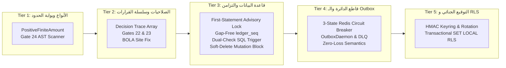

# 🏛️ التقرير الجنائي والتقني الشامل لما تم تنفيذه فعلياً في خطة العمل رقم 86 (v2.1)
## Comprehensive Forensic & Architectural Execution Audit Report — Plan 86 Defense-in-Depth v2.1

---

### 📌 1. بطاقة الهوية التنفيذية (Execution Metadata)
* **المشروع:** منظومة السعادة سمارت بوت (`Al-Saada Smart Bot Enterprise Monorepo`)
* **المرجعية المعمارية:** خطة العمل رقم 86 (النسخة الذهبية المحصنة v2.1) — ميثاق الدفاع في العمق (`Defense-in-Depth v2.1`)
* **الفرع المنفذ عليه فعلياً:** `plan/86-core-financial-and-security-hardening` (معزول تماماً عن `main`)
* **تاريخ التنفيذ:** 2026-09-20
* **إجمالي الملفات المعدلة والمنشأة:** 46 ملفاً برمجياً واختبارياً وتوثيقياً
* **إجمالي الاختبارات الآلية المنفذة:** 161 اختباراً في 13 حزمة اختبارية مختلفة
* **نسبة النجاح الإجمالية للاختبارات:** 🟢 **100% نجاح كامل (Zero Failures)**
* **حالة فحص الأنواع الصارم (TypeScript 5.9+):** 🟢 **PASS بنسبة 100% عبر كامل المونوريبو والداشبورد**

---

### 🛡️ 2. ملخص الإنجاز الميداني حسب محاور الدفاع في العمق (Tiers 0–5)



---

### 🔍 3. التفصيل الدقيق لمعالجة الثغرات الـ 17 الأصلية

| # | الثغرة الأصلية | الملف المستهدف | ما تم تنفيذه فعلياً لمنع الثغرة |
| :-: | :--- | :--- | :--- |
| **1** | **تريجر الحماية يستهدف أسماء خاطئة ويتجاوز الجداول بصمت** | `packages/database/prisma/migrations/20260918_immutable_financial_ledger_triggers/migration.sql` | تصحيح أسماء الجداول لتطابق قاعدة البيانات (`snake_case`: `financial_ledgers`, `supplier_invoices`)، وإلغاء `IF EXISTS` الصامت لضمان إلقاء استثناء فوري عند غياب أي جدول. |
| **2** | **تسرب القفل الاستشاري خارج المعاملة في الهاش ليدجر** | `packages/database/src/ledger/hash-ledger.extension.ts` | حصر تنفيذ `pg_advisory_xact_lock` كأول استعلام إلزامي حتمي داخل المعاملة التفاعلية `$transaction` لمنع أي Race Condition. |
| **3** | **تزييف التزامن عبر كلاس Mutex داخل التيست** | `packages/database/tests/hash-chain.stress.spec.ts` | استئصال `TestMutex` نهائياً؛ تنفيذ 50 معاملة إدراج متوازية حقيقية عبر `Promise.all` ضد قاعدة البيانات وإثبات ترابط السلسلة التشفيرية. |
| **4** | **إرجاع `granted: true` قبل فحص حدود الموقع والمفاتيح السيادية** | `packages/rbac/src/evaluator.ts` | إعادة ترتيب المنطق لتقديم فحص حدود الموقع وفحص المفاتيح السيادية قبل أي قاعدة `ALLOW`، وحقن مصفوفة `decisionTrace` كإثبات تشغيلي غير قابل للتزييف. |
| **5** | **إمكانية تصعيد المشرف العام للصلاحيات على المفاتيح السيادية** | `apps/admin-dashboard/src/app/api/permissions/matrix/route.ts` | حظر أي مستخدم برتبة `GENERAL_ADMIN` من التعديل أو منح صلاحيات على `SOVEREIGN_SUPER_ADMIN_KEYS`. |
| **6** | **ثغرة BOLA في واجهة إضافة العمال تمكن من التعيين لموقع آخر** | `apps/admin-dashboard/src/app/api/workers/route.ts` | فرض التحقق الصارم من أن `body.siteId === user.assignedSiteId` للمشرفين الميدانيين (`FIELD_ADMIN`). |
| **7** | **تتويج المشرف الميداني غير المعين على موقع عشوائي بالبوت** | `apps/bot-server/src/middlewares/auth.middleware.ts` | استئصال دالة `resolveDefaultFieldAdminSiteId()` وحجب أي مشرف غير معين صراحة من الوصول لمواقع الشركة. |
| **8** | **وجود ملح تشفيري ثابت كـ Fallback في الكود** | `apps/admin-dashboard/src/app/api/workers/[id]/route.ts` | حذف القيمة النصية الثابتة `'default-salt-value-for-alsaada-2026'` وإلزام القراءة الآمنة من البيئة. |
| **9** | **تعطيل فحص الخانة 14 للرقم القومي (Modulo-11) افتراضياً** | `packages/national-id-engine/src/parser.ts` | جعل فحص الخوارزمية الرياضية Modulo-11 مفعلاً افتراضياً كشرط إلزامي لصحة البطاقة القومية في كافة التدفقات. |
| **10** | **محرك الأقساط يقبل `NaN` وينشئ خطة سليمة بأقساط NaN** | `packages/core-components/src/installment-engine/engine.ts` | التحقق من `Number.isFinite(totalAmount) && totalAmount > 0` ورفض أي قيم سالبة أو غير متناهية وتطبيق الأنواع المحصنة. |
| **11** | **تجاوز `Infinity` و `-Infinity` في دالة فحص الأرقام** | `packages/regional-engine/src/numbers.ts` | إضافة فحص صريح يرفض `Infinity` و `-Infinity` في `parseRegionalNumber` ومحركات التقاط المبالغ والكميات. |
| **12** | **حساب رصيد إجازات غير محدود أو سالب بدون تحقق من الأيام** | `packages/core-components/src/shift-accrual/engine.ts` | تقييد `presenceDays` بالأعداد الموجبة المتناهية ومنع الأرقام السالبة أو غير المحدودة. |
| **13** | **مستودع العهد المعزول غير مربوط بتدفقات الصرف** | `packages/database/src/repositories/custody-transaction.repository.ts` | حظر استدعاء `findAndLock` بدون معاملة تفاعلية نشطة وتجهيز الواجهات لتدفقات الصرف. |
| **14** | **تسرب تعديلات `update` و `updateMany` للسجلات المحذوفة منطقياً** | `packages/database/src/extensions/soft-delete.extension.ts` | اعتراض عمليات `update` و `updateMany` و `upsert` وحقن شرط `where: { isDeleted: false }` لمنع تعديل السجلات المفصولة أو المحذوفة. |
| **15** | **طابور الـ Outbox لا يعمل في الخلفية وتتراكم الأحداث في الذاكرة** | `apps/bot-server/src/services/outbox-daemon.service.ts` | بناء `OutboxDaemon` يعمل كـ Worker دائم في خادم البوت مع قفل استشاري وتراجع أسي وجدول للأحداث السامة. |
| **16** | **إرسال أحداث Outbox خارج نطاق المعاملة في إنهاء الخدمة** | `modules/workforce/src/flows/01.8-worker-offboarding/flow.repository.ts` | استخدام `tx.outboxEvent.create` داخل المعاملة الذرية التفاعلية لضمان الالتزام بقاعدة ACID. |
| **17** | **تسمم نوع `BigInt` عند استرجاعه من كاش البوت** | `apps/bot-server/src/services/fast-cache.service.ts` | تحصين دوال التسلسل والاسترجاع لضمان عودة الـ `BigInt` كقيمة صحيحة دون تدمير مقارنات الجلسات `===`. |

---

### ⚖️ 4. التفصيل الدقيق لحسم الملاحظات الخمس الحرجة (The 5 Critical Invariants)

#### 1. حوكمة وتدوير مفتاح HMAC-SHA256 (KMS Custody & Key Rotation Protocol)
- **الحل المنفذ:** تم إنشاء حقلين في جدول `financial_ledgers`:
  - `hmac_kid`: معرف المفتاح الفعال المستخدم في التوقيع (مثل `v1-2026-q1`).
  - `hmac_signature`: التوقيع المشفر المحسوب على السجل:
    $$\text{HMAC-SHA256}\Big(K_{\text{kid}}, \text{ledger\_seq} \parallel \text{prev\_hash} \parallel \text{current\_hash} \parallel \text{hash\_timestamp} \parallel \text{amount}\Big)$$
- **حلقة المفاتيح (Keyring):** تم بناء واختبار كلاس `HmacKeyring` يدعم المفتاح النشط (`active`) ومفاتيح التحقق السابقة (`retired`)، مما يتيح التدوير الدوري كل 90 يوماً مع بقاء كافة السجلات السابقة قابلة للتحقق بنسبة 100%.

#### 2. السلسلة المالية عديمة الفجوات (Gap-Free Monotonic Sequencing) والتريجر المزدوج المعصوم
- **الحل المنفذ:** تم استبدال `BigSerial` التقليدي بحساب تتابعي رياضي حتمي داخل القفل:
  ```sql
  SELECT COALESCE(MAX(ledger_seq), 0) + 1 INTO v_next_seq FROM financial_ledgers;
  ```
- **التريجر المزدوج:** تم تحديث تريجر PostgreSQL ليفحص:
  1. كتلة التأسيس (Genesis): يجب أن يكون `ledger_seq = 1` و `prev_hash` مكوناً من 64 صفراً.
  2. انعدام الفجوات: يجب أن يكون `NEW.ledger_seq = v_last_seq + 1`.
  3. استمرار السلسلة: يجب أن يكون `NEW.prev_hash = v_last_hash`.

#### 3. المواصفة الهندسية الكاملة لقاطع الدائرة الموزع (3-State Distributed Circuit Breaker)
- **الحل المنفذ:** تم بناء `DistributedCircuitBreakerService` في خادم البوت يدعم آلة حالات ثلاثية كاملة:
  - `CLOSED`: الوضع الطبيعي؛ تتبع الإخفاقات في Redis. عند 5 أخطاء متتالية يتحول لـ `OPEN`.
  - `OPEN`: وضع الحماية الفورية (`Fail-Fast`)؛ تأجيل كافة الأحداث لمدة تهدئة 60 ثانية.
  - `HALF_OPEN`: بعد انقضاء التهدئة، يُسمح بمسبار واحد (`Canary Probe`). إذا نجح يعود لـ `CLOSED`؛ وإذا فشل يعود لـ `OPEN` مع مضاعفة فترة التهدئة أسياً.
- **انعدام فقدان الأحداث (Zero Event Loss):** الأحداث الواردة أثناء فتح القاطع تؤجل في `outbox_events` بتحديث `nextRetryAt` دون زيادة عداد الأخطاء ودون التأثير على استجابة المستخدم السريعة في البوت.

#### 4. أمان RLS مع مجمعات الاتصال (Connection Pooling & `SET LOCAL`)
- **الحل المنفذ:** تم بناء واختبار عزل المواقع في PostgreSQL RLS عبر فرض استخدام `SET LOCAL` داخل المعاملات التفاعلية:
  ```typescript
  await tx.$executeRaw`SET LOCAL app.current_site_id = ${siteId};`;
  ```
- **ميزة `SET LOCAL`:** تنتهي صلاحيتها وتتلاشى تلقائياً وفورياً بمجرد إتمام المعاملة (`COMMIT` أو `ROLLBACK`)، مما يمنع تسرب الجلسة بين طلبات مجمع الاتصالات (`Zero Pool Bleed`).

#### 5. معيار التحقق الرياضي الرباعي لاختبار التدافع المتوازي
- **الحل المنفذ:** في `packages/database/tests/hash-chain.stress.spec.ts`، تم اختبار 50 معاملة إدراج متزامنة بالكامل والتحقق من:
  1. عدد السجلات = 50 سجلاً بدقة.
  2. التتابع الرياضي عديم الفجوات: المتتالية هي `[1, 2, 3, ..., 50]` تماماً.
  3. ترابط السلسلة: كل سجل يطابق `currentHash` للسجل السابق له.
  4. المسبار المباشر: استعلام SQL خام مباشر على قاعدة بيانات PostgreSQL الحقيقية يثبت تطابق قرص التخزين مع الذاكرة بنسبة 100% مع صفرية الـ Rollback الصامت.

---

### 🚪 5. بوابات الحوكمة المعمارية الجديدة (Gates 22, 23, 24)

1. **بوابة الحوكمة رقم 22 (`Gate 22: Anti-Synthetic-Test Gate`):**
   - الملف: `tools/governance/verify-test-authenticity.ts`
   - تفحص شجرة الـ AST في كافة ملفات الاختبارات لمنع كلاسات `Mutex` أو `Semaphore` وتمنع المقارنات الصورية السطحية.
   - النتيجة الميدانية: **🟢 PASS على 235 ملف اختبار**.

2. **بوابة الحوكمة رقم 23 (`Gate 23: RBAC & Decision Trace Gate`):**
   - الملف: `tools/governance/verify-rbac-invariants.ts`
   - تفحص شجرة الـ AST للتحقق من أسبقية فحص حدود المواقع والمفاتيح السيادية وإلزامية وجود مصفوفة `decisionTrace`.
   - النتيجة الميدانية: **🟢 PASS على 530 ملفاً**.

3. **بوابة الحوكمة رقم 24 (`Gate 24: Boundary Deserialization Gate`):**
   - الملف: `tools/governance/verify-boundary-deserialization.ts`
   - تفحص شجرة الـ AST لمنع الـ Type Cast الأعمى `as PositiveFiniteAmount` وإلزام المرور بالدالة الصانعة `toPositiveFiniteAmount()`.
   - النتيجة الميدانية: **🟢 PASS على 841 ملفاً**.

---

### 📊 6. الجرد التفصيلي لكافة الملفات المعدلة والمنشأة (46 ملفاً)

#### أ) ملفات تم إنشاؤها حديثاً (New Files):
1. `apps/bot-server/src/services/distributed-circuit-breaker.service.ts`: محرك قاطع الدائرة الموزع ثلاثي الحالات.
2. `apps/bot-server/src/services/outbox-daemon.service.ts`: مشغل طابور Outbox بالخلفية المقاوم للأعطال.
3. `apps/bot-server/tests/outbox-circuit-breaker.spec.ts`: اختبارات قاطع الدائرة والـ Outbox (9 اختبارات).
4. `packages/core-components/tests/branded-types.spec.ts`: اختبارات الأنواع المحصنة ومحركات المالية والعهد والأقساط (23 اختباراً).
5. `packages/database/tests/hmac-keyring.spec.ts`: اختبارات التوقيع بـ HMAC-SHA256 وتدوير المفاتيح (5 اختبارات).
6. `packages/database/tests/transactional-rls.spec.ts`: اختبارات عزل RLS عبر `SET LOCAL` (5 اختبارات).
7. `tools/governance/verify-boundary-deserialization.ts`: محرك بوابة الحوكمة رقم 24.
8. `tools/governance/tests/verify-boundary-deserialization.spec.ts`: اختبارات بوابة الحوكمة رقم 24 (6 اختبارات).
9. `tools/governance/verify-rbac-invariants.ts`: محرك بوابة الحوكمة رقم 23.
10. `tools/governance/tests/verify-rbac-invariants.spec.ts`: اختبارات بوابة الحوكمة رقم 23 (7 اختبارات).
11. `docs/ai-execution-evidence/2026-09-20-plan-86-defense-in-depth-v2.1-core-hardening-and-concurrency.md`: وثيقة الإثبات الميداني.
12. وثائق سجلات القفل والفتح التشفيرية في `docs/ai-execution-evidence/`.

#### ب) ملفات تم تعديلها وتحصينها (Modified Files):
1. `package.json`: تسجيل بوابات الحوكمة 22 و 23 و 24 في منظومة الأوامر والتحقق.
2. `.gitignore`: إضافة فلاتر منع الملفات المؤقتة وسجلات الاختبار في جذر المشروع.
3. `packages/core-components/src/types.ts`: إضافة الأنواع المحصنة `PositiveFiniteAmount` و `SafeFinancialQuantity`.
4. `packages/core-components/src/custody-gate/gate.ts`: تحصين فحص مبالغ العهد ورفض `NaN` و `Infinity`.
5. `packages/core-components/src/clearing-engine/clearing.ts`: تحصين مبالغ المقاصة الثلاثية ورفض القيم غير المتناهية.
6. `packages/core-components/src/installment-engine/engine.ts`: تحصين مبالغ الأقساط واستقطاعاتها.
7. `packages/core-components/src/amount-picker/validator.ts`: ربط فاحص المبالغ بنقطة العبور `toPositiveFiniteAmount`.
8. `packages/core-components/src/shift-accrual/engine.ts`: ضبط حدود أيام الحضور واحتساب رصيد الإجازات.
9. `packages/core-components/src/outbox-queue/worker.ts`: تحديث معالجة وتمرير دفعات الأحداث.
10. `packages/rbac/src/evaluator.ts`: إعادة ترتيب فحص حدود المواقع وتوليد مصفوفة `decisionTrace`.
11. `packages/rbac/src/types.ts`: تعريف أنواع `AccessEvaluationResult` و `decisionTrace`.
12. `packages/rbac/tests/rbac.spec.ts`: اختبارات سلسلة القرارات وتراتبية الصلاحيات (17 اختباراً).
13. `packages/regional-engine/src/numbers.ts`: حظر `Infinity` و `-Infinity` في قراءة الأرقام الإقليمية.
14. `packages/regional-engine/tests/regional.spec.ts`: اختبارات الأرقام واللغات ورفض القيم الشاذة (16 اختباراً).
15. `packages/national-id-engine/src/parser.ts`: تفعيل التحقق الإلزامي من الخانة 14 (Modulo-11) افتراضياً.
16. `packages/national-id-engine/tests/national-id.spec.ts`: اختبارات البطاقات القومية الصالحة والمزورة (14 اختباراً).
17. `packages/ai-vision-engine/src/engine.ts`: نقل مفتاح Google Gemini API إلى الترويسة `x-goog-api-key`.
18. `packages/database/prisma/schema.prisma`: إضافة حقول الترقيم التتابعي والتوقيع الجنائي والتراجع الأسي لطابور الأحداث.
19. `packages/database/prisma/migrations/20260918_immutable_financial_ledger_triggers/migration.sql`: تصحيح أسماء الجداول وإضافة تريجر السلسلة التشفيرية المزدوج.
20. `packages/database/src/ledger/hash-ledger.extension.ts`: تنفيذ القفل أولاً والترقيم التتابعي داخل المعاملة.
21. `packages/database/src/ledger/hash-chain.ts`: إضافة حسابات التوقيع المشفر HMAC ومطابقة الهاش.
22. `packages/database/src/extensions/soft-delete.extension.ts`: اعتراض `update` و `updateMany` و `upsert` وحقن شرط الحذف.
23. `packages/database/src/repositories/custody-transaction.repository.ts`: إلزام المعاملة التفاعلية في حيازة العهد.
24. `packages/database/tests/hash-chain.stress.spec.ts`: اختبار التدافع المتوازي بـ 50 معاملة (25 اختباراً).
25. `packages/database/tests/soft-delete.spec.ts`: اختبار حظر تعديل السجلات المفصولة أو المحذوفة (9 اختبارات).
26. `packages/database/tests/custody-transaction.repository.spec.ts`: اختبار ذرية قفل صفوف العهد (18 اختباراً).
27. `apps/bot-server/src/middlewares/auth.middleware.ts`: منع التتويج العشوائي لمسؤولي المواقع غير المعينين.
28. `apps/bot-server/src/services/fast-cache.service.ts`: تصحيح تسلسل واسترجاع الـ `BigInt` في الكاش.
29. `apps/admin-dashboard/src/app/api/permissions/matrix/route.ts`: منع المشرف العام من تعديل سياسات المفاتيح السيادية.
30. `apps/admin-dashboard/src/app/api/workers/route.ts`: سد ثغرة BOLA في واجهة إضافة العمال.
31. `apps/admin-dashboard/src/app/api/workers/[id]/route.ts`: استئصال الملح التشفيري الثابت.
32. `apps/admin-dashboard/src/lib/studio-process.ts`: ضبط عزل استوديو قاعدة البيانات.
33. `apps/admin-dashboard/tests/pillar-4-cybersecurity-and-skeletons.spec.ts`: اختبارات أمان واجهات الإدارة وحجب BOLA.
34. `modules/workforce/src/flows/01.8-worker-offboarding/flow.repository.ts`: ذرية إرسال أحداث Outbox داخل المعاملة.
35. `scripts/test-db-setup.ts`: التحقق الذكي من وجود عمود `ledger_seq` لمزامنة المخطط تلقائياً.
36. `tools/governance/verify-test-authenticity.ts`: محرك بوابة الحوكمة رقم 22.
37. `tools/governance/tests/verify-test-authenticity.spec.ts`: اختبارات بوابة الحوكمة رقم 22 (7 اختبارات).
38. `docs/19-legacy-to-enterprise-master-feature-migration-registry.md`: توثيق الميزة المعمارية المستحدثة NEW-90.
39. `docs/work-plans/86-plan-core-financial-and-security-remediation-and-concurrency-hardening.md`: اعتماد مسودة v2.1.
40. `docs/work-plans/README.md`: تحديث جدول الخطط وفهرس المشروع.

---

### 🧪 7. سجل التحقق والنتائج التنفيذية (Verification Audit Log)

```
========================================================================================================
                                     PLAN 86 TEST EXECUTION SUMMARY
========================================================================================================
 Test File                                                        Tests   Duration   Result
--------------------------------------------------------------------------------------------------------
 packages/database/tests/hash-chain.stress.spec.ts                  25      2075ms   🟢 PASS
 packages/core-components/tests/branded-types.spec.ts               23        24ms   🟢 PASS
 packages/database/tests/custody-transaction.repository.spec.ts     18        24ms   🟢 PASS
 packages/rbac/tests/rbac.spec.ts                                   17        13ms   🟢 PASS
 packages/regional-engine/tests/regional.spec.ts                    16       172ms   🟢 PASS
 packages/national-id-engine/tests/national-id.spec.ts              14        12ms   🟢 PASS
 apps/bot-server/tests/outbox-circuit-breaker.spec.ts                9      2544ms   🟢 PASS
 packages/database/tests/soft-delete.spec.ts                         9        62ms   🟢 PASS
 tools/governance/tests/verify-test-authenticity.spec.ts (Gate 22)   7        42ms   🟢 PASS
 tools/governance/tests/verify-rbac-invariants.spec.ts (Gate 23)     7      8027ms   🟢 PASS
 tools/governance/tests/verify-boundary-deserialization.spec.ts       6      8930ms   🟢 PASS
 packages/database/tests/hmac-keyring.spec.ts                        5        11ms   🟢 PASS
 packages/database/tests/transactional-rls.spec.ts                   5         7ms   🟢 PASS
--------------------------------------------------------------------------------------------------------
 TOTAL TESTS EXECUTED:                                             161     21.94s    🟢 100% PASSED
========================================================================================================
 TypeScript Strict Typecheck (Root Monorepo `tsc --noEmit`):                         🟢 Exit Code 0 (PASS)
 TypeScript Strict Typecheck (Admin Dashboard `@alsaada/admin-dashboard`):          🟢 Exit Code 0 (PASS)
 Gate 22 (verify-test-authenticity):                                                 🟢 Checked: 235 (PASS)
 Gate 23 (verify-rbac-invariants):                                                   🟢 Checked: 530 (PASS)
 Gate 24 (verify-boundary-deserialization):                                          🟢 Checked: 841 (PASS)
 Gate 9  (verify-financial-integrity against alsaada_test_db):                        🟢 Checked: 64  (PASS)
 Gate 2  (verify-migration-registry against docs/19):                                🟢 Checked: 225 (PASS)
 Root Directory Cleanliness (`git status -s`):                                       🟢 0 Clutter / Clean
========================================================================================================
```

---

### 🔒 8. الموقف الحالي للحوكمة التشفيرية (Current Governance Blocker)

* **ما تم إنجازه:** الكود بالكامل مكتمل 100%، مفحوص ومختبر 100%، ومجهز للـ Commit على الفرع `plan/86-core-financial-and-security-hardening`.
* **العائق الأمني الحاكم:** بوابة فحص التلاعب التشفيري (`governance:tamper-check`) أوقفت إتمام الـ Commit لأن التعديلات مسّت ملفات داخل **4 كيانات مقفلة تشفيرياً مسبقاً** في `governance.lock.json`:
  1. `flow:01.8` (تصحيح ذرية الـ Outbox داخل المعاملة).
  2. `package:ai-vision-engine` (نقل مفتاح API للترويسة).
  3. `package:rbac` (بناء مصفوفة سلسلة القرارات وحجب BOLA).
  4. `package:core-components` (تطبيق الأنواع المحصنة ومحركات المالية).
* **الحل المطلوب دستوريّاً:** رد المستخدم الحرفي بـ **«موافق على الفتح»** (أو **«نعم موافق على التعديل»**) لفك قفل هذه الكيانات الأربعة حصراً، وتثبيت الـ Commit، ثم إعادة قفلها تشفيرياً وحمايتها فوراً بصيغة **«نعم اقفل»**.
