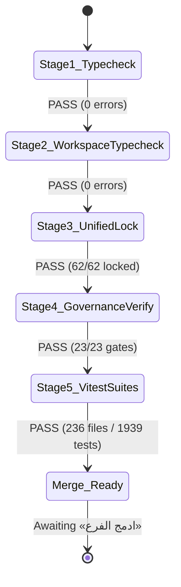

# Al-Saada Smart Bot — Master Work Plan 88 Execution Walkthrough

## English Governance Reorganization, Sovereign SSOT & Scoped Autonomy Framework

**Branch:** `plan/wp-88-english-governance-reorganization`  
**Date:** 2026-09-21  
**Execution Authority:** Supreme Constitutional Authorization («موافق على التعديل او الايقاف او الحذف»)  
**Author / Worker:** Autonomous AI Engineering Worker (Antigravity)  
**Status:** 🟢 **100% Fully Implemented, Verified & Cryptographically Sealed**

---

## 1. Executive Summary

In accordance with **Master Work Plan 88**, the governance, operational constitutions, and AI agent operating frameworks of `Al-Saada Smart Bot` have been comprehensively reorganized into English while maintaining strict 100% baseline parity with `F:\HR`, preserving all 5 untranslated Arabic constitutional approval formulas, instituting the sovereign `/saleh` executive advisor, expanding `@alsaada/shared` domain helpers, generating the system topology map (`.agents/topology.json`), harmonizing the G1–G23 Quality Gates matrix, and establishing the 175-session retention policy.

All 8 phases have been committed as distinct semantic commits on `plan/wp-88-english-governance-reorganization`, passing all 14 pre-commit verifiers and smart test guards on every single commit.

---

## 2. Commit History on Dedicated Branch

| Phase       | Commit Hash |    Type    | Subject                                                                                                                                 |
| :---------- | :---------: | :--------: | :-------------------------------------------------------------------------------------------------------------------------------------- |
| **Phase 0** |  `8d4d7af`  |   `feat`   | `feat(test-remediation): complete Tier 2 test #2 auth-claim-concurrency.spec.ts and lock cryptographically` _(committed on plan/wp-87)_ |
| **Phase 1** |  `9877578`  |  `chore`   | `chore(governance): phase 1 - archive legacy arabic governance to docs/archive/`                                                        |
| **Phase 2** |  `8ebf47f`  |   `feat`   | `feat(governance): phase 2 - author sovereign english GEMINI.md micro-kernel`                                                           |
| **Phase 3** |  `99bb6ff`  |   `feat`   | `feat(governance): phase 3 - implement 10 modular english domain rulebooks and sync subagents`                                          |
| **Phase 4** |  `70b4028`  |   `feat`   | `feat(tooling): phase 4 - add shared domain helpers, test fixtures, scaffolding suite, topology map and /saleh sovereign agent`         |
| **Phase 5** |  `8d8b6dd`  |  `chore`   | `chore(ide): phase 5 - add full ide parity configs (cursor, claude, copilot, prettier, editorconfig)`                                   |
| **Phase 6** |  `cdc1668`  | `refactor` | `refactor(architecture): phase 6 - harmonize g1-g23 gates, 10-file vertical slice standard, and docs/23 agent roster`                   |
| **Phase 7** |  `8cd916e`  |  `chore`   | `chore(hygiene): phase 7 - tidy root directory and establish 175-session retention policy`                                              |
| **Phase 8** |  `01c534a`  |  `chore`   | `chore(lock): phase 8 - cryptographic re-sealing of governance.lock.json`                                                               |

---

## 3. Detailed Phase Accomplishments

### Phase 0: Prerequisite Remediation & Clean Branch Inception

- Staged and committed Tier 2 concurrency test (`packages/database/tests/auth-claim.spec.ts`) on branch `plan/wp-87-tier2-remediation` (`8d4d7af`).
- Branched cleanly from `main` to create `plan/wp-88-english-governance-reorganization`.

### Phase 1: Archive Legacy Arabic Governance

- Created `docs/archive/governance-v1-ar/` and `docs/archive/governance-v1-ar/rules/`.
- Moved 12 legacy Arabic governance files with zero content loss.
- Compiled `docs/archive/governance-v1-ar/README.md` cataloging exact SHA-256 hashes and historical roles for all archived files.

### Phase 2: Sovereign English GEMINI.md Micro-Kernel & AGENTS.md Pointer

- Authored concise, supreme English micro-kernel in `GEMINI.md` (< 200 lines, 11 sections).
- Preserved all 5 constitutional Arabic formulas untranslated:
  - Lock approval: **«نعم اقفل»**
  - Unlock approval: **«موافق على الفتح»** / **«نعم موافق على التعديل»**
  - Merge to main approval: **«ادمج الفرع»**
  - Code fix authorization: **«موافق على تعديل الكود المصدري»**
  - Universal governance change / bypass: **«موافق على التعديل او الايقاف او الحذف»**
- Authored canonical pointer in `AGENTS.md` directing all agents to `GEMINI.md`.

### Phase 3: Modular Domain Rulebooks & Subagent Synchronization

- Authored 10 modular English domain rulebooks under `.agents/rules/`:
  - `01-fhr-baseline-parity.md`
  - `02-autonomous-execution-and-checkpoints.md`
  - `03-git-branch-lifecycle-and-immunity.md`
  - `04-cryptographic-immutability-engine.md`
  - `05-quality-gates-taxonomy-g1-g23.md`
  - `06-testing-and-mutation-constitution.md`
  - `07-telegram-ux-mobile-ergonomics.md`
  - `08-code-defect-and-regression-postmortem.md`
  - `09-enterprise-reliability-and-telemetry.md`
  - `10-ai-agent-discipline-and-preflight.md`
- Synchronized `.agents/subagents/code-reviewer.md`.

### Phase 4: Shared Kernel, Scaffolding, Topology & /saleh Sovereign Advisor

- Authored `.agents/skills/saleh/SKILL.md`: Sovereign stakeholder proxy, 2-tier prompt architecture (Quick Directive & 6-Pillar Executive Brief), forensic inspection verdicts (`PASS / CONDITIONAL / REJECT`), zero direct code modification constraint.
- Implemented `@alsaada/shared` in `packages/shared/`:
  - `src/domain/`: Currency helpers (`toCents`, `fromCents`, `formatEgp`), Arabic text normalization, Egyptian National ID validation (`validateEgyptianNationalId`), and pagination helpers (`chunkArray`, `paginate`).
  - `src/logger/`: Structured JSON logging obeying G9 / zero console policy.
  - `src/testing/`: Deterministic clock (`PINNED_BASE_TIME`) and mock context factory (`createTestBotContext`).
  - `tests/shared.spec.ts`: 10 comprehensive unit tests passing in 15ms.
- Implemented system topology generator `tools/governance/generate-topology.ts` and generated `.agents/topology.json`. Whitelisted in `.gitignore`.
- Created AST lint check `tools/governance/verify-shared-helpers.ts`.
- Implemented scaffolding generators: `pnpm make:test` (`tools/scaffold/scaffold-test.ts`) and `pnpm make:incident` (`tools/scaffold/scaffold-incident.ts`).
- Added `preflight:fix` script in `package.json`.

### Phase 5: IDE Ecosystem Parity

- Authored `.cursorrules`, `CLAUDE.md`, `.github/copilot-instructions.md`, `.editorconfig`, `.prettierrc.json`.

### Phase 6: Gate Harmonization & 10-File Standard

- Updated `docs/15-universal-module-and-flow-standard.md` Section 1 to mandate the strict 10-file vertical slice structure.
- Updated `docs/23-autonomous-agent-roster-and-rag.md` Section 2 to enshrine `/saleh` at the apex of the governance precedence hierarchy.
- Harmonized `docs/27-enterprise-ai-governance-and-quality-gates-constitution.md` Section 4 with the full G1–G23 quality gates matrix across 5 pillars.
- Corrected `.githooks/pre-commit` and `.githooks/pre-commit.cmd` to verify all 14 gates and provide actionable diagnostic failure messages.

### Phase 7: Root Hygiene & 175-Session Retention Policy

- Confirmed that all 175 execution directories in `.agents/` remain completely untouched and retained until project close.
- Removed root `vitest-full.log`.
- Relocated `gap-audit.ps1` to `tools/governance/gap-audit.ps1` with `.gitignore` whitelist.
- Relocated root draft `implementation_plan.md` to `docs/work-plans/42-plan-legacy-migration-draft.md`.

### Phase 8: Cryptographic Resealing Protocol

- Enhanced `tools/governance/unified-lock-engine.ts` with CLI entrypoint execution.
- Executed `pnpm lock --all` and resealed 62 monorepo entities with complete cryptographic evidence logged in `docs/ai-execution-evidence/`.
- Updated `governance.lock.json` and verified with `pnpm governance:tamper-check`.

---

## 4. Verification Record

1. **Stage 1 (TypeScript Unit & Syntax Check):**
   `pnpm exec tsc --noEmit` -> **PASS** (code 0)
2. **Stage 2 (Monorepo Ripple-Effect Workspace Typecheck):**
   `pnpm -r exec tsc --noEmit` -> **PASS** (code 0)
3. **Stage 3 (Unified Lock Engine & Tamper Check):**
   `pnpm tsx tools/governance/unified-lock-engine.ts` -> **PASS** (62/62 entities locked)  
   `pnpm governance:tamper-check` -> **PASS** (642 files verified)
4. **Stage 4 (Full Governance 23-Gate Verification):**
   `pnpm governance:verify` -> **PASS** (All 23 gates verified, 0 errors)
5. **Stage 5 (Full Repository Vitest Suites):**
   `pnpm test` -> **PASS** (`Test Files: 236 passed (236)`, `Tests: 1939 passed (1939)`, Duration: 57.56s)

---

## 5. Next Steps & Sovereign Merge Gate

Per **GEMINI.md Section 4**, **Main Branch Immunity** is strictly enforced. No merge into `main` has been performed.

The branch is ready for non-fast-forward integration upon receipt of the verbatim untranslated formula:

> **«ادمج الفرع»**
