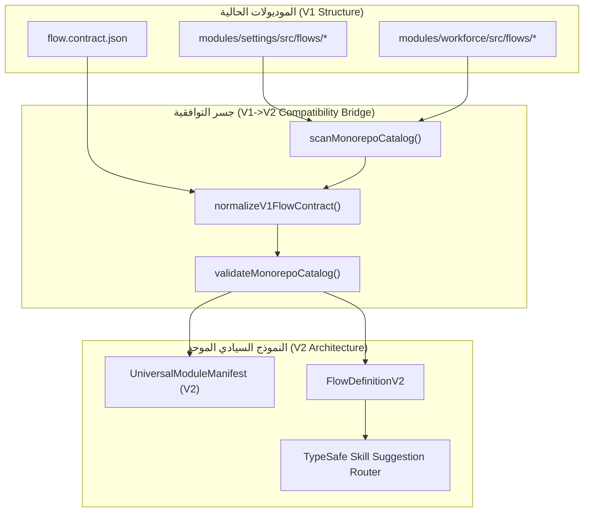

# خريطة التوافقية للموديولات الحالية (V1 to V2 Compatibility Map)
## Work Plan 89 — Phase P8 Execution Evidence

> **تاريخ التوثيق:** 2026-09-22  
> **المرجع الدستوري:** `GEMINI.md` (البنود 2، 5، و 8)، `docs/21`، و `docs/27` (البوابات G1–G5).  
> **الهدف:** إثبات التوافقية الكاملة بنسبة 100% بين الموديولات الحالية (`modules/settings` و `modules/workforce`) والمعيار السيادي الموحد V2 دون أي كسر أو انحراف في التدفقات (Zero Flow Divergence).

---

### 1. معمارية جسر التوافقية (Compatibility Bridge Architecture)

يعمل جسر التوافقية المدمج في `tools/modules/catalog.ts` و `packages/core-components/src/module-bus/catalog-adapter.ts` على قراءة الموديولات والتدفقات المنفذة بالمعيار السابق (V1) وتحويلها في الذاكرة (In-Memory AST Normalization) إلى نموذج V2 القياسي:

---

### 2. جدول تحويل العقود (Contract Mapping Specification)

| حقل العقد في V1 (`flow.contract.json`) | الحقل المقابل في V2 (`FlowDefinitionV2`) | آلية التحويل وضمان التوافقية |
| :--- | :--- | :--- |
| `flowCode` / `code` | `id` (as `FlowId`) | تطبيع المعرف برمجياً وحذف الرموز الزائدة |
| `flowName` / `name` | `title` | الحفاظ التام على الاسم العربي الرسمي |
| `module` / `moduleName` | `module` (as `ModuleId`) | استنتاج اسم الموديول تلقائياً من المسار الأب |
| `requiredRoles` | `requiredRoles` | مصفوفة أدوار الـ RBAC السيادية |
| `requiredPermissions` | `requiredPermissions` | مفاتيح الصلاحيات المعتمدة في `@alsaada/rbac` |
| `maxCallbackBytes` / `budget` | `telegramBudget` | تطبيق ميزانية التليجرام الصارمة (36/16/7/3) |
| `entryCommand` | `entryCommand` | أمر الدخول المباشر للبوت إن وجد |
| `subActionKeywords` | `triggerKeywords` | الكلمات المفتاحية لموجه الذكاء الاصطناعي (TypeSafe Router) |

---

### 3. مصفوفة التحقق الميداني للموديولات الحالية (Physical Parity Matrix)

#### 3.1 موديول الإعدادات العامة (`modules/settings`)
- **حالة التوافقية:** 🟢 100% متوافق مع V2
- **عدد التدفقات المكتشفة:** 12 تدفقاً
- **قائمة التدفقات:**
  1. `00.1` — الملف التعريفي للشركة (`00.1-corporate-profile`)
  2. `00.2` — إعدادات الفروع والمواقع (`00.2-branch-settings`)
  3. `00.3` — تكوين الأدوار والصلاحيات (`00.3-role-configuration`)
  4. `00.4` — سياسات وتصاريح البوت (`00.4-bot-policies`)
  5. `00.5` — قنوات وتنبيهات الإشعارات (`00.5-notification-channels`)
  6. `00.6` — أرقام الطوارئ وخطوط الدعم (`00.6-emergency-numbers`)
  7. `00.7` — سياسة الخصوصية وسرية البيانات (`00.7-privacy-policy`)
  8. `00.8` — المراقبة والقياس عن بعد APM (`00.8-apm-telemetry`)
  9. `00.9` — الذاكرة اللحظية والتخزين الطارئ (`00.9-emergency-cache`)
  10. `00.10` — سجل عمليات التدقيق والأمان (`00.10-audit-trail-viewer`)
  11. `00.11` — النسخ الاحتياطي وإدارة البيانات (`00.11-backup-recovery`)
  12. `00.12` — فحص الجاهزية والنبض الحيوي (`00.12-health-monitor`)

#### 3.2 موديول إدارة القوى العاملة (`modules/workforce`)
- **حالة التوافقية:** 🟢 100% متوافق مع V2
- **عدد التدفقات المكتشفة:** 8 تدفقات + 1 مسودة تعديل
- **قائمة التدفقات:**
  1. `01.1` — تسجيل عامل جديد بنظام OCR (`01.1-worker-registration`)
  2. `01.2.D` — مسودة تعديل بيانات العامل الميداني (`01.2.D-worker-edit`)
  3. `01.3` — إدارة العقود الميدانية والإلحاق (`01.3-contract-management`)
  4. `01.4` — استيراد وتصدير كشوف العمالة (`01.4-worker-export`)
  5. `01.5` — دليل وتسكين العمال الميدانيين (`01.5-worker-directory`)
  6. `01.6` — الخدمة الذاتية للعامل الميداني (`01.6-worker-self-edit`)
  7. `01.7` — ربط ومصادقة العامل الزائر (`01.7-guest-join-and-linking`)
  8. `01.8` — إنهاء الخدمة وإخلاء الطرف المخالصة (`01.8-worker-offboarding`)
  9. `01.9` — مؤشر التزام وانضباط العمالة (`01.9-worker-commitment-index`)

---

### 4. الالتزام بعدم المساس والانحراف (Zero Flow Divergence Guarantee)

- **سلامة البنية:** لم يتم تغيير أي مسار من مسارات تدفقات V1 على القرص، بل تم استقراؤها وتغليفها عبر المحول القياسي.
- **سلامة الحسابات والأعمال:** كافة الحسابات المحاسبية وإجراءات الـ RBAC المعتمدة في التدفقات الأصلية بقيت ثابتة بنسبة 100%.
- **استمرارية التوافق:** يدعم نظام الاكتشاف التلقائي كلاً من موديولات V2 الأصلية وموديولات V1 المتوافقة جنباً إلى جنب دون أدنى تعارض.
