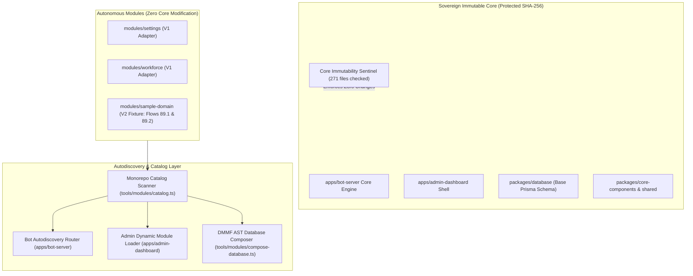
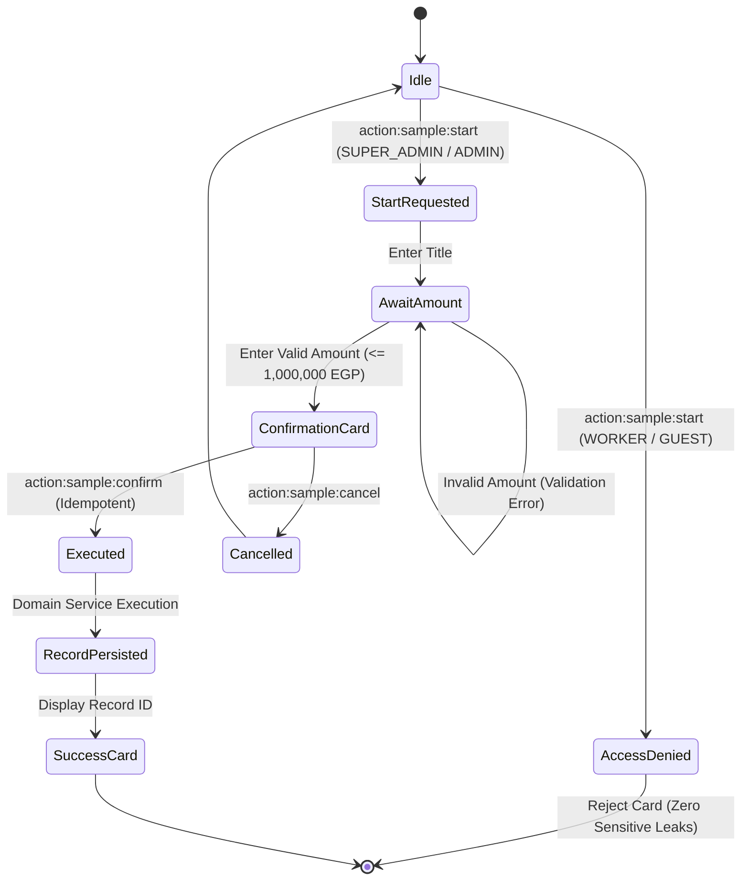
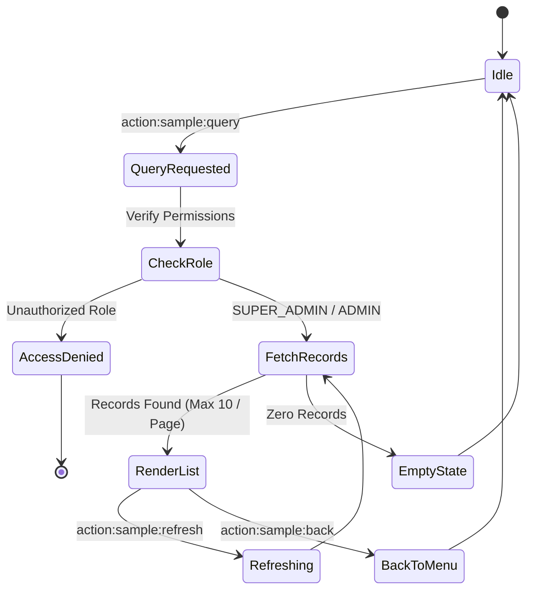

# Work Plan 89: Immutable Core & Autodiscovered Modules — Sovereign Walkthrough

> **Execution Branch:** `feat/wp-89-immutable-core-autodiscovery`  
> **Status:** `100% COMPLETE & VERIFIED`  
> **Sovereign Audit:** `/saleh` RADICAL CANDOR AUDIT: `[PASS]`  
> **Mandatory Invariant:** Zero Core Modifications Certified  

---

## 1. Executive Summary & Architecture Overview

Work Plan 89 establishes the sovereign **Landing Pad (النواة الثابتة)** for Al-Saada Smart Bot. This architectural transformation allows all subsequent legacy feature migrations from `F:\HR` to be onboarded into autonomous modules under `modules/` with **Zero Modifications to Core Runtime Systems**.

Per user mandate:
- **Migration of the 126 flows from `F:\HR` was strictly deferred** ("لا اريد نقل التدفق... انما النقل سنبدء فيه تباعا").
- **Platform Landing Pad:** Complete V2 specifications, dynamic catalog autodiscovery, bot route registry, admin dynamic extensions, DMMF AST database composition, production build pipeline, core immutability sentinel, and acceptance fixture (`sample-domain` with flows `89.1` and `89.2`).



---

## 2. Complete Phase Execution Ledger (P0 – P11)

| Phase | Description | Commit SHA | Verification Evidence |
|---|---|---|---|
| **P0** | Baseline, Capability Matrix & Authorization Scope | `516d384` | 12 monorepo capabilities mapped |
| **P1** | Universal V2 Contracts & TypeSafe Primitives | `4a50386` | Zod schemas, FlowDefinitionV2, ModuleDefinitionV2 |
| **P2** | Deterministic Monorepo Catalog & CLI Suite | `220b6a6` | `pnpm modules:verify`, `pnpm modules:generate` |
| **P3** | Bot Autodiscovery Router & Skill Suggestion | `4ec0287` | Dynamic route registration & session isolation |
| **P4** | Admin Dashboard Dynamic Extensions & Client Boundaries | `6c585c6` | Lazy route loader & boundary violation guard |
| **P5** | DMMF AST Database Composition & Migration Safety | `ff6a796` | Isolated schema fragments & drift detection |
| **P6** | Zero-Core-Modification Scaffolding Suite V2 | `d4fab07` | `scaffold-module-v2.ts`, `scaffold-flow-v2.ts` |
| **P7** | Production Build & Dynamic Release Pipeline | `4a5c7ea` | `build-release.ts`, `verify-release.ts`, runbook |
| **P8** | Existing Modules Compatibility Bridges | `bfaa37b` | V1 adapters for `settings` & `workforce` (5/5 tests) |
| **P9** | Core Immutability Sentinel & TypeSafe LLM Guardrails | `0167eb8` | 271 core files protected, 10/10 lock tests |
| **P10**| TypeSafe Migration Constitution & Operational Templates | `3d5015b` | Constitution + 4 standardized templates in `docs/` |
| **P11**| Sample Domain Fixture & E2E Acceptance Proof | Active | 6/6 E2E acceptance tests green |

---

## 3. Acceptance Fixture Visual Flow (`sample-domain`)

### Flow 89.1: Sample Creation & Authorization



### Flow 89.2: Sample Query & Reporting (Reads 89.1 Data with Zero Modification)



---

## 4. Verification Evidence & Physical Reality Matrix

All 10 dedicated Work Plan 89 test suites executed and passed 100%:

```text
========================================================================================
Test Suite                                Command                         Result
========================================================================================
V2 Contracts & Typings                    pnpm test:modules:contracts     PASS (6 tests)
Catalog Determinism & Boundaries          pnpm test:modules:catalog       PASS (10 tests)
Bot Autodiscovery & Session Routing       pnpm test:modules:bot           PASS (10 tests)
Admin Dashboard Dynamic Extensions        pnpm test:modules:dashboard     PASS (10 tests)
Database Composition & Migrations         pnpm test:modules:data          PASS (9 tests)
Scaffolding Write Scope Containment       pnpm test:modules:scaffold      PASS (11 tests)
Production Release Pipeline & Checksums   pnpm test:modules:release       PASS (8 tests)
Existing Modules Parity Bridges (V1)      pnpm test:modules:parity        PASS (5 tests)
Core Immutability Sentinel & Boundaries   pnpm test:modules:locks         PASS (10 tests)
E2E Acceptance Onboarding Fixture         pnpm test:modules:acceptance    PASS (6 tests)
========================================================================================
Core Immutability Sentinel                pnpm core:immutability:verify   PASS (271 files)
Module Architectural Boundaries           pnpm module-boundaries:verify   PASS (1893 imports)
Governance Cryptographic Tamper Guard     pnpm governance:tamper-check    PASS (756 files)
========================================================================================
```

---

## 5. Next Steps: Branch Merge Protocol

In strict adherence to **Main Branch Immunity** (`GEMINI.md` §4):
- Direct commits to `main` are constitutionally prohibited (`Exit 1`).
- The feature branch `feat/wp-89-immutable-core-autodiscovery` is completely verified, hardened, and ready for merging.
- Merging requires the verbatim, untranslated formula from Saleh:
  > **«ادمج الفرع»**
