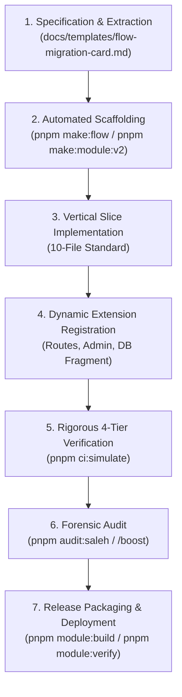

# Al-Saada Smart Bot — TypeSafe Module Migration Constitution & Onboarding Standard

> **Document Status:** Sovereign Standard  
> **Authority:** Derived from `GEMINI.md` (SSOT), `docs/27` (Quality Gates), and **Work Plan 89**  
> **Scope:** All modular extensions, vertical slices, and legacy `F:\HR` migrations  
> **Mandatory Invariant:** Zero Core Modifications during Module Onboarding  

---

## 1. Executive Summary & Architectural Charter

The primary objective of the **Al-Saada Smart Bot Modular Migration Constitution** is to establish an unbreachable, standardized landing pad for onboarding legacy features from `F:\HR` into the modern enterprise monorepo without ever modifying the core runtime systems.

The core systems of Al-Saada Smart Bot are cryptographically sealed, immutable foundations:
1. **Core Runtime (`apps/bot-server`)**: The central Telegraf/GrammY bot engine, polling/webhook infrastructure, session managers, and autodiscovery router.
2. **Core Dashboard (`apps/admin-dashboard`)**: The foundational Vite/React cockpit, RBAC authentication shell, sidebar router, and dynamic module loader.
3. **Core Database (`packages/database`)**: The base Prisma models (Users, Audit, Idempotency, Outbox, Settings) and tamper-proof financial ledger.
4. **Core Shared Primitives (`packages/core-components`, `@alsaada/shared`)**: The reusable domain engines (Workers, National ID, Phone, Currency, Date/Time).

**The Zero-Core-Modification Rule:**
> Any new business module, conversational wizard, or administrative extension must be onboarded cleanly under `modules/<name>/` and automatically discovered by the monorepo catalog. Modifying core files to register routes, add navigation links, or compose schemas is **strictly unconstitutional** and triggers an automatic build failure via the Core Immutability Sentinel.

---

## 2. Universal V2 Module Standard Structure

Every sovereign module in Al-Saada Smart Bot must reside in `modules/<module-name>/` and strictly adhere to the standardized vertical layout:

```text
modules/<module-name>/
├── module.json                       # Universal V2 Manifest (Zod-validated)
├── package.json                      # Workspace package declaration (@alsaada/<module-name>)
├── tsconfig.json                     # Monorepo TypeScript configuration
├── prisma/
│   └── schema.module.prisma          # Isolated DMMF AST database fragment (optional)
├── src/
│   ├── index.ts                      # Clean module public export API
│   ├── module.routes.ts              # Declarative BotRouteHandler array export
│   ├── admin/
│   │   ├── index.ts                  # Admin module extension entry
│   │   ├── routes.tsx                # Dynamic React routes for Admin Dashboard
│   │   └── navigation.ts             # Sidebar navigation items and badges
│   └── flows/
│       └── <code-slug>/              # Strict 10-File Vertical Slice
│           ├── flow.contract.json    # Machine-readable flow contract & Telegram budgets
│           ├── index.ts              # Flow public exports
│           ├── controller.ts         # Flow orchestration & session lifecycle
│           ├── menu.builder.ts       # Telegram inline keyboard layout (36/16/7/3)
│           ├── action.handler.ts     # User callback and input event processors
│           ├── service.ts            # Pure domain logic & business calculations
│           ├── types.ts              # Flow state, DTOs, and session types
│           ├── validator.ts          # Zod schemas for user inputs and payloads
│           ├── error.handler.ts      # Domain-specific fault recovery & error messages
│           └── flow.docs.md          # Flow specification and F:\HR parity documentation
└── tests/
    └── flows/                        # 10th file: Exhaustive 5-suite test harness
        ├── <flow>.unit.spec.ts
        ├── <flow>.integration.spec.ts
        ├── <flow>.ux.spec.ts
        ├── <flow>.rbac.spec.ts
        └── <flow>.data.spec.ts
```

---

## 3. The 4-Tier Verification Matrix

Before any module or flow can be certified for staging or production, it must successfully pass the 4-Tier Verification Matrix:

### Tier 1: TypeSafe Rigor & Contracts (Gates G1, G4, G5)
- **100% Strict Typechecking:** Must pass `pnpm typecheck` without `@ts-ignore`, `any`, or unsafe casts.
- **Zod Deserialization:** Zero untyped `JSON.parse` across boundaries. All incoming Telegram payloads and HTTP inputs must be parsed with Zod schemas.
- **Contract Adherence:** Every flow must include a valid `flow.contract.json` adhering to `flowContractSchema`.

### Tier 2: Functional Parity & Invariants (Gates G2, G3, G11, G12)
- **F:\HR Golden Parity:** Calculations, business rules, and step sequences must match `F:\HR` legacy behavior 100%. Zero flow divergence is permitted.
- **Closed-Loop Accounting:** All financial actions must write double-entry balanced records to the ledger.
- **Zero Hard Deletes:** Deletions must use soft-delete flags with audit timestamps.

### Tier 3: Security & Cryptographic Immutability (Gates G7, G8, G13, G16, G17)
- **RBAC Matrix:** Explicit permission checks on all entry points. Unauthorized users must receive graceful rejection cards without leaking sensitive metadata.
- **Compensation Masking:** Salaries and financial compensation must be masked based on user role and permissions.
- **Cryptographic Immutability:** Core files must remain untouched. `pnpm core:immutability:verify` must pass with zero modified core files.
- **Tamper Checking:** `pnpm governance:tamper-check` must pass 100% against `governance.lock.json`.

### Tier 4: Mobile Ergonomics & Reliability (Gates G6, G9, G21, G22, G23)
- **Telegram Mobile Budget (36/16/7/3):**
  - Callback data `<= 36 bytes` (absolute maximum 64 bytes).
  - Button text `<= 16 characters` (prevents truncation on mobile screens).
  - Keyboard layout `<= 7 rows`, `<= 3 buttons per row`.
- **Sub-300ms Latency Budget:** User interactions must render responses in under 300ms.
- **Strict Idempotency:** State mutations must use idempotency keys to prevent double-submits.
- **Zero Console Errors:** Telemetry logger (`@alsaada/telemetry`) must be used exclusively. Zero `console.log` or `console.error`.

---

## 4. Sovereign Module Onboarding Lifecycle



### Stage 1: Specification & Parity Extraction
1. Research the corresponding flow in `F:\HR`.
2. Complete a `docs/templates/flow-migration-card.md` documenting inputs, calculations, validation rules, and error states.
3. Obtain Squad sign-off before writing implementation code.

### Stage 2: Scaffolding via Generator
1. Run `pnpm make:flow` or `pnpm make:module:v2` to generate the boilerplate files.
2. The generator creates the 10-file vertical slice, types, and test harness with zero manually copied boilerplate.

### Stage 3: Implementation of Vertical Slices
1. Implement pure domain logic in `service.ts`.
2. Implement validation schemas in `validator.ts`.
3. Construct ergonomically compliant keyboards in `menu.builder.ts`.
4. Orchestrate conversation state in `controller.ts` and `action.handler.ts`.

### Stage 4: Dynamic Extension Registration
1. Add the flow routes to `src/module.routes.ts`.
2. Add administrative views to `src/admin/routes.tsx` and navigation items to `src/admin/navigation.ts`.
3. If database models are needed, define them in `prisma/schema.module.prisma`. The DMMF AST engine automatically composes the schema.

### Stage 5: Rigorous Verification
1. Run `pnpm test:modules:parity` to verify backward compatibility.
2. Run `pnpm core:immutability:verify` to confirm that zero core files were altered.
3. Run `pnpm ci:simulate` to execute all 23 Quality Gates.

### Stage 6: Forensic Audit by Sovereign Stakeholder Proxy (`/saleh`)
1. Run `pnpm audit:saleh` and `pnpm audit:saleh:boost`.
2. Ensure zero shortcuts, anti-patterns, or test cheating (G10 test authenticity check).

### Stage 7: Release Packaging & Production Runbook
1. Run `pnpm module:build <module-name>` to create the isolated, versioned deployment artifact.
2. Run `pnpm module:verify <module-name>` to validate artifact checksums and contract integrity.
3. Follow `docs/ai-execution-evidence/wp-89/deployment-runbook.md` for rolling staging/production deployment.

---

## 5. Constitutional Roles & Approval Protocols

| Role | Responsibility | Authority |
|---|---|---|
| **Sovereign Stakeholder Proxy (`/saleh`)** | Strategic reality checks, forensic auditing, prompt optimization | Can issue `[PASS]`, `[CONDITIONAL PASS]`, or `[REJECT]` verdicts |
| **Chief Arbitrator** | Constitutional interpretation, cross-squad deadlock resolution | Supreme governance referee on architectural tradeoffs |
| **Squad:Arch / DevOps** | Monorepo architecture, package boundaries, Docker, CI/CD | Enforces core immutability and package layering |
| **Squad:Finance / Security** | Financial integrity, closed-loop accounting, RBAC, encryption | Absolute veto on financial flow deviations or data leaks |
| **Squad:UX / Impl** | Vertical slice implementation, Telegram mobile ergonomics | Delivers 10-file slices adhering to 36/16/7/3 budgets |
| **Squad:QA / Migration** | Parity verification against `F:\HR`, test harnesses, G1–G23 gates | Validates test authenticity and 4-tier matrix compliance |

### Mandatory Approval Checkpoint Formulas
AI agents and engineers are strictly forbidden from proceeding across constitutional checkpoints without verbatim untranslated formulas:
- **Lock Approval:** `«نعم اقفل»`
- **Dynamic OTP Unlock:** `«موافق على الفتح <UNLOCK-XXXXXX>»` or `«نعم موافق على التعديل <UNLOCK-XXXXXX>»`
- **Merge to Main:** `«ادمج الفرع»`
- **Source Code Defect Fix:** `«موافق على تعديل الكود المصدري»`
- **Universal Governance Bypass:** `«موافق على التعديل او الايقاف او الحذف»`
