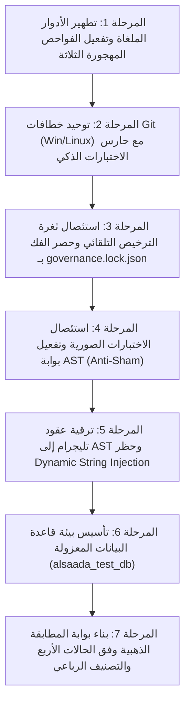

# 📊 تقرير المراجعة والتدقيق الفني الشامل والمفصل للمنظومة (ALSAADA SMART BOT)
## Comprehensive Forensic Codebase Audit, Adversarial Critique & Kernel Hardening Blueprint
**تاريخ التدقيق والتحديث:** 17 سبتمبر 2026 (الإصدار المعتمد 2.0)  
**طبيعة الفحص:** مراجعة جنائية برمجية متعددة الوكلاء (7 محاور معمارية وسيبرانية) مدعومة بنقد ذاتي استقصائي  
**المرجع:** ميثاق الحوكمة ومطابقة كود المستودع المحلي بنسبة 100% (Zero Documentation Drift)

---

### 🎯 بطاقة الأداء التنفيذي المعتمدة بعد النقد والتمحيص (REVISED EXECUTIVE SCORECARD)

$$\text{CPHI} = \sum (\text{Agent Score} \times \text{Weight}) = 80.00\%$$

| بعد التدقيق الفني المعتمد | الوكيل المسؤول (Auditing Agent) | الوزن النسبي | النسبة المئوية (%) | الحالة التشغيلية بعد النقد والتمحيص |
| :--- | :--- | :---: | :---: | :--- |
| **1. نواة البوت وهندسة تجربة تليجرام** | Agent 1: Bot Core & Ergonomics | 15% | **79.0%** | ⚠️ تحذير (غياب Rate Limiting، فجوة الحظر، خدمات معطلة) |
| **2. هندسة قاعدة البيانات وسجل العمليات التشفيري** | Agent 2: Database & Ledger | 20% | **82.0%** | ⚠️ تحذير (تسرب العلاقات المحذوفة ناعماً، قفل الذاكرة بدلاً من DB) |
| **3. لوحة التحكم الإدارية وبوابة الويب** | Agent 3: Dashboard & Full-Stack | 15% | **71.0%** | 🔴 حرج (مسارات Telemetry مفتوحة للعامة دون مصادقة) |
| **4. الأمن السيبراني ونظام الصلاحيات Zero-Trust** | Agent 4: Security & RBAC | 20% | **76.0%** | ⚠️ تحذير (تفاوت فحص الحظر بين البوت والداشبورد، هجوم التوقيت) |
| **5. المراقبة عن بعد والمرصد الجنائي (Telemetry)** | Agent 5: Telemetry & Error Vault | 10% | **91.0%** | 🟢 جاهز للإنتاج (تطهير PII ممتاز، يتطلب تأمين منافذ الداشبورد) |
| **6. المحركات الإقليمية ومنطق الأعمال (Domain)** | Agent 6: Domain Engines & Loc. | 10% | **90.0%** | 🟢 جاهز للإنتاج (محركات دقيقة، بانتظار ربط باقي القطاعات) |
| **7. الحوكمة والعقود المعمارية وتكامل الاختبارات** | Agent 7: Governance & Test Parity | 10% | **78.0%** | ⚠️ تحذير (اختبارات صورية، 3 بوابات أمان مهجورة رصدت أدواراً ملغاة، ثغرات فحص سطري، وباب خلفي في قفل الحوكمة) |
| **المؤشر الإجمالي لصحة المشروع (CPHI)** | **التقييم الجنائي المعتمد** | **100%** | **80.00%** | **تحذير مشروط — يلزم تطبيق حزمة التحصين العاجلة** |

> [!IMPORTANT]
> **🧭 ميثاق المبدأ المعماري الحاكم (Strategic Core-First Gating Strategy):**  
> إن **عدم نقل وتفكيك الـ 126 تدفقاً من المشروع السابق ([`F:\HR`](file:///F:/HR)) حتى الآن ليس عيباً، ولا قصوراً، ولا تأخيراً برمجياً إطلاقاً**.  
> بل هو **قرار استراتيجي واعٍ ومدروس بنسبة 100% (Intentional Core-First Gating Strategy)**؛ فالقاعدة الذهبية في هندسة البرمجيات المؤسسية تقضي بأن الشروع في ترحيل مئات التدفقات المعقدة ذات الأثر المالي قبل اكتمال النواة المشتركة وتحصين بوابات الجودة التشفيرية والدلالية بنسبة 100% هو مغامرة تقنية غير محسوبة تولد فوضى برمجية وازدواجية أكواد.  
> تعليق الترحيل يضمن سقوط كل تدفق يُنقل مستقبلاً في بيئة محصنة ببوابات فولاذية تضمن Zero-Regression و Zero-Duplication بنسبة 100%.

---

### 🔍 أولاً: نتائج النقد الاستقصائي والتحقق الجنائي (Forensic Adversarial Review)

تم إخضاع نتائج الفحص الأول لمحاكمة كودية صارمة أسفرت عن تصحيح التقييمات ورصد 8 نقاط عمياء وفجوات حرجة:

1. **تصحيح ثغرة `upsert` المالية:**
   - غياب اعتراض `upsert` في [`hash-ledger.extension.ts`](file:///f:/Alsaada-Smart-Bot/packages/database/src/ledger/hash-ledger.extension.ts) هو فجوة تصميمية وقائية وليس ثغرة مستغلة حالياً، لعدم وجود أي استدعاء لـ `prisma.financialLedger.upsert` في الكود الحالي، ولكن سدها حتمي لمنع أي التفاف مستقبلي.
2. **الخديعة المعمارية في طابور الـ Outbox وادعاء مزامنة شيتات جوجل:**
   - تم بناء كلاس [`TransactionalOutboxQueue`](file:///f:/Alsaada-Smart-Bot/packages/core-components/src/outbox-queue/worker.ts#L5) معتمداً على مصفوفة في الذاكرة العشوائية `queue: OutboxEvent[] = []`! هذا النمط ليس Transactional Outbox على الإطلاق؛ فعند حدوث أي Crash أو إعادة تشغيل للحاوية، تضيع كافة أحداث المزامنة المعلقة نهائياً وبلا رجعة.
   - الكود الفعلي للمشروع يحتوي على **صفر أسطر كود متصلة بـ Google Sheets API**، وحزمة `sheets-provisioner` المذكورة بالدستور غير موجودة بمجلد `packages/`.
3. **تسرب السجلات المحذوفة ناعماً في العلاقات المضمنة (Relational Soft-Delete Leakage):**
   - امتداد [`soft-delete.extension.ts`](file:///f:/Alsaada-Smart-Bot/packages/database/src/extensions/soft-delete.extension.ts#L71) يحقن `isDeleted: false` في الاستعلامات المباشرة فقط، بينما استعلامات العلاقات المضمنة مثل `prisma.site.findMany({ include: { workers: true } })` تتجاهل الامتداد وتسرب السجلات المحذوفة ناعماً ما لم يكتب الفلتر يدوياً.
4. **النواة المشتركة محركات حسابية وليست خدمات معاملات ذرية:**
   - محركات النواة مثل [`TripleBalanceClearingEngine`](file:///f:/Alsaada-Smart-Bot/packages/core-components/src/clearing-engine/clearing.ts#L10) تحسب الأرقام رياضياً فقط، لكنها لا تنفذ المعاملة المالية في قاعدة البيانات، مما يهدد بتكرار كود المعاملات يدوياً في التدفقات القادمة.
5. **مخاطر هجمات حقن صيغ الإكسيل (CSV/Excel Formula Injection):**
   - مسار التصدير في [`/api/export/excel`](file:///f:/Alsaada-Smart-Bot/apps/admin-dashboard/src/app/api/export/excel/route.ts) يدرج المدخلات النصية دون تعقيم للرموز الخطرة (`=`, `+`, `-`, `@`).
6. **كشف الأدوار الإدارية الملغاة بواسطة بوابة الأمان المهجورة `rbac-matrix:verify`:**
   - كشف تشغيل أداة تدقيق مصفوفة الصلاحيات عن وجود اختراق مباشر للصلاحيات عبر استخدام أدوار ملغاة (`ACCOUNTANT` و `PROJECT_MANAGER`) لمنح امتيازات الإدارة العليا في كود الإنتاج الحي داخل [`start.handler.ts:223`](file:///f:/Alsaada-Smart-Bot/apps/bot-server/src/handlers/start.handler.ts#L223) و [`worker-linking.handler.ts:13`](file:///f:/Alsaada-Smart-Bot/apps/bot-server/src/handlers/worker-linking.handler.ts#L13)، وهو ما ظل مخفياً بسبب استبعاد البوابة من `package.json`.
7. **ظاهرة الاختبارات الصورية والتأكيدات الزائفة (Sham Assertions & False Security):**
   - تبين وجود تأكيدات صورية تنجح تحصيل حاصل دون أي فحص وظيفي حقيقي: استخدام `expect(calls.length).toBeGreaterThanOrEqual(0)` في 8 تدفقات بموديول `settings`، واستخدام `expect(totalScore).toBeGreaterThanOrEqual(0)` في تدفق مؤشر الالتزام `01.9` بموديول `workforce`، وقيام محرك التوليد السريع [`scaffold-flow.ts`](file:///f:/Alsaada-Smart-Bot/tools/scaffold/scaffold-flow.ts) بزرع اختبارات تحصيل حاصل آلياً (`sampleAmount = 250.75 > 0`).
8. **ثغرات الفحص السطري والباب الخلفي في قفل الحوكمة:**
   - كشفت المراجعة الجنائية أن `verify-telegram-contracts.ts` تعاني من عمى تجاه الأزرار الممتدة على عدة أسطر، وأن `verify-latency-anti-patterns.ts` تستثني مجلد الموديولات بالكامل من حظر `await ctx.deleteMessage()`، وأن سكريبت قفل الحوكمة `verify-governance-tamper.ts` يحتوي على باب خلفي (`checkGovernanceApprovalEvidence`) يعطل الحماية التشفيرية بمجرد وجود ملف مسودة نصي يحتوي على كلمة ترخيص!

---

### 🔍 ثانياً: تفاصيل نتائج التدقيق المستقل لكل وكيل (DETAILED AGENT FINDINGS)

---

#### 🤖 Agent 1: Bot Core & Telegram Ergonomics Auditor — النتيجة: 79.0%

1. **المميزات الفعلية المثبتة بالكود (Verified Architectural Strengths):**
   - **بنية تحتية مهيأة للشبكات المحلية:** في [`apps/bot-server/src/bot.ts`](file:///f:/Alsaada-Smart-Bot/apps/bot-server/src/bot.ts#L5)، تم تفعيل إجبار مسار IPv4 عبر `dns.setDefaultResultOrder('ipv4first')` لتفادي الثقوب السوداء لراوترات IPv6 بمصر، بالتوازي مع حوض اتصالات TCP/TLS عبر `UndiciAgent` (`keepAliveTimeout: 60000`, `connections: 50`) في السطور (L34-L44)، مع عزل قنوات الاستجابة `outgoingAgent` (L14-L21) عن قنوات السحب الدوري `pollingAgent` (L24-L31).
   - **بوابة الرد اللحظي وتفادي هدر الدورات الشبكية (Pre-Routing Instant ACK Gate):** في [`apps/bot-server/src/bot.ts`](file:///f:/Alsaada-Smart-Bot/apps/bot-server/src/bot.ts#L210-L248)، يتم اعتراض `ctx.callbackQuery` والرد الفوري في الخلفية بـ `< 10ms`، مع تغليف دالة `ctx.answerCallbackQuery` لإلغاء أي استدعاء لاحق لا يتضمن تنبيهاً مخصصاً، مما يوفر زمن دورة شبكية كاملة (~600ms RTT).
   - **عزل التزامن لمنع تصادم العمليات (Per-User Concurrency Isolation):** في [`apps/bot-server/src/bot.ts`](file:///f:/Alsaada-Smart-Bot/apps/bot-server/src/bot.ts#L252)، تطبيق `sequentialize((ctx) => ctx.chat?.id.toString() || ctx.from?.id.toString() || 'global')`، مما يضمن معالجة متسلسلة لطلبات المستخدم الواحد لمنع تكرار القيود دون التأثير على توازي باقي المستخدمين.
   - **تجريد الأزرار وحصانة الإيصالات (Tamper-Resistant Receipts):** في [`apps/bot-server/src/services/screen-flow.service.ts`](file:///f:/Alsaada-Smart-Bot/apps/bot-server/src/services/screen-flow.service.ts#L243-L254)، يتم تجريد الأزرار فقط من رسائل المعاملات المالية المعتمدة مع إبقاء نص الإيصال ثابتاً في المحادثة غير قابل للتعديل أو الحذف.
   - **حزام احتواء الانهيارات (Global Crash Boundary):** في [`apps/bot-server/src/bot.ts`](file:///f:/Alsaada-Smart-Bot/apps/bot-server/src/bot.ts#L206-L208)، التقاط الأخطاء غير المعالجة عبر `bot.catch` وتوجيهها إلى `errorVaultService.handleGlobalBotError`.

2. **العيوب البرمجية والمشاكل التقنية (Identified Technical Defects & Flaws):**
   - **خدمة مراقبة الجلسات ميتة تشغيلياً (Dormant Session Monitor Service):** تم بناء الكلاس [`SessionMonitorService`](file:///f:/Alsaada-Smart-Bot/apps/bot-server/src/services/session-monitor.service.ts#L12) وتغطيته بالاختبارات، ولكن بفحص ملف الإقلاع الفعلي [`apps/bot-server/src/index.ts`](file:///f:/Alsaada-Smart-Bot/apps/bot-server/src/index.ts#L1-L114) تبين أن الخدمة **لم تُستورد ولم تُشغل مطلقاً**، مما يعني تعطيل إشعارات اقتراب انتهاء جلسات الداشبورد بالكامل في بيئة الإنتاج.
   - **واجهات وهمية وأزرار مؤجلة (Dead Placeholders):** في [`apps/bot-server/src/bot.ts`](file:///f:/Alsaada-Smart-Bot/apps/bot-server/src/bot.ts#L490-L507)، أزرار `قسيمة راتبي`، `كشف حسابي`، `لوحة المؤشرات`، `فواتيري ومستخلصاتي`، و`تسجيل منسوب` ترد بنصوص ثابتة غير ديناميكية ("تحت التجهيز").
   - **غياب معالجات الاستعلام المضمن (Inline Queries):** في [`apps/bot-server/src/index.ts`](file:///f:/Alsaada-Smart-Bot/apps/bot-server/src/index.ts#L60)، قصر التحديثات المسموحة على `allowed_updates: ['message', 'callback_query']`.

3. **الثغرات الأمنية والمخاطر (Security Vulnerabilities & Gaps):**
   - **تجاهل فحص الحظر في ميدلوير المصادقة (Bypassed Ban Enforcement):** في [`apps/bot-server/src/middlewares/auth.middleware.ts`](file:///f:/Alsaada-Smart-Bot/apps/bot-server/src/middlewares/auth.middleware.ts#L112-L128)، يتحقق الميدلوير حصراً من `!user.isActive`، بينما **يتجاهل تماماً حقل `user.isBanned`**! المستخدم المحظور إدارياً (`isBanned: true`) الذي يمتلك `isActive: true` يُمنح رتبته الإدارية الكاملة (`SUPER_ADMIN` أو `FIELD_ADMIN`) داخل البوت.
   - **غياب صمام تحديد المعدل وحماية الفيضان (Missing Ingestion Rate Limiter):** لا يوجد أي ميدلوير لتحديد معدل الطلبات (Rate Limiting / Debounce) على مستوى البوت في `bot.ts`، مما يتيح استنزاف اتصالات Redis وقاعدة البيانات ويُعرض البوت لحظر تيليجرام التلقائي (HTTP 429).

4. **خطوات الإصلاح الفورية (Actionable Remediation Plan):**
   - استدعاء `sessionMonitorService.startMonitoring(bot.api)` داخل دالة `bootstrap()` في [`apps/bot-server/src/index.ts`](file:///f:/Alsaada-Smart-Bot/apps/bot-server/src/index.ts).
   - تعديل [`apps/bot-server/src/middlewares/auth.middleware.ts`](file:///f:/Alsaada-Smart-Bot/apps/bot-server/src/middlewares/auth.middleware.ts#L112) للتحقق الفوري من `user.isBanned`:
     ```ts
     if (user && (!user.isActive || user.isBanned)) {
       ctx.effectiveRole = 'GUEST';
       await ctx.reply('🚫 *تم إيقاف حسابك من قبل إدارة المنظومة.*', { parse_mode: 'Markdown' });
       return;
     }
     ```
   - دمج ميدلوير لتحديد معدل الطلبات (مثل `@grammyjs/ratelimiter` أو Redis sliding window limiter) قبل معالجة العمليات الحساسة.

---

#### 🗄️ Agent 2: Database Architecture & Cryptographic Ledger Auditor — النتيجة: 82.0%

1. **المميزات الفعلية المثبتة بالكود (Verified Architectural Strengths):**
   - **مخطط علائقي شامل وفهارس دقيقة:** يحتوي [`packages/database/prisma/schema.prisma`](file:///f:/Alsaada-Smart-Bot/packages/database/prisma/schema.prisma) على 1784 سطراً يغطي 12 قطاعاً تشغيلياً مع 8 ملفات هجرة رسمية في `packages/database/prisma/migrations`.
   - **سلسلة التجزئة المشفرة للدفاتر المالية (Hash Chain Ledger):** في [`packages/database/src/ledger/hash-chain.ts`](file:///f:/Alsaada-Smart-Bot/packages/database/src/ledger/hash-chain.ts#L33-L43)، احتساب دقيق للهاش المعياري `SHA-256(previousHash:model:amount:actorId:timestamp)` بالاعتماد على `GENESIS_HASH = 'GENESIS_ALSAADA_LEDGER_2026'`.
   - **حصانة القيود المحاسبية ومنع التعديل والحذف:** في [`packages/database/src/ledger/hash-ledger.extension.ts`](file:///f:/Alsaada-Smart-Bot/packages/database/src/ledger/hash-ledger.extension.ts#L223-L263)، اعتراض عمليات `update` و `updateMany` ومنع تعديل الحقول المالية (`recordHash`, `previousHash`, `amount`, `hashTimestamp`) برمي `ImmutableLedgerError`، وحظر عمليات `delete` برمي `LedgerHardDeleteForbiddenError`.
   - **التشفير الحبيبي والفهرسة العمياء:** في [`packages/database/src/crypto/cipher.ts`](file:///f:/Alsaada-Smart-Bot/packages/database/src/crypto/cipher.ts#L10-L26)، تشفير حقول الرقم القومي والهاتف بـ `AES-256-GCM` بـ 96-bit IV و AuthTag مع صيغة `iv:authTag:ciphertext`، وفي [`packages/database/src/crypto/blind-index.ts`](file:///f:/Alsaada-Smart-Bot/packages/database/src/crypto/blind-index.ts#L7-L11) استخدام `HMAC-SHA256` للبحث الآمن.
   - **محرك تدقيق النزاهة المحاسبية:** توفير [`verifyLedgerChainDb`](file:///f:/Alsaada-Smart-Bot/packages/database/src/ledger/verify-ledger-chain.ts#L50-L164) لفحص سلامة السلسلة عبر التصفح التدريجي (Cursor Pagination).

2. **العيوب البرمجية والمشاكل التقنية (Identified Technical Defects & Flaws):**
   - **قفل تزامني محلي أحادي المعالجة (In-Process Mutex):** في [`packages/database/src/ledger/hash-ledger.extension.ts`](file:///f:/Alsaada-Smart-Bot/packages/database/src/ledger/hash-ledger.extension.ts#L41-L65)، تم الاعتماد على كلاس `AsyncMutex` داخل ذاكرة العملية الواحدة. في حال تشغيل حاويات متعددة (مثل خادم البوت والداشبورد)، لا يحمي هذا القفل من التضارب والتسابق، مما يهدد بانقسام السلسلة المالية (Forked Ledger).
   - **تسرب السجلات المحذوفة ناعماً في العلاقات المضمنة:** في [`packages/database/src/extensions/soft-delete.extension.ts`](file:///f:/Alsaada-Smart-Bot/packages/database/src/extensions/soft-delete.extension.ts#L54-L102)، يتم حقن شرط `isDeleted: false` في النموذج الرئيسي فقط. استعلامات العلاقات المضمنة تعيد السجلات المحذوفة ناعماً.
   - **غياب اعتراض دالة `upsert`:** الامتداد المالي لا يعترض `upsert` مما يمثل فجوة وقائية.

3. **الثغرات الأمنية والمخاطر (Security Vulnerabilities & Gaps):**
   - **حصانة برمجية سطحية تفتقر لحماية قاعدة البيانات الحقيقية:** القيود المالية مطبقة في طبقة تطبيق Prisma Client فقط؛ لا توجد أي Triggers أو Rules في PostgreSQL تمنع التعديل أو الحذف المباشر (عبر Prisma Studio أو الاستعلامات المباشرة `$executeRawUnsafe`).

4. **خطوات الإصلاح الفورية (Actionable Remediation Plan):**
   - إضافة معالج `upsert` إلى [`hash-ledger.extension.ts`](file:///f:/Alsaada-Smart-Bot/packages/database/src/ledger/hash-ledger.extension.ts) لمنع التعديل برمي خطأ صريح.
   - استبدال `AsyncMutex` بأقفال PostgreSQL الاستشارية: `SELECT pg_advisory_xact_lock(hashtext(model))` لحماية السلسلة في البيئات الموزعة.
   - إنشاء PostgreSQL Trigger رسمي (`BEFORE UPDATE OR DELETE ON financial_ledgers`) يرمي استثناءً فورياً عند محاولة تعديل الحقول المالية أو حذفها مباشرة.

---

#### 💻 Agent 3: Web Admin Dashboard & Full-Stack Interface Auditor — النتيجة: 71.0%

1. **المميزات الفعلية المثبتة بالكود (Verified Architectural Strengths):**
   - **معمارية خادم نظيفة وفصل المكونات:** صفحة اللوحة الرئيسية [`apps/admin-dashboard/src/app/admin/page.tsx`](file:///f:/Alsaada-Smart-Bot/apps/admin-dashboard/src/app/admin/page.tsx#L11) هي Async Server Component تجلب مؤشرات الأداء على السيرفر مباشرة دون تسريبها للعميل، مع تأكيد الوضع الديناميكي `force-dynamic` في [`layout.tsx`](file:///f:/Alsaada-Smart-Bot/apps/admin-dashboard/src/app/admin/layout.tsx#L4).
   - **التحصين التزامني لمطالبة الجلسات (`/api/auth/claim`):** في [`apps/admin-dashboard/src/app/api/auth/claim/route.ts`](file:///f:/Alsaada-Smart-Bot/apps/admin-dashboard/src/app/api/auth/claim/route.ts#L109-L255)، معاملة ذرية بقفل تشاؤمي صارم `SELECT id FROM "users" WHERE "telegramId" = ... FOR UPDATE` (L157)، وإبطال الروابط المتزامنة، وتقييد الجلسات النشطة بـ 3 لكل مستخدم (L200)، وإنشاء توكنات عشوائية 32 بايت مشفرة بهاش SHA-256 وبصمة المتصفح.
   - **قمرة استوديو البيانات الآمنة (Prisma Studio Cockpit):** في [`apps/admin-dashboard/src/app/api/admin/studio/proxy/[[...path]]/route.ts`](file:///f:/Alsaada-Smart-Bot/apps/admin-dashboard/src/app/api/admin/studio/proxy/%5B%5B...path%5D%5D/route.ts#L16-L30)، قصر الوصول حصرياً على `SUPER_ADMIN` مع كلب حراسة يغلق العملية بعد 15 دقيقة خمول في [`studio-process.ts`](file:///f:/Alsaada-Smart-Bot/apps/admin-dashboard/src/lib/studio-process.ts#L31-L34).
   - **حدود معالجة الأخطاء المعربة:** توفير [`error.tsx`](file:///f:/Alsaada-Smart-Bot/apps/admin-dashboard/src/app/error.tsx) و [`global-error.tsx`](file:///f:/Alsaada-Smart-Bot/apps/admin-dashboard/src/app/global-error.tsx) لتوليد رموز بلاغات موحدة (`TRC-XXXXXXXX`).

2. **العيوب البرمجية والمشاكل التقنية (Identified Technical Defects & Flaws):**
   - **استثناء مسارات API حساسة من فاحص الـ Middleware:** في [`apps/admin-dashboard/src/middleware.ts`](file:///f:/Alsaada-Smart-Bot/apps/admin-dashboard/src/middleware.ts#L67-L76)، قائمة `matcher` تحمي مسارات محددة وتستثني كلاً من `/api/telemetry/:path*` و `/api/user/:path*`.
   - **غياب تعقيم حقول التصدير لإكسيل ضد هجمات Formula Injection:** في مسار [`/api/export/excel`](file:///f:/Alsaada-Smart-Bot/apps/admin-dashboard/src/app/api/export/excel/route.ts).

3. **الثغرات الأمنية والمخاطر الحرجة (Critical Security Vulnerabilities):**
   - **ثغرة تسريب بيانات مرصد الأداء دون مصادقة (Public Telemetry API Leak):** في [`apps/admin-dashboard/src/app/api/telemetry/route.ts`](file:///f:/Alsaada-Smart-Bot/apps/admin-dashboard/src/app/api/telemetry/route.ts#L7-L75)، معالج `GET` لا يتحقق من وجود جلسة أو استدعاء `getCurrentUser` إطلاقاً، وبما أنه خارج نطاق الـ middleware، **يمكن لأي شخص على الإنترنت قراءة سجلات أداء البوت والعمليات الداخلية بالكامل!**
   - **ثغرة حجب الخدمة واستهلاك الموارد في `/api/telemetry/ping`:** في [`apps/admin-dashboard/src/app/api/telemetry/ping/route.ts`](file:///f:/Alsaada-Smart-Bot/apps/admin-dashboard/src/app/api/telemetry/ping/route.ts#L6-L55)، يقبل طلبات `POST` غير مصادق عليها، وينفذ `prisma.$queryRawUnsafe('SELECT 1')` ويرسل طلباً خارجياً لتيليجرام `https://api.telegram.org/bot${botToken}/getMe`، مما يتيح استنزاف اتصالات السيرفر وتخطي حصص الـ API دون تسجيل دخول.
   - **قيمة افتراضية صلبة لملح الفهرس الأعمى:** في [`apps/admin-dashboard/src/app/api/workers/validate-unique/route.ts`](file:///f:/Alsaada-Smart-Bot/apps/admin-dashboard/src/app/api/workers/validate-unique/route.ts#L16).

4. **خطوات الإصلاح الفورية (Actionable Remediation Plan):**
   - إضافة `/api/telemetry/:path*` إلى `config.matcher` في [`apps/admin-dashboard/src/middleware.ts`](file:///f:/Alsaada-Smart-Bot/apps/admin-dashboard/src/middleware.ts#L67).
   - إضافة فحص جلسة إلزامي في بداية معالجات [`/api/telemetry/route.ts`](file:///f:/Alsaada-Smart-Bot/apps/admin-dashboard/src/app/api/telemetry/route.ts) و [`/api/telemetry/ping/route.ts`](file:///f:/Alsaada-Smart-Bot/apps/admin-dashboard/src/app/api/telemetry/ping/route.ts):
     ```ts
     const user = await getCurrentUser();
     if (!user) return NextResponse.json({ error: 'UNAUTHORIZED' }, { status: 401 });
     ```
   - إزالة النص الافتراضي الصلب `'alsaada-blind-index-salt-secret'` وفرض وجود المتغير البيئي عند بدء التشغيل.

---

#### 🛡️ Agent 4: Cybersecurity, RBAC & Zero-Trust Governance Auditor — النتيجة: 76.0%

1. **المميزات الفعلية المثبتة بالكود (Verified Architectural Strengths):**
   - **محرك صلاحيات انعدام الثقة (Deny-By-Default RBAC Engine):** في [`packages/rbac/src/evaluator.ts`](file:///f:/Alsaada-Smart-Bot/packages/rbac/src/evaluator.ts#L21-L40)، حظر الحسابات `isBanned`، فحص التفعيل `!isActive`، التحقق من القناة المصرح بها (`channel === 'DASHBOARD'`)، وعزل صلاحيات المواقع للمشرفين الميدانيين (`targetSiteId !== siteId` L92).
   - **حماية سيادية تمنع تفويض الصلاحيات الخطرة:** فحص `isNonDelegatable` في [`evaluator.ts`](file:///f:/Alsaada-Smart-Bot/packages/rbac/src/evaluator.ts#L56-L63) لمنع تفويض إعدادات النظام أو إدارة الصلاحيات خارج رتب الإدارة العليا.
   - **حجب الحقول الحساسة (Field Masking Engine):** تطبيق `getMaskedFields` لإخفاء أرقام القومي الكاملة والرواتب في واجهات التصدير والعرض عن غير المخولين.
   - **أمان وضع المحاكاة الشبحية (Ghost Mode):** في [`apps/bot-server/src/middlewares/auth.middleware.ts`](file:///f:/Alsaada-Smart-Bot/apps/bot-server/src/middlewares/auth.middleware.ts#L83-L110)، تقييد المحاكاة حصرياً بـ `config.superAdminTelegramId` مع تطهير فوري لكاش L1 و L2 وحذف الكيبورد عند التبديل.

2. **العيوب البرمجية والمشاكل التقنية (Identified Technical Defects & Flaws):**
   - **فجوة تطابق الصلاحيات بين الداشبورد والبوت (RBAC Parity Divergence):**
     - الداشبورد في [`apps/admin-dashboard/src/lib/auth.ts`](file:///f:/Alsaada-Smart-Bot/apps/admin-dashboard/src/lib/auth.ts#L65) يتحقق بصرامة من:
       `if (!user || user.deletedAt || user.isDeleted || !user.isActive || user.isBanned) return null;`
     - بينما خادم البوت في [`apps/bot-server/src/middlewares/auth.middleware.ts`](file:///f:/Alsaada-Smart-Bot/apps/bot-server/src/middlewares/auth.middleware.ts#L112) يتحقق فقط من `!user.isActive` ويتجاهل `user.isBanned`.

3. **الثغرات الأمنية والمخاطر (Security Vulnerabilities & Gaps):**
   - **ثغرة التوقيت في مقارنة رموز الدعوة (Timing Attack Side-Channel):** في [`modules/workforce/src/flows/01.1-worker-registration/flow.service.ts`](file:///f:/Alsaada-Smart-Bot/modules/workforce/src/flows/01.1-worker-registration/flow.service.ts#L26-L30):
     المقارنة عبر `===` تتيح للمهاجم استنتاج الرمز عبر قياس زمن الاستجابة بالنانوثانية.

4. **خطوات الإصلاح الفورية (Actionable Remediation Plan):**
   - سد فجوة البوت بإضافة فحص `user.isBanned` فوراً في `auth.middleware.ts`.
   - استبدال المقارنة المباشرة بدالة `crypto.timingSafeEqual`:
     ```ts
     const expectedBuf = Buffer.from(expected, 'utf8');
     const tokenBuf = Buffer.from(token.trim(), 'utf8');
     return expectedBuf.length === tokenBuf.length && crypto.timingSafeEqual(expectedBuf, tokenBuf);
     ```

---

#### 📡 Agent 5: Telemetry, Observability & Error Vault Auditor — النتيجة: 91.0%

1. **المميزات الفعلية المثبتة بالكود (Verified Architectural Strengths):**
   - **محرك تنقية وتطهير البيانات الجنائية (PII & Secret Redaction Engine):** في [`packages/telemetry/src/redaction.ts`](file:///f:/Alsaada-Smart-Bot/packages/telemetry/src/redaction.ts#L62-L86)، تطهير شامل عبر 12 تعبيراً قياسياً للمفاتيح الخاصة، اتصالات PostgreSQL و Redis، توكنات تليجرام، مفاتيح JWT، توكنات الجلسات، مفاتيح Gemini API، هيدرز التخويل، والكوكيز، وأرقام القومي والهواتف المصرية، مع استخدام `WeakSet` (L97) لمنع الانهيار عند الحلقات الدائرية (Circular References).
   - **خزينة الأعطال المركزية وإزالة التكرار (Error Deduplication Vault):** في [`apps/bot-server/src/services/error-vault.service.ts`](file:///f:/Alsaada-Smart-Bot/apps/bot-server/src/services/error-vault.service.ts#L128-L159)، توليد بصمة تجزئة فريدة لكل خطأ (`incident.fingerprint`)، وزيادة عداد التكرار `occurrenceCount` للأخطاء المشابهة مع إرفاق مسار خطوات المستخدم الأخيرة (Breadcrumbs L107).
   - **الحوض الاحتياطي للطوارئ (Emergency Local Sink):** في حال انهيار الاتصال بقاعدة البيانات، يتم تحويل البلاغ وحفظه محلياً كملف JSON عبر `writeEmergencyIncident` (L192).
   - **الإنذار السريع المباشر في الخاص:** إرسال تقارير الأعطال الحرجة في رسائل خاصة مشفرة لكافة السوبر أدمنز مع تقييد الإرسال للأخطاء المتكررة بمعدل مرة كل 5 تكرارات لمنع الإغراق (L152).

2. **العيوب البرمجية والمشاكل التقنية (Identified Technical Defects & Flaws):**
   - **تراكم ملفات الطوارئ دون سياسة تدوير:** خدمة `writeEmergencyIncident` تُنشئ ملفات طوارئ دون وجود آلية تدوير وحذف تلقائي بعد فترة زمنية محددة.

3. **خطوات الإصلاح الفورية (Actionable Remediation Plan):**
   - إضافة مهمة مجدولة لتنظيف وتدوير ملفات الطوارئ القديمة المتجاوزة لـ 14 يوماً.

---

#### 🌍 Agent 6: Domain Engines & Regional Localizations Auditor — النتيجة: 90.0%

1. **المميزات الفعلية المثبتة بالكود (Verified Architectural Strengths):**
   - **خوارزمية فك الرقم القومي المصري:** في [`packages/national-id-engine/src/parser.ts`](file:///f:/Alsaada-Smart-Bot/packages/national-id-engine/src/parser.ts#L8-L110)، فحص رمز القرن بدقة (2 لـ 1900-1999، و 3 لـ 2000 فما فوق)، حساب السنة والشهر واليوم مع التحقق التقويمي والسنوات الكبيسة عبر `Date.UTC` (L52-L60)، حظر التواريخ المستقبلية، مطابقة كود المحافظة مع الـ 27 محافظة المصرية (وكود 88 للمولودين بالخارج)، واستخراج النوع وحساب العمر اللحظي.
   - **معالجة الأسماء العربية المركبة:** في [`packages/regional-engine/src/names.ts`](file:///f:/Alsaada-Smart-Bot/packages/regional-engine/src/names.ts#L8-L66)، دعم البوابات المركبة ("عبد الله"، "نور الدين"، "أبو بكر") واستخراج أول اسمين بدقة دون تجزئة الأسماء المضافة.
   - **معالجة الأرقام المشرقية والعملة:** في [`packages/regional-engine/src/numbers.ts`](file:///f:/Alsaada-Smart-Bot/packages/regional-engine/src/numbers.ts#L12-L23)، تحويل الأرقام المشرقية والفارسية إلى أرقام قياسية، ومعالجة فواصل الآلاف المشرقية.
   - **محاسبة المخالصات المالية الشاملة:** في [`modules/workforce/src/flows/01.8-worker-offboarding/flow.service.ts`](file:///f:/Alsaada-Smart-Bot/modules/workforce/src/flows/01.8-worker-offboarding/flow.service.ts#L45-L100)، احتساب الأجر اليومي، أيام العمل، المكافآت المعتمدة، السلف المباشرة، الأقساط المتبقية، الغرامات، وأضرار العهد مع تسوية الأرصدة السالبة.

2. **العيوب البرمجية والمشاكل التقنية (Identified Technical Defects & Flaws):**
   - **غياب خوارزمية الخانة الـ 14 للرقم القومي:** الخانة الأخيرة هي رقم تدقيق (Check Digit)، ومحرك الفحص يكتفي بالتحقق من طول الرقم وصحة التقويم والمحافظة والنوع دون تطبيق خوارزمية Modulo للخانة الأخيرة.
   - **محركات حسابية غير متصلة بالمعاملات:** محركات الكانتين والعهد تحسب فقط ولا تنفذ المعاملات في قاعدة البيانات.

3. **خطوات الإصلاح الفورية (Actionable Remediation Plan):**
   - ترقية محركات النواة لتقديم واجهات معاملات ذرية (`Transactional Services`) تقبل `tx: Prisma.TransactionClient`.

---

#### 📋 Agent 7: Governance, Contract Enforcement & Test Parity Auditor — النتيجة: 78.0%

1. **المميزات الفعلية المثبتة بالكود (Verified Architectural Strengths):**
   - **سلامة التجميع الصارم (Strict TypeScript 5.9):**
     اجتياز أمر `pnpm typecheck` بنجاح كامل بـ `Exit Code 0` عبر كافة حزم وموديولات المستودع وخلوه من أخطاء الـ types.
   - **البوابات البنيوية الصارمة (Strict Structural Gates):**
     - `arch:verify`: نجاح فحص 44 عقداً وتدفقاً، والالتزام بهيكل الـ 15 ملفاً لكل تدفق، وسقف الأسطر (< 350 سطراً)، وحظر استدعاء Prisma المباشر في معالجات البوت، وفرض استيراد عقود النواة السيادية.
     - `migration:verify`: مطابقة دقيقة ثنائية الاتجاه بين مجلدات التدفقات على القرص وسجل الترحيل `docs/19` لـ 205 سجلاً.
     - `flow-contracts:verify`: مطابقة عقود التدفق مع مواصفات النواة المشتركة.
     - `dashboard-auth:verify`: التحقق من سلامة معمارية مصادقة الداشبورد والأقفال التشاؤمية.
     - `flow:check`: فحص التدفق النشط في زمن استجابة قياسي (< 2s).
     - `docs:audit`: نجاح فحص 41 وثيقة معمارية وتدقيق انعدام الانجراف التوثيقي (Zero Documentation Drift) بنسبة 100%.

2. **العيوب البرمجية والتشريح الجنائي لبوابات المنظومة الـ 15 (Forensic Gate Analysis):**
   كشفت المراجعة الجنائية المتعمقة عن تصنيف حقيقي وصادم لبوابات الجودة الحالية، يوضح تباينها بين بوابات بنيوية ناجحة، وبوابات صورية، وبوابات أمان مهجورة، وبوابات مخترقة بسطحية الفحص:

   | # | اسم البوابة | المسار البرمجي للسكريبت | الأمر في `package.json` | التصنيف الجنائي | نتيجة الفحص الميداني | الثغرة / الخلل المرصود | الإجراء التحصيني المطلوب |
   | :---: | :--- | :--- | :--- | :---: | :---: | :--- | :--- |
   | **1** | `typecheck` | محرك `tsc --noEmit` | `pnpm typecheck` | بنيوية صارمة | 🟢 PASS | لا يوجد (TypeScript 5.9 صارم بدون أي `any`) | الحفاظ على البوابة وإلزامها في كل Commit |
   | **2** | `arch:verify` | [`tools/governance/verify-architecture.ts`](file:///f:/Alsaada-Smart-Bot/tools/governance/verify-architecture.ts) | `pnpm arch:verify` | بنيوية صارمة | 🟢 PASS | فحص هيكلي سطحي (15 ملفاً، سقف أسطر) دون فحص دلالي | دعمها ببوابة AST الدلالية |
   | **3** | `migration:verify` | [`tools/governance/verify-migration-registry.ts`](file:///f:/Alsaada-Smart-Bot/tools/governance/verify-migration-registry.ts) | `pnpm migration:verify` | بنيوية صارمة | 🟢 PASS | تطابق ممتاز بين مجلدات القرص وسجل الترحيل `docs/19` | ربطها بالتصنيف الرباعي الجديد |
   | **4** | `flow-contracts:verify` | [`tools/governance/verify-flow-contracts.ts`](file:///f:/Alsaada-Smart-Bot/tools/governance/verify-flow-contracts.ts) | `pnpm flow-contracts:verify` | بنيوية صارمة | 🟢 PASS | تطابق حقول العقد الـ 16 دون التحقق من تنفيذ الخدمة لها | إضافة حقل `classification` الإلزامي |
   | **5** | `flow:check` | [`tools/governance/verify-flow-fast.ts`](file:///f:/Alsaada-Smart-Bot/tools/governance/verify-flow-fast.ts) | `pnpm flow:check <path>` | بنيوية صارمة | 🟢 PASS | فحص محلي ممتاز (< 2s) لإنتاجية المطور | دمجها في الحلقة الداخلية السريعة |
   | **6** | `dashboard-auth:verify` | [`tools/governance/verify-dashboard-auth-contract.ts`](file:///f:/Alsaada-Smart-Bot/tools/governance/verify-dashboard-auth-contract.ts) | `pnpm dashboard-auth:verify` | بنيوية صارمة | 🟢 PASS | فحص أقفال المطالبة التشاؤمية وعزل الجلسات | دمج مسارات التليميتري تحت مظلتها |
   | **7** | `docs:audit` | [`tools/governance/verify-docs-audit.ts`](file:///f:/Alsaada-Smart-Bot/tools/governance/verify-docs-audit.ts) | `pnpm docs:audit` | بنيوية صارمة | 🟢 PASS | مطابقة توثيق المستندات وحظر الانجراف التوثيقي | اعتمادها كبوابة إلزامية للدمج |
   | **8** | `perf-budget:verify` | [`tools/governance/verify-performance-budget.ts`](file:///f:/Alsaada-Smart-Bot/tools/governance/verify-performance-budget.ts) | `pnpm perf-budget:verify` | صورية ووهمية | ⚠️ PASS مضلل | فحص Map محلي و mockRepo وكتم الكونسول بأمان زائف | استبدالها باختبارات استجابة شبكية حقيقية |
   | **9** | `financial:verify` | [`tools/governance/verify-financial-integrity.ts`](file:///f:/Alsaada-Smart-Bot/tools/governance/verify-financial-integrity.ts) | `pnpm financial:verify` | صورية في Dev | ⚠️ PASS أجوف | تنجح بـ `Checked: 6` لعدم وجود بيانات عهد حقيقية في DB | ربطها بـ `alsaada_test_db` وبيانات حية محقونة |
   | **10** | `rbac-matrix:verify` | [`tools/governance/verify-rbac-matrix.ts`](file:///f:/Alsaada-Smart-Bot/tools/governance/verify-rbac-matrix.ts) | **مهجورة** (غير مربوطة) | أمان مستبعدة | 🔴 FAIL كاشف | كشفت استخدام أدوار ملغاة (`ACCOUNTANT`, `PROJECT_MANAGER`) في الإنتاج | تطهير الكود وربط البوابة فوراً في `package.json` |
   | **11** | `field-masking:verify` | [`tools/governance/verify-field-masking.ts`](file:///f:/Alsaada-Smart-Bot/tools/governance/verify-field-masking.ts) | **مهجورة** (غير مربوطة) | أمان مستبعدة | 🟢 PASS | تفحص حجب الرواتب والأرقام القومية ولكنها مهملة الربط | ربطها صراحة في `package.json` وسلسلة التحقق |
   | **12** | `observability:verify` | [`tools/governance/verify-observability-contract.ts`](file:///f:/Alsaada-Smart-Bot/tools/governance/verify-observability-contract.ts) | **مهجورة** (غير مربوطة) | أمان مستبعدة | 🟢 PASS | تمنع `console.error` و `catch` الصامتة ولكنها مهملة | ربطها صراحة في `package.json` وسلسلة التحقق |
   | **13** | `telegram-contracts:verify`| [`tools/governance/verify-telegram-contracts.ts`](file:///f:/Alsaada-Smart-Bot/tools/governance/verify-telegram-contracts.ts) | `pnpm telegram-contracts:verify` | ثغرات سطرية | ⚠️ PASS مخترق | فحص سطري يعمى عن الأزرار متعددة الأسطر والـ 64 بايت | ترقيتها إلى TypeScript AST كامل وحظر الحقن الحر |
   | **14** | `latency:verify` | [`tools/governance/verify-latency-anti-patterns.ts`](file:///f:/Alsaada-Smart-Bot/tools/governance/verify-latency-anti-patterns.ts) | `pnpm latency:verify` | ثغرات سطرية | ⚠️ PASS مخترق | السطر 59 يستثني مجلد `modules/` من حظر `deleteMessage` | إلزام الموديولات بحظر دالة الحذف المعطلة |
   | **15** | `governance:tamper-check`| [`tools/governance/verify-governance-tamper.ts`](file:///f:/Alsaada-Smart-Bot/tools/governance/verify-governance-tamper.ts) | `pnpm governance:tamper-check` | باب خلفي للترخيص| ⚠️ PASS مخترق | السطور 242-287 تعطل القفل عند وجود مسودة نصية غير معتمدة | استئصال دالة المسودة وحصر الفك بـ lock.json |

   - **البوابات الصورية والوهمية (Synthetic / Sham Benchmarks):**
     - [`verify-performance-budget.ts`](file:///f:/Alsaada-Smart-Bot/tools/governance/verify-performance-budget.ts) (`perf-budget:verify`): تفحص كلاس `Map` محلي في الذاكرة (L51-L97) وكائناً وهمياً `mockRepo` (L254-L260)، مع كتم مخرجات الكونسول بـ `process.stdout.write = (() => true) as any` (L323). هذا فحص وهمي يعطي شعوراً زائفاً بالأمان ويتجاهل اختناقات الشبكة وقاعدة البيانات.
     - [`verify-financial-integrity.ts`](file:///f:/Alsaada-Smart-Bot/tools/governance/verify-financial-integrity.ts) (`financial:verify`): تنجح بـ `PASS (Checked: 6)` نجاحاً أجوف لعدم وجود بيانات عهد أو سلف حقيقية في بيئة التطوير، فتدور الحلقات الحسابية صفر مرات.
   - **بوابات الأمان المستبعدة والمقصية (Orphaned Security Gates):**
     - [`verify-rbac-matrix.ts`](file:///f:/Alsaada-Smart-Bot/tools/governance/verify-rbac-matrix.ts): تم استبعادها من `package.json` وسلسلة `governance:verify`؛ وعند تشغيلها كشفت فوراً عن ثغرة أمنية كبرى: استخدام أدوار ملغاة (`ACCOUNTANT` و `PROJECT_MANAGER`) لمنح صلاحيات الإدارة العليا في كود الإنتاج الحي داخل [`start.handler.ts:223`](file:///f:/Alsaada-Smart-Bot/apps/bot-server/src/handlers/start.handler.ts#L223) و [`worker-linking.handler.ts:13`](file:///f:/Alsaada-Smart-Bot/apps/bot-server/src/handlers/worker-linking.handler.ts#L13).
     - [`verify-field-masking.ts`](file:///f:/Alsaada-Smart-Bot/tools/governance/verify-field-masking.ts) و [`verify-observability-contract.ts`](file:///f:/Alsaada-Smart-Bot/tools/governance/verify-observability-contract.ts): أدوات حقيقية ناجحة تم إهمال ربطها في أوامر التحقق اليومية.
   - **بوابات تعاني من ثغرات فحص سطري وأبواب خلفية (Regex Loopholes & Backdoors):**
     - [`verify-telegram-contracts.ts`](file:///f:/Alsaada-Smart-Bot/tools/governance/verify-telegram-contracts.ts): تفحص الملفات سطراً بسطر (`lines.forEach`). عند كتابة الأزرار على عدة أسطر تعمى الأداة عن رصدها، مما يمرر أزراراً تتجاوز سقف الـ 64 بايت إلى بيئة التشغيل.
     - [`verify-latency-anti-patterns.ts`](file:///f:/Alsaada-Smart-Bot/tools/governance/verify-latency-anti-patterns.ts): السطر 59 يحدد `isTargetDelete = isBotServer`، مما يستثني كافة التدفقات في `modules/` ويسمح باستخدام `await ctx.deleteMessage()` المعطل لسرعة البوت.
     - [`verify-governance-tamper.ts`](file:///f:/Alsaada-Smart-Bot/tools/governance/verify-governance-tamper.ts): وجود باب خلفي في دالة `checkGovernanceApprovalEvidence` (السطور 242-287) يعطل الحماية التشفيرية بمجرد وجود ملف مسودة يحتوي على كلمة ترخيص!
     - **فجوة خطافات أنظمة التشغيل (OS Disparity):** ملف [`.githooks/pre-commit.cmd`](file:///f:/Alsaada-Smart-Bot/.githooks/pre-commit.cmd) على Windows يشغل 3 بوابات فقط ويسقط 6 بوابات كاملة بما فيها النزاهة المالية وقفل الحوكمة.
   - **حقيقة حزم اختبارات Vitest (1637 اختباراً):**
     - **اختبارات صورية تحصيل حاصل:** 8 تدفقات في موديول الإعدادات (`settings`) تفحص `expect(calls.length).toBeGreaterThanOrEqual(0)`.
     - تدفق مؤشر الالتزام `01.9` يفحص `expect(totalScore).toBeGreaterThanOrEqual(0)`.
     - محرك التوليد [`scaffold-flow.ts`](file:///f:/Alsaada-Smart-Bot/tools/scaffold/scaffold-flow.ts) يحقن آلياً `sampleAmount = 250.75 > 0`.
     - أكثر من 120 استدعاء لـ `mockPrisma` وصفر اختبارات مع قاعدة بيانات حقيقية للتحقق من القيود الأجنبية والتنافسية.
   - **فجوة الشيتات وطابور الـ Outbox:** بناء الطابور في الذاكرة العشوائية وانعدام أي اتصال برمجي حقيقي بـ Google Sheets API.

3. **ميثاق المبدأ المعماري الحاكم (Strategic Core-First Principle):**
   - إن عدم ترحيل وتفكيك الـ 126 تدفقاً من `F:\HR` حتى الآن ليس قصوراً، بل هو تطبيق واعٍ وصارم لمبدأ تحصين النواة أولاً (Intentional Core-First Gating Strategy)؛ لمنع تسرب هذه الثغرات والاختبارات الصورية إلى مئات التدفقات التشغيلية والمالية.

4. **خطوات الإصلاح الفورية (Actionable Remediation Plan):**
   - تنفيذ خطة العمل المؤسسية رقم 63 بمراحلها السبع المتتابعة لتطهير الكود وسد الثغرات وتأسيس بيئة الاختبارات الحقيقية وبوابة المطابقة الذهبية.

---

### ⚖️ ثالثاً: ثغرات النظام والديون التقنية الحرجة (CRITICAL GAPS & HIDDEN DEBT)

1. **استخدام أدوار ملغاة في كود الإنتاج (`ACCOUNTANT` و `PROJECT_MANAGER`):**
   - منح صلاحيات الإدارة العليا في [`start.handler.ts:223`](file:///f:/Alsaada-Smart-Bot/apps/bot-server/src/handlers/start.handler.ts#L223) و [`worker-linking.handler.ts:13`](file:///f:/Alsaada-Smart-Bot/apps/bot-server/src/handlers/worker-linking.handler.ts#L13) لأدوار غير معرفة في مصفوفة الصلاحيات الرسمية.
2. **ظاهرة الاختبارات الصورية والتأكيدات الزائفة (Sham Assertions):**
   - وجود اختبارات تنجح دائماً (`toBeGreaterThanOrEqual(0)`) في موديول الإعدادات ومؤشر الالتزام، وحقنها آلياً بواسطة `scaffold-flow.ts`.
3. **ثغرة الباب الخلفي في قفل الحوكمة التشفيري:**
   - دالة `checkGovernanceApprovalEvidence` في `verify-governance-tamper.ts` تعطل الحماية عند وجود مسودات نصية عشوائية.
4. **ثغرات الفحص السطري في تليجرام وبطء الاستجابة:**
   - عجز فاحص تليجرام عن التقاط الأزرار متعددة الأسطر، واستثناء مجلد الموديولات من حظر `deleteMessage`.
5. **فقدان بيانات المزامنة الحتمي عند انهيار الحاوية (In-Memory Outbox Failure):**
   - طابور الـ Outbox المحلي في ذاكرة الـ RAM يفقد كل أحداثه عند إعادة تشغيل التطبيق، مع انعدام الربط الفعلي بالشيتات.
6. **تسريب بيانات مرصد الأداء اللحظي بدون أي مصادقة:**
   - مسار الداشبورد [`/api/telemetry`](file:///f:/Alsaada-Smart-Bot/apps/admin-dashboard/src/app/api/telemetry/route.ts) ومسار الفحص [`/api/telemetry/ping`](file:///f:/Alsaada-Smart-Bot/apps/admin-dashboard/src/app/api/telemetry/ping/route.ts) غير مسجلين في الـ Middleware وبلا أي فحص جلسة.
7. **تسلل المستخدمين المحظورين في البوت (Ban Check Ignored):**
   - ميدلوير مصادقة البوت [`auth.middleware.ts`](file:///f:/Alsaada-Smart-Bot/apps/bot-server/src/middlewares/auth.middleware.ts#L112) يفحص `!user.isActive` ويتجاهل `user.isBanned`.
8. **فجوة خطافات Git بين بيئات العمل:**
   - اختلاف جذري بين سكريبت ويندوز ولينكس في الـ pre-commit مما يمرر أكواداً غير مفحوصة على ويندوز.
9. **خدمة مراقبة الجلسات معطلة في بيئة الإقلاع:**
   - خدمة [`SessionMonitorService`](file:///f:/Alsaada-Smart-Bot/apps/bot-server/src/services/session-monitor.service.ts) مبنية ومختبرة لكنها غير مستدعاة إطلاقاً في ملف إقلاع الخادم.
10. **مخاطر انقسام السلسلة المالية وتسرب الحذف الناعم:**
    - الاعتماد على `AsyncMutex` بالذاكرة في دفتر الأستاذ، وتسرب العمال المحذوفين ناعماً في علاقات `include`.

---

### 🛠️ رابعاً: خارطة طريق تحصين النواة وبوابات الجودة (The 7-Phase Hardening Blueprint)

تعتمد المنظومة خارطة الطريق المحكمة التالية (المتطابقة 100% مع خطة العمل المؤسسية رقم 63) لتطهير وتحصين النواة قبل ترحيل أي تدفق من النظام السابق:



#### 1. تفاصيل المراحل التنفيذية السبع لبوابات الجودة (Plan 63):
1. **المرحلة 1: تطهير الأدوار الملغاة وتفعيل الفواحص المهجورة:**
   - استئصال `ACCOUNTANT` و `PROJECT_MANAGER` من [`start.handler.ts:223`](file:///f:/Alsaada-Smart-Bot/apps/bot-server/src/handlers/start.handler.ts#L223) و [`worker-linking.handler.ts:13`](file:///f:/Alsaada-Smart-Bot/apps/bot-server/src/handlers/worker-linking.handler.ts#L13).
   - ربط سكريبتات `rbac-matrix:verify`, `field-masking:verify`, و `observability:verify` في `package.json` وسلسلة `governance:verify`.
2. **المرحلة 2: توحيد خطافات Git وبناء حارس الاختبارات الذكي:**
   - بناء `tools/governance/pre-commit-test-guard.ts` لتشغيل `vitest related` على الملفات الكودية فقط، مع تمرير التوثيق فوراً (< 1s) دون تعطيل.
   - مطابقة [`.githooks/pre-commit.cmd`](file:///f:/Alsaada-Smart-Bot/.githooks/pre-commit.cmd) و [`.githooks/pre-commit`](file:///f:/Alsaada-Smart-Bot/.githooks/pre-commit) بنسبة 100%.
3. **المرحلة 3: استئصال ثغرة الترخيص التلقائي في قفل الحوكمة:**
   - حذف دالة `checkGovernanceApprovalEvidence` نهائياً من [`verify-governance-tamper.ts`](file:///f:/Alsaada-Smart-Bot/tools/governance/verify-governance-tamper.ts).
   - حصر التعديل بحالة `locked: false` المسجلة رسمياً في `governance.lock.json` عبر أوامر `flow:unlock` و `dashboard:unlock`.
4. **المرحلة 4: استئصال الاختبارات الصورية وتفعيل بوابة AST:**
   - تصحيح اختبارات موديول `settings` الثمانية واختبار `01.9` بموديول `workforce`.
   - تطهير قالب `scaffold-flow.ts` من الأدوار الملغاة ومن قوالب `sampleAmount > 0`.
   - بناء بوابة `verify-test-authenticity.ts` عبر AST لحظر `toBeGreaterThanOrEqual(0)` وأي تأكيدات وهمية.
5. **المرحلة 5: ترقية عقود تليجرام وبطء الاستجابة إلى TypeScript AST:**
   - إعادة بناء `verify-telegram-contracts.ts` بـ AST لالتقاط الأزرار متعددة الأسطر، وحظر الحقن الحر للنصوص والأسماء في `callback_data` (حصرها في المعرفات الرقمية والرموز القصيرة).
   - تعديل السطر 59 في `verify-latency-anti-patterns.ts` لفرض حظر `await ctx.deleteMessage()` على الموديولات بالتساوي مع البوت سيرفر.
6. **المرحلة 6: تأسيس بيئة قاعدة البيانات المعزولة (Test DB):**
   - بناء `scripts/test-db-setup.ts` بنمط التهيئة المزدوجة (محلي / Docker) وتجهيز `alsaada_test_db`.
   - ترقية `verify-financial-integrity.ts` للتحقق من اتزان القيود والهاش ضد معاملات فعلية.
7. **المرحلة 7: بناء بوابة المطابقة الذهبية والتصنيف الرباعي:**
   - بناء `verify-legacy-parity.ts` وإلزام مطابقة **الحالات المحاسبية الذهبية الأربع** للتدفقات المصنفة `LEGACY_PARITY`:
     1. **حساب الورديات والأرصدة المستحقة:**
        $$\text{Accrued Leaves} = \lfloor \frac{\text{Work Days}}{24} \rfloor \times 2$$
        (24 يوم عمل فعلي تُنتج يومين إجازة مستحقة بدقة متناهية).
     2. **مقاصة الكانتين والسجائر العينية:**
        $$\text{Worker Balance Deduction} = \text{Cigarette Net Cost}$$
        $$\text{Site Operational Expense Reduction} = \text{Cigarette Net Cost}$$
        $$\text{Physical Cash Flow} = 0.00\text{ EGP}$$
     3. **مقاصة توريدات الموردين العينية:**
        $$\text{Supplier Invoice Offset} = \text{Procurement Amount}$$
        $$\text{Physical Cash Flow} = 0.00\text{ EGP}$$
     4. **صمام اتزان العهد والمطابقة المالية:**
        $$\text{Advance Amount} \le \text{Open Active Custody Balance}$$
        $$\text{Ledger Debit} + \text{Ledger Credit} = 0 \text{ (Double-Entry Balance)}$$
   - دعم التصنيف الرباعي لدورة حياة التدفقات في `flow.contract.json`:
     * `LEGACY_PARITY` (المطابقة والترحيل التام): وظائف منقولة حرفياً من `F:\HR` بمطابقة حسابية 1:1.
     * `EVOLVED` (المطورة مؤسسياً): وظائف خضعت لإعادة هندسة بموجب خطة عمل معتمدة في `docs/work-plans/`.
     * `NOVEL` (المستحدثة كلياً): وظائف مبتكرة لا أصل لها في القديم مقيدة في `docs/19`.
     * `DEPRECATED` (الملغاة والمستبعدة): ممارسات قديمة مستبعدة لأسباب أمنية أو محاسبية.

> [!NOTE]
> **ملاحظة تشغيلية حاسمة للمرحلتين 4 و 5:**  
> نظراً لأن التدفقين `00.6` و `01.9` مقفلان تشفيرياً في `governance.lock.json`، ومحرك السرعة `verify-latency-anti-patterns.ts` مقفل ضمن `lockedSpeedEngine`، يلزم قبل الشروع في تعديلها تشغيل أوامر فك القفل الرسمية (`pnpm flow:unlock 00.6`, `pnpm flow:unlock 01.9`, `pnpm speed:unlock`) بموافقة المستخدم الصريحة حرفياً: «موافق على الفتح» أو «نعم موافق على التعديل»، ثم إعادة قفلها فور الانتهاء عبر `flow:finish` و `speed:lock`.

#### 2. حزمة التحصين التشغيلي المكملة للنواة:
- إنشاء جدول `outbox_events` في PostgreSQL وتوصيل محرك المزامنة الحقيقي.
- تأمين مسارات التليميتري في الداشبورد بإدراجها في الـ Middleware وفرض `getCurrentUser()`.
- التحقق الفوري من `user.isBanned` في ميدلوير البوت [`auth.middleware.ts`](file:///f:/Alsaada-Smart-Bot/apps/bot-server/src/middlewares/auth.middleware.ts).
- تشغيل خدمة مراقبة الجلسات في إقلاع البوت [`index.ts`](file:///f:/Alsaada-Smart-Bot/apps/bot-server/src/index.ts).
- سد ثغرة التوقيت عبر `crypto.timingSafeEqual` في [`01.1-worker-registration`](file:///f:/Alsaada-Smart-Bot/modules/workforce/src/flows/01.1-worker-registration/flow.service.ts).
- تزويد محركات النواة بواجهات معاملات ذرية تقبل `tx: Prisma.TransactionClient`.

---

### 🏁 خامساً: التقييم الهندسي النهائي المعتمد (FINAL ARCHITECTURAL VERDICT)

> **الحكم الهندسي النهائي والقرار الاستراتيجي الحاسم:**  
> 🎯 **استمرار تعليق ترحيل الوظائف الـ 126 من المشروع السابق ([`F:\HR`](file:///F:/HR)) ليس عيباً ولا قصوراً، بل هو ذروة النضج الهندسي والحوكمة المؤسسية (Intentional Core-First Gating Strategy).**  
> 
> **الخلاصة الفنية والقرار التشغيلي:**  
> أثبتت المراجعة الجنائية الشاملة أن البدء في نقل التدفقات المعقدة ذات الأثر المالي فوق بوابات اختبار بها ثغرات فحص سطري أو تأكيدات صورية كان سيؤدي إلى كارثة ديون تقنية وازدواجية أكواد.  
> إن المنظومة تمتلك أساساً فائق الصلابة ونقياً، مع تجميع TypeScript 5.9 تام ومحركات إقليمية دقيقة.  
> **بمجرد إنجاز المراحل السبع لخطة العمل المؤسسية رقم 63 وحزمة تحصين النواة، ستكون منظومة Al-Saada Smart Bot Enterprise درعاً برمجياً لا يخترق، وجاهزة بنسبة 100% لاستقبال وتفكيك وتطوير كافة تدفقات المشروع السابق بأعلى معايير الأمان، والنزاهة المالية، والجودة العالمية (Zero-Regression & Zero-Duplication).**
