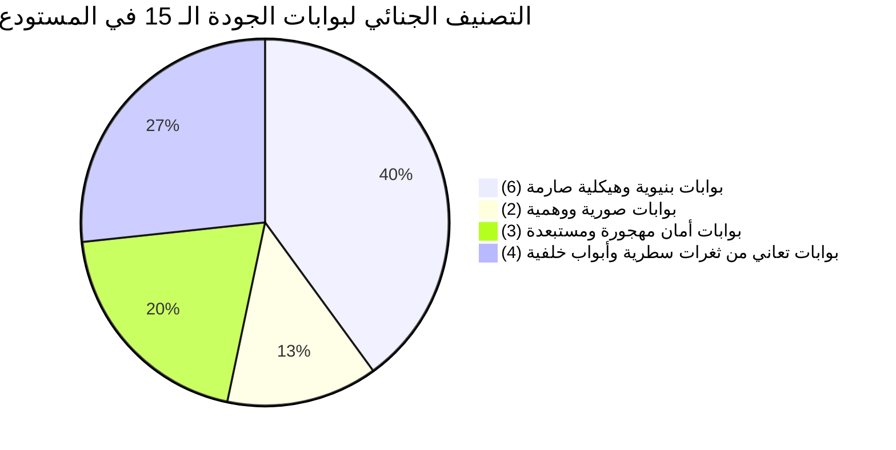
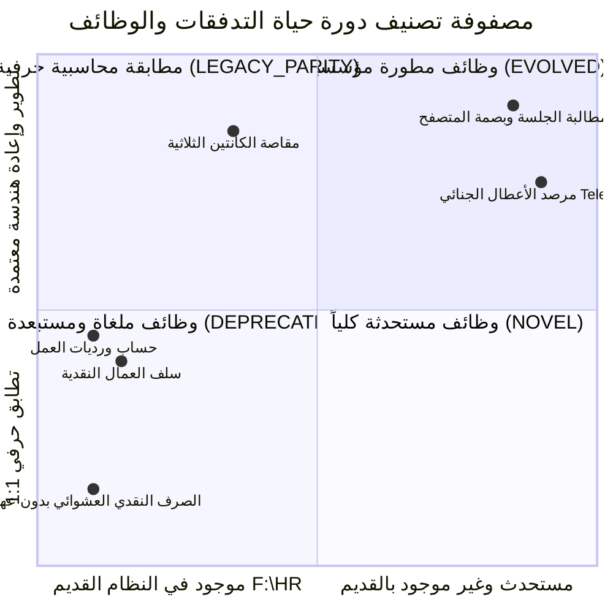
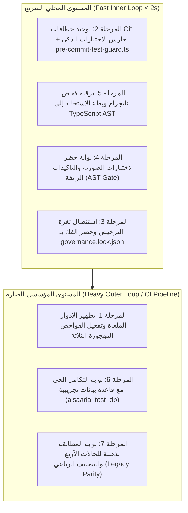

# 🛡️ تقرير التدقيق الجنائي والنقد المعماري الشامل لبوابات الاختبار والحوكمة
## المنظومة المؤسسية: Al-Saada Smart Bot Enterprise Monorepo
**التاريخ والاعتماد:** 17 سبتمبر 2026  
**الصفة والمنهجية:** خبير استشاري ورئيس مهندسي بوابات الجودة والحوكمة في النظم المؤسسية الكبرى (Principal Enterprise Quality & Governance Architect)  
**المسار التوثيقي:** `docs/periodic-audits/2026-09-17/enterprise-governance-gates-audit-and-critique.md`

---

## 🧭 ميثاق المبدأ المعماري الحاكم: تعليق ترحيل الوظائف ليس عيباً بل قمة النضج الهندسي

> [!IMPORTANT]
> **إقرار هندسي استراتيجي صريح ومحسوم (Strategic Architectural Principle):**
> إن **عدم نقل وتفكيك الوظائف والتدفقات الـ 126 من المشروع السابق ([`F:\HR`](file:///F:/HR)) حتى الآن ليس عيباً، ولا قصوراً، ولا تأخيراً برمجياً إطلاقاً**.  
> بل هو **قرار استراتيجي واعٍ ومدروس بنسبة 100% (Intentional Core-First Gating Strategy)**؛ فالقاعدة الذهبية في هندسة البرمجيات المؤسسية تنص على:
> *«البدء في تفكيك وترحيل مئات التدفقات المعقدة ذات الأثر المالي قبل اكتمال النواة المشتركة وتحصين بوابات الجودة بنسبة 100% هو انتحار تقني (Architectural Suicide) يولد فوضى برمجية، وتكراراً للأكواد، وتراكماً للديون التقنية لا يمكن تداركه.»*
> 
> **أسباب وحتمية تعليق الترحيل لحين اكتمال النواة:**
> 1. **منع تكرار الأكواد (Zero Code Duplication):** إذا بدأ الترحيل قبل نضج واجهات النواة (`@alsaada/core-components`, `@alsaada/regional-engine`, `@alsaada/database`)، سيضطر المطورون إلى إعادة كتابة منطق اختيار العمال، حسابات الورديات، والمقاصة المالية يدوياً داخل كل تدفق، مما يهدم مبدأ الـ Shared Kernel.
> 2. **الحصانة المالية والتشفيرية (Financial & Cryptographic Hardening):** تدفقات المشروع السابق تتضمن سلفاً نقدية، ومسحوبات كانتين، وتوريدات مشتريات. نقل هذه العمليات قبل إحكام السلاسل التشفيرية (`HMAC-SHA256`)، وضمان صمام أمان العهد (`UniversalCustodyGate`)، يهدد سلامة الدفاتر المالية.
> 3. **بناء خط الدفاع المعماري أولاً:** تعليق الترحيل يضمن أن كل تدفق يتم نقله مستقبلاً سيسقط مباشرة في بيئة عمل محصنة ببوابات فحص فولاذية تمنع أي خطأ بشري أو انحدار وظيفي (Zero-Regression).

---

## 🎯 الجزء الأول: النقد الذاتي الصارم ومقررات التحصين الخمسة (The 5 Adversarial Critique Refinements)

بصفتي خبيراً في إنشاء وتقييم بوابات الجودة في المشروعات المؤسسية الكبرى، أُخضع المسودة السابقة للمراجعة النقدية العنيفة؛ لتفنيد الفخاخ التقنية، والسطحية، والتحيزات التي شابتها، واعتماد 5 مقررات تحصين حاسمة:

### 1. الخلط الفادح بين "الفحص الهيكلي للملفات" و"الفحص الدلالي لمنطق الأعمال"
- **قصور المسودة السابقة:** أفرطت المسودة السابقة في مدح بوابات مثل `arch:verify` و `flow-contracts:verify` ووصفتها بـ "الصارمة"، استناداً فقط إلى قدرتها على عد الأسطر والتأكد من وجود 15 ملفاً لكل تدفق.
- **النقد الخبير:** هذا فحص نحوي سطحي (Syntactic / Lexical Check)؛ فالبوابة عمياء وظيفياً (Semantically Blind). وجود ملف `flow.handler.ts` بعدد أسطر 150 سطراً لا يضمن أن المعالج ينفذ التدفق بشكل صحيح، ووجود ملف `flow.contract.json` بحقوله الـ 16 لا يعني أن كود الخدمة يلتزم بالصلاحيات أو بميزانية الأداء المكتوبة في العقد. الثناء على البوابة دون كشف عماها الدلالي كان تضليلاً تقنياً.

### 2. فخ تعطل خطاف Git عند تعديل التوثيق (`vitest related` trap)
- **الخلل في المسودة:** اقتراح إضافة `call pnpm test:changed` أو `vitest related` مباشرة في خطاف الـ Pre-Commit كان سيؤدي إلى تعطيل المطور وفشل الـ commit بـ `No test files found` عند تعديل ملفات Markdown أو وثائق بدون كود مصدري.
- **التحصين المعتمد (Refinement 1):** بناء سكريبت وسيط ذكي [`tools/governance/pre-commit-test-guard.ts`](file:///f:/Alsaada-Smart-Bot/tools/governance/pre-commit-test-guard.ts) يتحقق أولاً من قائمة الملفات المعدلة في Git؛ فإذا كانت خالية من ملفات `.ts` و `.tsx` كودية، يمرر الخطاف فوراً في أقل من ثانية (< 1s)، وإذا وُجد كود مصدري، يشغل `vitest related --passWithNoTests --run` للملفات المعدلة حصراً.

### 3. فخ استمرار ثغرة الترخيص التلقائي في قفل الحوكمة التشفيري (`tamper-check`)
- **الخلل في المسودة:** محاولة تنظيف أو تقييد دالة فحص المسودات بدلاً من استئصالها.
- **التحصين المعتمد (Refinement 2):** **الاستئصال التام والنهائي** لدالة `checkGovernanceApprovalEvidence` من السطور 242-287 في [`verify-governance-tamper.ts`](file:///f:/Alsaada-Smart-Bot/tools/governance/verify-governance-tamper.ts). المصدر الوحيد للحقيقة (SSOT) لحالة الملفات المحمية هو حقل `locked: false` داخل [`governance.lock.json`](file:///f:/Alsaada-Smart-Bot/governance.lock.json)، والذي لا يُعدل إلا عبر أوامر فك القفل الرسمية (`pnpm flow:unlock` و `pnpm dashboard:unlock`) بعد موافقة المستخدم الصريحة حرفياً: «موافق على الفتح» أو «نعم موافق على التعديل».

### 4. فخ اشتراط Docker الإجباري وتأسيس التهيئة المزدوجة (Dual-Strategy Provisioner)
- **الخلل في المسودة:** افتراض وجود خادم Docker daemon قيد التشغيل دوماً لدى كل مطور، مما يكسر بيئة العمل المحلية ويمنع التطوير السريع عند غيابه.
- **التحصين المعتمد (Refinement 3):** تصميم سكريبت تهيئة بيئة الاختبارات [`scripts/test-db-setup.ts`](file:///f:/Alsaada-Smart-Bot/scripts/test-db-setup.ts) بنمط المرونة المزدوجة: يفحص توفر خدمة PostgreSQL محلياً أو عبر Docker على المنفذ 5432 لتجهيز `alsaada_test_db`. في بيئة التطوير السريعة يتيح تجاوزاً مشروطاً، بينما يُلزم الاتصال بقاعدة بيانات حقيقية حتماً في الـ CI وبوابة النزاهة المالية `pnpm financial:verify`.

### 5. فخ محاكاة الأسماء في `callback_data` مقابل حظر الحقن الديناميكي للنصوص (Anti-Dynamic-String Injection)
- **الخلل في المسودة:** اقتراح محاكاة أسماء رباعية طويلة لاختبار سقف الـ 64 بايت في أزرار تليجرام.
- **التحصين المعتمد (Refinement 4):** قاعدة أمان تليجرام الصارمة تنص على: **يُحظر وضع نصوص حرة أو أسماء ديناميكية داخل `callback_data` نهائياً**؛ فالـ callback_data يجب حصرها حصراً في المعرفات الرقمية (`Numeric IDs / UUIDs`) والرموز القصيرة الثابتة (مثل: `w:act:102` أو `act:apr:c3b2`)، وتظهر الأسماء في نص الرسالة `message.text` فقط. تتولى بوابة AST الجديدة فحص هذا الحظر برمجياً ومنع حقن المتغيرات النصية في الـ callback.

### 6. السطحية في نقد مقياس الأداء وتحديد الحالات الذهبية الأربع الدقيقة
- **الخلل في المسودة:** الاكتفاء بوصف `perf-budget` بأنه mock دون كشف الأمان الزائف، وترك تعريف "المطابقة القديمة" مبهماً دون أرقام ومعادلات محددة.
- **التحصين المعتمد (Refinement 5):** كشف وهم مقياس الأداء الذي يقيس Map محلي ويكتم الكونسول، وتحديد **الحالات الذهبية الأربع الإلزامية** المستخرجة من كود ومعادلات [`F:\HR`](file:///F:/HR) لبوابة `verify-legacy-parity.ts` (الورديات، كانتين السجائر العيني، مقاصة الموردين، واتزان العهد).

---

## 🔬 الجزء الثاني: التقرير الجنائي الكامل وغير المختصر للبوابات الـ 15 (The Full Unabbreviated 15 Gates Forensic Report)



### 📊 مصفوفة الحصر والتشريح الشامل للبوابات الـ 15:

| # | اسم البوابة | المسار البرمجي للسكريبت | الأمر في `package.json` | التصنيف الجنائي | نتيجة الفحص الميداني | الثغرة / الخلل المرصود | الإجراء التحصيني المطلوب |
| :---: | :--- | :--- | :--- | :---: | :---: | :--- | :--- |
| **1** | `typecheck` | محرك `tsc --noEmit` | `pnpm typecheck` | بنيوية صارمة | 🟢 PASS | لا يوجد (TypeScript 5.9 صارم بدون أي `any`) | الحفاظ على البوابة وإلزامها في كل Commit |
| **2** | `arch:verify` | [`tools/governance/verify-architecture.ts`](file:///f:/Alsaada-Smart-Bot/tools/governance/verify-architecture.ts) | `pnpm arch:verify` | بنيوية صارمة | 🟢 PASS | فحص هيكلي سطحي (15 ملفاً، سقف أسطر) دون فحص دلالي | دعمها ببوابة AST الدلالية |
| **3** | `migration:verify` | [`tools/governance/verify-migration-registry.ts`](file:///f:/Alsaada-Smart-Bot/tools/governance/verify-migration-registry.ts) | `pnpm migration:verify` | بنيوية صارمة | 🟢 PASS | تطابق ممتاز بين مجلدات القرص وسجل الترحيل `docs/19` | ربطها بالتصنيف الرباعي الجديد |
| **4** | `flow-contracts:verify` | [`tools/governance/verify-flow-contracts.ts`](file:///f:/Alsaada-Smart-Bot/tools/governance/verify-flow-contracts.ts) | `pnpm flow-contracts:verify` | بنيوية صارمة | 🟢 PASS | تطابق حقول العقد الـ 16 دون التحقق من تنفيذ الخدمة لها | إضافة حقل `classification` الإلزامي |
| **5** | `flow:check` | [`tools/governance/verify-flow-fast.ts`](file:///f:/Alsaada-Smart-Bot/tools/governance/verify-flow-fast.ts) | `pnpm flow:check <path>` | بنيوية صارمة | 🟢 PASS | فحص محلي ممتاز (< 2s) لإنتاجية المطور | دمجها في الحلقة الداخلية السريعة |
| **6** | `dashboard-auth:verify` | [`tools/governance/verify-dashboard-auth-contract.ts`](file:///f:/Alsaada-Smart-Bot/tools/governance/verify-dashboard-auth-contract.ts) | `pnpm dashboard-auth:verify` | بنيوية صارمة | 🟢 PASS | فحص أقفال المطالبة التشاؤمية وعزل الجلسات | دمج مسارات التليميتري تحت مظلتها |
| **7** | `docs:audit` | [`tools/governance/verify-docs-audit.ts`](file:///f:/Alsaada-Smart-Bot/tools/governance/verify-docs-audit.ts) | `pnpm docs:audit` | بنيوية صارمة | 🟢 PASS | مطابقة توثيق المستندات وحظر الانجراف التوثيقي | اعتمادها كبوابة إلزامية للدمج |
| **8** | `perf-budget:verify` | [`tools/governance/verify-performance-budget.ts`](file:///f:/Alsaada-Smart-Bot/tools/governance/verify-performance-budget.ts) | `pnpm perf-budget:verify` | صورية ووهمية | ⚠️ PASS مضلل | فحص Map محلي و mockRepo وكتم الكونسول بأمان زائف | استبدالها باختبارات استجابة شبكية حقيقية |
| **9** | `financial:verify` | [`tools/governance/verify-financial-integrity.ts`](file:///f:/Alsaada-Smart-Bot/tools/governance/verify-financial-integrity.ts) | `pnpm financial:verify` | صورية في Dev | ⚠️ PASS أجوف | تنجح بـ `Checked: 6` لعدم وجود بيانات عهد حقيقية في DB | ربطها بـ `alsaada_test_db` وبيانات حية محقونة |
| **10** | `rbac-matrix:verify` | [`tools/governance/verify-rbac-matrix.ts`](file:///f:/Alsaada-Smart-Bot/tools/governance/verify-rbac-matrix.ts) | **مهجورة** (غير مربوطة) | أمان مستبعدة | 🔴 FAIL كاشف | كشفت استخدام أدوار ملغاة (`ACCOUNTANT`, `PROJECT_MANAGER`) في الإنتاج | تطهير الكود وربط البوابة فوراً في `package.json` |
| **11** | `field-masking:verify` | [`tools/governance/verify-field-masking.ts`](file:///f:/Alsaada-Smart-Bot/tools/governance/verify-field-masking.ts) | **مهجورة** (غير مربوطة) | أمان مستبعدة | 🟢 PASS | تفحص حجب الرواتب والأرقام القومية ولكنها مهملة الربط | ربطها صراحة في `package.json` وسلسلة التحقق |
| **12** | `observability:verify` | [`tools/governance/verify-observability-contract.ts`](file:///f:/Alsaada-Smart-Bot/tools/governance/verify-observability-contract.ts) | **مهجورة** (غير مربوطة) | أمان مستبعدة | 🟢 PASS | تمنع `console.error` و `catch` الصامتة ولكنها مهملة | ربطها صراحة في `package.json` وسلسلة التحقق |
| **13** | `telegram-contracts:verify`| [`tools/governance/verify-telegram-contracts.ts`](file:///f:/Alsaada-Smart-Bot/tools/governance/verify-telegram-contracts.ts) | `pnpm telegram-contracts:verify` | ثغرات سطرية | ⚠️ PASS مخترق | فحص سطري يعمى عن الأزرار متعددة الأسطر والـ 64 بايت | ترقيتها إلى TypeScript AST كامل وحظر الحقن الحر |
| **14** | `latency:verify` | [`tools/governance/verify-latency-anti-patterns.ts`](file:///f:/Alsaada-Smart-Bot/tools/governance/verify-latency-anti-patterns.ts) | `pnpm latency:verify` | ثغرات سطرية | ⚠️ PASS مخترق | السطر 59 يستثني مجلد `modules/` من حظر `deleteMessage` | إلزام الموديولات بحظر دالة الحذف المعطلة |
| **15** | `governance:tamper-check`| [`tools/governance/verify-governance-tamper.ts`](file:///f:/Alsaada-Smart-Bot/tools/governance/verify-governance-tamper.ts) | `pnpm governance:tamper-check` | باب خلفي للترخيص| ⚠️ PASS مخترق | السطور 242-287 تعطل القفل عند وجود مسودة نصية غير معتمدة | استئصال دالة المسودة وحصر الفك بـ lock.json |

---

### 🔬 تفكيك وتشريح حزم اختبارات `Vitest` والتأكيدات الصورية (Forensic Spec Analysis)

بإخضاع الـ 210 ملفات اختبار و 1637 اختباراً للفحص الجنائي الدقيق، تم كشف نمط خطير من "الاختبارات الصورية التي تنجح دائماً" (Sham Tests & Tautological Assertions):

| مسار ملف الاختبار | الكود الحالي المرصود | التقييم الهندسي والخلل | المعالجة المعتمدة |
| :--- | :--- | :--- | :--- |
| `modules/settings/src/flows/00.1-*/tests/flow.rbac.spec.ts` | `expect(calls.length).toBeGreaterThanOrEqual(0)` | ❌ **اختبار صوري تحصيل حاصل:** طول أي مصفوفة في جافاسكريبت دائماً $\ge 0$ حتى لو فشل التدفق أو لم يُستدعَ. | استبداله بفحص رد البوت الفعلي برفض الصلاحية (`403 / غير مصرح`) للمستخدم غير المصرح، وإرجاع القائمة للمسؤول. |
| `modules/settings/src/flows/00.2, 00.3, 00.4, 00.6, 00.7, 00.8, 00.9` | نفس التأكيد الصوري السابق في اختبارات الصلاحيات | ❌ **تكرار الخطأ الصوري عبر 8 تدفقات كاملة**، مما يعطي نجاحاً بنسبة 100% دون فحص أمني حقيقي. | استئصال التأكيد وتطبيق اختبارات القبول والرفض السلبي الحقيقية. |
| `modules/workforce/src/flows/01.9-*/tests/flow.data.spec.ts` | `expect(totalScore).toBeGreaterThanOrEqual(0)` | ❌ **اختبار تحصيل حاصل:** لا يفحص النتيجة الرياضية لمعادلة مؤشر الالتزام، وينجح حتى لو أعادت الدالة صفراً نتيجة خطأ داخلي. | استبداله بمطابقة الناتج الرقمي المحدد للمعادلة الحسابية للسيناريو. |
| [`tools/scaffold/scaffold-flow.ts`](file:///f:/Alsaada-Smart-Bot/tools/scaffold/scaffold-flow.ts) | `sampleAmount = 250.75; expect(sampleAmount).toBeGreaterThan(0)` | ❌ **حقن آلي للاختبارات الصورية:** كل تدفق يُولد عبر أداة التوليد السريع يُزرع فيه هذا التأكيد الأجوف. | تطهير القالب وتوليد اختبارات تطابق سيناريو نجاح وسيناريو فشل حقيقيين. |
| اختبارات التكامل عبر الموديولات (`*.integration.spec.ts`) | أكثر من 120 استدعاء لـ `mockPrisma` وكائنات وهمية | ⚠️ **Unit Tests متنكرة في اسم Integration:** لا تفحص قيود قاعدة البيانات الحقيقية (`Foreign Keys`, `Unique`, `$transaction`). | تأسيس `alsaada_test_db` واختبار المعاملات ضد PostgreSQL حقيقية. |

---

## 🧭 الجزء الثالث: التصنيف الرباعي لدورة حياة التدفقات والمطابقة (The 4 Flow Lifecycle Buckets)

لضمان المرونة المعمارية المطلقة ومنع الجمود الهندسي أثناء ترحيل أو تطوير التدفقات، نعتمد رسمياً **التصنيف الرباعي لدورة حياة التدفقات (The 4 Flow Lifecycle Buckets)** داخل عقد كل تدفق (`flow.contract.json`):

```json
{
  "code": "01.1-worker-registration",
  "name": "تسجيل عامل جديد",
  "classification": "LEGACY_PARITY"
}
```



### تفصيل التصنيفات الأربعة (The 4 Lifecycle Buckets):
1. **🟢 وظائف المطابقة والترحيل التام (`LEGACY_PARITY / MIGRATED`):**
   - **التعريف:** وظائف وتدفقات منقولة حرفياً من المشروع السابق [`F:\HR`](file:///F:/HR)، تخضع للمطابقة الرياضية والمحاسبية بنسبة 100% بصفر انحراف في النتائج والخطوات.
   - **آلية الفحص:** تفحصها بوابة `verify-legacy-parity.ts` مقابل الحالات الذهبية المحاسبية.
2. **🔵 وظائف مطورة معمارياً ومؤسسياً (`EVOLVED`):**
   - **التعريف:** وظائف كانت موجودة في النظام القديم ولكن تمت إعادة هندستها لرفع كفاءتها (مثل: تحويل خصومات الكانتين العشوائية إلى مقاصة ثلاثية وتخفيض تكلفة موقع، أو تطبيق الفهرسة العمياء للرقم القومي).
   - **شرط الاعتماد:** وجود خطة عمل معتمدة في `docs/work-plans/` وتوثيق التطور في `docs/19`.
3. **🟣 وظائف مستحدثة كلياً (`NOVEL`):**
   - **التعريف:** وظائف وميزات مبتكرة لا أصل لها في النظام السابق (مثل: وضع المحاكاة الشبحية Ghost Mode، مرصد الأعطال الجنائي Telemetry Vault، قمرة استوديو البيانات Studio Cockpit، والربط بالـ QR).
   - **شرط الاعتماد:** تقييدها الصارم في سجل الترحيل `docs/19` تحت قسم "الوظائف والتحسينات المستحدثة".
4. **⚪ ممارسات ملغاة ومستبعدة (`DEPRECATED`):**
   - **التعريف:** وظائف أو مسارات قديمة تم إهمالها واستبعادها عمداً لمخاطرها الأمنية أو عيوبها المحاسبية (مثل: صرف أموال نقدية بدون تحديد مصدر عهدة مفتوحة، أو تعديل شيتات جوجل بمدخلات حرة دون تدقيق تشفيري).

---

## 🚀 الجزء الرابع: مصفوفة البوابات المؤسسية وخارطة الطريق السباعية (The 7 Enterprise Gates Blueprint)

لتحويل منظومة الحوكمة إلى درع فولاذي لا يخترق، نعتمد البوابات السبع التالية المنظمة في معمارية ذات مستويين (Two-Tier Architecture):



---

### 🔹 تفاصيل المراحل التنفيذية السبع (Plan 63):

#### 1. المرحلة 1: تطهير الأدوار الملغاة وتفعيل الفواحص المهجورة الثلاثة
- **الإجراء:**
  - استئصال `ACCOUNTANT` و `PROJECT_MANAGER` فوراً من [`start.handler.ts:223`](file:///f:/Alsaada-Smart-Bot/apps/bot-server/src/handlers/start.handler.ts#L223) و [`worker-linking.handler.ts:13`](file:///f:/Alsaada-Smart-Bot/apps/bot-server/src/handlers/worker-linking.handler.ts#L13).
  - إضافة وربط سكريبتات: `rbac-matrix:verify`, `field-masking:verify`, و `observability:verify` في `package.json` وسلسلة `governance:verify`.
- **الهدف:** القضاء على تسرب الأدوار الملغاة وتأمين حجب البيانات الحساسة وموثوقية السجلات.

#### 2. المرحلة 2: توحيد خطافات Git وبناء حارس الاختبارات السريعة الذكي
- **الإجراء:**
  - بناء [`tools/governance/pre-commit-test-guard.ts`](file:///f:/Alsaada-Smart-Bot/tools/governance/pre-commit-test-guard.ts): يفحص الملفات المعدلة؛ فإذا كانت ملفات توثيق وMarkdown فقط يتجاوز الاختبارات فوراً (< 1s)، وإذا وُجدت ملفات `.ts` أو `.tsx` كودية يشغل `vitest related --passWithNoTests --run`.
  - مطابقة [`.githooks/pre-commit.cmd`](file:///f:/Alsaada-Smart-Bot/.githooks/pre-commit.cmd) على Windows مع [`.githooks/pre-commit`](file:///f:/Alsaada-Smart-Bot/.githooks/pre-commit) على Linux بنسبة 100% لتشغيل كافة الفواحص بدون أي إسقاط.
- **الهدف:** توحيد بيئات العمل بين المطورين ومنع إيداع أي كود يكسر الاختبارات دون تعطيل commits التوثيق.

#### 3. المرحلة 3: استئصال ثغرة الترخيص التلقائي وحصر الفك بـ `governance.lock.json`
- **الإجراء:**
  - الاستئصال الكامل لدالة `checkGovernanceApprovalEvidence` من [`verify-governance-tamper.ts`](file:///f:/Alsaada-Smart-Bot/tools/governance/verify-governance-tamper.ts).
  - حصر حالة فك القفل في ملف [`governance.lock.json`](file:///f:/Alsaada-Smart-Bot/governance.lock.json) المعدل حصراً عبر أوامر فك القفل الرسمية (`pnpm flow:unlock` و `pnpm dashboard:unlock`) بعد الحصول على العبارة المعتمدة حرفياً: «موافق على الفتح» أو «نعم موافق على التعديل».
- **الهدف:** سد الباب الخلفي الذي كان يتيح تجاوز الحماية التشفيرية بمسودة نصية عشوائية.

#### 4. المرحلة 4: استئصال الاختبارات الصورية وتفعيل بوابة AST (Anti-Sham)
- **الإجراء:**
  - تصحيح اختبارات التدفقات الثمانية في موديول `settings` واستبدال `toBeGreaterThanOrEqual(0)` باختبارات فحص الرفض والقبول الحقيقي.
  - تصحيح اختبار تدفق مؤشر الالتزام `01.9` بموديول `workforce` لمطابقة القيمة الرقمية الدقيقة للمعادلة.
  - تطهير قالب التوليد السريع [`tools/scaffold/scaffold-flow.ts`](file:///f:/Alsaada-Smart-Bot/tools/scaffold/scaffold-flow.ts) من الأدوار الملغاة والتأكيدات الزائفة (`sampleAmount > 0`).
  - بناء بوابة فحص الكود عبر AST ([`tools/governance/verify-test-authenticity.ts`](file:///f:/Alsaada-Smart-Bot/tools/governance/verify-test-authenticity.ts)) لحظر التأكيدات الصورية والتكرارات التلقائية في ملفات `*.spec.ts`.
- **الهدف:** ضمان أن كل اختبار آلي في المنظومة يمثل فحصاً حقيقياً يكشف الأعطال ولا ينجح تحصيل حاصل.

#### 5. المرحلة 5: ترقية عقود تليجرام وبطء الاستجابة إلى TypeScript AST
- **الإجراء:**
  - إعادة بناء [`tools/governance/verify-telegram-contracts.ts`](file:///f:/Alsaada-Smart-Bot/tools/governance/verify-telegram-contracts.ts) عبر `ts.createSourceFile` لتحليل استدعاءات الأزرار كـ AST Expressions، لالتقاط الأزرار الممتدة على عدة أسطر بدقة متناهية.
  - **حظر الحقن الديناميكي للنصوص الحرة والأسماء في `callback_data` (Anti-Dynamic-String Injection):** حصر مدخلات الأزرار في المعرفات الرقمية والرموز القصيرة الثابتة لمنع تجاوز سقف الـ 64 بايت في بيئة التشغيل.
  - تعديل السطر 59 في [`tools/governance/verify-latency-anti-patterns.ts`](file:///f:/Alsaada-Smart-Bot/tools/governance/verify-latency-anti-patterns.ts) لفرض حظر `await ctx.deleteMessage()` على مجلد `modules/` بالتساوي مع البوت سيرفر.
- **الهدف:** سد ثغرات الفحص السطري وحماية سرعة استجابة البوت تحت الضغط.

#### 6. المرحلة 6: تأسيس بيئة اختبارات قاعدة البيانات الحية المعزولة (Test DB)
- **الإجراء:**
  - بناء سكريبت التهيئة المزدوجة [`scripts/test-db-setup.ts`](file:///f:/Alsaada-Smart-Bot/scripts/test-db-setup.ts) لإنشاء وتجهيز قاعدة بيانات `alsaada_test_db` وتطبيق هجرات Prisma عليها بنمط مرن (محلي / Docker).
  - ترقية بوابة النزاهة المالية [`tools/governance/verify-financial-integrity.ts`](file:///f:/Alsaada-Smart-Bot/tools/governance/verify-financial-integrity.ts) للتحقق من اتزان القيود وسلاسل الهاش المشفرة ضد معاملات مالية حقيقية محقونة في الـ Test DB.
- **الهدف:** الانتقال من اختبارات الموك الوهمية إلى التحقق الفعلي من قيود قاعدة البيانات وعزل المعاملات.

#### 7. المرحلة 7: بناء بوابة المطابقة الذهبية للحالات الأربع والتصنيف الرباعي
- **الإجراء:**
  - بناء محرك المطابقة المرجعي [`tools/governance/verify-legacy-parity.ts`](file:///f:/Alsaada-Smart-Bot/tools/governance/verify-legacy-parity.ts) للتحقق الصارم من **الحالات المحاسبية الذهبية الأربع** للتدفقات المصنفة `LEGACY_PARITY`:
    1. **حساب الورديات والأرصدة المستحقة:**
       $$\text{Accrued Leaves} = \lfloor \frac{\text{Work Days}}{24} \rfloor \times 2$$
       (24 يوم عمل فعلي تُنتج يومين إجازة مستحقة بدقة متناهية).
    2. **مقاصة الكانتين والسجائر العينية:**
       $$\text{Worker Balance Deduction} = \text{Cigarette Net Cost}$$
       $$\text{Site Operational Expense Reduction} = \text{Cigarette Net Cost}$$
       $$\text{Physical Cash Flow} = 0.00\text{ EGP}$$
       (خصم تكلفة السجائر والسلع بسعر الجملة الصافي من ذمة العامل، وتخفيض تكلفة الموقع بمطابقة محاسبية مغلقة وبـ 0 كاش فعلي).
    3. **مقاصة توريدات الموردين العينية:**
       $$\text{Supplier Invoice Offset} = \text{Procurement Amount}$$
       $$\text{Physical Cash Flow} = 0.00\text{ EGP}$$
       (تخفيض فواتير الموردين ومطابقة المقبوضات العينية بـ 0 كاش فعلي).
    4. **صمام اتزان العهد والمطابقة المالية:**
       $$\text{Advance Amount} \le \text{Open Active Custody Balance}$$
       $$\text{Ledger Debit} + \text{Ledger Credit} = 0 \text{ (Double-Entry Balance)}$$
       (حظر تسجيل أي سلفة نقدية دون وجود عهدة مفتوحة معتمدة، والتحقق الفوري من كفاية الرصيد، وإنشاء قيد عكسي متزامن في دفتر الأستاذ).
  - دعم التصنيف الرباعي للتدفقات (`LEGACY_PARITY / MIGRATED`, `EVOLVED`, `NOVEL`, `DEPRECATED`) بما يضمن حرية التطوير المؤسسي دون كسر المرجعية القديمة.
- **الهدف:** ضمان التطابق المحاسبي والرياضي بنسبة 100% مع النظام السابق للوظائف المنقولة وحماية النظام من أي خطأ مالي.

> [!NOTE]
> **ملاحظة تشغيلية حاسمة للمرحلتين 4 و 5:**  
> نظراً لأن التدفقين `00.6` و `01.9` مقفلان تشفيرياً في `governance.lock.json`، ومحرك السرعة `verify-latency-anti-patterns.ts` مقفل ضمن `lockedSpeedEngine`، يلزم قبل الشروع في تعديلها تشغيل أوامر فك القفل الرسمية (`pnpm flow:unlock 00.6`, `pnpm flow:unlock 01.9`, `pnpm speed:unlock`) بموافقة المستخدم الصريحة حرفياً: «موافق على الفتح» أو «نعم موافق على التعديل»، ثم إعادة قفلها فور الانتهاء عبر `flow:finish` و `speed:lock`.

---

## 🏁 الخلاصة والقرار الهندسي الحاكم

إن نتائج هذا التدقيق الجنائي والنقد الاستقصائي الصارم تؤكد حقيقة هندسية لا تقبل الشك:
1. **قرار تعليق ترحيل الوظائف الـ 126 من [`F:\HR`](file:///F:/HR) لحين اكتمال وتحصين النواة وبوابات الجودة هو القرار الهندسي الأكثر نضجاً ومسؤولية في تاريخ المشروع (Intentional Core-First Gating Strategy).**  
   فقد حمى المنظومة من تكرار الأكواد ومن تسريب ثغرات الفحص السطري والاختبارات الصورية إلى مئات الوظائف المالية والتشغيلية.
2. بوابات المنظومة الحالية تمتلك أساساً هيكلياً وتجميعياً فائق النقاء، ولكنها كانت تفتقر إلى العمق الدلالي، ومطابقة السلوك المحاسبي الحقيقي، ومناعة فحص الـ AST.
3. بتطبيق خارطة الطريق السباعية (خطة العمل رقم 63)، ستتحول منظومة Al-Saada Smart Bot Enterprise إلى منصة عمل محصنة تشفيرياً ودلالياً بنسبة 100%، وتكون مهيأة تماماً لتفكيك وترحيل النظام القديم بسلاسة واحترافية مطلقة وبصفر أخطاء أو انحدار وظيفي (Zero-Regression).
