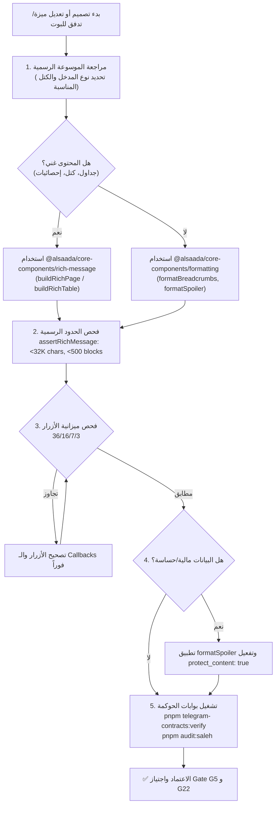

# 📖 الموسوعة المرجعية الرسمية لمميزات وتنسيقات بوت تليجرام ودستور الإلزام التشغيلي
## Official Telegram Bot Features & Formatting Master Encyclopedia & AI Agent Operational Directive

> [!IMPORTANT]
> **المرجعية الدستورية العليا للبوت وواجهات المستخدم (SSOT for Telegram Bot UX/UI):**
> تمثل هذه الموسوعة الدليل المرجعي الرسمي الشامل والمعتمد داخل منظومة **Al-Saada Smart Bot**، والمستمد مباشرة من وثائق تليجرام الرسمية:
> 1. [Telegram Bot Features](https://core.telegram.org/bots/features)
> 2. [Telegram Bot API: Rich Markdown Style & Formatting Options](https://core.telegram.org/bots/api#rich-markdown-style)
>
> **الإلزام القطعي لوكلاء الذكاء الاصطناعي (Mandatory AI Invariant):**
> يُحظر على أي وكيل ذكاء اصطناعي (AI Agent) أو مطور برمجي إنشاء، تعديل، تحسين، أو إعادة هيكلة أي تدفق (Flow)، معالج (Handler)، لوحة مفاتيح (Keyboard)، أو رسالة نصية في المنظومة دون الرجوع إلى هذه الموسوعة والالتزام التام بضوابطها، ومعايير الأرغونوميا ومحرر النصوص الغني المشترك `@alsaada/core-components/rich-message`.

---

## فهرس الموسوعة (Encyclopedia Table of Contents)

1. [الجزء الأول: معمارية مدخلات المستخدم والتحكم (Bot Inputs Architecture)](#1-معمارية-مدخلات-المستخدم-والتحكم-bot-inputs-architecture)
2. [الجزء الثاني: التفاعلات والتدفقات المتقدمة (Interactions & Advanced Flows)](#2-التفاعلات-والتدفقات-المتقدمة-interactions--advanced-flows)
3. [الجزء الثالث: وكلاء الذكاء الاصطناعي والتكامل المؤسسي (AI Agents & Bot Integration)](#3-وكلاء-الذكاء-الاصطناعي-والتكامل-المؤسسي-ai-agents--bot-integration)
4. [الجزء الرابع: الوسائط والمراسلات الغنية وحماية المحتوى (Media & Rich Messaging)](#4-الوسائط-والمراسلات-الغنية-وحماية-المحتوى-media--rich-messaging)
5. [الجزء الخامس: المرجع الموسوعي الكامل لأنماط التنسيق (Formatting Reference)](#5-المرجع-الموسوعي-الكامل-لأنماط-التنسيق-formatting-reference)
6. [الجزء السادس: جسر مواءمة السعادة ومعايير الأرغونوميا (Al-Saada Ergonomics Bridge)](#6-جسر-مواءمة-السعادة-معايير-الأرغونوميا-al-saada-ergonomics-bridge)
7. [الجزء السابع: الموجهات التشغيلية الإلزامية لوكلاء الذكاء الاصطناعي (AI Agent Directives)](#7-الموجهات-التشغيلية-الإلزامية-لوكلاء-الذكاء-الاصطناعي-ai-agent-directives)

---

## 1. معمارية مدخلات المستخدم والتحكم (Bot Inputs Architecture)

يوفر تليجرام أدوات متعددة ومرنة لبناء واجهات تحكم تفاعلية تغني المستخدم عن كتابة النصوص المجردة.

### 1.1 الأوامر (Commands)
الأمر هو كلمة مفتاحية تبدأ برمز `/` تُعرّف البوت بما يجب تنفيذه:
- **الشروط القياسية للأمر:**
  - الطول الأقصى: 32 حرفاً.
  - الرموز المسموحة: الأحرف اللاتينية الصغيرة (`a-z`)، الأرقام (`0-9`)، والشرطة السفلية (`_`).
  - الوضوح والتحديد: استخدام أسماء محددة مثل `/newlocation` أو `/newrule` بدلاً من أسماء عامة مثل `/new` التي تتطلب معلمات إضافية.
- **تخصيص نطاقات الأوامر (Command Scopes):**
  - يدعم Bot API تخصيص قائمة الأوامر المعروضة للمستخدمين عبر `setMyCommands` باستخدام كائنات `BotCommandScope`:
    * `BotCommandScopeDefault`: النطاق الافتراضي لكافة المستخدمين.
    * `BotCommandScopeAllPrivateChats`: لكافة المحادثات الفردية.
    * `BotCommandScopeAllGroupChats`: لكافة المجموعات.
    * `BotCommandScopeAllChatAdministrators`: لجميع مديري المجموعات والقنوات.
    * `BotCommandScopeChat`: لمحادثة محددة بـ `chat_id`.
    * `BotCommandScopeChatMember`: لعضو محدد في محادثة معينة.
  - دعم الترجمة المباشرة للأوامر عبر تمرير `language_code` للمستخدم.
- **الأوامر العامة الإلزامية (Mandatory Global Commands):**
  - `/start`: لبدء التفاعل وإظهار الرسالة الترحيبية ودعم الروابط العميقة.
  - `/help`: لعرض دليل المساعدة وقائمة الوظائف المتاحة.
  - `/settings`: لعرض وتعديل إعدادات المستخدم والنظام.

### 1.2 لوحات المفاتيح المخصصة (Custom Reply Keyboards)
تستبدل لوحة المفاتيح الافتراضية للمستخدم بأزرار محددة مسبقاً (`ReplyKeyboardMarkup`):
- `resize_keyboard: true`: تصغير ارتفاع الأزرار لتناسب شاشات الهواتف رأسياً دون حجب الرسائل.
- `one_time_keyboard: true`: إخفاء لوحة المفاتيح فور اختيار المستخدم لأحد الأزرار.
- `input_field_placeholder`: نص إرشادي باهت داخل حقل الكتابة يوضح المدخل المطلوب (مثل: *"اكتب الرقم القومي المكون من 14 رقماً..."*).
- `selective: true`: إظهار لوحة المفاتيح لمستخدمين محددين (في المجموعات).
- **أزرار الطلب المباشر من النظام:**
  * `request_contact: true`: طلب رقم هاتف المستخدم المسجل رسمياً للتحقق من الهوية.
  * `request_location: true`: طلب إحداثيات GPS المباشرة لحضور وانصراف المواقع.
  * `request_poll`: طلب إنشاء استطلاع رأي.

### 1.3 لوحات المفاتيح المضمنة (Inline Keyboards)
تظهر الأزرار أسفل الرسالة مباشرة (`InlineKeyboardMarkup`) ولا ترسل رسائل نصية في المحادثة، مما يحافظ على نظافة الشاشة:
- **أنواع أزرار الـ Inline:**
  1. **أزرار الاستدعاء (`callback_data`):** ترسل استدعاءً خلفياً للبوت (سقف تليجرام 64 بايت، وسقف السعادة المؤسسي **36 بايت**).
  2. **أزرار الروابط (`url`):** تفتح روابط ويب خارجية أو روابط تليجرام داخلية (`tg://`).
  3. **أزرار تطبيقات الويب (`web_app`):** تفتح Telegram Mini App مباشرة داخل نافذة منبثقة تفاعلية.
  4. **أزرار التحويل المضمن (`switch_inline_query`):** تفتح محادثة أخرى مع إدراج معرف البوت وكلمة بحث.
  5. **أزرار النسخ الفوري (`copy_text`):** مدعومة في Bot API 7.10+ لنسخ أرقام الهواتف أو الحسابات أو المعرفات بنقرة واحدة إلى حافظة الهاتف.
  6. **الأزرار المعطلة (`disabled`):** مدعومة في Bot API 10.3+ لإظهار زر خامل غير قابل للنقر مع الحفاظ على التخطيط البصري.
- **التحديث الموضعي (In-Place Editing):**
  - استخدام `editMessageReplyMarkup` أو `editMessageText` لتحديث الرسالة والأزرار فورياً عند تنقل المستخدم بين التبويبات بدلاً من إرسال رسائل جديدة.

### 1.4 زر القائمة الدائم (Menu Button)
يظهر بجوار حقل الإدخال في كافة المحادثات الخاصة:
- يدعم البوت تعيين سلوك الزر عبر `setChatMenuButton`:
  * عرض قائمة أوامر البوت المعتمدة (`BotMenuButtonCommands`).
  * تشغيل Mini App مباشرة بضغطة زر واحدة (`BotMenuButtonWebApp`).

### 1.5 واجهة اختيار المستخدمين والمحادثات (Chat & User Selection)
تتيح للمستخدمين اختيار مستخدم آخر أو مجموعة أو قناة وفق شروط معينة دون الحاجة لكتابة المعرف أو الاسم:
- `KeyboardButtonRequestChat`: تحديد معايير المجموعة (هل البوت أدمن؟ هل يملك صلاحيات معينة؟).
- `KeyboardButtonRequestUsers`: تحديد معايير المستخدمين (طلب مستخدم أو عدة مستخدمين، روبوت أم بشري، هل هو بريميوم؟).
- يستقبل البوت رسالة خدمية رسمية بنمط `chat_shared` أو `users_shared` تحتوي على المعرف الرقمي المطلوب.

---

## 2. التفاعلات والتدفقات المتقدمة (Interactions & Advanced Flows)

### 2.1 النمط المضمن (Inline Mode)
يتيح للمستخدمين استدعاء البوت من أي محادثة أو مجموعة بمجرد كتابة `@botusername query`:
- يرسل تليجرام تحديث `inline_query` للبوت.
- يرد البوت بقائمة نتائج (`answerInlineQuery`) تتضمن مقالات، صور، أو كروت مخصصة.
- عند اختيار المستخدم لنتيجة، تُرسل فوراً إلى المحادثة مع إشعار البوت عبر `chosen_inline_result`.

### 2.2 الروابط العميقة (Deep Linking)
آلية تمرير معلمات برمجية للبوت عند بدء المحادثة عبر الرابط الرسمي `https://t.me/<bot_username>`:
- **المحادثات الخاصة (`start` parameter):**
  - الرابط: `https://t.me/your_bot?start=PAYMENT_12345`
  - التحديث المستقبل في البوت: `/start PAYMENT_12345`
- **المجموعات (`startgroup` parameter):**
  - الرابط: `https://t.me/your_bot?startgroup=LINK_PROJECT_HQ`
  - التحديث المستقبل في البوت: `/start@your_bot LINK_PROJECT_HQ`
- **قواعد المعلمات:**
  - الطول الأقصى للمعلمة: **64 حرفاً**.
  - الرموز المسموحة: `A-Z`, `a-z`, `0-9`, `_`, `-`.
  - يُوصى باستخدام تشفير `base64url` لتمرير البيانات المركبة والمشفرة.

### 2.3 رسائل وأوامر الخفاء المؤقتة (Ephemeral Messages & Commands - Bot API 10.2+)
تمكّن البوت من إرسال ردود خاصة داخل المجموعات والفرق يراها المستخدم المعني والبوت فقط، دون أن تظهر لبقية أعضاء المجموعة:
- **كائن المعلمات (`EphemeralMessageParameters`):**
  - تمرير `ephemeral_message_parameters` في كافة دوال الإرسال (`sendMessage`, `sendPhoto`, `sendRichMessage`, إلخ).
  - استخدام الخاصية `replace_callback_query_message: true` لإظهار الرد الخفي في نفس موضع الرسالة الأصلية التي احتوت على الزر المنقور.
- **أوامر الخفاء الثنائية (Two-Way Ephemeral Commands):**
  - تحديد `is_ephemeral: true` في كائن `BotCommand`، مما يجعل أمر المستخدم نفسه مخفياً عن أعضاء المجموعة، مما يوفر خصوصية تامة للعمليات المالية والحساسة في المجموعات المشتركة.
- **إدارة الرسائل الخفية:**
  - الرد على الرسائل الخفية عبر `ReplyParameters.ephemeral_message_id`.
  - حذف الرسالة الخفية برمجياً عبر `deleteEphemeralMessage`.

### 2.4 الردود المتدفقة والمسودات الحية (Streaming Replies & Drafts)
تتيح للبوت بث مسودة إجابة حية تظهر للمستخدم أثناء توليد الرد من نماذج الذكاء الاصطناعي بدلاً من جعله ينتظر اكتمال العملية:
- **الدوال الرسمية:**
  - `sendMessageDraft`: إرسال وتحديث مسودة نصية عادية.
  - `sendRichMessageDraft`: إرسال وتحديث مسودة غنية تتضمن كتل وتنسيقات `InputRichMessage`.
- **مؤشر التفكير المباشر (`Thinking Placeholder`):**
  - عند إرسال مسودة فارغة، يظهر تليجرام مؤشر *"Thinking..."* للمستخدم.
  - دعم وسم `<tg-thinking>` في HTML أو الكتلة الرسمية `InputRichBlockThinking` لإظهار مساحة التفكير المتحركة.
- **إلغاء المعالجة التفاعلي (`MessageGenerationStopped`):**
  - تفعيل الخيار `can_stop: true` يتيح للمستخدم النقر على زر إيقاف التوليد في التطبيق.
  - يستقبل البوت تحديث `Update.stopped_message_generation` مما يسمح بإلغاء استدعاء الـ LLM في الخلفية وتوفير الموارد.
- **إرسال الرسالة النهائية:**
  - مسودات الردود هي معاينات مؤقتة؛ عند اكتمال الرد، يجب إرسال الرسالة الدائمة عبر `sendMessage` أو `sendRichMessage`.

### 2.5 موضوعات المحادثات الخاصة (Topics in Private Chats)
تنظيم المحادثات الطويلة مع المستخدم داخل البوت إلى موضوعات مستقلة (مثل: موضوع للدعم الفني، موضوع للعهد، وموضوع للإجازات):
- إدارة الموضوعات برمجياً عبر: `createForumTopic`, `editForumTopic`, `deleteForumTopic`.

---

## 3. وكلاء الذكاء الاصطناعي والتكامل المؤسسي (AI Agents & Bot Integration)

### 3.1 النمط المساعد ونمط الضيف (Guest Bots - Bot API 10.0+)
يتيح للمستخدمين استدعاء بوتات تخصصية داخل المحادثة والمجموعات للإجابة على استفسارات سريعة دون الحاجة لإضافتهم كأعضاء دائمين:
- تفعيل الخاصية عبر `supports_guest_queries: true`.
- استقبال رسائل الضيف عبر `Update.guest_message`.
- الرد الفوري المباشر عبر دالة `answerGuestQuery`.

### 3.2 التواصل المتبادل بين البوتات (Bot-to-Bot Communication)
دعم تبادل الرسائل والبيانات المباشرة بين بوتات مختلفة عبر المعرفات الرسمية، لتمكين سيناريوهات التعاون بين أسراب البوتات المؤسسية المستقلة.

### 3.3 بوتات الأعمال وسكرتارية الحسابات (Business & Secretary Bots)
تمكين البوت من إدارة حساب تليجرام للمستخدمين والشركات للرد التلقائي وإدارة الرسائل الواردة استناداً إلى Bot API 10.0+.

### 3.4 المجتمعات المترابطة (Communities - Bot API 10.2+)
ربط مجموعة من القنوات والمجموعات والبوتات التابعة لنفس المنشأة في كيان مجتمعي واحد (`Community`) مع استقبال تنبيهات الانضمام والمغادرة عبر `CommunityChatAdded` و `CommunityChatRemoved`.

---

## 4. الوسائط والمراسلات الغنية وحماية المحتوى (Media & Rich Messaging)

### 4.1 استطلاعات الرأي والاختبارات المتقدمة (Polls & Quizzes - Bot API 10.0+)
- دعم إرفاق وسائط (صور، روابط، مواقع، ملصقات) داخل خيارات الاستطلاع وتفسيرات الاختبارات عبر `InputPollMedia` و `InputPollOptionMedia`.
- خيار اقتصار الاستطلاع على أعضاء القناة/المجموعة حصراً (`members_only: true`).
- خيار استهداف دول محددة لخيارات الاستطلاع (`country_codes`).

### 4.2 الصور الحية والوسائط المدفوعة (Live Photos - Bot API 10.0+)
- إرسال الصور المقترنة بمقطع فيديو قصير عبر `sendLivePhoto` و `InputMediaLivePhoto`.
- دعم الصور الحية كوسائط مدفوعة عبر `PaidMediaLivePhoto`.

### 4.3 مجموعات الوسائط والكولاج (Media Groups)
- تجميع ما يصل إلى 10 صور أو مستندات أو فيديوهات في شبكة بصرية أنيقة واحدة عبر `sendMediaGroup` لمنع تشتيت المحادثة.

### 4.4 حماية المحتوى والسرية (`protect_content: true`)
- تفعيل خاصية `protect_content: true` في كافة الرسائل التي تشتمل على بيانات مالية، مرتبات، أرقام بطاقات قومية، أو مستندات عهد.
- تمنع هذه الميزة في تليجرام إعادة توجيه الرسالة (`Forwarding`)، منع نسخ النصوص المباشر من واجهة الرسالة، ومنع التقاط لقطات الشاشة (`Screenshots`) على تطبيقات الهواتف المحمولة.

---

## 5. المرجع الموسوعي الكامل لأنماط التنسيق (Formatting Reference)

يدعم تليجرام ثلاثة أنماط رئيسية لتنسيق الرسائل: نمط كتل الرسائل الغنية (Rich Messages)، نمط MarkdownV2، ونمط HTML.

### 5.1 نمط كتل الرسائل الغنية (Rich Messages Blocks - Bot API 10.1+ / 10.3+)
النمط الأحدث والأكثر قوة وتنظيماً، حيث يُرسل ككائن `InputRichMessage` يحتوي على هيكل شجري من الكتل (`blocks`) دون الاعتماد على سلاسل نصية مشوهة.

#### الكتل الرسمية المتاحة (`InputRichBlock`):
| اسم الكتلة | النوع (`type`) | الوظيفة والاستخدام |
| :--- | :---: | :--- |
| **فقرة نصية** | `paragraph` | كتلة نص عادي تدعم كائنات `RichText` وتنسيقاتها المتداخلة. |
| **ترويسة / عنوان** | `heading` | ترويسة رئيسية بحجم محدد من 1 إلى 6 (`size: 1..6`). |
| **كود مسبق التنسيق** | `pre` | كتلة برمجية مونوسبيس مع خيار تحديد لغة البرمجة (`language`). |
| **تذييل** | `footer` | نص تذييل باهت في أسفل الرسالة أو البطاقة. |
| **خط فاصل** | `divider` | خط فاصل أفقي أنيق بين أقسام الرسالة. |
| **صيغة رياضية** | `mathematical_expression` | صيغ ومعادلات LaTeX الرياضية المتقدمة. |
| **مرساة داخلية** | `anchor` | نقطة تثبيت داخل الرسالة للقفز إليها برابط داخلي. |
| **قوائم ومهام** | `list` | قوائم نقطية، رقمية، أو قوائم مهام تدعم الصناديق (`has_checkbox`, `is_checked`). |
| **اقتباس عادي** | `blockquote` | اقتباس نصي مجمع لسياسات أو نصوص مرجعية. |
| **اقتباس ممتد** | `expandable_blockquote` | اقتباس قابل للطي والتوسيع على الهواتف يختصر النصوص الطويلة. |
| **اقتباس بارز** | `pullquote` | اقتباس بارز في منتصف النص للفت الانتباه لأرقام أو ملاحظات هامة. |
| **كولاج وسائط** | `collage` | شبكة مجمعة من الصور والوسائط المتجاورة. |
| **معرض شرائح** | `slideshow` | معرض شرائح تفاعلي للمستندات والوسائط. |
| **جدول بيانات** | `table` | جدول منظم يدعم الرأس، الخطوط (`is_bordered`)، التبادل (`is_striped`)، والضغط (`is_compact`). |
| **تفاصيل قابلة للطي** | `details` | عنصر تفاعلي مدمج (`<details>`) مع عنوان ملخص (`summary`) يفتح بالنقر. |
| **خريطة موقع** | `map` | خريطة جغرافية مدمجة بإحداثيات محددة ونسبة تقريب (`zoom`). |
| **وسائط متخصصة** | `photo`, `video`, `audio`, `voice_note`, `document`, `animation` | إدراج وسائط مدمجة مباشرة ككتل داخل الرسالة. |
| **أزرار مدمجة** | `buttons` | صف أزرار مدمج مباشرة داخل متن الرسالة الغنية مع محاذاة (`align`). |
| **مؤشر التفكير** | `thinking` | كتلة عرض مؤشر تفكير الذكاء الاصطناعي في المسودات الحية. |

#### كيانات النصوص الغنية (`RichText`):
- `bold`, `italic`, `underline`, `strikethrough`, `spoiler`.
- `date_time`: وقت محدد بصيغة يونكس وتنسيق مخصص يتغير وفق منطقة المستخدم الزمنية.
- `text_mention`: إشارة لمستخدم بدون يوزرنيم رسمي عبر كائن `User`.
- `subscript`, `superscript`: نصوص منخفضة ومرتفعة للمعادلات والرموز.
- `marked`: تمييز وتحديد النص بلون مميز (Highlighting).
- `code`: كود مونوسبيس بنقرة نسخ واحدة.
- `custom_emoji`: رموز تعبيرية مخصصة لمعرفات Telegram Premium.
- `mathematical_expression`: تعبيرات رياضية مضمنة في السطر.
- `url`, `email_address`, `phone_number`, `bank_card_number`, `mention`, `hashtag`, `cashtag`, `bot_command`.
- `anchor`, `anchor_link`, `reference`, `reference_link`.
- `button`: زر تفاعلي مضمن داخل السطر النصي نفسه (`richInlineButton`).

#### الحدود الرسمية الصارمة للرسائل الغنية (Rich Message Hard Limits):
1. **الحد الأقصى لعدد الأحرف:** **32,768 حرف UTF-8** (مقارنة بـ 4096 حرفاً فقط للرسائل العادية).
2. **الحد الأقصى لعدد الكتل:** **500 كتلة** (بما في ذلك الكتل المتداخلة وعناصر القوائم وخلايا الجداول).
3. **الحد الأقصى لعمق التداخل:** **16 مستوى**.
4. **الحد الأقصى لمرفقات الوسائط:** **50 مرفق وسائط**.
5. **الحد الأقصى لأعمدة الجدول:** **20 عموداً**.

---

### 5.2 نمط MarkdownV2 الرسمي (Official MarkdownV2 Style)
نمط التنسيق النصي المتقدم الذي يعتمد على علامات الترقيم الخاصة مع ضرورة الهروب الصارم للرموز:

#### جدول علامات MarkdownV2 الرسمية:
| التنسيق | البنية النصية | ملاحظات تليجرام الرسمية |
| :--- | :--- | :--- |
| **عريض (Bold)** | `*bold text*` | غامق بارز |
| **مائل (Italic)** | `_italic text_` | خط مائل |
| **تسطير (Underline)** | `__underline__` | خط تحت الكلمة |
| **شطب (Strikethrough)** | `~strikethrough~` | خط في منتصف الكلمة |
| **تعتيم (Spoiler)** | `\|\|spoiler\|\|` | نص مموه تفاعلي يزول بالنقر |
| **كود مضمن (Code)** | `` `inline code` `` | مونوسبيس للنسخ الفوري بنقرة واحدة |
| **كتلة كود (Preformatted)** | ```` ```language\ncode block\n``` ```` | كود متعدد الأسطر مع لغة البرمجة |
| **اقتباس عادي** | `>single line quote` | اقتباس في بداية السطر |
| **اقتباس ممتد** | `**>expandable blockquote\n>line 2**` | اقتباس قابل للطي والتوسيع |
| **رابط مضمن** | `[inline URL](http://www.example.com/)` | رابط مدمج بنص مخصص |
| **رابط مستخدم** | `[inline mention of a user](tg://user?id=123456789)` | منشن صامت برقم المعرف |
| **إيموجي مخصص** | `` | كود إيموجي مخصص |

#### قواعد الهروب الصارمة في MarkdownV2 (Mandatory Escaping Rules):
يجب وجوباً الهروب برمز الشرطة المائلة العكسية `\` قبل أي من الحروف الـ 18 التالية في أي مكان يقع خارج كتل الكود:
```text
_ , * , [ , ] , ( , ) , ~ , ` , > , # , + , - , = , | , { , } , . , !
```
> ⚠️ **تحذير جنائي:** عدم الهروب لأي رمز من هذه الرموز (خاصة النقطة `.` والشرطة `-` والأقواس `()`) يتسبب فوراً في انهيار استدعاء تليجرام بخطأ `Bad Request: can't parse entities in message`.

---

### 5.3 نمط HTML الرسمي (Official HTML Style)
النمط الأكثر أماناً ضد أخطاء الهروب النصي عند معالجة البيانات الديناميكية:

#### قائمة الوسوم المدعومة حصراً في تليجرام:
- `<b>bold</b>`, `<strong>bold</strong>`
- `<i>italic</i>`, `<em>italic</em>`
- `<u>underline</u>`, `<ins>underline</ins>`
- `<s>strikethrough</s>`, `<strike>strikethrough</strike>`, `<del>strikethrough</del>`
- `<span class="tg-spoiler">spoiler</span>`, `<tg-spoiler>spoiler</tg-spoiler>`
- `<b><i>bold italic</i></b>` (يدعم التداخل المنضبط)
- `<a href="http://www.example.com/">inline URL</a>`
- `<a href="tg://user?id=123456789">inline mention of a user</a>`
- `<tg-emoji emoji-id="5368324127940076788">👍</tg-emoji>`
- `<code>inline monospace code</code>`
- `<pre>preformatted code block</pre>`
- `<pre><code class="language-typescript">code with lang</code></pre>`
- `<blockquote>Block quotation</blockquote>`
- `<blockquote expandable>Expandable block quotation</blockquote>`
- `<tg-thinking>AI thinking placeholder</tg-thinking>` (في المسودات الحية)

#### قواعد الهروب في HTML:
يجب فقط استبدال الرموز الأربعة التالية عند إدراج نصوص ديناميكية:
- `<` يستبدل بـ `&lt;`
- `>` يستبدل بـ `&gt;`
- `&` يستبدل بـ `&amp;`
- `"` يستبدل بـ `&quot;` (داخل خصائص الروابط)

---

## 6. جسر مواءمة السعادة ومعايير الأرغونوميا (Al-Saada Ergonomics Bridge)

لضمان عمل كافة مميزات تليجرام الرسمية بسلاسة على شاشات الهواتف الذكية الميدانية، وضعت المنظومة معايير صارمة محكومة ببوابات الجودة (G5 و G22):

### 6.1 ميثاق الميزانية الذهبية للأزرار `36/16/7/3`
تفرض شاشات الهواتف الذكية (بعرض 360px - 420px) قيوداً فيزيائية على مساحة العرض:

| القيد الهندسي | الحد الأقصى للمنظومة | الحد الأقصى لتليجرام | الغاية التشغيلية والتصميمية |
| :--- | :---: | :---: | :--- |
| **بيانات الـ Callback** | **36 بايت** | 64 بايت | منع انقطاع واختناق المعاملات الديناميكية المتداخلة في المعالجات. |
| **حروف نص الزر الواحد** | **16 حرفاً** | مفتوح | منع بتر النصوص وظهور علامات الحذف (`...`) على شاشات الهواتف الضيقة. |
| **صفوف أزرار الكيبورد** | **7 صفوف** | مفتوح | منع طوفان الشاشة رأسياً وإتاحة رؤية محتوى الرسالة والأزرار معاً. |
| **أزرار الصف الواحد** | **3 أزرار** *(المعيار 2)* | 8 أزرار | تجنب انحشار الأزرار أفقياً ومنع النقر الخاطئ بالإبهام. |

### 6.2 سياسة حظر النصوص العادية (Zero Raw Text Policy - Rule 8.1)
- يُحظر قطعيًا على أي وكيل ذكاء اصطناعي أو مطور استدعاء `ctx.reply("raw string")` أو `ctx.editMessageText("raw string")` بنصوص عادية غير منسقة.
- **الاستيراد الإلزامي الموحد:**
  - القوالب الرسمية: `@alsaada/core-components/rich-message` (`buildRichPage`, `buildRichTable`, `buildRichConfirmation`, `assertRichMessage`).
  - المنسقات المعيارية: `@alsaada/core-components/formatting` (`formatBreadcrumbs`, `formatSpoiler`, `formatMonospace`, `formatExpandableQuote`, `formatClickToCopy`, `buildCopyTextButton`).
  - منسقات الأرقام الإقليمية: `@alsaada/regional-engine` (`formatCurrency`, `formatDateDMY`, `normalizeDigits`).

### 6.3 معيار اتجاه النصوص العربية وثنائية الاتجاه (Arabic BiDi & RTL Alignment)
- فرض `is_rtl: true` على كافة كائنات `InputRichMessage` العربية.
- حقن محرف الاتجاه العربي من اليمين لليسار (`\u200F` - Right-to-Left Mark) عند دمج نصوص عربية مع مصطلحات لاتينية، أكواد، أو عملات مثل `EGP` أو أرقام الهواتف، لمنع ارتداد علامات الترقيم والأقواس في تطبيقات الهواتف.

---

## 7. الموجهات التشغيلية الإلزامية لوكلاء الذكاء الاصطناعي (AI Agent Directives)

يخضع كل وكيل ذكاء اصطناعي ينشئ أو يعدل تدفقات البوت لبروتوكول التحقق الذاتي التالي قبل تسليم أي كود:



### قائمة الفحص الذاتي الإلزامية للوكيل (AI Self-Inspection Checklist):
- [ ] هل تم التحقق من أن الأمر يبدأ بـ `/` ولا يتجاوز 32 حرفاً وبحروف لاتينية صغيرة؟
- [ ] هل تم استخدام قوالب النواة (`buildRichPage`, `buildRichTable`) بدلاً من نصوص عادية مجردة؟
- [ ] هل تم التحقق من حدود الرسالة الغنية عبر `assertRichMessage(msg)`؟
- [ ] هل بيانات الـ callback في لوحة المفاتيح <= 36 بايت ولا تتجاوز سقف 64 بايت؟
- [ ] هل نصوص الأزرار لا تتجاوز 16 حرفاً لمنع البتر على شاشات الهواتف الذكية؟
- [ ] هل شبكة الأزرار لا تتجاوز 7 صفوف ولا تتجاوز 3 أزرار في الصف الواحد؟
- [ ] هل تم تفعيل `protect_content: true` واستخدام `formatSpoiler` لأي بيانات مرتبات أو مستندات عهد؟
- [ ] هل تم توفير زر نسخ فوري `buildCopyTextButton` لكافة المعرفات وأرقام إنستاباي والمحافظ؟
- [ ] هل تم إضافة ترويسة المسار `formatBreadcrumbs` لتحديد موقع المستخدم بوضوح؟
- [ ] هل تم اجتياز الفحص الآلي عبر `pnpm telegram-contracts:verify` و `pnpm audit:saleh`؟

---
**تاريخ التوثيق والاعتماد:** 23 سبتمبر 2026  
**المرجعية:** الهيئة المعمارية العليا — منظومة السعادة سمارت بوت  
