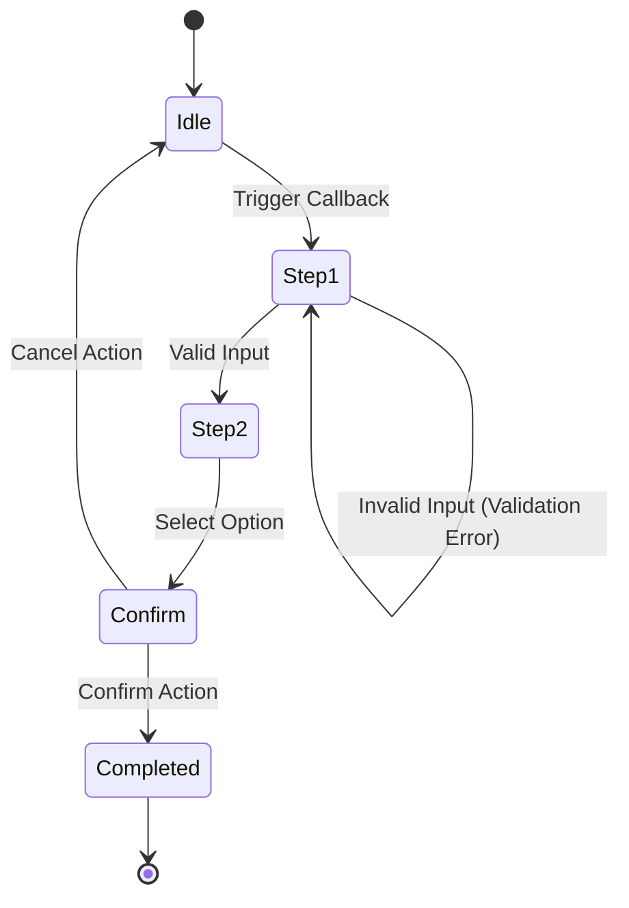

# Flow Migration Card: [Flow Code - Flow Slug]

> **Template Version:** 2.0.0 (Work Plan 89 Standard)  
> **Flow Identifier:** `[XX.X]`  
> **Flow Slug:** `[flow-slug]`  
> **Module:** `modules/[module-name]/`  
> **Status:** `[DRAFT | IN_DEVELOPMENT | UNDER_AUDIT | ACCEPTED]`  

---

## 1. Flow Metadata & Legacy Source

| Field | Detail |
|---|---|
| **Flow Code** | `[XX.X]` (e.g. `01.1`) |
| **Title (Arabic)** | `[عنوان التدفق]` |
| **Title (English)** | `[Flow Title]` |
| **Category** | `[Workforce / Financial / Operational / Settings]` |
| **Legacy F:\HR Source** | `F:\HR\[legacy_file_or_screen]` |
| **Assigned Squad** | `[Squad:UX / Squad:Finance / Squad:Arch]` |
| **Contract File** | `modules/[module-name]/src/flows/[code-slug]/flow.contract.json` |

---

## 2. Legacy `F:\HR` Parity Baseline

### Legacy Behavior Description
> Describe exact inputs, wizard steps, button options, validation rules, calculations, and error messages from `F:\HR`.

### Step-by-Step State Flow
1. **Entry Point / Trigger:** Command `/command` or inline button callback.
2. **Step 1:** Prompt user for `[Input 1]`. Validation: `[Rules]`.
3. **Step 2:** Prompt user for `[Input 2]`. Options: `[Keyboard]`.
4. **Step 3 (Confirmation Card):** Display summary card with masked fields if applicable.
5. **Step 4 (Execution):** Domain service executes mutation with idempotency key.
6. **Completion:** Success message card with back-to-menu keyboard.

---

## 3. Strict 10-File Vertical Slice Verification

| # | Required File | Path | Status |
|---|---|---|---|
| 1 | `flow.contract.json` | `modules/[module]/src/flows/[slug]/flow.contract.json` | `[PASS / FAIL]` |
| 2 | `index.ts` | `modules/[module]/src/flows/[slug]/index.ts` | `[PASS / FAIL]` |
| 3 | `controller.ts` | `modules/[module]/src/flows/[slug]/controller.ts` | `[PASS / FAIL]` |
| 4 | `menu.builder.ts` | `modules/[module]/src/flows/[slug]/menu.builder.ts` | `[PASS / FAIL]` |
| 5 | `action.handler.ts` | `modules/[module]/src/flows/[slug]/action.handler.ts` | `[PASS / FAIL]` |
| 6 | `service.ts` | `modules/[module]/src/flows/[slug]/service.ts` | `[PASS / FAIL]` |
| 7 | `types.ts` | `modules/[module]/src/flows/[slug]/types.ts` | `[PASS / FAIL]` |
| 8 | `validator.ts` | `modules/[module]/src/flows/[slug]/validator.ts` | `[PASS / FAIL]` |
| 9 | `error.handler.ts` | `modules/[module]/src/flows/[slug]/error.handler.ts` | `[PASS / FAIL]` |
| 10 | `flow.docs.md` / Tests | `modules/[module]/tests/flows/[slug]/*.spec.ts` | `[PASS / FAIL]` |

---

## 4. Telegram Mobile Ergonomics Audit (36/16/7/3 Rule)

- [ ] **Callback Data Budget:** Maximum byte size is `<= 36 bytes` (absolute limit 64 bytes).
- [ ] **Button Label Character Budget:** Maximum characters per button is `<= 16 characters`.
- [ ] **Row Limit:** Inline keyboard contains `<= 7 rows`.
- [ ] **Column Limit:** Inline keyboard contains `<= 3 buttons per row`.
- [ ] **Navigation Invariant:** Every interactive screen includes a Back (`⬅️ رجوع`) or Cancel (`❌ إلغاء`) button.
- [ ] **Message Editing Invariant:** In-place message edits (`editMessageText`) used instead of spamming new messages.

---

## 5. Flow State Diagram (Mermaid `stateDiagram-v2`)

---

## 6. Quality Gates Verification (G1–G23)

- **G1 (Type Safety):** 100% typechecked, zero `any`.
- **G4 (Flow Contract):** Contract JSON adheres to `flowContractSchema`.
- **G5 (Telegram Contracts):** Callback data and URLs adhere to length constraints.
- **G6 (Latency Budget):** Flow execution finishes within `<= 300ms`.
- **G7 (RBAC Matrix):** Permissions properly enforced; unauthenticated access rejected.
- **G8 (Compensation Masking):** Salaries and sensitive data masked for unauthorized roles.
- **G9 (Observability):** Zero `console.log` / `console.error`; structured telemetry used.
- **G10 (Test Authenticity):** 5-suite tests pass with genuine assertions (anti-cheating guard).
- **G21 (Idempotency):** Duplicate callback submits safely rejected without side-effects.

---

## 7. Sign-Off & Physical Reality Evidence

| Test Suite | Spec Path | Test Count | Result |
|---|---|---|---|
| **Unit Tests** | `modules/[mod]/tests/flows/[slug].unit.spec.ts` | `[N]` | `PASS` |
| **Integration** | `modules/[mod]/tests/flows/[slug].integration.spec.ts`| `[N]` | `PASS` |
| **UX & Ergonomics** | `modules/[mod]/tests/flows/[slug].ux.spec.ts` | `[N]` | `PASS` |
| **RBAC Security** | `modules/[mod]/tests/flows/[slug].rbac.spec.ts` | `[N]` | `PASS` |
| **Data Invariants** | `modules/[mod]/tests/flows/[slug].data.spec.ts` | `[N]` | `PASS` |

**Squad Reviewer:** `[Name / Squad]`  
**Verdict:** `[APPROVED / REJECTED]`
