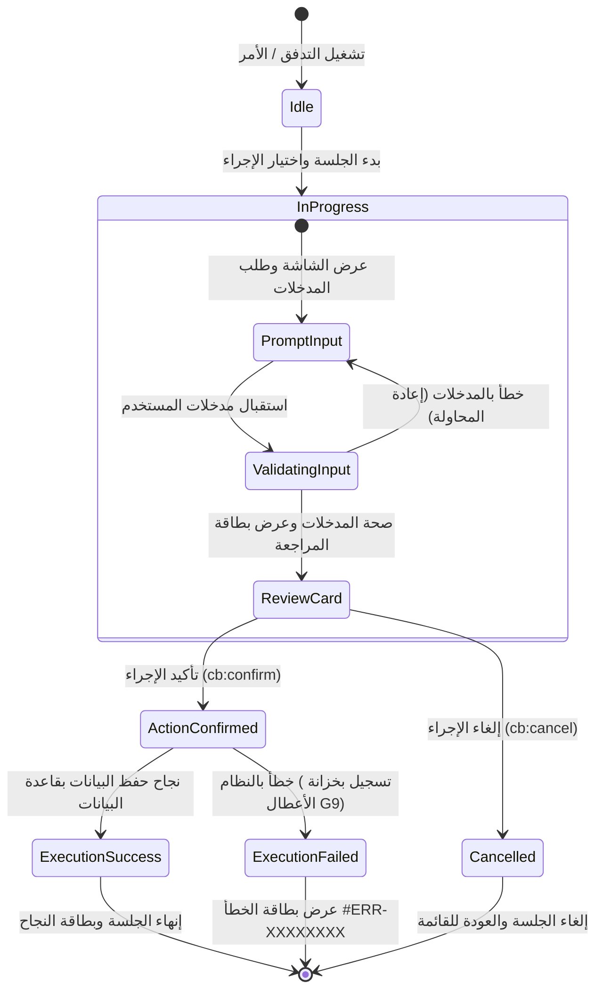
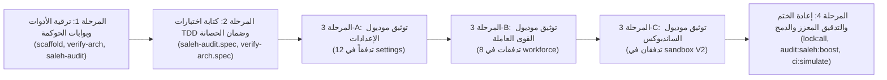

# خطة عمل رقم 101: التوثيق المرئي لمسارات البوت وتحديث مولدات السقالات وتحصين بوابات الحوكمة المؤسسية (النسخة المحصنة v2.0)
## Work Plan 101: Telegram Bot Flow State Diagrams Backfill, Smart Scaffolding Upgrade & Governance Gates Hardening

> **الحالة:** 🟢 معتمدة وجاهزة للتنفيذ بعد تحصينات JEV السبعة (Approved & Ready for Execution)  
> **الفرع المعزول المستهدف (OBOO Branch):** `plan/101-flow-state-diagrams-and-governance-hardening`  
> **المرجع الدستوري:** ميثاق `GEMINI.md` البنود 3 و 5 و 8، نتائج التدقيق الدوري (المحور 12: 50% تحذير)، مصفوفة بوابات الجودة (Gate G2, G5, G13, G19, G22)، كتيب القواعد `Rulebook 07` (القسم 5 و 6)، وكتيب القواعد `Rulebook 11` (معيار التعديل)، وميثاق `WP 96` و `WP 97`  
> **السلطة الرقابية:** `/saleh` (Sovereign Stakeholder Proxy & Chief Strategy Auditor) بالتعاون مع حارس الجودة السحابي `/jev`  
> **النتيجة المستهدفة:** رفع ركيزة توثيق مسارات البوت (المحور 12) من **50% إلى 100%** مع صفر مسارات غير موثقة، وإدراج مخططات الحالة كشرط معزز قطعي لسلامة المعمارية (Exit Code 1).

---

## 🎯 الأركان الستة الهندسية المحصنة (The 6 Hardened Architectural Pillars)

### الركن الأول (Pillar 1): النطاق والهدف والتحليل الجذري المحدث (Scope, Parity & 5 Whys RCA)
- **Baseline Parity:** إغلاق الفجوة التوثيقية والمعمارية في المحور 12 من تقرير التدقيق الدوري (2026-09-23)، ومطابقة الواقع البرمجي لمسارات البوت مع الوثائق الحية بنسبة 100%.
- **التحليل الجذري المعزز للخلل (5 Whys RCA):**
  1. *لماذا تفتقر 22 مساراً من أصل 23 إلى مخططات Mermaid الحية؟*  
     لأن ملفات `flow.docs.md` تم إنشاؤها عبر قوالب سقالات قديمة تفتقر إلى صياغة كتل `stateDiagram-v2`، وفي تدفقات المعمارية الحديثة V2 أسقط مولد السقالات إنشاء الملف كلياً.
  2. *لماذا لم تولد السقالات مخططات حالة؟*  
     أداة `tools/scaffold/scaffold-flow.ts` (السطر 265) كانت تولد نصاً ساذجاً من 10 أسطر يخلو من كتل Mermaid، في حين أن `scaffold-flow-v2.ts` أدرج `flow.docs.md` في العقد ولكنه لم يستدعِ `writeFileSync` لكتابته فعلياً على القرص.
  3. *لماذا لم ترصد بوابات الجودة (CI / Pre-commit) هذا النقص؟*  
     بوابة المعمارية `tools/governance/verify-architecture.ts` وأداة الفحص السريع `verify-flow-fast.ts` كانتا تفحصان فقط مجرد الوجود المادي للملف وأنه غير فارغ (`fileIsNonEmpty`) دون فحص المحتوى النحوي أو التحقق من وجود كتل المخطط وحالاته، بل إن `REQUIRED_FLOW_FILES_V2` أسقطت `flow.docs.md` تماماً من قائمة الملفات الإلزامية لتدفقات V2.
  4. *لماذا لم يُسقط التدقيق الرقابي `/saleh` هذا النقص بحكم [REJECT]؟*  
     أداة `tools/governance/saleh-audit-suite.ts` صنفت فحص `MISSING_STATE_DIAGRAM` كـ `WARNING` بدلاً من `ERROR` عبر استدعاء `warn(result, ...)`, مما سمح بمرور الكود في الـ CI دون أي عائق برمجي.
  5. *ما هو الحل الجذري المستدام لمنع تكرار المشكلة نهائياً؟*  
     ترقية مولدات السقالات (V1 و V2) لتوليد مخططات حالة ديناميكية متكاملة تلقائياً، وتطوير بوابات الحوكمة (`verify-architecture.ts` و `saleh-audit-suite.ts`) لجعل وجود وصحة مخطط `stateDiagram-v2` (نحوياً، وبما لا يقل عن 3 تحولات حالة فعلية، وحالتي بداية ونهاية صريحتين) شرطاً معمارياً إلزامياً مانعاً للدمج (Exit Code 1) تحت Gate G22، مع توثيق كافة التدفقات الـ 22 الحالية على 3 دفعات معيارية منضبطة.

---

### الركن الثاني (Pillar 2): نطاق التعديل والمطابقة الفيزيائية للتدفقات (Blast Radius & Physical Inventory)

#### 1. الحصر الميداني الدقيق للمسارات الـ 22 وفق الواقع الفيزيائي على القرص:
- **موديول الإعدادات (`modules/settings/src/flows/` - 12 تدفقاً):**
  1. `00.1-corporate-profile`: مسار إدارة الملف التعريفي للمؤسسة وبيانات الشركة.
  2. `00.2-sites-hub`: مسار إدارة المواقع الجغرافية ومحددات GPS.
  3. `00.3-job-matrix`: مسار مصفوفة المهن والوظائف المعتمدة.
  4. `00.4-admin-profile`: مسار إدارة الملف الشخصي للأدمن والمشرفين.
  5. `00.5-admin-assignment`: مسار تعيين وتوزيع مدراء المواقع والمسؤولين.
  6. `00.6-ghost-mode`: مسار وضع المحاكاة وانتحال الشخصية للأدمن.
  7. `00.7-audit-incident-vault`: مسار خزانة البلاغات والأعطال الجنائية.
  8. `00.8-apm-telemetry`: مسار مرصد قياس الأداء والسرعة (APM).
  9. `00.9-emergency-cache`: مسار إدارة الكاش الاحتياطي وتجاوز الأعطال.
  10. `00.10-notification-policies`: مسار سياسات الإشعارات والتنبيهات الميدانية.
  11. `00.11-telegram-groups`: مسار إدارة مجموعات وتوبيكات تيليجرام المربوطة.
  12. `00.12-user-rbac-management`: مسار إدارة وتفويض المستخدمين ومصفوفة الأدوار.
  *(ملاحظة: التدفق `00.13-system-backup-recovery` مستثنى لامتلاكه مخططاً موثقاً بالكامل في خطة 99)*

- **موديول القوى العاملة (`modules/workforce/src/flows/` - 8 تدفقات):**
  13. `01.1-worker-registration`: معالج تسجيل وتعيين العمالة وتدقيق الرقم القومي.
  14. `01.2.D-worker-edit`: مسار تعديل بيانات العامل المهنية والشخصية.
  15. `01.4-worker-export`: مسار تصدير بيانات العمالة وكشوف الإكسيل.
  16. `01.5-worker-directory`: دليل وبوابة استعراض سجلات العمالة والبحث.
  17. `01.6-worker-self-edit`: مسار التعديل الذاتي للعامل لبياناته المسموحة.
  18. `01.7-guest-join-and-linking`: مسار انضمام وربط العامل بحسابه في تيليجرام.
  19. `01.8-worker-offboarding`: معالج إخلاء الطرف وإنهاء الخدمة وتصفية العهد.
  20. `01.9-worker-commitment-index`: مسار تقييم مؤشر التزام وسلوكيات العاملين.

- **موديول البيئة التجريبية (`modules/sandbox/src/flows/` - تدفقان من معمارية V2):**
  21. `99.1-sandbox-ping`: مسار فحص الاتصال ونبض المنظومة التجريبي.
  22. `99.2-sandbox-calc`: مسار الآلة الحاسبة واختبارات الحسابات الميدانية.

#### 2. الأدوات البرمجية وبوابات الحوكمة المستهدفة بالتحصين:
- `tools/scaffold/scaffold-flow.ts`: توليد قالب `stateDiagram-v2` ديناميكي مخصص في `flow.docs.md`.
- `tools/scaffold/scaffold-flow-v2.ts`: إضافة استدعاء `writeFileSync` لكتابة `flow.docs.md` فعلياً متضمناً `stateDiagram-v2`.
- `tools/governance/verify-architecture.ts`:
  - إضافة `'flow.docs.md'` إلى `REQUIRED_FLOW_FILES_V2`.
  - إضافة دالة الفحص النحوي `validateMermaidStateDiagram(content)` للتحقق من:
    - وجود `stateDiagram-v2` أو `stateDiagram`.
    - وجود انتقال بدئي `[*] -->`.
    - وجود انتقال نهائي `--> [*]`.
    - وجود 3 انتقالات حالة على الأقل (`-->`).
    - توازن الأقواس في الحالات الفرعية (`state`).
- `tools/governance/verify-flow-fast.ts`: فحص `stateDiagram-v2` السريع في التدفق المستهدف.
- `tools/governance/saleh-audit-suite.ts`:
  - تحويل `severity: 'WARNING'` إلى `severity: 'ERROR'` في فحص `MISSING_STATE_DIAGRAM`.
  - استدعاء `fail(result, ...)` لضمان الخروج بـ Exit Code 1.
- `tools/governance/tests/saleh-audit-suite.spec.ts`: إضافة اختبارات تؤكد سقوط الفحص عند غياب المخطط.
- `tools/governance/tests/verify-architecture.spec.ts`: إضافة اختبارات تؤكد إلزامية المخطط وتفوقه على الفحص السطحي.

---

### الركن الثالث (Pillar 3): بوابات الجودة الإلزامية (Mandatory Quality Gates)
- **Gate G1 (Type Safety):** خلو كافة الأدوات المطورة من أي تجاوز للأنماط الصارمة (`any`).
- **Gate G2 (10-File Slice Architecture):** التطبيق الصارم لشريحة الـ 10 ملفات مع الإلزام القطعي بوجود `flow.docs.md` كمكون معماري لا يقبل الاستثناء في V1 و V2.
- **Gate G5 (Telegram Contracts):** مطابقة حالات المخطط المرئي مع ميزانية الأزرار (36/16/7/3) وأكواد الـ Callbacks الفعلية.
- **Gate G13 (Cryptographic Tamper Guard):** إعادة قفل كافة الكيانات الـ 22 في `governance.lock.json` بنسبة 100% عبر `pnpm lock:all`.
- **Gate G19 (Documentation Parity):** التطابق الجنائي المطلق بين المخطط المرسوم في `flow.docs.md` وبين منطق الكود الفعلي في `flow.handler.ts` أو `controller.ts`.
- **Gate G22 (Mobile Viewport Ergonomics & State Machine Visibility):** تحويل فحص المخطط إلى شرط نجاح إلزامي حاسم (Blocking Failure) يُسقط الدمج فوراً (Exit Code 1).

---

### الركن الرابع (Pillar 4): المعيار المعماري الموحد لمخططات الحالة (State Machine Standard)

#### 1. الهيكل النموذجي لمخطط الحالة المعتمد (`stateDiagram-v2`):

#### 2. القواعد الجنائية لمنع المخططات الصورية (Anti-Sham Rules):
1. **الحد الأدنى للانتقالات:** لا يقل المخطط عن 3 انتقالات حالة (`-->`).
2. **الانتقالات الطرفية:** حتمية وجود `[*] -->` كمدخل و `--> [*]` كمخرج.
3. **الواقعية التشغيلية:** مطابقة أسماء الحالات للأزرار والشاشات الحقيقية (مثل `ActionConfirmed`, `ReviewCard`, إلخ).

---

### الركن الخامس (Pillar 5): مراحل التنفيذ المنضبطة عبر الدفعات المعيارية (Execution Phasing & Batching)

#### تفصيل المراحل:
- **المرحلة الأولى: ترقية أدوات السقالات وبوابات الحوكمة**
  - تحديث `scaffold-flow.ts` لتوليد قالب `stateDiagram-v2` ديناميكي.
  - تحديث `scaffold-flow-v2.ts` لكتابة `flow.docs.md` وتضمين المخطط.
  - ترقية `verify-architecture.ts` بإضافة `flow.docs.md` إلى `REQUIRED_FLOW_FILES_V2` ودالة الفحص النحوي.
  - تصعيد فحص `MISSING_STATE_DIAGRAM` في `saleh-audit-suite.ts` إلى `ERROR` مع `fail(result, ...)`.
- **المرحلة الثانية: اختبارات الحوكمة التلقائية (TDD)**
  - اختبارات في `saleh-audit-suite.spec.ts` تؤكد الخروج بـ Exit Code 1 عند غياب المخطط.
  - اختبارات في `verify-architecture.spec.ts` تؤكد إسقاط التدفقات ذات المخططات الصورية أو التالفة نحوياً.
- **المرحلة الثالثة: التوثيق بأثر رجعي على 3 دفعات معيارية**
  - **الدفعة A (Settings - 12 تدفقاً):** توثيق `00.1` إلى `00.12` بمخططات مطابقة لكود كل معالج.
  - **الدفعة B (Workforce - 8 تدفقات):** توثيق `01.1` إلى `01.9` بمخططات مطابقة لمسارات العمالة.
  - **الدفعة C (Sandbox - تدفقان):** إنشاء `flow.docs.md` لتدفقي `99.1` و `99.2` بمخططات V2.
- **المرحلة الرابعة: إعادة القفل التشفيري التام والتدقيق النهائي**
  - تشغيل `pnpm lock:all` لإعادة ختم الكيانات المعدلة في `governance.lock.json`.
  - تشغيل `pnpm audit:saleh:boost` والتحقق من CGI >= 95%.
  - تشغيل `pnpm ci:simulate` واجتياز كافة الاختبارات الـ 282.

---

### الركن السادس (Pillar 6): مصفوفة الفحص وأوامر القبول الميداني (Verification Matrix)

| أمر الفحص والتحقق | الغرض والهدف | النتيجة المتوقعة |
| :--- | :--- | :---: |
| `pnpm typecheck` | التحقق من تكامل الأنماط الصارمة | Exit Code 0 |
| `pnpm arch:verify` | التحقق من وجود وصحة المخططات في كافة التدفقات الـ 23 | Exit Code 0 |
| `pnpm test tools/governance/tests/saleh-audit-suite.spec.ts` | التحقق من اختبارات التدقيق الرقابي | 100% Pass |
| `pnpm audit:saleh` | التدقيق الموحد لحوكمة العرض والواجهات | Verdict: [PASS] |
| `pnpm audit:saleh:boost` | التدقيق الجنائي المعزز بالترسانة الثلاثية | Verdict: [PASS] |
| `pnpm lock:verify` | التحقق من قفل 100% من الكيانات في المستودع | 355 Locked (0 modified) |
| `pnpm ci:simulate` | محاكاة بوابات التكامل المستمر الـ 23 | 23/23 Gates PASS |

---

## 📜 بطاقة الإقرار الجنائي الختامي (Mandatory Completion Attestation)
عند اكتمال كافة مراحل الخطة واجتياز جميع البوابات، يتم إصدار بطاقة الإقرار الحتمية:
> **«✅ تم توثيق وحل الخلل بالكامل في مجلد المشاكل [INC-20260924-FLOW-DIAGRAMS] داخل الفرع المنعزل واجتياز الفحص الجنائي»**
