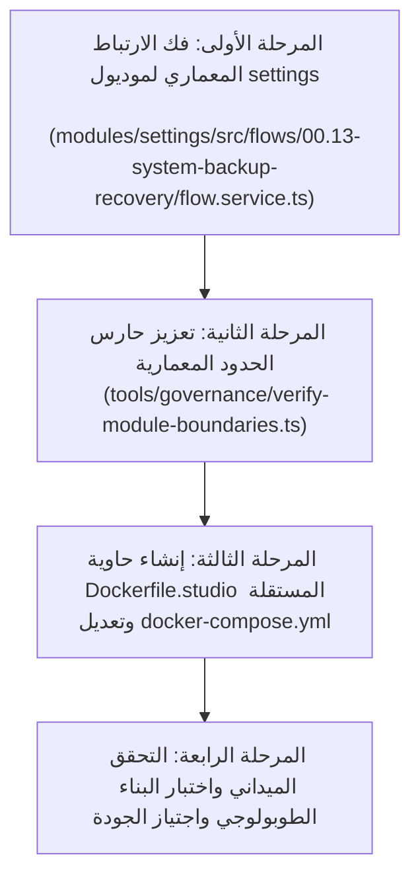

# خطة العمل 103: معالجة الحدود المعمارية وتسريع بناء حاويات الدوكر (Work Plan 103)

> **الحالة:** 🟢 مسودة خطة عمل سيادية مقدمة للمراجعة والاستشارة السحابية (/jev)  
> **المرجع الدستوري:** `GEMINI.md` (البنود 2، 4، 5، 7، 7.1) و `Rulebook 02` و `Rulebook 03` و `Rulebook 05` و `Rulebook 11`  
> **الفرع المنعزل:** `plan/docker-build-acceleration`  
> **تاريخ الإنشاء:** 2026-09-24  
> **المستشار الرقابي:** TypeSafe System One Cloud Sentinel (`/jev`) والمستشار الاستراتيجي (`/saleh`)  

---

## 1. التوصيف الدقيق للأزمة والجذور الجنائية (Incident Overview & Forensic RCA)

### توصيف الفشل الميداني
عند محاولة تشغيل بيئة الحاويات عبر `docker compose up -d` أو بناء خدمة البوت واستوديو قاعدة البيانات، يسقط أمر البناء عند الخطوة 86:
```bash
RUN pnpm --filter @alsaada/bot-server... build
target studio: failed to solve: process "/bin/sh -c pnpm --filter @alsaada/bot-server... build" did not complete successfully: exit code: 1
```

### التحقيق الجنائي خماسي الأسباب (5 Whys Root Cause Analysis)
1. **لماذا فشل أمر البناء في Docker؟**  
   لأن تصريف TypeScript داخل الحزمة البرمجية `@alsaada/settings` تعطل بوجود خطأ `TS6059`.
2. **لماذا أطلق TypeScript الخطأ TS6059 في `@alsaada/settings`؟**  
   لأن إعداد `rootDir` في `modules/settings/tsconfig.json` محدد كـ `./src`، بينما الكود المصدري في `modules/settings/src/flows/00.13-system-backup-recovery/flow.service.ts` يستورد ملفات تقع خارج مجلد `src/` مباشرة (`tools/backup/backup-manager.ts`).
3. **لماذا استورد موديول الإعدادات ملفات من خارج حدوده؟**  
   لأن خدمة النسخ الاحتياطي في تدفق الإعدادات تم ربطها برمجياً بسكربتات موجهة للمطورين وإدارة الحوكمة بدلاً من استهلاك عقود واجهات برمجية مستقلة أو تنفيذ أوامر فرعية منفصلة.
4. **لماذا تفاقم الانهيار داخل حاوية الدوكر مقارنة ببيئة التطوير المباشرة؟**  
   لأن `docker/Dockerfile` يقوم بنسخ ملفات كود الموديولات والحزم الصافية فقط ولا ينسخ مجلد الأدوات `tools/`، مما أحدث فراغاً في الملفات المستوردة داخل بيئة الحاوية المعزولة (Isolation Air-Gap).
5. **لماذا تأثر الهدف `studio` بهذا الانهيار بالرغم من أنه مخصص لـ Prisma Studio؟**  
   لأن تعريف خدمة `studio` في `docker-compose.yml` يشير مباشرة إلى `docker/Dockerfile` الكامل الخاص بالبوت، مما يجبر المنظومة على بناء خادم البوت والموديولات الـ 22 مرتين بالكامل.

---

## 2. الأركان المعمارية الستة الصارمة (The 6-Pillar Architecture)

### الركن الأول: النطاق ومطابقة الأساس الوظيفي (Pillar 1: Scope & Functional Baseline Parity)
- **Scope & Parity:** الحفاظ على التطابق الوظيفي بنسبة 100% مع الأساس المرجعي في `F:\HR` فيما يخص وظائف الإعدادات والصيانة الدورية والنسخ الاحتياطي لقواعد البيانات والتحكم في الحسابات.
- حظر أي انحراف وظيفي (Zero Flow Divergence) في خطوات معالج النسخ الاحتياطي والاستعادة رقم `00.13` وتأكيد سلامة تجربة المستخدم.

### الركن الثاني: نصف قطر الانفجار وعقود البيانات وشريحة الـ 10 ملفات (Pillar 2: Blast Radius & Data Contracts - 10-File Vertical Slice)
- **File Scope & Blast Radius:** ينحصر نطاق التعديل في:
  1. `modules/settings/src/flows/00.13-system-backup-recovery/flow.service.ts`: فك الارتباط المعماري المباشر مع `tools/` واستبداله بواجهة استدعاء نظام فرعية آمنة أو طبقة وسيطة معزولة.
  2. `tools/governance/verify-module-boundaries.ts`: توسيع فحص الحوكمة المعمارية ليشمل حظر استيراد `tools/**` و `scripts/**` من داخل `modules/**` و `packages/**`.
  3. `docker/Dockerfile.studio`: إنشاء ملف دوكر مخصص فائق الخفة لخدمة Prisma Studio بمعزل عن كود البوت.
  4. `docker-compose.yml`: تحديث سياق بناء خدمة `studio` للإشارة إلى `Dockerfile.studio`.
- **10-File Vertical Slice Standard:** تدفق `00.13-system-backup-recovery` يلتزم بالهيكل المعياري لشريحة الـ 10 ملفات دون خرق لعقد `flow.contract.json` أو مسارات التصدير الرسمية.

### الركن الثالث: ميزانية تجربة التيليجرام والهندسة البشرية (Pillar 3: Telegram Mobile UX & Ergonomics Budget - 36/16/7/3)
- **Telegram Mobile Ergonomics:** الحفاظ على قيود الأزرار والواجهات في لوحات تحكم الإعدادات:
  - الحد الأقصى لبيانات الاستدعاء: `<= 36 bytes` (الحد المطلق 64 بايت).
  - الحد الأقصى للنص على الزر: `<= 16 حرفاً` لمنع القص على شاشات الهواتف المحمولة.
  - شبكة الأزرار: لا تزيد عن 7 صفوف، ولا تزيد عن 3 أزرار في الصف الواحد.
  - الاعتماد الحصري على محرر الرسائل الغنية `@alsaada/core-components/rich-message` واستدعاء `assertRichMessage`.

### الركن الرابع: التزامن والثوابت والأمان والحوكمة (Pillar 4: Concurrency, Invariants & Security)
- **Security & Concurrency Safety:**
  - عزل صلاحيات النسخ الاحتياطي ومناورات الاستعادة خلف بوابة التحقق الصارم من صلاحية `SUPER_ADMIN` ومطابقة مصفوفة RBAC (Gate G7).
  - تفعيل الإقفال التشفيري في `governance.lock.json` لكافة الملفات المستهدفة بعد الانتهاء من التعديل المنضبط.
  - ضمان عدم تسريب أي مفاتيح تشفير أو روابط حساسة في سجلات البناء أو رسائل البوت (Gate G16).
  - صيانة مبدأ منع التكرار ومعرفات الـ Idempotency في عمليات طلب النسخ الاحتياطي عبر البوت.

### الركن الخامس: مصفوفة الاختبارات وأوامر التحقق (Pillar 5: Test Matrix & Verification Commands)
- **Test Matrix & Vitest Suite:**
  - تشغيل اختبارات موديول الإعدادات: `pnpm --filter @alsaada/settings test`
  - تشغيل اختبارات الحدود المعمارية: `pnpm module-boundaries:verify`
  - تشغيل اختبار سلامة البناء الطوبولوجي الصافي: `pnpm --filter @alsaada/bot-server... build`
  - اختبار جفاف بناء الحاوية: `docker build -f docker/Dockerfile.studio -t alsaada-studio-test .`
  - التحقق الدستوري الشامل: `pnpm ci:simulate` و `pnpm audit:saleh:boost`

### الركن السادس: معايير القبول وبوابات الجودة (Pillar 6: Acceptance Criteria & Quality Gates G1–G23)
- **Acceptance Criteria:**
  1. اجتياز بناء `pnpm build` و `pnpm --filter @alsaada/bot-server... build` بنجاح كامل (Exit Code: 0).
  2. انخفاض زمن بناء الحاويات بنسبة تتجاوز 60% عبر عزل `Dockerfile.studio`.
  3. مطابقة بوابات الجودة:
     - **Gate G1 (Type Safety):** تصريف منضبط 100% دون أخطاء TS6059 أو استثناءات في الـ rootDir.
     - **Gate G2 (Module Boundaries):** منع أي استيراد عكسي أو عابر للحدود من الموديولات إلى مجلدات السكربتات والأدوات.
     - **Gate G14 (Build Hygiene):** نجاح البناء في البيئات المعزولة بدون كاش محلي ملوث.
     - **Gate G15 (Git Isolation):** تنفيذ العمل داخل الفرع المخصص المنعزل `plan/docker-build-acceleration`.
  4. إصدار بطاقة الإقرار الجنائي الإلزامية عند إتمام التنفيذ.

---

## 3. خطة العمل الميدانية ومراحل التنفيذ (Execution Roadmap)



### تفاصيل المراحل التنفيذية:
1. **المرحلة 1:** إعادة صياغة `flow.service.ts` في تدفق النسخ الاحتياطي بموديول `settings`، بحيث تعتمد على تنفيذ أمر التشغيل الفرعي النظيف عند استدعاء النسخ أو المناورة دون استيراد شفرة `tools/backup` في الـ AST، مما يحل خطأ `TS6059` نهائياً.
2. **المرحلة 2:** تدريع `tools/governance/verify-module-boundaries.ts` بإضافة قاعدة منع استيراد `tools/` و `scripts/` لضمان عدم تكرار المشكلة مطلقاً وإسقاط أي تجاوز في CI.
3. **المرحلة 3:** تجهيز `docker/Dockerfile.studio` النحيف (حجم أصغر، استهلاك أقل للذاكرة، وبناء ينتهي في أقل من 30 ثانية) وتحديث `docker-compose.yml`.
4. **المرحلة 4:** محاكاة البناء الكامل واختبار الحاويات وتشغيل `pnpm audit:saleh:boost` واستكمال الإغلاق التشفيري المعتمد.
