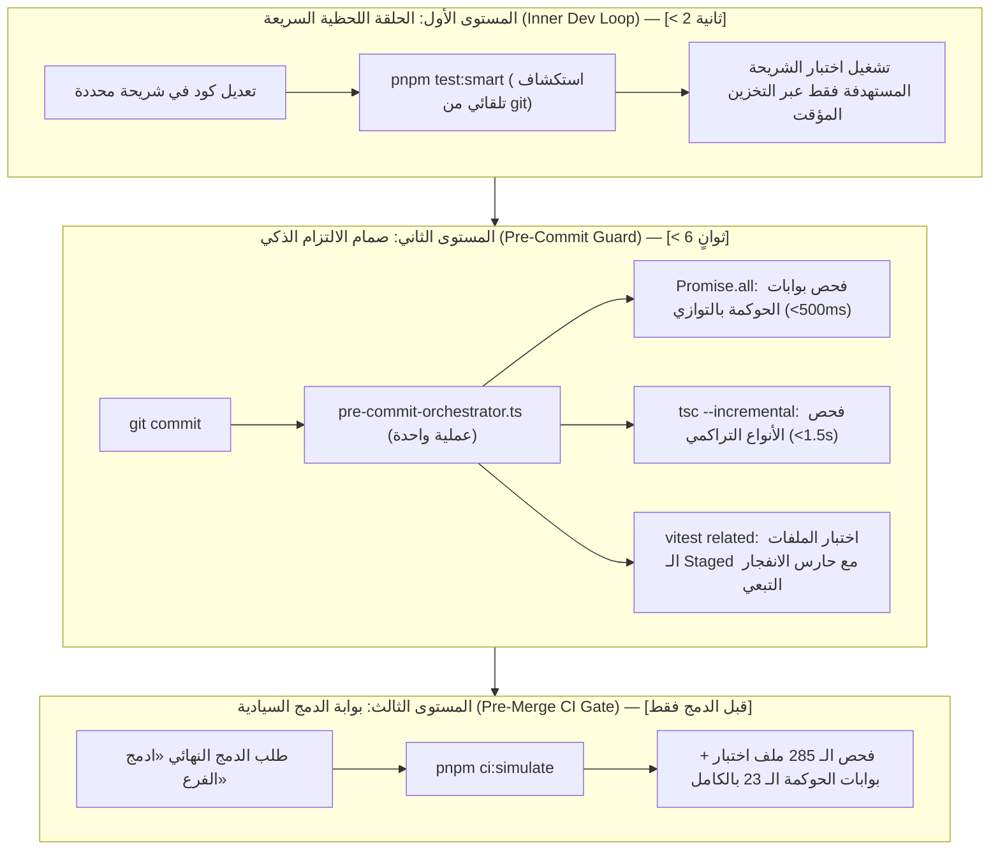

# خطة العمل 104: هندسة هرم الاختبارات المتدرج وتسريع دورة التطوير والالتزام المسبق (Work Plan 104)

> **الحالة:** 🟢 مسودة خطة عمل سيادية محدثة ومحصنة بالمقترحات التحسينية الستة ومجازة من (/jev)  
> **المرجع الدستوري:** `GEMINI.md` (البنود 3، 4، 5، 7، 7.1) و `Rulebook 02` و `Rulebook 03` و `Rulebook 05` و `Rulebook 06` و `Rulebook 11`  
> **الفرع المنعزل:** `plan/test-pyramid-acceleration`  
> **تاريخ الإنشاء والتحديث:** 2026-09-24  
> **المستشار الرقابي:** TypeSafe System One Cloud Sentinel (`/jev`) والمستشار الاستراتيجي (`/saleh`)  

---

## 1. التوصيف الدقيق للأزمة والجذور الجنائية (Incident Overview & Forensic RCA)

### توصيف الفشل الميداني وبطء التطوير
يواجه المطورون ووكلاء الذكاء الاصطناعي بطئاً شديداً وتراكماً زمنياً عند إجراء أي تعديل برمجي (حتى لو كان تعديلاً طفيفاً في سطر واحد داخل شريحة تدفق محددة)، حيث يتم تلقائياً إعادة تشغيل **كامل الاختبارات البرمجية للمستودع** والمكونة من **285 جناح اختبار (`.spec.ts`)**، مما يؤدي إلى:
1. استغراق فترات انتظار طويلة (تتراوح بين دقيقة إلى 3 دقائق) في كل دورة تجربة سريعة (Inner Dev Loop).
2. استهلاك مفرط لموارد المعالج والذاكرة ووحدات الإدخال/الإخراج على بيئة ويندوز نتيجة إطلاق 285 ملفاً مع كل تعديل.
3. ثقل وبطء خطاف الالتزام المسبق (`.githooks/pre-commit`) الذي يستدعي 14 أداة فحص تسلسلياً عبر عمليات `tsx` منفصلة، إضافة إلى بطء أمر `tsc --noEmit` غير التراكمي (يستغرق وحده 10-15 ثانية)، مما يجعل كل `git commit` مرحلي يأخذ وقتاً غير مبرر.

### التحقيق الجنائي خماسي الأسباب (5 Whys Root Cause Analysis)
1. **لماذا يُعاد تشغيل كامل الاختبارات عند كل تعديل بسيط؟**  
   لأن الوكلاء والمطورين يستدعون أمر `pnpm test` العام أو أمر `pnpm ci:simulate` كاستجابة فورية بعد كل تعديل.
2. **لماذا يستدعي الوكلاء والمطورون `pnpm test` و `pnpm ci:simulate` بصورة متكررة؟**  
   لأن وثيقة `GEMINI.md` تضع `pnpm test` و `pnpm ci:simulate` في القائمة البيضاء للأوامر المصرح بها (`Safe Command Whitelist`)، في حين تفتقر الوثيقة لتعريف صريح لأوامر الاختبار الموجه للشريحة المستهدفة (`Targeted Test Commands`) ضمن دورة الـ TDD اليومية، وتفتقر لأداة استهداف ذكية تلقائية.
3. **لماذا يقوم `pnpm test` بتشغيل كافة ملفات الاختبار الـ 285؟**  
   لأن ملف `package.json` يعرف `"test": "vitest run"` دون أي قيود، وملف `vitest.config.ts` يشمل المسار الشامل `include: ['**/tests/**/*.spec.ts']` ككتلة واحدة غير مجزأة إلى مشروعات أو نطاقات تخزين مؤقت.
4. **لماذا يستغرق خطاف الالتزام `pre-commit` وقتاً طويلاً حتى مع التعديلات المحدودة؟**  
   لأن سكريبت `.githooks/pre-commit` يطلق أكثر من 14 استدعاء منفصلاً لأدوات الحوكمة عبر `pnpm <script>`، وكل استدعاء يطلق عملية Node/TSX جديدة بالكامل تقوم بتحميل حزم التايب سكريبت ومطابقة الملفات من الصفر بدلاً من التنسيق الموحد المتوازي في عملية واحدة، فضلاً عن غياب الـ Incremental Caching في `tsc`.
5. **ما هو الجذر المعماري الكامن وراء هذه الأزمة؟**  
   **الخلط المعماري بين حلقة التطوير السريعة (Inner Dev Loop) وبوابة القبول النهائية قبل الدمج (Outer CI Gate)**؛ حيث فُرضت شروط ومحاكاة الـ CI الشاملة ذات الـ 285 ملفاً داخل أصغر خطوات العمل اللحظي أثناء كتابة الكود.

---

## 2. الأركان المعمارية الستة الصارمة (The 6-Pillar Architecture)



### الركن الأول: النطاق ومطابقة الأساس الوظيفي (Pillar 1: Scope & Functional Baseline Parity)
- **Scope & Parity:** الحفاظ الصارم بنسبة 100% على كافة الاختبارات الحالية الـ 285، وعدم حذف أو إضعاف أو تجاوز أي اختبار أو بوابة حوكمة من البوابات الـ 23.
- الحفاظ على التطابق المحاسبي والوظيفي مع الأساس المرجعي في `F:\HR` دون أي انحراف (Zero Flow Divergence).
- **الهدف الهندسي:** تسريع دورة التغذية الراجعة أثناء كتابة الكود إلى أقل من ثانيتين (`< 2000ms`)، وتسريع خطاف الالتزام المسبق إلى أقل من 6 ثوانٍ (`< 6000ms`)، مع الإبقاء على الفحص الشامل للـ 285 ملفاً كشرط إلزامي قطعي عند طلب الدمج فقط (`pnpm ci:simulate` / «ادمج الفرع»).

### الركن الثاني: نصف قطر الانفجار وعقود البيانات والتحسينات المدمجة (Pillar 2: Blast Radius & Data Contracts)
- **File Scope & Blast Radius:** ينحصر نطاق التعديل في:
  1. `package.json`:
     - إضافة سكربت الاستهداف التلقائي الذكي: `"test:smart": "tsx tools/governance/smart-test-runner.ts"`.
     - إضافة سكربت الاستهداف المباشر: `"test:target": "vitest run"`.
     - إضافة سكربتات التقسيم القطاعي: `"test:modules"`, `"test:packages"`, `"test:governance"`.
     - تحسين سكربت خطاف الحفظ الموحد: `"pre-commit:fast": "tsx tools/governance/pre-commit-orchestrator.ts"`.
  2. `tsconfig.json`:
     - تفعيل التصريف التراكمي عبر `"incremental": true` و `"tsBuildInfoFile": "./.cache/tsconfig.tsbuildinfo"` لتقليص زمن الفحص من 12s إلى <1.5s.
  3. `vitest.config.ts`:
     - تفعيل التخزين المؤقت للاختبارات (`cache: true`).
     - تقسيم بيئة الفحص إلى مشروعات (Projects/Workspaces) معزولة: `flows`, `packages`, `governance`, `apps`.
  4. `tools/governance/smart-test-runner.ts`:
     - أداة ذكية تقرأ `git status` وتحدد التدفق أو الموديول النشط الذي يتم تعديله حالياً، وتطلق اختباره المستهدف مباشرة دون كتابة المسار يدوياً.
  5. `tools/governance/pre-commit-orchestrator.ts`:
     - بناء منسق فحص موحد يجمع بوابات الحوكمة الـ 14 في عملية Node/TSX واحدة.
     - تشغيل فحوصات الـ AST الساكنة بالتوازي التام عبر `Promise.all` في أقل من 500ms.
     - تطبيق **حارس عتبة الانفجار التبعي (Blast Radius Threshold)** لمنع تشغيل كامل الاختبارات عند تعديل الحزم المشتركة محلياً.
     - قراءة الملفات من الذاكرة وتجنب تجاوز سقف سطر أوامر ويندوز (8191 حرفاً).
  6. `.githooks/pre-commit`:
     - استبدال الاستدعاءات الـ 14 المتفرقة بالمنسق الموحد `pnpm pre-commit:fast`.
  7. `GEMINI.md` و `.agents/rules/06-testing-and-mutation-constitution.md`:
     - تقنين قاعدة "التدرج الثلاثي لهرم الاختبارات" (The Tri-Tier Test Pyramid).
     - تقنين حظر استدعاء `pnpm test` الشامل أو `pnpm ci:simulate` أثناء دورة الـ TDD اللحظية، وإلزام الوكلاء بـ `pnpm test:smart` أو `pnpm test:target`.

### الركن الثالث: ميزانية الهندسة البشرية والأداء (Pillar 3: Ergonomics & Latency Budget)
- **Developer Ergonomics & Latency Budget:**
  - زمن تشغيل اختبار الشريحة المستهدفة عبر `pnpm test:smart`: `<= 2000ms`.
  - زمن خطاف الالتزام المسبق الموحد المتوازي: `<= 6000ms`.
  - زمن الفحص الشامل للـ 285 ملفاً: ينفذ حصراً كبوابة نهائية قبل الدمج (`Pre-Merge Gate`).
- **Telegram Rich Messages:** الالتزام بمحرر الرسائل الغنية وميزانية الأزرار (36/16/7/3) وحظر النصوص المباشرة في أي تقارير أو رسائل رقابية.

### الركن الرابع: التزامن والثوابت والأمان والحوكمة (Pillar 4: Concurrency, Invariants & Security)
- **Test Rigor & Anti-Cheating (Gate G10 & G23):**
  - بقاء صمام حظر التأكيدات الصورية (Zero Sham Assertions) فاعلاً ومطبقاً بنسبة 100%.
  - بقاء تثبيت الساعة الحتمية (`PINNED_BASE_TIME`) إلزامياً في كافة الاختبارات دون استثناء.
  - بقاء فحص سلامة القيود المحاسبية وسلاسل الهاش التراكمي (Gate G12) دون أدنى مساس.
- **Cryptographic Immutability Engine (Gate G13):**
  - كافة الملفات التي يتم تعديلها تخضع لبروتوكول فك القفل المشفر بطلب OTP المؤقت، ثم إعادة الإقفال التشفيري التلقائي في `governance.lock.json` فور الانتهاء.
- **Strict Main Immunity (Gate G15):**
  - تنفيذ كافة خطوات العمل داخل الفرع المخصص المنعزل `plan/test-pyramid-acceleration` مع حظر أي commit مباشر على `main`.

### الركن الخامس: مصفوفة الاختبارات وأوامر التحقق (Pillar 5: Test Matrix & Verification Commands)
- **Verification Commands Matrix:**
  1. التحقق من أداة الاستهداف التلقائي الذكية:
     ```bash
     pnpm test:smart
     ```
  2. التحقق من أداء السكربتات الموجهة:
     ```bash
     pnpm test:target modules/workforce/tests/flows/01.1-worker-registration.spec.ts
     ```
  3. التحقق من أداء خطاف الالتزام الموحد المتوازي:
     ```bash
     pnpm pre-commit:fast
     ```
  4. التحقق من اختبارات الحوكمة وأجنحة الفحص:
     ```bash
     pnpm test:governance
     ```
  5. التحقق الشامل من بوابات الجودة الـ 23 وكامل الـ 285 ملف اختبار:
     ```bash
     pnpm ci:simulate
     ```
  6. الفحص الجنائي السحابي عبر مستشار الجودة:
     ```bash
     pnpm jev:diff
     pnpm jev:consult
     ```

### الركن السادس: معايير القبول وبوابات الجودة (Pillar 6: Acceptance Criteria & Quality Gates G1–G23)
- **Acceptance Criteria:**
  1. **معيار السرعة اللحظية:** إمكانية تشغيل اختبار شريحة تدفق محددة في زمن يقل عن ثانيتين عبر `pnpm test:smart` أو السكربت الموجه.
  2. **معيار سرعة الالتزام:** تقليص زمن تنفيذ `.githooks/pre-commit` بنسبة تتجاوز 60% عبر المنسق الموحد المتوازي ليصبح `< 6000ms`.
  3. **معيار الحصانة الشاملة:** نجاح 100% من أجنحة الاختبارات الـ 285 في أمر `pnpm ci:simulate` النهائي قبل طلب الدمج.
  4. **معيار الانضباط التوجيهي:** التزام الوكلاء الدستوري بعدم تشغيل الفحص الشامل إلا كبوابة ما قبل الدمج النهائي.
  5. **مؤشر الحوكمة المركب:** تحقيق مؤشر `CGI v2.0 >= 95%` مع خروج الفحص الجنائي بـ `[CERTIFIED PASS]`.
  6. **بطاقة الإقرار الجنائية:** إصدار البطاقة الإلزامية الدستورية عند اكتمال خطة العمل.

---

## 3. مراحل التنفيذ التفصيلية خطوة بخطوة (Phased Implementation Plan)

### المرحلة الأولى: بناء أداة الاستهداف الذكية وضبط التخزين التراكمي لـ TS و Vitest
- تحديث `tsconfig.json` بإضافة الإعدادات التراكمية `"incremental": true` و `"tsBuildInfoFile"`.
- تحديث `vitest.config.ts` لدعم خاصية التخزين المؤقت وتجزئة المشاريع إلى `flows`, `packages`, `governance`, `apps`.
- إنشاء أداة الاستهداف التلقائي الذكية `tools/governance/smart-test-runner.ts`.
- تحديث `package.json` بإضافة أوامر `test:smart`, `test:target`, `test:modules`, `test:packages`, `test:governance`.

### المرحلة الثانية: بناء منسق الالتزام المسبق الموحد المتوازي (Pre-Commit Fast Orchestrator)
- إنشاء الأداة `tools/governance/pre-commit-orchestrator.ts`:
  - استيراد وتشغيل دوال التحقق الخاصة بالبوابات الساكنة بالتوازي الكامل عبر `Promise.all`.
  - فحص الملفات الملموسة في الـ Git Staging Area فقط لتجنب المسح العشوائي لكامل المستودع.
  - تطبيق حارس عتبة الانفجار التبعي للحزم المشتركة.
- تحديث ملف `.githooks/pre-commit` لاستدعاء المنسق الموحد `pnpm pre-commit:fast`.

### المرحلة الثالثة: تقنين هرم الاختبارات في الدستور وميثاق الوكلاء
- تعديل [`GEMINI.md`](../../GEMINI.md) لإضافة قواعد واضحة:
  - إضافة `pnpm test:smart` و `pnpm test:target` إلى القائمة البيضاء للأوامر الآمنة.
  - وضع حظر صريح على الوكلاء لتشغيل `pnpm test` الشامل أو `pnpm ci:simulate` أثناء مرحلة تطوير وإصلاح الخلل اللحظية.
- تعديل [`.agents/rules/06-testing-and-mutation-constitution.md`](../../.agents/rules/06-testing-and-mutation-constitution.md) لتوثيق المستويات الثلاثة لهرم الاختبارات (Inner Loop, Pre-Commit Guard, Pre-Merge CI Gate).

### المرحلة الرابعة: التحقق الميداني والقياس الفيزيائي للأزمنة وإعادة الإقفال
- قياس الأزمنة الفعلية قبل وبعد التعديل وتوثيق الفارق الفيزيائي.
- تشغيل كافة الاختبارات الـ 285 والتأكد من نجاحها الكامل (Exit Code 0).
- تشغيل التحقق الجنائي الشامل `pnpm jev:diff` وإصدار تقرير المطابقة السحابية.
- إعادة القفل التشفيري في `governance.lock.json` لكافة الملفات المستهدفة وتقديم التقرير النهائي للاعتماد.
