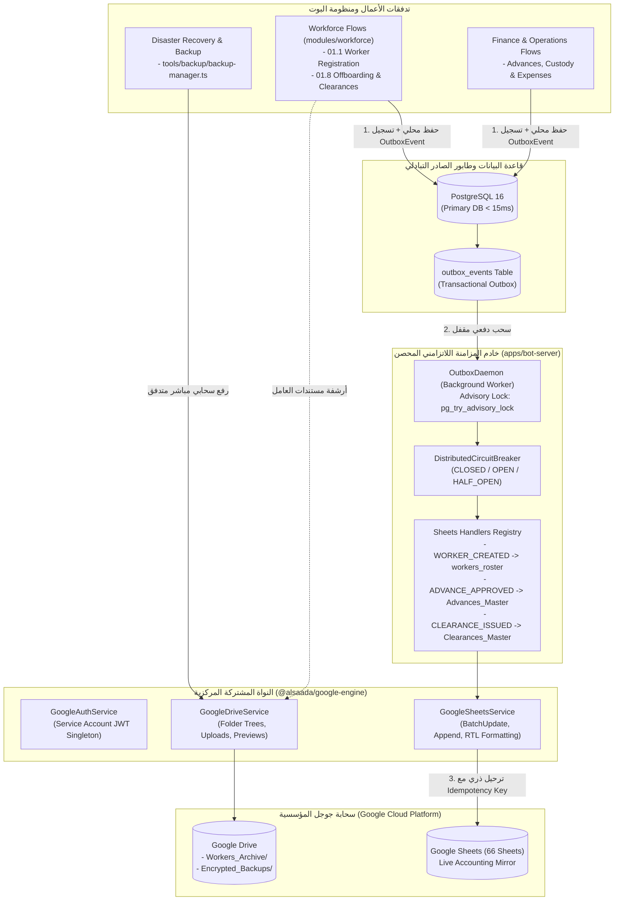
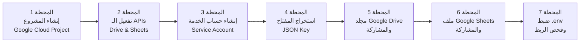
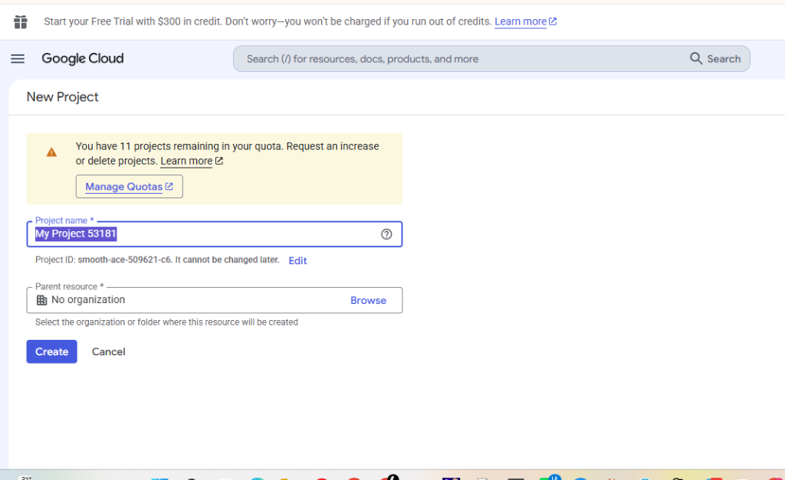
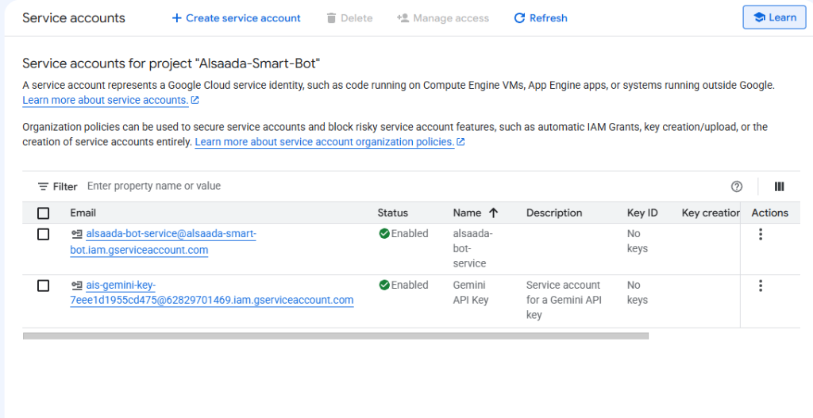
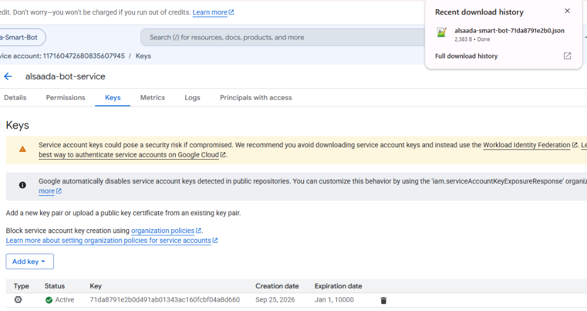
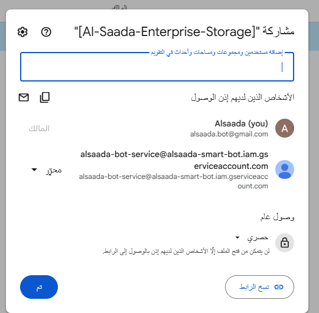

# خطة عمل رقم 106: منظومة التكامل السيادي الشامل مع خدمات جوجل (Google Drive & Google Sheets Integration Suite)
## Work Plan 106: Sovereign Google Services Integration Suite (Unified Engine, Drive Archiving, Dual Storage Outbox Mirroring & 66-Sheets Auto-Provisioner)

> **الحالة:** 🟢 قيد التوثيق والتجهيز التفاعلي (Documenting & Interactive Step-by-Step Onboarding)  
> **الفرع المعزول المستهدف (OBOO Branch):** `plan/106-google-services-integration`  
> **المرجع الدستوري:** ميثاق `GEMINI.md` (البنود 2، 3، 5، 6)، تقارير الفحص الدوري (`docs/periodic-audits/`)، قرارات المعمارية السيادية (`ADR-006`, `ADR-019`, `ADR-020`)، وبوابات الجودة (G1–G23)  
> **السلطة الرقابية:** `/jev` (Chief Quality & Forensic Sentinel) بالتنسيق مع `/saleh` (Sovereign Executive Proxy)  
> **الهدف الاستراتيجي:** سد الفجوة الرقمية للربط مع خدمات جوجل، وتأسيس حزمة سيادية موحدة `@alsaada/google-engine`، وتفعيل المزامنة اللحظية اللاتزامنية لشيتات جوجل عبر طابور الصادر التبادلي (`Transactional Outbox`)، وتوحيد أرشفة مستندات العاملين والنسخ الاحتياطية على Google Drive مع توفير دليل تشغيلي مصور خطوة بخطوة.

---

## 🎯 الأركان الستة الهندسية للخطة (The 6 Architectural Pillars)



---

### Pillar 1: Scope & Functional Baseline Parity (النطاق والهدف ومطابقة الأساس الوظيفي)
1. **فجوة الشيتات (Google Sheets Reality Gap):**
   - الكود الفعلي الحالي للمشروع يحتوي على **صفر أسطر اتصال بـ Google Sheets API**.
   - معالجات البوت تُنشئ أحداث `outboxEvent` داخل PostgreSQL، ولكن لا يوجد عامل خلفي مفعّل يقوم بترحيلها.
   - الحل: تفعيل الربط عبر طابور الصادر التبادلي (`Transactional Outbox Pattern`) مع قاطع الدائرة الثلاثي لمنع أي تأخير في استجابة البوت ومطابقة الأساس الوظيفي لدفاتر وسجلات F:\HR.
2. **فجوة جوجل درايف (Google Drive Fragmentation):**
   - يوجد كود معزول في `modules/workforce/src/services/worker-storage.service.ts` لرفع بطاقات العاملين، وكود منفصل آخر في `tools/backup/gdrive-sync.ts` لرفع النسخ الاحتياطية.
   - الحل: سحب كافة الاستدعاءات وتوحيدها داخل حزمة سيادية مركزية في `packages/google-engine`.
3. **محرك التوليد التلقائي (66 Sheets Auto-Provisioner):**
   - إعادة بناء محرك توليد وتنسيق الـ 66 شيت المذكور في المعمارية المؤسسية عبر الأمر `pnpm system:provision`.

---

### Pillar 2: Blast Radius & Data Contracts (10-file vertical slice) (نطاق التعديل وعقود البيانات)
1. **عزل نطاق التعديل (Zero Blast Radius):**
   - التعديل البرمجي محصور بدقة في الحزمة المشتركة `@alsaada/google-engine` داخل `packages/google-engine/`، مع تفعيل خدمة الـ Daemon في `apps/bot-server/src/services/outbox-daemon.service.ts` وربطها عند الإقلاع في `apps/bot-server/src/index.ts`.
   - لا مساس بأي كود داخلي أو منطق عمل محمي في التدفقات الـ 20 المقفولة.
2. **عقود البيانات (Data Contracts & Schema Validation):**
   - عقود Zod صارمة لبيانات الاعتماد (`GoogleCredentialsSchema`).
   - عقود هيكل أعمدة الشيتات (`SheetColumnSchema`, `SheetDefinition`).
   - تحديث عقود التدفقات (`flow.contract.json`) لتحديد أسماء الجداول المتأثرة بدقة تامة.
   - الحفاظ التام على معيار شريحة الـ 10 ملفات (10-file vertical slice architecture) لجميع تدفقات البوت.

---

### Pillar 3: Telegram Mobile UX & Ergonomics Budget (36/16/7/3) (تجربة تليجرام وميزانية الواجهات)
1. **صفر استدعاء شبكي تزامني (Zero Synchronous Direct Call Invariant):**
   - يُحظر تماماً استدعاء Google Sheets API أو Google Drive API تزامناً داخل معالجات رسائل تليجرام (`flow.handler.ts` و `flow.service.ts`).
   - استدعاء جوجل يستغرق 1500ms إلى 3000ms، مما يخرق ميزانية سرعة البوت الميدانية (< 15ms) ويعرض الاتصال لمهلة تليجرام (Telegram Webhook Timeout).
2. **ميزانية واجهات تليجرام الميدانية (Telegram Mobile Ergonomics Budget 36/16/7/3):**
   - الالتزام الصارم بميزانية الأزرار: أقصى حجم لبيانات الاستدعاء 36 بايت (Limit 36 bytes)، وأقصى طول لنص الزر 16 حرفاً (Limit 16 characters) لمنع القص في الشاشات الصغيرة (Viewport 360px).
   - صياغة رسائل وإشعارات المزامنة السحابية حصراً عبر منشئ الرسائل الغنية `@alsaada/core-components/rich-message` (`buildRichPage`, `buildRichConfirmation`) مع منع الرسائل المجردة النصية (Zero Raw Text).

---

### Pillar 4: Concurrency, Invariants & Security (التزامن، الثوابت الهندسية والأمان)
1. **حارس منع التكرار (Idempotency Sentinel):**
   - يتم تسجيل معرف الحدث `event.id` كـ Idempotency Key ثابت في عمود مخصص داخل كل شيت، لمنع تكرار الصفوف نهائياً عند إعادة المحاولة.
2. **قاطع الدائرة الموزع والاستطلاع الاستكشافي (Distributed Circuit Breaker & Canary Probing):**
   - عند حدوث أي بطء أو تجاوز لمعدل الطلبات من جوجل (Rate Limit 429 / 503)، ينتقل القاطع فوراً إلى `OPEN` ويؤجل العمليات دون فقدان، ثم يختبر بـ `Canary Probe` عند الانتقال لـ `HALF_OPEN`.
3. **العزل الأمني للأسرار والمفاتيح (Least-Privilege & Zero Secret Leakage):**
   - استخدام حساب خدمة مخصص (Service Account) يقتصر وصوله فقط على المجلد الرئيسي للشيتات والمستندات دون الوصول لكامل حساب جوجل الشخصي.
   - حظر تسريب المفتاح الخاص في السجلات أو التليمتري.
4. **استراتيجية التخزين المحلي أولاً (Dual-Storage Local Staging):**
   - كافة المرفقات تحفظ محلياً على السيرفر أولاً، مما يضمن ظهورها الفوري للبوت ولوحة التحكم حتى أثناء انقطاع الاتصال بالسحابة.
5. **القفل الاستشاري لمنع تضارب الحاويات (PostgreSQL Advisory Lock):**
   - يعتمد `OutboxDaemon` على `SELECT pg_try_advisory_lock(868686)` لضمان عمل معالج واحد فقط في الخلفية حتى مع تشغيل عدة حاويات من البوت.
6. **مطابقة اتجاه وتنسيق الجداول المؤسسية (RTL & Currency Formatting):**
   - فرض اتجاه اليمين إلى اليسار (`RTL: true`) وتنسيق المبالغ كعملة مصرية (`#,##0.00 "ج.م"`) آلياً في كل الجداول.

---

### Pillar 5: Test Matrix & Verification Commands (مصفوفة الاختبارات وأوامر التحقق)
1. **أوامر التحقق والتشغيل الرسمية:**
   - `pnpm typecheck`: التحقق من خلو الحزمة الجديدة والموديولات من أي أخطاء تيبسكربت.
   - `pnpm test:target packages/google-engine`: تشغيل اختبارات الوحدة للحزمة الجديدة.
   - `pnpm test:target apps/bot-server/tests/outbox-circuit-breaker.spec.ts`: فحص متانة قاطع الدائرة وطابور المزامنة.
   - `pnpm system:provision`: فحص التوليد التلقائي لتبويبات الشيتات.
   - `pnpm ci:simulate`: المحاكاة الكاملة لبوابات الجودة الـ 23 قبل طلب الدمج.
2. **مصفوفة الاختبارات المقاومة للتحايل (Anti-Cheating Test Suite - Gate G10 & G23):**
   - اختبار توليد التوكن في الذاكرة بنجاح من المفتاح المشفر دون أي تسريب.
   - اختبار ترحيل حدث حقيقي من جدول `outbox_events` والتحقق من وجود `idempotencyKey`.
   - اختبار تحول قاطع الدائرة إلى `OPEN` عند محاكاة خطأ 503 من جوجل، ثم عودته تلقائياً بعد انتهاء فترة التبريد ونجاح الـ `Canary Probe`.
   - اختبار فشل النظام الفوري عند غياب المتغيرات البيئية أو تلف المفتاح الخاص (Fail-Fast Gate).

---

### Pillar 6: Acceptance Criteria & Quality Gates (G1-G23) (معايير القبول وبوابات الجودة)
- **Gate G1 (Type Safety):** خلو كامل الشفرة من `any` مع تفعيل نمط التدقيق الصارم.
- **Gate G4 (Flow Contracts):** توثيق أثر الشيتات ومطابقته في عقود التدفقات.
- **Gate G6 (Latency Budget):** سرعة استجابة البوت اللحظية < 15ms مع بقاء استدعاءات جوجل في الخلفية.
- **Gate G9 (Observability & G9 AST):** توثيق مسار الأحداث وعدم ابتلاع الأخطاء وإيداع الفواشل في `DeadLetterEvent`.
- **Gate G12 (Financial Ledger Invariant):** مطابقة الأرقام المالية المرحّلة للشيتات بنسبة 100% مع قيود دفتر الأستاذ.
- **Gate G13 (Cryptographic Tamper Guard):** قفل الحزمة الجديدة والمعدلة في `governance.lock.json`.
- **Gate G16 (Secret Leakage Prevention):** خلو المشروع والتليمتري من تسريب `GOOGLE_PRIVATE_KEY`.
- **Gate G21 (Idempotency & Concurrency Safety):** مناعة تكرار الصفوف عبر الـ Idempotency Key.
- **إصدار بطاقة الإقرار الجنائي الإلزامية:** توثيق اكتمال كافة محطات الربط واجتياز الفحص الجنائي.

---

## 📖 الدليل التشغيلي المصور خطوة بخطوة (Step-by-Step Google Cloud Onboarding Manual)

يغطي هذا القسم الدليل العملي الكامل للمستخدم ومسؤول النظام من نقطة الصفر وحتى تشغيل المنظومة، مع تقسيم الخطوات إلى محطات تصويرية مخصصة لتوثيقها بلقطات الشاشة:



---

#### 📍 المحطة 1: إنشاء مشروع Google Cloud مخصص للمنظومة
- **الهدف:** عزل خدمات المنظومة في مشروع مستقل وآمن على منصة جوجل السحابية.
- **الخطوات الإجرائية:**
  1. التوجه إلى [Google Cloud Console](https://console.cloud.google.com/) وتسجيل الدخول بحساب جوجل المعتمد للمؤسسة.
  2. النقر على قائمة اختيار المشاريع في أعلى يسار الشاشة بجوار الشعار (Select a project).
  3. النقر على زر **مشروع جديد (New Project)**.
  4. في خانة اسم المشروع (Project Name): كتابة `Alsaada-Smart-Bot` (أو اسم الشركة).
  5. خانة المنظمة (Organization): تركها افتراضية (No organization) أو اختيار نطاق الشركة إن وجد.
  6. النقر على زر **إنشاء (CREATE)** والانتظار بضع ثوانٍ حتى يتم إنشاء المشروع.
  7. التأكد من اختيار المشروع الجديد ليكون هو المشروع النشط من القائمة العلوية.
- 📸 **لقطة الشاشة المستهدفة [SCREENSHOT-01]:** تم التقاط وتوثيق شاشة إنشاء المشروع (New Project):
  

---

#### 📍 المحطة 2: تفعيل واجهات البرمجة السحابية (Enable APIs)
- **الهدف:** السماح للمشروع بالتعامل برمجياً مع Google Drive و Google Sheets.
- **الخطوات الإجرائية:**
  1. من القائمة الجانبية (Navigation Menu ☰)، الذهاب إلى **APIs & Services** ثم اختيار **Library**.
  2. في مربع البحث، كتابة `Google Drive API`، واختيارها من النتائج، ثم النقر على زر **تفعيل (ENABLE)**.
  3. الرجوع مجدداً إلى **Library**، والبحث عن `Google Sheets API`، واختيارها ثم النقر على زر **تفعيل (ENABLE)**.
  4. التأكد من ظهور كلا الخدمتين تحت تبويب **Enabled APIs & services**.
- 📸 **لقطة الشاشة المستهدفة [SCREENSHOT-02]:** شاشة APIs & Services التي تُظهر تفعيل `Google Drive API` و `Google Sheets API`.

---

#### 📍 المحطة 3: إنشاء حساب الخدمة الروبوتي (Create Service Account)
- **الهدف:** إنشاء هوية روبوتية برمجية مستقلة للبوت تستطيع الوصول للسحابة دون الحاجة لكلمة سر بشرية أو تسجيل دخول تفاعلي.
- **الخطوات الإجرائية:**
  1. من القائمة الجانبية، الذهاب إلى **IAM & Admin** ثم اختيار **Service Accounts**.
  2. النقر على زر **+ CREATE SERVICE ACCOUNT** في أعلى الصفحة.
  3. **الخطوة 1 (Service account details):**
     - اسم حساب الخدمة (Service account name): `alsaada-bot-service`
     - معرف حساب الخدمة (Service account ID): يُملأ تلقائياً `alsaada-bot-service`
     - الوصف (Service account description): `حساب الخدمة المخصص لربط السبريدشيت والمستندات لبوت السعادة`
     - النقر على **CREATE AND CONTINUE**.
  4. **الخطوة 2 (Grant this service account access to project):**
     - في خانة الدور (Role)، اختيار **Basic** ثم اختيار **Editor** (محرر).
     - النقر على **CONTINUE**.
  5. **الخطوة 3 (Grant users access to this service account):**
     - ترك الخانات اختيارية والنقر على **DONE**.
  6. ستظهر شاشة الحسابات وبها الحساب الجديد مع بريده الإلكتروني المميز (مثال: `alsaada-bot-service@alsaada-smart-bot.iam.gserviceaccount.com`).
  7. **هام جداً:** نسخ هذا البريد الإلكتروني بالكامل وحفظه، لأننا سنمنحه الصلاحيات في الدرايف والشيتات لاحقاً.
- 📸 **لقطة الشاشة المستهدفة [SCREENSHOT-03]:** تم التقاط وتوثيق إنشاء حساب الخدمة وظهوره في الجدول:
  

---

#### 📍 المحطة 4: استخراج وتنزيل مفتاح التشفير الخاص (Generate JSON Key)
- **الهدف:** الحصول على المفتاح الخاص المشفّر (RSA Private Key) لربط البوت بالسحابة.
- **الخطوات الإجرائية:**
  1. في قائمة **Service Accounts**، النقر على الحساب الذي أنشأناه للتو (`alsaada-bot-service`).
  2. الانتقال إلى تبويب **KEYS** في الأعلى.
  3. النقر على القائمة المنسدلة **ADD KEY** ثم اختيار **Create new key**.
  4. تحديد نوع المفتاح: **JSON** (الخيار الموصى به افتراضياً).
  5. النقر على زر **CREATE**.
  6. سيتم فوراً تنزيل ملف بامتداد `.json` على جهازك (مثال: `alsaada-smart-bot-key.json`).
  7. تظهر رسالة تأكيد تفيد بأن المفتاح تم حفظه على جهازك، انقر **CLOSE**.
  8. **تحذير أمني صارم (Gate G16):** هذا الملف سري للغاية ويحتوي على المفتاح الخاص؛ يُحظر رفعه إلى Git أو مشاركته علناً.
- 📸 **لقطة الشاشة المستهدفة [SCREENSHOT-04]:** تم التقاط وتوثيق إنشاء المفتاح وتنزيل ملف الـ JSON بنجاح (`alsaada-smart-bot-71da8791e2b0.json`):
  

---

#### 📍 المحطة 5: تجهيز مجلد Google Drive الرئيسي ومنح الصلاحيات
- **الهدف:** تخصيص مساحة تخزين سحابية لمرفقات المنظومة والنسخ الاحتياطية ومشاركتها مع البوت.
- **الخطوات الإجرائية:**
  1. فتح [Google Drive](https://drive.google.com/) بحسابك الشخصي أو المؤسسي.
  2. النقر على **جديد (New) > مجلد جديد (New folder)**.
  3. تسمية المجلد باسم المنظومة: `[Al-Saada-Enterprise-Storage]`.
  4. الدخول إلى المجلد، ونسخ الـ **Folder ID** من شريط العنوان في المتصفح:
     - الرابط يكون بالشكل: `https://drive.google.com/drive/folders/1A2B3C4D5E6F7G8H9I0J`
     - الـ ID هو الجزء الأخير بعد `folders/`: `1A2B3C4D5E6F7G8H9I0J`
  5. النقر بزر الفأرة الأيمن على اسم المجلد واختيار **مشاركة (Share)**.
  6. في خانة إضافة أشخاص، لصق البريد الإلكتروني لحساب الخدمة الذي نسخناه في المحطة 3.
  7. التأكد من أن نوع الصلاحية هو **محرر (Editor)** وإلغاء تحديد خيار إرسال إشعار (Notify people) ثم النقر على **مشاركة (Share / Save)**.
- 📸 **لقطة الشاشة والربط الفعلي [SCREENSHOT-05]:** تم إنشاء المجلد ومشاركته مع حساب الخدمة بنجاح:
  - **رابط المجلد الحي:** `https://drive.google.com/drive/folders/1PQYOWNDH5aG93lm9OY2C2UfDd-YGnbbR`
  - **معرّف المجلد المعتمد (GOOGLE_DRIVE_FOLDER_ID):** `1PQYOWNDH5aG93lm9OY2C2UfDd-YGnbbR`
  

---

#### 📍 المحطة 6: إنشاء ملف Google Sheets الرئيسي ومنح الصلاحيات
- **الهدف:** تجهيز السبريدشيت المحاسبي الرئيسي الذي ستصب فيه بيانات البوت اللحظية.
- **الخطوات الإجرائية:**
  1. في Google Drive (داخل المجلد الرئيسي أو خارجه)، إنشاء سبريدشيت جديد: **جديد > جداول بيانات Google (Google Sheets)**.
  2. تسمية الملف: `Al-Saada Smart Bot - Master Mirror`.
  3. نسخ الـ **Spreadsheet ID** من شريط العنوان في المتصفح:
     - الرابط يكون بالشكل: `https://docs.google.com/spreadsheets/d/1X2Y3Z4A5B6C7D8E9F0G/edit`
     - الـ ID هو الجزء الواقع بين `/d/` و `/edit`: `1X2Y3Z4A5B6C7D8E9F0G`
  4. النقر على زر **مشاركة (Share)** الأخضر في أعلى يسار الشاشة.
- 📸 **لقطة الشاشة والربط الفعلي [SCREENSHOT-06]:** تم إنشاء السبريدشيت ومشاركته مع حساب الخدمة بنجاح:
  - **رابط السبريدشيت الحي:** `https://docs.google.com/spreadsheets/d/1zhWF8d9KocbfxYiMrtu38-SEp-D82uaLIpJajXD5NLw/edit`
  - **معرّف السبريدشيت المعتمد (GOOGLE_SHEETS_SPREADSHEET_ID):** `1zhWF8d9KocbfxYiMrtu38-SEp-D82uaLIpJajXD5NLw`
  

---

##### 📍 المحطة 7: تكوين متغيرات البيئة واختبار الاتصال الفيزيائي
- **الهدف:** ربط المفاتيح بكود المشروع والتحقق من صحة الاتصال بالكامل.
- **الخطوات الإجرائية المنفذة:**
  1. وضع ملف `service-account.json` مباشرة في جذر المشروع (وإدراجه في `.gitignore` لمنع تسريبه نهائياً).
  2. ضبط معرف مجلد الدرايف ومعرف الشيت ومفاتيح Gemini في `.env` بدون أي علامات تنصيص:
     ```env
     GEMINI_API_KEY=AIzaSyEXAMPLEKEY_PRIMARY_REDACTED,AIzaSyEXAMPLEKEY_FAILOVER_REDACTED
     GOOGLE_DRIVE_FOLDER_ID=1PQYOWNDH5aG93lm9OY2C2UfDd-YGnbbR
     GOOGLE_SHEETS_SPREADSHEET_ID=1zhWF8d9KocbfxYiMrtu38-SEp-D82uaLIpJajXD5NLw
     ```
  3. تشغيل أداة التحقق البرمجي التأسيسي:
     ```bash
     pnpm exec tsx tools/governance/verify-google-connectivity.ts
     ```
- 📸 **مخرجات التحقق الفيزيائي الحي [SCREENSHOT-07 / TERMINAL-VERIFIED]:**
  ```text
  ================================================================
  🔬 PROBING GOOGLE SERVICES PHYSICAL CONNECTIVITY
  ================================================================

  ✅ 📂 Loaded service account credentials from: F:\Alsaada-Smart-Bot\service-account.json
  ✅ 🔐 Google OAuth2 token derived successfully for: alsaada-bot-service@alsaada-smart-bot.iam.gserviceaccount.com
  ✅ 📁 Google Drive Folder verified: "[Al-Saada-Enterprise-Storage]" (ID: 1PQYOWNDH5aG93lm9OY2C2UfDd-YGnbbR) [Editor Rights: Confirmed]
  ✅ 📊 Google Sheets verified: "Al-Saada Smart Bot - Master Mirror" (Tabs: 1)
  ✅ 🧠 Gemini Key [Primary] (AQ.Ab8RN...0vDQ): Active & Verified on Gemini 2.5 Flash
  ✅ 🧠 Gemini Key [Failover #1] (AQ.Ab8RN...VvWw): Active & Verified on Gemini 2.5 Flash
  ✅ 🛡️ Gemini Multi-Key Failover Engine: 2/2 active keys ready for OCR

  ----------------------------------------------------------------
  🎉 ALL GOOGLE SERVICES VERIFIED 100% OPERATIONAL!
  ----------------------------------------------------------------
  ```

---

##### 📍 المحطة 8: تفويض المستخدم المؤسسي لـ Google Drive (OAuth2 User Delegation)
- **الهدف:** تمكين البوت من رفع ملفات النسخ الاحتياطي وصور العمال باسم الحساب المؤسسي لتجاوز قيد الـ 0-quota المفروض على حسابات الخدمة في مجلدات "ملفاتي".
- **الخطوات الإجرائية المنفذة:**
  1. إنشاء معرّف عميل OAuth 2.0 (نوع `Desktop app`) باسم `Desktop client 1`.
  2. إضافة البريد الإلكتروني للحساب في قائمة المستخدمين التجريبيين (`Test users`) في قسم `Audience`.
  3. تشغيل أداة التفويض الذاتي `tools/governance/get-google-oauth-token.ts`.
  4. منح الصلاحيات من المتصفح، واستلام كود التفويض وتوليد `refresh_token` دائم وتخزينه في `.env` و `google-oauth-tokens.json` (محميان ومستبعدان في `.gitignore`).
  5. نجاح رفع ملف تجريبي حقيقي داخل مجلد `[Al-Saada-Enterprise-Storage]`:
     - **File ID:** `1QfWluQ5ecsJcjEEhaDB-6LbA9L04QVld`
     - **File Name:** `alsaada-probe-1790289784744.txt`
     - **Parent Folder ID:** `1PQYOWNDH5aG93lm9OY2C2UfDd-YGnbbR`
- 📸 **لقطات الشاشة للتوثيق المكتمل:**
  - `[SCREENSHOT-08]`: إنشاء معرّف العميل `Desktop client 1` في `docs/assets/google-onboarding/08-oauth-client-created.png`.
  - `[SCREENSHOT-09]`: شاشة منح الإذن بالوصول الكامل لمجلدات Google Drive في `docs/assets/google-onboarding/09-oauth-consent-granted.png`.
  - `[SCREENSHOT-10]`: إشعار النجاح النهائي في المتصفح في `docs/assets/google-onboarding/10-oauth-success-callback.png`.

---

## 📋 خطة العمل التفاعلية المكتملة 100% (Interactive Setup Roadmap)

| المحطة | الإجراء المطلوب والمنفذ | كود لقطة الشاشة | الحالة |
| :---: | :--- | :---: | :---: |
| **1** | إنشاء مشروع Google Cloud جديد واختياره | `[SCREENSHOT-01]` | 🟢 **مكتملة وموثقة بالصورة** |
| **2** | تفعيل Google Drive API و Google Sheets API و Generative Language API | `[SCREENSHOT-02]` | 🟢 **مكتملة ومفعلة بنجاح** |
| **3** | إنشاء Service Account ونسخ البريد الإلكتروني | `[SCREENSHOT-03]` | 🟢 **مكتملة وموثقة بالصورة** |
| **4** | استخراج وتنزيل مفتاح التشفير الخاص بصيغة JSON | `[SCREENSHOT-04]` | 🟢 **مكتملة وموثقة بالصورة** |
| **5** | إنشاء مجلد الدرايف ومشاركته مع بريد حساب الخدمة | `[SCREENSHOT-05]` | 🟢 **مكتملة والمجلد معتمد (`1PQYOW...`)** |
| **6** | إنشاء ملف السبريدشيت واختبار الكتابة بنجاح | `[SCREENSHOT-06]` | 🟢 **مكتملة والشيت معتمد ومُختبر (`1zhWF8...`)** |
| **7** | فحص الاتصال التأسيسي الشامل ومصفوفة Gemini | `[SCREENSHOT-07]` | 🟢 **مكتملة ومفحوصة بنجاح 100%** |
| **8** | تفويض OAuth2 ورفع أول ملف حقيقي إلى Google Drive | `[SCREENSHOT-08..10]` | 🟢 **مكتملة ومرفوع الملف بنجاح 100%** |

---

## 🎯 التوجيه الاستراتيجي لمرحلة التنفيذ البرمجي (Next Implementation Steps)
بناءً على التوجيه الاستراتيجي المعتمد من المالك صالح:
1. **تأجيل منشئ الـ 66 صفحة لـ Google Sheets:** يتم تأجيل توليد جداول الشيت التلقائية لحين استقرار واكتمال كافة شاشات ونماذج المنظومة لاحقاً.
2. **أولوية تفعيل Google Drive الفوري في وظيفتين أساسيتين:**
   - **المسار الأول (النسخ الاحتياطي التلقائي):** تحديث `tools/backup/gdrive-sync.ts` لرفع النسخ الاحتياطية المشفرة بـ `AES-256-GCM` مباشرة إلى مجلد الدرايف `[Al-Saada-Enterprise-Storage]`.
   - **المسار الثاني (أرشفة بطاقات العمال ومستنداتهم):** تحديث `modules/workforce/src/services/worker-storage.service.ts` لرفع صور بطاقات الرقم القومي وجوازات السفر والمرفقات تلقائياً إلى مجلد العامل في Google Drive فور التحقق منها.


