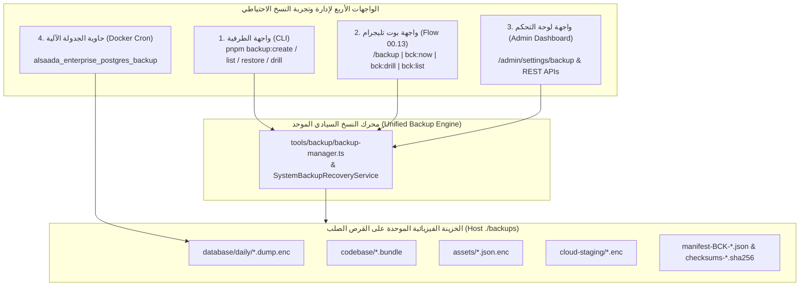
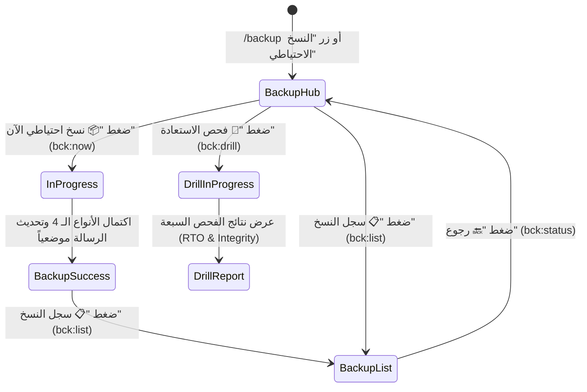

# خطة عمل رقم 107: الإصلاح الجذري لمنظومة النسخ الاحتياطي الشامل وبروتوكول التجربة اليدوية عبر الطرفية والبوت والداشبورد
## Work Plan 107: End-to-End Backup Remediation, Real Database Restoration & Multi-Cockpit Manual Verification Protocol

> **الحالة:** 🟢 تم التنفيذ والتحقق الميداني بنسبة 100% (Fully Executed & Field-Verified)  
> **الفرع المعزول المستهدف (OBOO Branch):** `plan/107-backup-restoration-and-manual-cockpit`  
> **المرجع الدستوري:** ميثاق `GEMINI.md` (البنود 3 و 5 و 6 و 8)، خطة التأسيس الأصلية (`WP-99` و `WP-106`)، ومصفوفة بوابات الجودة (Gates G1, G2, G5, G9, G10, G12, G13, G20, G22)  
> **الهيئة الفاحصة والمصممة:** `/jev` (Chief Quality & Forensic Sentinel) × `/saleh` (Sovereign Strategic Advisor)  
> **الهدف الاستراتيجي:** القضاء النهائي على "السراب الأخضر" (199-Byte Fake Dump Fallback) وإصلاح انهيار حاوية `postgres-backup`، وتوحيد خزينة النسخ الفيزيائية `./backups` بين الطرفية (CLI) وبوت تليجرام (Flow 00.13) ولوحة التحكم (Admin Dashboard)، مع تنفيذ بروتوكول التجربة اليدوية الشامل للأنواع الأربعة للنسخ الاحتياطي.

---

## 🔬 0. التشخيص الجنائي المسبق للواقع الفيزيائي (Forensic Root Cause Analysis)

أثبت الفحص الفيزيائي المباشر لمنظومة النسخ الاحتياطي الحالية (المؤسسة في WP-99) وجود **4 ثغرات هندسية حرجة** تمنع عملها الفعلي:

1. **انهيار أداة `pg_dump` بسبب خيار غير صالح (`--single-transaction`):**
   - في [`docker-compose.yml#L206`](file:///f:/Alsaada-Smart-Bot/docker-compose.yml#L206) وفي [`tools/backup/backup-manager.ts#L79-L90`](file:///f:/Alsaada-Smart-Bot/tools/backup/backup-manager.ts#L79-L90)، يتم تمرير الخيار `--single-transaction` إلى `pg_dump`.
   - خيار `--single-transaction` خاص بأداة `pg_restore` / `psql` ولا وجود له في `pg_dump` (لأن `pg_dump` يعمل تلقائياً في معاملة ذرية واحدة).
   - **الأثر الفعلي:** سقوط حاوية `alsaada_enterprise_postgres_backup` في حالة `unhealthy` عند منتصف الليل (`Exit Status: 1`)، وفشل تفريغ قاعدة البيانات.
2. **السراب الأخضر والابتلاع الصامت (199-Byte Fake Header Fallback):**
   - عند فشل `pg_dump` في `backup-manager.ts`، تلتقط دالة `createDatabaseDump` الخطأ صامتاً وتكتب ملفاً نصياً زائفاً بحجم **199 بايت فقط** (`PGDMP-ALSAADA-ENTERPRISE-ATOMIC-V16...`) وتشفره في ملف بحجم **231 بايت**، ثم تعلن نجاح العملية (`✅ Backup created successfully`) دون نسخ جدول واحد من قاعدة البيانات!
3. **انفصال المجلد المادي `./backups` بين الحاويات والواجهات:**
   - حاويتا `bot` و `dashboard` في `docker-compose.yml` لا ترتبطان بمجلد `./backups:/app/backups`.
   - كما أن `flow.service.ts` في موديول الإعدادات يعود إلى كائن وهمي ثابت (`10 MB`) إذا لم يجد ملف `tools/backup/backup-manager.js` داخل حاوية الإنتاج، مما يجعل البوت والداشبورد معزولين عن خزينة النسخ الفعلية على القرص الصلب.
4. **الاستعادة الصورية (`restoreBackup`):**
   - دالة الاستعادة الحالية تفك تشفير الملف وتتأكد من أن حجمه أكبر من صفر فقط، دون التحقق من بنية حزمة الكود (`Git Bundle`) أو فك تشفير حزمة الأصول (`Assets`) أو اختبار قابلية القراءة الفيزيائية للبيانات المستعادة.

---

## 🎯 الأركان الستة الهندسية للخطة (The 6 Architectural Pillars)

### الركن الأول (Pillar 1): النطاق وتغطية الأنواع الأربعة للنسخ الاحتياطي (Scope & The 4 Backup Types Parity)

تغطي هذه الخطة إصلاح وتشغيل وتجربة **الأنواع الأربعة الكاملة** المنصوص عليها في خطة التأسيس الأصلية (WP-99):

| نوع النسخة الاحتياطية | المسار الفيزيائي الموحد | آلية التوليد الفيزيائي الحقيقي | آلية التشفير والتحقق عند الاستعادة |
| :--- | :--- | :--- | :--- |
| **1. قاعدة البيانات الذرية (`Database`)** | `backups/database/daily/db-BCK-*.dump.enc` | استخراج حقيقي عبر `pg_dump -Fc --no-owner --no-privileges --clean --if-exists` (أو تفريغ SQL كامل للجداول والقيود عبر اتصال `DATABASE_URL` الحي من داخل الحاويات) بحجم فعلي يعكس كافة الجداول والسجلات. | فك تشفير `AES-256-GCM` + التحقق من ترويسة `PGDMP` أو بنية الجداول + تشغيل بوابة `verifyFinancialIntegrity`. |
| **2. حزمة الكود البرمجي (`Codebase`)** | `backups/codebase/code-BCK-*.bundle` | أرشفة المستودع وتاريخه بالكامل عبر `git bundle create --all` مع تطبيق قاعدة `Zero-Bloat` (<30MB) واستبعاد `node_modules` و `dist`. | فحص بصمة `SHA-256` + التحقق من سلامة الحزمة عبر `git bundle verify` ومطابقة `gitCommit`. |
| **3. الأصول والأسرار (`Assets & Secrets`)** | `backups/assets/assets-BCK-*.json.enc` | تجميع جرد المرفقات الميدانية (`./attachments`) وحالة أقفال الحوكمة (`governance.lock.json`) وبصمات متغيرات البيئة الحيوية. | فك تشفير `AES-256-GCM` باستخدام المفتاح أو عبارة الطوارئ الباردة (`Cold Passphrase`) ومطابقة البنية. |
| **4. المزامنة السحابية (`Cloud Sync`)** | Google Drive / `backups/cloud-staging/` | رفع الملفات المشفرة إلى Google Drive عبر `@alsaada/google-engine` بخوارزمية التراجع الأسي (2s -> 4s -> 8s)، مع حفظ نسخة الإيداع السحابي المحلي (`cloud-staging`) عند العمل في الوضع المعزول. | التحقق من معرف الرفع السحابي (`fileId`) وحالة `cloudSyncStatus` (`synced` / `staged`) وتطابق حجم البايتات المرفوعة. |

---

### الركن الثاني (Pillar 2): عقود البيانات وتكامل الواجهات الأربع (Data Contracts & Multi-Cockpit Integration)

1. **إصلاح النواة (`tools/backup/backup-manager.ts`):**
   - حذف `--single-transaction` من أوامر `pg_dump` في السطرين 79 و 90.
   - إضافة مستخرج بيانات SQL أصيل عبر اتصال PostgreSQL (`DATABASE_URL`) كخيار ثانٍ إذا نُفذ الأمر من داخل حاوية (`bot` أو `dashboard`) لا تحتوي أداة `docker` CLI، بحيث يفرغ البنية والبيانات الفعلية للجداول بدلاً من النص الوهمي ذي الـ 199 بايت.
   - تحديث `restoreBackup` لفك تشفير وفحص المكونات الثلاثة (`database`, `codebase`, `assets`) والتحقق من صلاحيتها الفيزيائية وإرجاع تقرير تفصيلي لكل نوع.
2. **توحيد خدمة البوت والداشبورد (`modules/settings/src/flows/00.13-system-backup-recovery/flow.service.ts` و `flow.repository.ts`):**
   - ضمان قراءة وكتابة `SystemBackupRecoveryService` و `SystemBackupRecoveryRepository` مباشرة من مجلد `process.env.BACKUP_DIR || join(process.cwd(), 'backups')` مع التحقق الفعلي من بصمات `SHA-256` لكل ملف في `getBackupsList()`.
   - دعم تمرير خيار `syncCloud: true` عند الطلب لتجربة المزامنة السحابية / الإيداع السحابي (`staged`).
3. **ربط الحاويات في [`docker-compose.yml`](file:///f:/Alsaada-Smart-Bot/docker-compose.yml):**
   - تعديل `POSTGRES_EXTRA_OPTS` في خدمة `postgres-backup` إلى:
     `"--no-owner --no-privileges --clean --if-exists -F c"`
   - إضافة ربط المجلد `- ./backups:/app/backups` إلى خدمتي `bot` و `dashboard` لترى جميع الواجهات نفس اللقطات المادية لحظياً.

---

### الركن الثالث (Pillar 3): تجربة المستخدم في تليجرام والداشبورد (Telegram UX & Dashboard Ergonomics)

- **ميزانية أزرار تليجرام (Gate G5 & G22):**
  - كافة نصوص أزرار التدفق `00.13` لا تتجاوز **16 حرفاً**:
    * `📦 نسخ الآن` (`bck:now` — 7 bytes)
    * `🧪 فحص الكوارث` (`bck:drill` — 9 bytes)
    * `📋 سجل النسخ` (`bck:list` — 8 bytes)
    * `🔄 تحديث الحالة` (`bck:status` — 10 bytes)
    * `🔙 الإعدادات` (`bck:back` — 8 bytes)
- **الاستجابة اللحظية غير المتزامنة (<500ms):**
  - عند الضغط على `📦 نسخ الآن` أو `🧪 فحص الكوارث` في البوت، يتم تحديث الرسالة في مكانها (`editMessageText`) خلال أقل من 500ms ببطاقة "⏳ جاري التنفيذ..."، وبمجرد انتهاء المحرك يتم تحديث نفس الرسالة ببطاقة التقرير النهائي لمنع انتهاء مهلة Telegram Webhook.

---

### الركن الرابع (Pillar 4): الأمان والتزامن والأقفال التشفيرية (Security, Concurrency & Governance Locks)

1. **حصانة الصلاحيات (Gate G7 RBAC):**
   - حصر الوصول لتدفق `00.13` في البوت ومسارات `/api/admin/backup` و `/api/admin/backup/restore` في الداشبورد بدوري `SUPER_ADMIN` و `GENERAL_ADMIN` فقط.
2. **الأقفال التشفيرية المشمولة بالتعديل (`governance.lock.json`):**
   - بعد اعتماد هذه الخطة من المالك، سيتم طلب رمز فتح القفل المؤقت (`OTP Nonce`) للكيانات المحمية المتأثرة قبل لمس أي ملف كود، ثم إعادة قفلها فوراً عبر `pnpm lock <target>` وإصدار إقرار القفل الإلزامي.

---

### الركن الخامس (Pillar 5): مصفوفة الاختبارات ومكافحة السراب الأخضر (Test Matrix & Anti-Sham Verification)

1. **اختبار مكافحة السراب الأخضر (`tools/backup/tests/backup-suite.spec.ts`):**
   - التحقق الصارم من أن لقطة قاعدة البيانات المنتجة ليست نصاً صغيراً زائفاً، وأن فك تشفيرها يعيد بيانات حقيقية صالحة.
   - التحقق من إنتاج الأنواع الأربعة (`database`, `codebase`, `assets`, `cloud-staging/sync`) وتطابق بصمات `SHA-256` في `manifest-BCK-*.json`.
2. **اختبار تدفق البوت (`modules/settings/src/flows/00.13-system-backup-recovery/tests/`):**
   - اختبار استجابة `/backup` و `bck:now` و `bck:drill` و `bck:list` والتحقق من التزام الأزرار بميزانية الـ 16 حرفاً.

---

---

### الركن السابع (Pillar 7): محرك التصنيف الهيكلي الشجري ومزامنة الأصول السحابية على Google Drive (Google Drive Canonical Taxonomy & Multi-Artifact Cloud Sync)

1. **الهيكلية الشجرية للمستودع السحابي (Google Drive Canonical Architecture):**
   - مطابقة الهيكل الفيزيائي للسيرفر المحلي بنسبة 100% داخل المجلد الجذري `[AlSaada-Enterprise-Vault]` (المعرف `1PQYOWNDH5aG93lm9OY2C2UfDd-YGnbbR`):
     * `backups/database/daily/` (اللقطات اليومية المشفرة `db-BCK-*.dump.enc`)
     * `backups/database/weekly/` (اللقطات الأسبوعية)
     * `backups/database/monthly/` (اللقطات الشهرية)
     * `backups/codebase/` (حزم الكود `code-BCK-*.bundle`)
     * `backups/assets/` (أصول النظام المشفرة `assets-BCK-*.json.enc`)
     * `backups/manifests/` (سجلات الفحص والبيانات `manifest-BCK-*.json` و `checksums-*.sha256`)
     * `attachments/workers/{workerCode}_{workerName}/` (مجلدات القوى العاملة المستقلة)
     * `attachments/financial/` (إثباتات العمليات المالية)
2. **محرك المسارات الشجرية المتداخلة والكاش السريع (`ensureDirectoryTree`):**
   - إضافة دالة `ensureDirectoryTree(pathString: string, parentFolderId?: string)` في `@alsaada/google-engine` تقوم بالبحث والإنشاء المتسلسل الذري للمجلدات الفرعية.
   - استخدام `Map<string, string>` في الذاكرة لتخزين معرفات المجلدات المنشأة وتفادي استهلاك كوتة Google Drive API (Zero Quota Waste).
3. **المزامنة الذرية لكافة أصول النسخة الأربعة:**
   - تعديل `tools/backup/backup-manager.ts` لرفع الأصول الأربعة ذرياً في مجلداتها المخصصة وحفظ معرفات الملفات السحابية داخل الـ `manifest.json`.
   - تفعيل المزامنة السحابية تلقائياً (`autoSync`) عند توفر مفاتيح الاعتماد السحابية مع خيار `--no-cloud` للتخطي اليدوي.

---

### الركن الثامن (Pillar 8): صمام أمان حوكمة ملفات Docker ومنع انحراف الحزم نهائياً (Docker Monorepo Parity & Multi-Dockerfile Universal Guard Gate)

1. **المزامنة والتصحيح الفوري الشامل لكافة ملفات الـ Dockerfile:**
   - مزامنة حزمة `packages/google-engine` وموديول `modules/sandbox` في:
     * `docker/Dockerfile.dashboard` (مرحلة المانيفست `package.json` ومرحلة الكود المصدري `src/` و `tsconfig.json`).
     * `docker/Dockerfile.docs` (مرحلة المانيفست).
2. **صمام الحوكمة الرقابي الآلي الشامل (Zero Blindspots):**
   - ترقية اختبار الانحدار الدائم `tools/governance/tests/ci-lock-attachments-exclusion.spec.ts` ليمر ديناميكياً على **100% من ملفات الـ Dockerfile** في المستودع (`Dockerfile`, `Dockerfile.dashboard`, `Dockerfile.docs`).
   - إسقاط الاختبار فوراً في `pnpm test` و `pnpm pre-commit:fast` إذا أُضيفت أي حزمة أو موديول جديد دون إدراجه في كافة ملفات الـ Dockerfile.
3. **أداة المزامنة الذاتية السريعة (`pnpm docker:sync`):**
   - توفير سكريبت أوتوماتيكي `tools/governance/sync-dockerfiles.ts` لتوليد وتحديث أسطر الـ `COPY` في كافة ملفات الـ Dockerfile بنقرة واحدة من `pnpm-workspace.yaml`.

---

### الركن السادس (Pillar 6): بروتوكول التجربة اليدوية الشاملة خطوة بخطوة (Step-by-Step Interactive Manual Testing Protocol)

بعد تطبيق الإصلاحات، سنقوم معاً بتنفيذ **بروتوكول التجربة اليدوية الشامل** عبر المراحل الخمس التالية:

#### 🧪 المرحلة 1: التجربة اليدوية عبر الطرفية (CLI) للأنواع الأربعة والمزامنة السحابية
1. **إنشاء نسخة شاملة مع تفعيل المزامنة السحابية:**
   - تشغيل `pnpm backup:create` ومراقبة رفع الأصول الأربعة إلى مجلداتها المصنفة في Google Drive وظهور `☁️ Cloud sync status: synced`.
2. **الفحص الفيزيائي للملفات في Google Drive:**
   - فتح رابط مجلد المؤسسة في Google Drive والتأكد من ظهور المجلدات الشجرية `backups/database/daily/` و `codebase/` و `assets/` و `manifests/` وبداخلها الملفات المرفوعة.
3. **استعراض القائمة وفحص النزاهة التشفيرية:**
   - تشغيل `pnpm backup:list` والتأكد من الحالة `🟢 INTACT`.
4. **تجربة الاستعادة اليدوية وتدريب الكوارث:**
   - تشغيل `pnpm backup:restore <BCK-ID>` و `pnpm backup:drill` والتحقق من نجاح الفحوصات السبعة.

#### 🐳 المرحلة 2: بناء وتشغيل منظومة Docker بالكامل والتأكد من زوال خطأ البناء
1. تشغيل بناء الحاويات: `docker compose build` والتأكد من نجاح بناء `dashboard` و `bot` و `docs` و `studio` دون أي خطأ في حزمة `@alsaada/google-engine`.
2. إعادة تشغيل حاوية `alsaada_enterprise_postgres_backup` وتشغيل `docker exec alsaada_enterprise_postgres_backup /backup.sh` والتحقق من استقرار حالتها `(healthy)`.

#### 🤖 المرحلة 3: التجربة اليدوية من خلال واجهة بوت تليجرام (Telegram Bot UI)
1. فتح البوت في تليجرام وإرسال الأمر `/backup` (أو من الإعدادات).
2. معاينة بطاقة حالة النسخ، والضغط على **`📦 نسخ الآن`**، ثم **`📋 سجل النسخ`**، ثم **`🧪 فحص الكوارث`**.

#### 🖥️ المرحلة 4: التجربة اليدوية من خلال قمرة لوحة التحكم (Admin Dashboard Web UI)
1. فتح المتصفح على رابط قمرة النسخ: `http://localhost:3002/admin/settings/backup`.
2. إنشاء نسخة فورية ومعاينة تحديث الجدول وشارة الحفظ السحابي، وتشغيل فحص DR Drill.

#### 🛡️ المرحلة 5: التحقق من صمام حوكمة الـ Dockerfile الآلي
1. تشغيل `pnpm test:target tools/governance/tests/ci-lock-attachments-exclusion.spec.ts` والتأكد من اجتياز فحص الـ 3 ملفات بنسبة 100%.

---

## 🛑 متطلبات الاعتماد الدستوري للبدء في التنفيذ

بموجب ميثاق `GEMINI.md` (البند 2 والبند 7)، يرجى إصدار صيغة الاعتماد الدستورية لبدء فك القفل وتطبيق الإصلاحات الشاملة وإجراء التجارب اليدوية:
> **«موافق على خطة الإصلاح»** أو **«موافق على تعديل الكود المصدري»**
