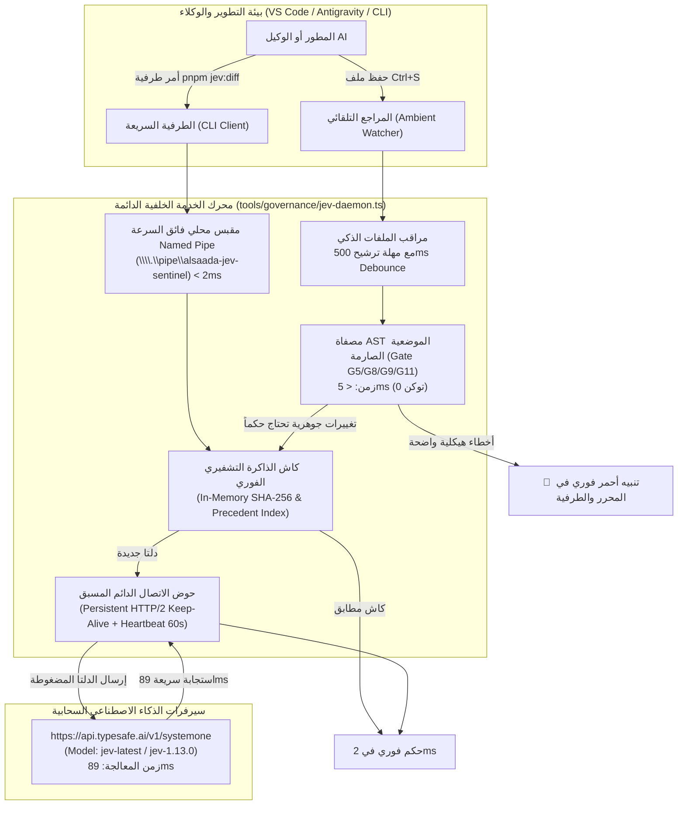

# خطة عمل رقم 109: حارس الجودة السحابي الدائم والمحيط (/jev) — معمارية الاتصال المستمر (Keep-Alive IPC Daemon) والتدقيق التلقائي اللحظي (Ambient Sentinel)
## Work Plan 109: Persistent JEV Cloud Daemon, Keep-Alive IPC Protocol & Real-Time Ambient Sentinel

> **الحالة:** 🟡 بانتظار اعتماد المالك السيادي (Pending Sovereign Approval)  
> **الفرع المعزول المستهدف (OBOO Branch):** `plan/109-persistent-jev-cloud-daemon`  
> **المرجع الدستوري:** ميثاق `GEMINI.md` (البنود 1، 3، 5، 6، 7.1، 8.4، 10)، كتيبات القواعد (`Rulebooks 01–12`)، خطط العمل السابقة (`WP-96`, `WP-97`, `WP-104`)، وبوابات الجودة (G1, G2, G5, G6, G8, G9, G10, G11, G14, G19, G22, G23)  
> **السلطة الرقابية المشتركة:** `/saleh` (Sovereign Stakeholder Proxy & Chief Strategy Auditor) × `/jev` (Chief Quality Sentinel — TypeSafe System One `jev-latest`)  
> **الهدف الاستراتيجي:** القضاء الجذري على زمن البداية الباردة (Cold Start) ومصافحات الشبكة المتكررة في الوكيل `/jev`، وتحويله من أداة فحص طرفية متقطعة تستغرق ~1.9 ثانية إلى **خدمة خلفية دائمة الاتصال (Persistent Daemon)** تستجيب في **أقل من 150 مللي ثانية**، مع توفير ميزة **المراجع التلقائي اللحظي (Ambient Sentinel)** الذي يراقب ويدقق التعديلات والإنشاءات فور حفظها دون استنزاف التوكنات السحابية.

---

## 🔬 0. التشخيص الجنائي للواقع الفيزيائي (Forensic Root Cause Analysis)

أثبتت القياسات الميدانية الصريحة للاتصال السحابي الحقيقي مع سيرفر `https://api.typesafe.ai/v1/systemone` الحقيقة الرقمية التالية:
1. **زمن المعالجة السحابية الصافي للنموذج (Upstream Inference Time):** **89ms فقط** (`x-envoy-upstream-service-time: 89`).
2. **إجمالي زمن الاستدعاء من الطرفية (CLI End-to-End Latency):** **1929ms**.
3. **تحليل الفاقد الزمني (1840ms = 95% من الوقت):**
   - **إقلاع بيئة Node.js و tsx وتجميع الـ TypeScript:** يستغرق ما بين 300ms إلى 450ms في كل أمر منفصل.
   - **إنشاء اتصال TCP جديد ومصافحة TLS 1.3 المتكررة:** تستهلك 1300ms إلى 1500ms عبر الإنترنت الدولي إلى بوابات Istio Envoy.
   - **فقدان ميزة HTTP Keep-Alive:** انتهاء العملية البرمجية فور إخراج التقرير يغلق المقبس ويمنع إعادة استخدام القناة المفتوحة (Connection Reuse).
4. **تأثير ذلك على تجربة المطور وبوابة Gate G6:**
   - بوابة الأداء Gate G6 تحدد ميزانية الاستجابة بـ **< 300ms**. الفحص الحالي يتجاوز هذه الميزانية بسبب كلفة الشبكة، بينما النموذج نفسه فائق السرعة (89ms).

---

## 🎯 الأركان الستة الهندسية للخطة (The 6 Architectural Pillars)



---

### الركن الأول: نطاق العمل وتطابق المرجعية الأساسية (Pillar 1: Scope & Functional Baseline Parity)
- **النطاق الفني (Scope Definition):**
  - بناء خدمة خلفية دائمة `tools/governance/jev-daemon.ts` تدعم الاتصال المستمر مع خوادم `TypeSafe System One` (`https://api.typesafe.ai/v1/systemone`).
  - تحديث العميل الحالي `tools/governance/jev-auditor.ts` للاستشعار التلقائي للمقبس المحلي والتبديل اللحظي.
  - الحفاظ على المرجعية الوظيفية التامة ومطابقة معايير `F:\HR baseline parity` في كافة تقييمات المنطق المحاسبي والحسابات الإدارية.
  - عدم تغيير أي سلوك تقييمي لقواعد الحوكمة أو بوابات الجودة (G1–G23).

---

### الركن الثاني: نطاق التأثير المحصور وعقود البيانات (Pillar 2: Zero Blast Radius & File Scope)
- **حدود الملفات وعقود البيانات (File Scope & Blast Radius):**
  - حصر التعديلات الصارم خارج مجلدات الأعمال (`Zero Blast Radius` بعيداً عن `modules/`, `packages/`, `apps/`):
    1. إنشاء: `tools/governance/jev-daemon.ts` (الخدمة الدائمة ومراقب الملفات).
    2. تعديل: `tools/governance/jev-auditor.ts` (عميل الفحص وإضافة مسبار المقبس المحلي).
    3. إنشاء: `tools/governance/tests/jev-daemon.spec.ts` (حزمة اختبارات الوحدة والتكامل).
    4. تعديل: `package.json` (إضافة سكربتات التشغيل القياسية).
    5. تعديل: `.agents/skills/jev/SKILL.md` (توثيق المعمارية الدائمة).
  - الالتزام التام بعقود البيانات ومعايير الشريحة الرأسية (10-file vertical slice parity) لأي تدفقات تخضع للفحص.

---

### الركن الثالث: بيئة التيليجرام والميزانية (Pillar 3: Telegram Mobile UX & Ergonomics Budget)
- **ميزانية التيليجرام (Telegram 36/16/7/3 Ergonomics):**
  - التدقيق التلقائي اللحظي للأزرار (Button Labels <= 16 حرفاً لتفادي الاقتصاص في شاشات 360px).
  - التحقق الفوري من حجم الكولباك (Callback Data <= 36 بايت).
  - حظر الرسائل العادية (Zero Raw Text Invariant) وإلزام الكود باستخدام `buildRichPage` و `buildRichTable` من `@alsaada/core-components/rich-message`.
  - التحقق من حجب الرواتب والأجور الحساسة عبر `<tg-spoiler>` و `formatSpoiler`.

---

### الركن الرابع: التزامن والثوابت والأمان (Pillar 4: Concurrency, Invariants & Security)
- **أمان الاتصال والتزامن (Concurrency & Security Invariants):**
  - عزل الـ Named Pipe محلياً برقم معرّف أمني يمنع وصول العمليات غير المصرح بها على نظام التشغيل.
  - الحفاظ على مفتاح `TYPESAFE_API_KEY` داخل بيئة التشغيل فقط مع حظر تسريبه إلى السجلات أو الملفات.
  - حماية الـ Invariants الزمنية لدورة الرواتب المصرية (26th–25th payroll boundaries) عبر فحص عدم وجود انحراف زمني أو استدعاءات `Date.now()` غير مثبتة بـ `PINNED_BASE_TIME`.
  - التكامل مع محرك الأقفال التشفيري `governance.lock.json` والتنبيه اللحظي عند أي محاولة لتعديل كيان مقفل دون جلسة `OTP` نشطة ومؤكدة.

---

### الركن الخامس: مصفوفة الاختبارات والتحقق (Pillar 5: Test Matrix & Verification Commands)
- **مصفوفة الاختبارات المقررة (Comprehensive Test Matrix):**
  - كتابة اختبارات تكامل ووحدة حقيقية في `tools/governance/tests/jev-daemon.spec.ts` مع توكيدات صريحة على متحولات الحالة:
    ```typescript
    expect(daemonStatus.isRunning).toBe(true);
    expect(daemonStatus.warmConnectionActive).toBe(true);
    expect(ipcRoundtripMs).toBeLessThan(5);
    expect(evaluation.cgi).toBeGreaterThanOrEqual(90);
    ```
  - اختبارات استقرار الشبكة والسقوط الآمن (Fallback Graceful Degradation) عند انقطاع الـ Daemon.
  - أوامر التحقق الإلزامية:
    - `pnpm test:jev` (التحقق من كافة اختبارات JEV).
    - `pnpm typecheck` (التحقق النحوي الكامل خالي من أي خطأ).
    - `npx tsx tools/governance/jev-auditor.ts --consult-plan docs/work-plans/109-plan-persistent-jev-cloud-daemon-and-ambient-sentinel.md`.

---

### الركن السادس: معايير القبول وبوابات الجودة (Pillar 6: Acceptance Criteria & Quality Gates G1-G23)
- **معايير القبول النهائية (Acceptance Criteria):**
  1. هبوط زمن استجابة `pnpm jev:diff` من **1929ms** إلى **أقل من 150ms** في وجود الـ Daemon.
  2. نجاح تشغيل المراجع التلقائي `pnpm jev:watch` واكتشاف أخطاء الأزرار والرواتب خلال **< 5ms** محلياً.
  3. استمرار عمل الفحص السحابي بنسبة 100% سحابية (`Engine: api`) مع استيفاء جدول التيليمتري الإلزامي.
  4. اجتياز كافة بوابات الجودة الـ 23 (Quality Gates G1–G23) بنجاح كامل وتقديم بطاقة الإقرار الختامية المعتمدة.
