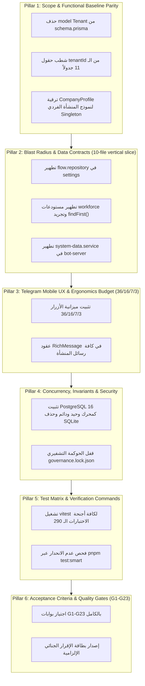
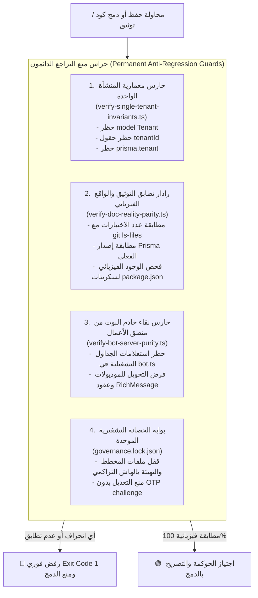

# خطة عمل رقم 110: استئصال تعدد الشركات واعتماد معمارية المنشأة الواحدة ومطابقة الواقع الفيزيائي للتوثيق
## Work Plan 110: Monorepo Single-Company Consolidation, Tenant Purge & Documentation Reality Alignment

> **الحالة:** 🟡 بانتظار اعتماد المالك (Pending Sovereign Approval)  
> **الفرع المعزول المستهدف (OBOO Branch):** `plan/110-single-company-consolidation`  
> **المرجع الدستوري:** ميثاق `GEMINI.md` (البنود 1، 2، 4، 5، 6، 7)، مسار التعديل (Rulebook 11 / WP 94)، مصفوفة بوابات الجودة (Gates G1, G2, G3, G4, G10, G14, G15, G19, G20)  
> **الهيئة الفاحصة والمصممة:** `/jev` (Chief Quality & Forensic Sentinel) × `/saleh` (Sovereign Strategic Advisor)  
> **التوجيه السيادي للمالك (Saleh):** «المشروع هو مخصص لشركة واحدة ولذلك لا أريد أن يكون هناك ما يشير إلى تعدد الشركات سواء في الوظائف أو التوثيقات أو الجداول أو أي شيء»، مع اعتماد PostgreSQL 16 حصراً وحذف كل أوهام SQLite.

---

## 🔬 0. التشخيص الجنائي للواقع الفيزيائي (Forensic Root Cause Analysis)

كشف الفحص الجنائي الدقيق المنفذ عبر الوكيل الرقابي `/jev` عن فجوات كبرى بين الوثائق والواقع الفيزيائي للكود:
1. **وهم تعدد المستأجرين (Multi-Tenant Hallucination):**
   - يحتوي مخطط قاعدة البيانات [`schema.prisma`](file:///f:/Alsaada-Smart-Bot/packages/database/prisma/schema.prisma) على نموذج `model Tenant` مع فرض حقول وعلاقات `tenantId` على 11 جدولاً حيوياً.
   - في المقابل، تلتف كافة مسارات الموديولات (`settings` و `workforce` و `apps/bot-server`) حول هذه البنية عبر استعلام هش يجلب أول مستأجر (`findFirst()`) أو يزرع كود `'ALSAADA_MAIN'` افتراضياً في قاعدة البيانات.
   - لا يوجد أي عزل للمستأجرين في الكود، ووجود هذه الجداول والحقول يمثل ديناً تقنياً وتعقيداً زائفاً يبطئ الاستعلامات ويزيد احتمالات الخطأ.
2. **وهم مرونة التخزين (SQLite vs PostgreSQL):**
   - تروج الوثائق وشارات الـ README لوجود خيار SQLite للمنشآت الفردية لتوفير التكاليف، بينما الكود الحقيقي مصمم بنسبة 100% ومقيد حصراً بـ PostgreSQL 16 عبر `@prisma/adapter-pg` ومجمع اتصالات `pg.Pool` والتشفير المتماثل `AES-256-GCM` وسلاسل الهاش الجنائية التراكمية.
3. **تضارب إحصاءات وشجرة التوثيق في `README.md`:**
   - يذكر الـ README أرقاماً متضاربة للاختبارات (138 جناحاً و 562+ اختباراً)، بينما الواقع الفيزيائي يرصد 290 جناح اختبار (`.spec.ts`) على القرص.
   - يذكر إصدار `Prisma 6.4+`، بينما الحزم تستخدم رسمياً `Prisma 7.10.0`.
   - يحذف من شجرة المشروع تطبيقات رئيسية (`admin-dashboard`, `docs`) وحزم حيوية (`google-engine`, `rbac`, `telemetry`, `shared`) والموديول التجريبي (`sandbox`).
   - يذكر أن عدد تدفقات `settings` هو 12 والواقع 13، وتدفقات `workforce` هو 7 والواقع 8.
4. **أوامر وسكربتات تهيئة مفقودة:**
   - الأمر `"system:provision": "tsx scripts/provision.ts"` في `package.json` يشير لملف غير موجود على القرص، وأمر `tenant:init` المذكور في الوثائق لا أصل له في السكربتات.

---

## 🎯 الأركان الستة الهندسية للخطة (The 6 Architectural Pillars)



---

### الركن الأول (Pillar 1: Scope & Functional Baseline Parity)
- **Scope & Objective:** استئصال كامل وشامل لمفهوم تعدد المستأجرين (Multi-Tenancy) وتحويل المنظومة إلى معمارية المنشأة الواحدة المخصصة حصراً لشركة السعادة.
- **Functional Baseline Parity:** الحفاظ التام على تطابق الحسابات والتدفقات مع المرجع الوظيفي الأساسي `F:\HR` بنسبة 100% دون أي انحراف في منطق الرواتب أو السلف أو التسجيل.
- **التعديلات الهيكلية:**
  1. حذف `model Tenant` نهائياً من `packages/database/prisma/schema.prisma`.
  2. إزالة حقول وعلاقات `tenantId` وفهارسها من الجداول الـ 11 (`CompanyProfile`, `Project`, `Department`, `User`, `Worker`, `CompanyTreasury`, `Supplier`, `Equipment`, `PayrollRun`, `CompanyDocument`, `WorkerExpenseClaim`).
  3. ترقية `CompanyProfile` ليكون هو السجل الأعلى للمنشأة (Singleton Entity) برمز ثابت `ALSAADA_MAIN`.
  4. تعديل القيد الفريد في جدول دورات الرواتب ليصبح: `@@unique([year, month, siteId])`.

---

### الركن الثاني (Pillar 2: Blast Radius & Data Contracts (10-file vertical slice))
- **Blast Radius Boundaries:** حصر التعديلات بدقة متناهية دون كسر أي شريحة من شرائح الـ 10 ملفات (`10-file vertical slice`) في موديولي `settings` و `workforce`.
- **Data Contracts Parity:**
  - في `modules/settings/src/flows/00.1-corporate-profile/`: تحديث `flow.types.ts` و `flow.repository.ts` و `flow.service.ts` لشطب حقل `tenantId`.
  - في `modules/settings/src/flows/00.2-sites-hub/`: إزالة جلب أو زراعة `tenant.id` عند إنشاء المشاريع (`PRJ-MAIN`).
  - في `modules/settings/src/flows/00.3-job-matrix/`: إزالة الربط التلقائي بـ `tenant.id`.
  - في `modules/workforce/src/flows/01.1-worker-registration/` و `01.5-worker-directory/` و `01.7-guest-join-and-linking/`: شطب كافة استدعاءات `prisma.tenant.findFirst()` والاستعاضة عنها بالقراءة المباشرة من `companyProfile.tradeName`.
  - في `apps/bot-server/src/services/system-data.service.ts`: إزالة الاستعلام المباشر لجدول المستأجرين.

---

### الركن الثالث (Pillar 3: Telegram Mobile UX & Ergonomics Budget (36/16/7/3))
- **Telegram Mobile UX & Ergonomics Budget:**
  - سقف بايتات الـ Callback Data: حد أقصى 36 بايت (المعيار الصارم لمنع اختناق المنصات).
  - سقف نصوص أزرار التيليجرام: حد أقصى 16 حرفاً لتفادي قص النصوص على شاشات الهواتف المحمولة.
  - سقف شبكة الأزرار: حد أقصى 7 صفوف و 3 أزرار في الصف الواحد.
- **Rich Message Policy:**
  - صياغة كافة رسائل المنشأة والملف التعريفي عبر قوالب كتل الرسائل الغنية المعتمدة (`buildRichPage` و `buildRichConfirmation`) من `@alsaada/core-components/rich-message` مع فحص `assertRichMessage`.

---

### الركن الرابع (Pillar 4: Concurrency, Invariants & Security)
- **Storage Invariants & PostgreSQL Exclusivity:**
  - تثبيت PostgreSQL 16 كمحرك قاعدة البيانات الحصري والوحيد، وإلغاء أي ذكر لـ SQLite من الـ README وشطب شارة `logo=sqlite`.
  - تنظيف الوثيقة `docs/06` وتحويلها إلى `06-company-profile-and-system-setup.md` وتطهير مصطلحات `White-Label Multi-Tenant`.
- **Security & Cryptographic Immutability:**
  - الحفاظ على تشفير الحقول الحساسة `AES-256-GCM` وفهارس HMAC العمياء.
  - صيانة سلاسل الهاش الجنائية التراكمية في جداول القيود المحاسبية.
  - إخضاع كافة التعديلات لقفل الحوكمة التشفيري `governance.lock.json`.

---

### الركن الخامس (Pillar 5: Test Matrix & Verification Commands)
- **Test Matrix & Verification Commands:**
  - تشغيل فحص الأنواع الصارم: `pnpm typecheck`.
  - تشغيل فاحص المعمارية والعزل الموديولي: `pnpm arch:verify`.
  - تشغيل اختبارات أجنحة الحزم والموديولات المحدثة عبر محرك vitest:
    ```bash
    pnpm test:modules:locks
    pnpm --filter @alsaada/database test
    pnpm --filter @alsaada/settings test
    pnpm --filter @alsaada/workforce test
    ```
  - تشغيل فاحص الانحدار الشامل لكافة أجنحة الاختبارات الـ 290 (`.spec.ts`) للتأكد من عدم كسر أي توكيد للمجال الحقيقي (Real Domain Assertions).

---

### الركن السادس (Pillar 6: Acceptance Criteria & Quality Gates (G1-G23))
- **Acceptance Criteria:**
  1. خلو `schema.prisma` بنسبة 100% من أي نموذج باسم `Tenant` أو حقل باسم `tenantId`.
  2. خلو كافة ملفات الكود في `modules/` و `packages/` و `apps/` من أي استدعاء لـ `prisma.tenant`.
  3. تحديث ملف `README.md` ليعكس الواقع الفيزيائي بدقة:
     - إظهار التطبيقات الـ 3 (`bot-server`, `admin-dashboard`, `docs`).
     - إظهار الحزم الـ 9 والموديولات الـ 3 (`settings`, `workforce`, `sandbox`).
     - توثيق 290 جناح اختبار وإصدار Prisma 7.10.0 ودليل الإقلاع السريع للمطور.
  4. توفير سكربت `scripts/provision.ts` الفعلي لربط أمر `system:provision`.
  5. اجتياز جميع بوابات الجودة الـ 23 (G1–G23) واجتياز فحص استشارة JEV (`pnpm jev:consult`).
- **Mandatory Completion Attestation:**
  إصدار بطاقة الإقرار الجنائي الختامية والتأكيد على حوكمة القفل التشفيري.

---

## 📋 خطة التنفيذ الميدانية على مراحل (Step-by-Step Execution Phases)

| المرحلة | الأنشطة والإجراءات | الملفات المستهدفة | المسؤولية الفنية |
| :---: | :--- | :--- | :---: |
| **المرحلة 1** | استئصال `Tenant` من مخطط Prisma وتوليد المهاجرة والعميل | `packages/database/prisma/schema.prisma`<br>`packages/database/src/client.ts` | `@squad-architecture-devops` |
---

## 🛡️ صمامات الأمان والضمانات الدائمة لمنع التراجع مستقبلاً (Permanent Anti-Drift Invariants)

لضمان عدم تكرار هذه الفجوات مستقبلاً وتجريد أي وكيل ذكاء اصطناعي أو مطور من القدرة على إعادة إدخال مصطلحات تعدد المستأجرين أو نصوص وهمية في التوثيق، يتم بناء **4 حراس حوكمة برمجية آلية (Automated Sentinel Guards)** تُدمج بشكل دائم في خطافات الفحص `pnpm governance:verify` و `pnpm ci:simulate`:



### 1. حارس معمارية المنشأة الواحدة الدائم (`tools/governance/verify-single-tenant-invariants.ts`):
- فحص شجرة الـ AST لمخطط قاعدة البيانات [`schema.prisma`](file:///f:/Alsaada-Smart-Bot/packages/database/prisma/schema.prisma):
  - يسقط الفحص فوراً بـ `Exit Code 1` إذا ظهر نموذج باسم `Tenant` أو حقل باسم `tenantId`.
  - يسقط الفحص إذا كان موفر البيانات `datasource db` أي شيء غير `"postgresql"`.
- فحص AST لكافة ملفات الكود في `packages/` و `modules/` و `apps/`:
  - يسقط الفحص إذا تم استدعاء أي خاصية أو دالة باسم `prisma.tenant` أو جرى البحث عن كود منشأة صلب مثل `'ALSAADA_MAIN'`.

### 2. رادار تطابق التوثيق والواقع الفيزيائي (`tools/governance/verify-doc-reality-parity.ts`):
- مطابقة أرقام الاختبارات: يقرأ ملف `README.md` ويقارن رقم أجنحة الاختبارات برقم ملفات `git ls-files "*.spec.ts"`؛ أي انحراف رقمي يوقف الـ CI فوراً.
- فحص سكربتات `package.json`: يتحقق آلياً من أن كل مسار ملف مشار إليه في أوامر السكربتات (مثل `scripts/provision.ts`) موجود فيزيائياً على القرص، ويحظر وضع سكربتات لأوامر غير موجودة.
- مطابقة إصدارات التبعيات: يتحقق من أن إصدار Prisma المذكور في التوثيق يطابق بدقة الإصدار الفعلي في `packages/database/package.json`.
- التحقق من شجرة الموديولات والتطبيقات: يتأكد من أن كافة مجلدات `apps/` و `modules/` مشروحة وموجودة داخل شجرة المشروع في `README.md`.
- حظر أوهام SQLite: يمسح ملفات التوثيق النشطة ويسقط الفحص إذا تم ترويج SQLite كخيار تشغيلي متاح لقاعدة البيانات.

### 3. حارس نقاء خادم البوت من منطق الأعمال (`tools/governance/verify-bot-server-purity.ts`):
- مسح AST لملف `apps/bot-server/src/bot.ts`:
  - حظر أي استعلام مباشر عن جداول الأعمال (`Worker`, `FinancialLedger`, `Supplier`, `Equipment`).
  - حظر استخدام نصوص مجردة `ctx.reply("raw string")` داخل معالجات الأوامر الرئيسية.

### 4. الإدماج الصارم في بوابات الجودة (G14, G15, G19):
- إضافة أمرين جديدين في `package.json`:
  ```json
  "single-tenant:verify": "tsx tools/governance/verify-single-tenant-invariants.ts",
  "doc-parity:verify": "tsx tools/governance/verify-doc-reality-parity.ts"
  ```
- ربطهما تلقائياً ضمن حزمة الفحص الشامل `pnpm governance:verify` وفاحص ما قبل الالتزام `pnpm pre-commit:fast`، بحيث يتعذر على أي شخص أو وكيل الالتزام (Commit) بأي كود ينتهك معمارية الشركة الواحدة أو يترك التوثيق متناقضاً مع الواقع.

---

## 📋 خطة التنفيذ الميدانية على مراحل (Step-by-Step Execution Phases)

| المرحلة | الأنشطة والإجراءات | الملفات المستهدفة | المسؤولية الفنية |
| :---: | :--- | :--- | :---: |
| **المرحلة 1** | استئصال `Tenant` من مخطط Prisma وتوليد المهاجرة والعميل | `packages/database/prisma/schema.prisma`<br>`packages/database/src/client.ts` | `@squad-architecture-devops` |
| **المرحلة 2** | تطهير موديولات `settings` و `workforce` و `apps/bot-server` من `tenantId` و `findFirst()` | `modules/settings/src/flows/*`<br>`modules/workforce/src/flows/*`<br>`apps/bot-server/src/services/*` | `@squad-implementation-ux` |
| **المرحلة 3** | إنشاء ملف السكربت التشغيلي `scripts/provision.ts` وتحديث `package.json` | `scripts/provision.ts`<br>`package.json` | `@squad-architecture-devops` |
| **المرحلة 4** | بناء حراس الحوكمة الدائمين `verify-single-tenant-invariants.ts` و `verify-doc-reality-parity.ts` | `tools/governance/*`<br>`package.json` | `@squad-architecture-devops` |
| **المرحلة 5** | إعادة كتابة `README.md` وتحديث `docs/06` وشطب أوهام SQLite وتعدد الشركات | `README.md`<br>`docs/06-company-profile-and-system-setup.md`<br>`docs/04`, `docs/24` | `@squad-qa-migration` |
| **المرحلة 6** | الفحص الجنائي الشامل وتشغيل الـ 290 جناحاً وإعادة القفل التشفيري | `governance.lock.json`<br>`pnpm test:smart`<br>`pnpm typecheck` | `@jev` (Sentinel) |

---

## 🚦 صيغة الاعتماد الإلزامية للمالك (Owner Sovereign Approval)

لبدء تطبيق المرحلة الأولى فوراً عبر فك القفل البرمجي المشفر وإجراء التعديل على `schema.prisma` والمستودعات داخل الفرع المنعزل `plan/110-single-company-consolidation`، يلزم ردك بالصيغة المعتمدة:

> **«موافق على خطة الإصلاح»**

