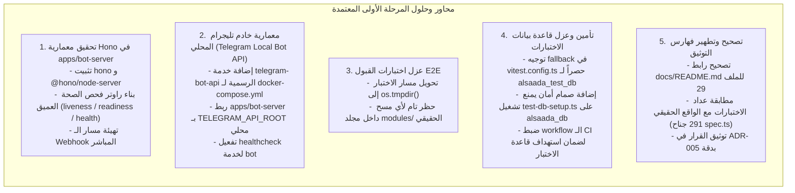

# خطة عمل رقم 111: المرحلة الأولى — أمن البيئة وعزل الاختبارات وتحقيق معمارية Hono وخادم تليجرام المحلي
## Work Plan 111: Phase 1 — Environment Security, Test Isolation, Deep Health Probes, Hono Engine Implementation & Telegram Local Bot API Architecture

> **الحالة:** 🟡 بانتظار اعتماد المالك (Pending Sovereign Approval)  
> **الفرع المنعزل (OBOO Branch):** `plan/111-security-test-isolation-data-safety`  
> **المرجع الدستوري:** ميثاق `GEMINI.md` (البنود 1، 3، 4، 5، 6، 7)، مسار التعديل السيادي (Rulebook 11 / WP 94)، مصفوفة بوابات الجودة (Gates G1, G5, G6, G7, G9, G10, G14, G15, G16, G17, G19, G20, G21, G22)  
> **القاعدة التشغيلية السيادية الملزمة:** الالتزام الصارم بتوجيه المالك بتقديم واقتراح الحلول الهندسية الفضلى والمثلى دائماً واعتماد خيار الاستضافة المحلية (On-Premise) مع خادم تليجرام المحلي (`telegram-bot-api`).  
> **الهيئة الفاحصة والمصممة:** `/jev` (Chief Quality & Forensic Sentinel) × `/saleh` (Sovereign Strategic Advisor)  
> **المحرك السحابي المعتمد:** TypeSafe System One (`jev-latest`) عبر `https://api.typesafe.ai/v1/systemone`  
> **السجل المرجعي للفجوات المستهدفة:** مخرجات المحادثة المرجعية `521771c5-c0a2-457e-965b-182d6f9bb5ca` ومجلد التدقيق الدوري `2026-09-25`.

---

## 🔬 0. التشخيص الجنائي للواقع الفيزيائي وفجوات المرحلة الأولى

بناءً على التوجيه المباشر للمالك:
1. **تثبيت واستخدام محرك Hono** رسمياً في `apps/bot-server` بدلاً من المخدم السطحي الأصلي، ليصبح المخدم الفعلي لنقاط فحص الصحة ومسار الـ Webhooks.
2. **اعتماد الخيار الثالث (الذهبي والأمثل):** استضافة On-Premise محلية في الشركة مع تفعيل خادم تليجرام المحلي (`telegram-bot-api`) كحاوية Docker مرافقة، لتحقيق زمن استجابة داخلي <1ms، كسر حدود الملفات (2GB)، ودعم مسارات الملفات المحلية (`file://`).
3. معالجة فجوات العزل الأمني لقاعدة بيانات الاختبار ومسارات الحذف التكراري في اختبارات القبول وتصحيح فهارس التوثيق الميتة.



---

## 🎯 الأركان الستة الهندسية للمرحلة الأولى (The 6 Architectural Pillars)

### الركن الأول (Pillar 1: Scope & Functional Baseline Parity)
- **Scope:**  
  1. ترقية البنية التحتية البرمجية لـ `apps/bot-server` بتثبيت محرك Hono رسمياً.
  2. إنشاء فحص صحة عميق متعدد الأبعاد (`/health/liveness`, `/health/readiness`, `/api/health`).
  3. إضافة حاوية خادم تليجرام المحلي (`telegram-bot-api`) إلى `docker-compose.yml` وضبط متغيرات البيئة.
  4. عزل اختبارات الـ E2E لتتم داخل مجلد النظام المؤقت `os.tmpdir()`.
  5. فرض العزل الصارم لقاعدة بيانات الاختبارات (`alsaada_test_db`).
  6. تصحيح الروابط المعطوبة وأرقام الاختبارات في مكتبة التوثيق.
- **Functional Baseline Parity:**  
  لا مساس بالـ 126 تدفقاً التشغيلية؛ التعديل يعزز البنية التحتية، الأمان، الرصد، وسرعة استجابة البوت.

---

### الركن الثاني (Pillar 2: Blast Radius & Detailed Modifications)

#### 1. تثبيت وتفعيل محرك Hono في `apps/bot-server`:
- **الملف:** [`apps/bot-server/package.json`](file:///f:/Alsaada-Smart-Bot/apps/bot-server/package.json)  
  - إضافة `hono` و `@hono/node-server` إلى التبعيات المباشرة (`dependencies`).
- **الملف:** [`apps/bot-server/src/index.ts`](file:///f:/Alsaada-Smart-Bot/apps/bot-server/src/index.ts)  
  - استبدال مخدم `node:http` القديم بتطبيق Hono متكامل:
    - مسار `/health/liveness`: يتحقق من حياة عملية Node.js.
    - مسار `/health/readiness` و `/api/health`:
      1. التحقق من `runner.isRunning()` (في نمط الـ Polling) أو جاهزية الـ Webhook.
      2. التحقق من اتصال قاعدة بيانات PostgreSQL عبر استعلام سريع (`prisma.$queryRaw\`SELECT 1\``).
      3. التحقق من استجابة ذاكرة Redis عبر `redis.ping()`.
      - إرجاع **`HTTP 503 Service Unavailable`** فوراً عند تعطل أي مكون رئيسي.
    - مسار `/webhook`: معالج الـ Webhook الرسمي لاستقبال تحديثات تليجرام من الخادم المحلي أو السحابي عبر `webhookCallback(bot, 'hono')`.
  - تشغيل المخدم عبر `serve({ fetch: app.fetch, port: Number(config.port) })`.
- **الملف:** [`apps/bot-server/src/config/env.ts`](file:///f:/Alsaada-Smart-Bot/apps/bot-server/src/config/env.ts)  
  - إضافة المتغيرات: `telegramApiRoot`, `telegramLocal`, `webhookUrl`.
- **الملف:** [`apps/bot-server/src/bot.ts`](file:///f:/Alsaada-Smart-Bot/apps/bot-server/src/bot.ts)  
  - تمرير `apiRoot: config.telegramApiRoot` إلى إعدادات عميل `grammy`.

#### 2. معمارية خادم تليجرام المحلي في `docker-compose.yml`:
- **الملف:** [`docker-compose.yml`](file:///f:/Alsaada-Smart-Bot/docker-compose.yml)  
  - إضافة خدمة خادم تليجرام المحلي الرسمي:
    ```yaml
    telegram-bot-api:
      image: aiogram/telegram-bot-api:latest
      container_name: alsaada_enterprise_telegram_api
      restart: unless-stopped
      environment:
        TELEGRAM_API_ID: ${TELEGRAM_API_ID}
        TELEGRAM_API_HASH: ${TELEGRAM_API_HASH}
        TELEGRAM_LOCAL: "true"
        TELEGRAM_STAT: "true"
      volumes:
        - telegram_bot_api_data:/var/lib/telegram-bot-api
        - ./attachments:/app/attachments
      ports:
        - "127.0.0.1:${TELEGRAM_API_PORT:-8081}:8081"
      networks:
        - alsaada-enterprise-internal
        - alsaada-enterprise-public
    ```
  - إضافة `telegram_bot_api_data:` إلى قسم `volumes`.
  - إضافة فحص الصحة لخدمة `bot`:
    ```yaml
    healthcheck:
      test: ["CMD-SHELL", "wget -qO- http://127.0.0.1:${PORT:-3000}/api/health || exit 1"]
      interval: 15s
      timeout: 5s
      retries: 3
      start_period: 20s
    ```
  - ربط بيئة `bot` بـ `TELEGRAM_API_ROOT: ${TELEGRAM_API_ROOT:-http://telegram-bot-api:8081}`.

#### 3. القضاء على أثر الحذف في اختبار القبول E2E:
- **الملف:** [`tools/modules/tests/module-onboarding.e2e.spec.ts`](file:///f:/Alsaada-Smart-Bot/tools/modules/tests/module-onboarding.e2e.spec.ts)  
  - استبدال المسار الثابت الخطير `modules/sample-domain` بمسار نظام مؤقت معزول:
    ```typescript
    const tempModuleDir = fs.mkdtempSync(path.join(os.tmpdir(), 'alsaada-e2e-onboarding-'));
    ```
  - تعديل مسار `outDir` الخاص بتوليد حزمة الإصدار التجريبية ليكون داخل المجلد المؤقت أيضاً، مع تنظيفه في `afterAll` دون لمس جذر المستودع نهائياً.

#### 4. فرض العزل التام لقاعدة بيانات الاختبار:
- **الملف:** [`vitest.config.ts`](file:///f:/Alsaada-Smart-Bot/vitest.config.ts)  
  - توجيه الـ fallback لقاعدة البيانات صراحة وحصراً إلى `alsaada_test_db`.
- **الملف:** [`scripts/test-db-setup.ts`](file:///f:/Alsaada-Smart-Bot/scripts/test-db-setup.ts)  
  - إضافة حارس أمان صارم (Fail-Fast Guard) يرفض العمل ويرمي استثناءً إذا كان الـ URL المستهدف يشير إلى `alsaada_db` الرئيسية.
- **الملف:** [`.github/workflows/ci.yml`](file:///f:/Alsaada-Smart-Bot/.github/workflows/ci.yml)  
  - تمرير `DATABASE_URL` المحقون بقاعدة الاختبار صراحة لخطوة `pnpm test`.

#### 5. تحديث التوثيق المؤسسي وقرار `ADR-005`:
- **الملف:** [`apps/docs/src/content/docs/adrs/adr-005.md`](file:///f:/Alsaada-Smart-Bot/apps/docs/src/content/docs/adrs/adr-005.md)  
  - توثيق المعمارية المعتمدة: محرك Hono فائق السرعة لدعم فحص الصحة والـ Webhooks محلياً مع خادم تليجرام المحلي (`telegram-bot-api`)، مع دعم الـ Polling البديل.
- **الملف:** [`docs/README.md`](file:///f:/Alsaada-Smart-Bot/docs/README.md)  
  - تصحيح الرابط المعطوب السطر 43 من `28-master-tests-...` إلى `29-master-tests-...`.
  - تصحيح ترقيم الجدول من 28 المكرر إلى 29.
  - تحديث إحصاءات الاختبارات لتسجل 291 جناح اختبار حقيقي.

---

### الركن الثالث (Pillar 3: Telegram Mobile UX & Ergonomics Budget)
- **الحالة:** N/A (غير منطبق مباشرة)؛ مع الحفاظ الكامل على ميزانية الأزرار (36/16/7/3) وعدم المساس بأي من رسائل المستخدم، بينما يدعم الخادم المحلي نقل الملفات الكبيرة حتى 2GB.

---

### الركن الرابع (Pillar 4: Concurrency, Invariants & Security)
1. **Hono Physical Engine Invariant:** التحقق من وجود `hono` و `@hono/node-server` فعلياً في `apps/bot-server` واستخدام `Hono` في المخدم.
2. **Deep Healthcheck Invariant:** حظر إرجاع كود 200 أو `status: ready` إذا كان `runner` متوقفاً أو قاعدة البيانات منهارة، وإرجاع كود 503 عند الفشل.
3. **Local Bot API Readiness Invariant:** دعم التوجيه المباشر لخادم تليجرام المحلي عبر `TELEGRAM_API_ROOT`.
4. **Anti-Self-Destruction Invariant:** حظر استدعاء `rmSync` على أي مسار يقع تحت `modules/` أو `packages/` في أي اختبار.
5. **Database Isolation Guard:** حظر تشغيل الاختبارات ضد قاعدة `alsaada_db`.
6. **Zero Secret Leakage (Gate G16):** حظر كتابة أي كلمات سر حقيقية في الكود المصدري أو ملفات التوثيق.

---

### الركن الخامس (Pillar 5: Test Matrix & Verification Commands)

إنشاء الجناح الحصين الدائم:  
[`tests/wave-1-security-and-isolation-invariants.spec.ts`](file:///f:/Alsaada-Smart-Bot/tests/)

يتضمن الجناح 7 اختبارات صارمة:
1. `apps/bot-server/package.json contains hono and @hono/node-server dependencies`.
2. `apps/bot-server/src/index.ts integrates Hono and conducts deep health checks on runner and database`.
3. `docker-compose.yml defines telegram-bot-api service and bot healthcheck`.
4. `ADR-005 accurately documents Hono engine and Local Bot API architecture`.
5. `module-onboarding.e2e.spec.ts operates inside os.tmpdir() and never deletes modules/sample-domain in repo`.
6. `vitest.config.ts fallback DATABASE_URL strictly targets alsaada_test_db`.
7. `test-db-setup.ts fails fast and throws error if target URL contains alsaada_db`.

**أوامر التحقق والتشغيل:**
```bash
# 1. فحص جناح الأمان والعزل الجديد
pnpm test:target tests/wave-1-security-and-isolation-invariants.spec.ts

# 2. فحص اختبار القبول E2E في بيئته المعزولة
pnpm test:target tools/modules/tests/module-onboarding.e2e.spec.ts

# 3. فحص انضباط الأنواع عبر المونوريبو
pnpm typecheck
```

---

### الركن السادس (Pillar 6: Rollback Strategy & Physical Provenance)
- **استراتيجية التراجع (Rollback):**
  العملية تتم بالكامل داخل الفرع المنعزل `plan/111-security-test-isolation-data-safety`. إذا حدث أي فشل غير متوقع، يمكن التراجع الفوري عن الـ commit أو حذف الفرع وإعادة بنائه من `main` دون أدنى مساس بالفروع الرئيسية.
- **إثبات الحقيقة الفيزيائية:**
  جميع الأكواد تخضع لفحص `pnpm audit:saleh:boost` وفحص `ocr review` قبل تقديم طلب الدمج النهائي.
