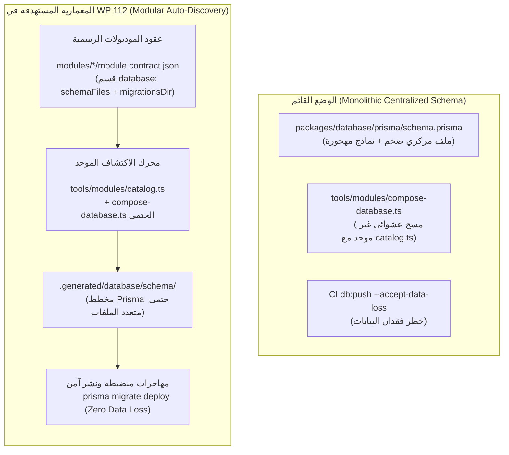

# خطة عمل رقم 112: مخطط قاعدة البيانات الوظيفي والاكتشاف التلقائي للموديولات (Wave 2)
## Work Plan 112: Functional Database Schema and Module Auto-Discovery Architecture

> **الحالة:** 🟡 بانتظار الاعتماد السيادي (Pending Sovereign Approval)  
> **الفرع المنعزل (OBOO Branch):** `plan/112-functional-database-schema-and-module-autodiscovery`  
> **المرجع الدستوري:** ميثاق `GEMINI.md` (البنود 1، 2، 3، 4، 5، 6، 7، 7.1)، مسار التعديل والإنشاء السيادي (Rulebooks 11 & 12)، مصفوفة بوابات الجودة (G1, G2, G3, G4, G7, G10, G13, G14, G15, G19, G20, G21)  
> **الهيئة الفاحصة والمصممة:** `/jev` (Chief Quality & Forensic Sentinel) × `/saleh` (Sovereign Strategic Advisor)  
> **المحرك السحابي المعتمد:** TypeSafe System One (`jev-latest`) عبر `https://api.typesafe.ai/v1/systemone`  
> **الوثيقة المرجعية الأصلية:** تقرير التدقيق الدوري `docs/periodic-audits/2026-09-25/16-plan-functional-database-schema-and-module-autodiscovery.md`.

---

## 🔬 0. التشخيص الجنائي للواقع المعماري والمشكلة الأساسية

يعاني المستودع تاريخياً من مركزية ملف قاعدة البيانات العملاق (`packages/database/prisma/schema.prisma`)، حيث تتجمع نماذج الـ 126 تدفقاً في ملف واحد غير مملوك للموديولات التي تنفذ وظائفها فعلياً، مما يترتب عليه المشكلات التالية:
1. **غياب ملكية المخططات (Broken Schema Ownership):** الموديولات المستقلة (`modules/workforce`, `modules/settings`) لا تعلن مساهماتها في قاعدة البيانات داخل عقودها (`module.contract.json`)، بينما عقد `modules/sandbox` يعلن ملفات مخطط غير مستخدمة فعلياً.
2. **ازدواجية محركات الاكتشاف والتركيب (Discovery Divergence):** أداة التركيب `tools/modules/compose-database.ts` تبحث عن مجلدات `database/` بشكل مستقل عن سجل الاكتشاف الرسمي `tools/modules/catalog.ts` ومحمل التشغيل `modules-registry.ts`.
3. **وجود نماذج وهمية أو غير مستخدمة (Zombie & Phantom Models):** وجود نماذج وجداول في المخطط لا يقابلها أي استدعاء فعلي في تدفقات Telegram أو لوحة الإدارة.
4. **فجوة المهاجرات في بيئة الـ CI (CI Data-Loss Risk):** استخدام أمر `db:push --accept-data-loss` في الـ CI بدلاً من مسار المهاجرات المنضبط (`prisma migrate deploy`).



---

## 🎯 الأركان الستة الهندسية لخطة العمل 112 (The 6 Architectural Pillars)

---

### الركن الأول (Pillar 1: Scope & Functional Baseline Parity)
- **Scope:**
  1. إجراء جرد ساكن وديناميكي شامل لكافة نماذج `packages/database/prisma/schema.prisma` وربط كل نموذج بمستودعه وتدفقه ومالكه الفعلي (`model → repository/service → entry point/flow → owner`).
  2. تحديث وتوحيد عقود الموديولات (`modules/workforce/module.contract.json`, `modules/settings/module.contract.json`) بإضافة قسم `database` الرسمي، وحسم وضع `sandbox`.
  3. توحيد محرك الاكتشاف (`catalog.ts`) مع مركب المخطط (`compose-database.ts`) لتوليد مخطط Prisma متعدد الملفات في `.generated/database/schema/` بشكل حتمي وحساب بصمة تجزئة SHA-256 للمخطط المجمع.
  4. نقل نماذج المجال الخاصة بـ `workforce` و `settings` تدريجياً إلى مجلدات الموديولات (`modules/<module>/database/schema.prisma`) مع الإبقاء على النواة المشتركة فقط في `packages/database`.
  5. محاذاة مسارات البناء وتوليد العميل (`packages/database/prisma.config.ts`, `package.json`, Dockerfile, GitHub Actions).
  6. بناء جناح اختبارات ثوابت شامل يمنع أي تعارض في الأسماء أو العلاقات العابرة للموديولات دون عقد مصرح به.
- **Functional Baseline Parity (`F:\HR`):**
  - لا مساس بالحسابات أو الشاشات أو منطق الـ 126 تدفقاً التشغيلية؛ الهدف هو إعادة هيكلة وتوزيع ملكية البيانات مع الحفاظ بنسبة 100% على مطابقة `F:\HR`.

---

### الركن الثاني (Pillar 2: Blast Radius & Target Inventory)
الالتزام بمبدأ **Zero Blast Radius**؛ التعديلات محصورة حصراً في الملفات التالية:
- **عقود الموديولات:**
  - `modules/workforce/module.contract.json`
  - `modules/settings/module.contract.json`
  - `modules/sandbox/module.contract.json`
- **مخططات الموديولات الجديدة:**
  - `modules/workforce/database/schema.prisma`
  - `modules/settings/database/schema.prisma`
- **المخطط المركزي المحدث:**
  - `packages/database/prisma/schema.prisma`
  - `packages/database/prisma.config.ts`
  - `packages/database/package.json`
- **أدوات الحوكمة والاكتشاف:**
  - `tools/modules/catalog.ts`
  - `tools/modules/compose-database.ts`
  - `tools/modules/validate-catalog.ts`
  - `tools/modules/tests/database-composition.spec.ts`
- **أدوات البناء والـ CI:**
  - `.github/workflows/ci.yml` (تطبيق التركيب قبل التوليد والنشر)
  - `docker/Dockerfile`
- **التوثيق:**
  - `docs/18-enterprise-schema-and-entity-relationship-model.md`
  - `docs/21-mandatory-module-architecture-and-gates.md`

---

### الركن الثالث (Pillar 3: The 6 Discrete Implementation Tasks)

#### المهمة 1: تثبيت خط الأساس وجرد استخدام النماذج (Model Usage Inventory)
- مسح كامل لجميع نماذج `packages/database/prisma/schema.prisma`.
- تتبع استدعاءات كل نموذج عبر `ast-grep` والبحث المعجمي في `modules/`, `packages/`, `apps/`.
- تصنيف كل نموذج إلى 4 فئات:
  1. `SHARED_CORE`: نماذج البنية المشتركة الحقيقية (مثل `CompanyProfile`, `AuditLog`, `SystemConfig`, `User`).
  2. `DOMAIN_WORKFORCE`: نماذج تابعة لإدارة العاملين والتشغيل (مثل `Worker`, `Department`, `JobTitle`, `DutyRoster`, `PayrollRun`).
  3. `DOMAIN_SETTINGS`: نماذج الإعدادات وإدارة النظام.
  4. `UNUSED_CANDIDATE`: نماذج غير مستخدمة في أي كود تنفيذي (تُعزل وتُراجع قبل الحذف).
- إخراج تقرير جرد مفصل في `docs/schemas/model-ownership-inventory.json`.

#### المهمة 2: تعريف حدود الملكية وعقد مساهمة الموديول (`module.contract.json`)
- ترقية مواصفة `module.contract.json` لتدعم الحقول:
  ```json
  "database": {
    "schemaFiles": ["database/schema.prisma"],
    "relationsFile": "database/relations.contract.json",
    "migrationsDir": "database/migrations"
  }
  ```
- تحديث عقود `modules/workforce` و `modules/settings`.
- تصحيح عقد `modules/sandbox` إما بحذف مساهمة DB أو ضبطه كعقد اختباري لا ينتج جداول إنتاجية.

#### المهمة 3: توحيد اكتشاف الموديولات وتركيب المخطط الحتمي
- دمج منطق استكشاف المخططات في `tools/modules/catalog.ts` ليعتمد حصراً على ما تعلنه العقود الرسمية.
- إعادة كتابة `tools/modules/compose-database.ts` لتوليد مجلد المخطط متعدد الملفات `.generated/database/schema/` بدلاً من الدمج النصي البدائي.
- استخراج `datasource` و `generator` مركزياً وحظر تكرارهما داخل الموديولات.
- حساب بصمة SHA-256 للمخطط المجمع في manifest خاص لضمان حتمية البناء (Deterministic Build).

#### المهمة 4: نقل النماذج إلى مالكيها تدريجياً (Incremental Migration)
- نقل نماذج قطاع العاملين إلى `modules/workforce/database/schema.prisma`.
- نقل نماذج الإعدادات إلى `modules/settings/database/schema.prisma`.
- إبقاء النماذج العامة والمالية المشتركة في `packages/database/prisma/schema.prisma`.
- تشغيل أداة التركيب والتحقق من تطابق العميل المولد (`prisma generate`).

#### المهمة 5: محاذاة أدوات البناء والـ CI والـ Dockerfile
- تحديث `packages/database/prisma.config.ts` ليشير إلى مسار المخطط المجمع.
- تحديث أوامر `pnpm db:generate` في جذر المشروع والحزم لتشغيل التركيب أولاً (`pnpm db:compose && prisma generate`).
- تصحيح مسار GitHub Actions (`.github/workflows/ci.yml`) لتطبيق `prisma migrate deploy` الآمن بدلاً من `db:push --accept-data-loss`.

#### المهمة 6: توثيق معايير الحوكمة واختبارات الانحدار
- كتابة جناح اختبار شامل `tools/modules/tests/database-composition.spec.ts`:
  - التحقق من رفض أي تكرار في أسماء النماذج أو الحقول.
  - التحقق من حظر العلاقات العابرة للموديولات دون عقد صريح.
  - التحقق من حتمية التجميع وتطابق الهاش.
- تحديث الوثيقة المعمارية [`docs/18`](docs/18-enterprise-schema-and-entity-relationship-model.md) والوثيقة [`docs/21`](docs/21-mandatory-module-architecture-and-gates.md).

---

### الركن الرابع (Pillar 4: Testing & Regression Strategy - TDD)
- تطبيق منهجية **Test-Driven Development (TDD)** الصارمة:
  1. **Red Stage:** كتابة اختبارات التركيب والاكتشاف الموحد (`database-composition.spec.ts`) وفشلها قبل كتابة محرك التركيب المحدث.
  2. **Green Stage:** تنفيذ محرك الاكتشاف والتركيب وتوزيع النماذج واجتياز كافة الاختبارات.
  3. **Refactor Stage:** ضبط الأداء وتحقيق ميزانية التنفيذ (< 2s).
- **جناح اختبارات الثوابت الدائم:**
  إنشاء `tests/wave-2-database-composition-invariants.spec.ts` للتحقق من سلامة المخطط المولد وسلامة العميل.

---

### الركن الخامس (Pillar 5: Security, RBAC & Cryptographic Lock Plan)
- **قواعد أمان المخطط:**
  - حظر أي حقول غير مشفرة للبيانات الحساسة (تطبيق AES-256-GCM للبيانات المدنية والرواتب).
  - حظر النماذج مجهولة المالك (Orphan Models).
- **بروتوكول القفل التشفيري التلقائي:**
  - أي ملف مخطط أو عقد موديول يتم تعديله يُقفل تلقائياً بالهاش SHA-256 في `governance.lock.json`.
  - اجتياز `pnpm lock:verify` كشرط قطعي للانتهاء.

---

### الركن السادس (Pillar 6: Quality Gates & Rollback Playbook)
- **مطابقة بوابات الجودة (Quality Gates Compliance):**
  - **Gate G1 (Type Safety):** خلو كامل من `any` واجتياز `pnpm typecheck`.
  - **Gate G2 (10-File Slice Architecture):** احترام حدود الموديولات الـ 10 ملفات.
  - **Gate G4 (Flow & Module Contracts):** مطابقة عقود `module.contract.json`.
  - **Gate G10 (Test Authenticity):** فحص حقيقي لقاعدة البيانات بدون Mocking مفرط.
  - **Gate G13 (Cryptographic Integrity):** سلامة الهاش وسلاسل التدقيق.
  - **Gate G15 (Git Hygiene):** العمل داخل فرع منعزل ونظيف off `main`.
  - **Gate G20 (Database Migration Reversibility):** وجود مهاجرات قابلة للعكس وخلو من فقدان البيانات.
- **خطة التراجع الآمن (Rollback Playbook):**
  - في حال حدوث أي خطأ غير متوقع أثناء التركيب أو التوليد، يتم الاحتفاظ بالنسخة الأصلية لـ `schema.prisma`، وتفريغ المسار المؤقت `.generated/database/`، والرجوع لحالة الالتزام النظيفة عبر Git.

---

## 🔬 7. استشارة محرك الجودة `/jev` (Pre-Task Plan Readiness Consultation)

- **الهدف الرقابي:** فحص الخطة عبر الأبعاد الـ 10 لمحرك System One السحابي.
- **الحد الأدنى للاعتماد:** تحقيق مؤشر جاهزية **Plan Readiness >= 90%** و **CGI >= 95%**.
- **صيغة الاعتماد السيادي المطلوبة لبدء الكود:**
  > **«موافق على خطة الإصلاح»**
