# خطة عمل رقم 113: تفكيك وتطهير خادم البوت، والتهيئة الموحدة، ومطابقة التوثيق للواقع الفيزيائي (الموجة 3)
## Work Plan 113: Pure Micro-Kernel Bot Decoupling, Unified System Provisioning & Architecture Reality Alignment (Wave 3)

> **الحالة:** 🟡 بانتظار اعتماد المالك (Pending Sovereign Approval) — تم دمج المقترحات التحسينية الجنائية لـ `/jev`  
> **الفرع المعزول المستهدف (OBOO Branch):** `plan/113-bot-decoupling-provisioning-and-reality-alignment`  
> **المرجع الدستوري:** ميثاق `GEMINI.md` (البنود 1، 2، 4، 5، 6، 7، 8.1، 8.2، 8.4)، كتيب القواعد 11 (مسار التعديل السيادي)، وبوابات الجودة (G1–G23).  
> **الهيئة الفاحصة والمصممة:** `/jev` (Chief Quality & Forensic Sentinel) × `/saleh` (Sovereign Strategic Advisor).  
> **مؤشر الجاهزية الرقابي (Plan Readiness):** **`98%`** (اجتياز كامل لعتبة WP 96).  
> **التوجيه السيادي للمالك (Saleh):** «المشروع مخصص لشركة واحدة، وتفكيك كافة الوظائف داخل موديولاتها، وتحويل خادم البوت لقشرة نقية، مع مطابقة التوثيق بنسبة 100% للواقع الفعلي وإلغاء أي أوهام لا وجود لها في الكود، ودمج المقترحات التحسينية».

---

## 🔬 0. التشخيص الجنائي للواقع الفيزيائي (Forensic Reality & Root Cause Analysis)

بناءً على نتائج التدقيق الفني الشامل بتاريخ 2026-09-25 (`docs/periodic-audits/2026-09-25/`) وفحص محرك `/jev` المباشر لأصل الكود، تم رصد الفجوات الهندسية التالية:

1. **تداخل منطق الأعمال وانتهاك سرية الرواتب داخل خادم البوت (`apps/bot-server/src/bot.ts`):**
   - يحتوي `bot.ts` في الأسطر 564–660 على استعلامات مباشرة عن جداول `prisma.worker` و `prisma.financialLedger` و `prisma.supplier`.
   - **انتهاك Gate G8:** طباعة أرقام الرواتب والبدلات مكشوفة تماماً دون تعمية `formatSpoiler` في أمر `/قسيمة راتبي/`.
   - **انتهاك Gate G11 & G23:** قراءة تاريخ عشوائي `const currentMonth = new Date().toISOString().slice(0, 7);` في أمر `/كشف حسابي/`، مما يعطل مطابقة دورة الرواتب المصرية (26 إلى 25) ويسبب انحرافاً في كشف الحساب.
   - **انتهاك Gate G5 & G22 والبند 8.1:** استخدام نصوص مجردة بـ `ctx.reply(...)` بدلاً من قوالب الرسائل الغنية المعتمدة (`@alsaada/core-components/rich-message`).
   - خرق مبدأ القشرة المعمارية النقية (Pure Micro-Kernel Bot Shell).

2. **تعطل أمر التهيئة الأولي وثغرة دورة حياة الاتصال (`scripts/provision.ts`):**
   - في `scripts/provision.ts`، يتم استيراد عميل Prisma في السطر 1 قبل تحميل متغيرات البيئة بـ `dotenv`، مما يتسبب في فشل الاتصال بقاعدة البيانات (`Authentication failed for user "postgres"`).
   - في `packages/database/src/scripts/seed-company-profile.ts` السطر 71، يوجد `finally { await disconnectDatabase(); }`، مما يقطع الاتصال بقاعدة البيانات فور انتهاء الخطوة 1، فيفشل السكربت الرئيسي في الخطوتين 2 و 3.
   - ظهور مصطلحات "White-Label" قديمة تتعارض مع المعمارية الموحدة لشركة السعادة.

3. **انحراف التوثيق عن الواقع الفيزيائي للكود (Documentation-Code Drift):**
   - احتواء وثائق `docs/06` و `README.md` على مصطلحات Multi-Tenant وأوهام SQLite غير الموجودة في الواقع.
   - تفاوت أرقام الاختبارات وبعض التبعيات ومسارات التشغيل في الوثائق المرجعية.

4. **غياب الحراس الدائمين لمنع التراجع (Permanent Anti-Drift Sentinels):**
   - عدم وجود حارس AST آلي يمنع عودة حقول `tenantId` أو نماذج `Tenant`.
   - عدم وجود فاحص آلي يمنع تلوث `apps/bot-server` باستيراد `prisma` أو الرسائل المجردة.
   - عدم وجود فاحص لمطابقة أرقام التوثيق بالواقع على القرص لمنع تكرار الانحراف.

---

## 🎯 الأركان الستة الهندسية المعززة بالتحسينات الجنائية (The 6 Enhanced Pillars)

```mermaid
flowchart TD
    subgraph Pillar1["Pillar 1: Scope & Functional Baseline Parity"]
        P1A["تطهير bot.ts من استعلامات الأعمال"]
        P1B["ترحيل الرواتب وكشف الحساب لـ workforce مع formatSpoiler"]
        P1C["ترحيل استعلامات الموردين لـ settings"]
    end

    subgraph Pillar2["Pillar 2: Blast Radius & Data Contracts"]
        P2A["الالتزام الصارم بـ 10-file vertical slice"]
        P2B["عقود RichMessage لرسائل الرواتب وكشف الحساب"]
        P2C["حظر النصوص المجردة Zero Raw Text"]
    end

    subgraph Pillar3["Pillar 3: Telegram Mobile UX (36/16/7/3)"]
        P3A["ميزانية الأزرار 36/16/7/3"]
        P3B["استخدام formatBreadcrumbs في الشاشات الجديدة"]
        P3C["تعمية الرواتب عبر formatSpoiler"]
    end

    subgraph Pillar4["Pillar 4: Invariants, Provisioning & Security"]
        P4A["تحميل dotenv في السطر الأول لسكربت التهيئة"]
        P4B["تجريد disconnectDatabase من الدوال الفرعية وحصرها في النهاية"]
        P4C["ضبط الدورة المحاسبية 26-25 عبر AccountingCycleService"]
        P4D["PostgreSQL 16 حصراً وحظر SQLite والـ Multi-Tenant"]
    end

    subgraph Pillar5["Pillar 5: Test Matrix & Permanent Sentinels"]
        P5A["حارس verify-single-tenant-invariants.ts"]
        P5B["حارس verify-bot-server-purity.ts (حظر استيراد prisma)"]
        P5C["حارس verify-doc-reality-parity.ts"]
        P5D["اختبار تكاملي دائم scripts/tests/provision.spec.ts"]
    end

    subgraph Pillar6["Pillar 6: Quality Gates & Attestation"]
        P6A["اجتياز بوابات G1-G23 بالكامل"]
        P6B["CGI >= 95% واجتياز jev:consult"]
        P6C["إصدار بطاقة الإقرار الجنائي الختامية"]
    end

    Pillar1 --> Pillar2 --> Pillar3 --> Pillar4 --> Pillar5 --> Pillar6
```

---

### الركن الأول (Pillar 1: Scope & Functional Baseline Parity)
- **Scope:** 
  1. تحويل `apps/bot-server` إلى قشرة تشغيلية نقية (Pure Micro-Kernel Bot Shell) تدير الاتصال، الجلسات، التوجيه العام، واعتراض المدخلات، وتفوض كافة استعلامات الأعمال للموديولات المكتشفة تلقائياً.
  2. ترحيل معالجات `bot.hears(/قسيمة راتبي/)` و `bot.hears(/كشف حسابي/)` إلى مسار معتمد في موديول `workforce` (`modules/workforce/src/flows/01.6-worker-self-edit` أو تدفق استعلامات الموظف).
  3. ترحيل معالج `bot.hears(/فواتيري ومستخلصاتي/)` لموديول الموردين أو الإعدادات العامة `settings`.
  4. ترحيل `bot.hears(/🚜 تسجيل منسوب/)` لمعالج العمليات الميدانية في موديول القوى العاملة.
- **Functional Baseline Parity:** مطابقة 100% مع شاشات وعمليات `F:\HR` وحسابات الرواتب وكشوف الحسابات دون أدنى تغيير في المخرجات الرقمية أو العملة (EGP حصراً).

---

### الركن الثاني (Pillar 2: Blast Radius & Data Contracts (10-file vertical slice))
- **Zero Blast Radius:** لا تعديل على جداول قاعدة البيانات المقفلة أو الحزم الأساسية؛ كافة التعديلات تنحصر في:
  - `apps/bot-server/src/bot.ts`
  - موديولات `workforce` و `settings`
  - `scripts/provision.ts` و `packages/database/src/scripts/seed-company-profile.ts`
  - `tools/governance/`
  - التوثيق `README.md` و `docs/06`
- **Rich Message Invariant:** تحويل كافة النصوص المجردة القديمة إلى قوالب `buildRichPage` من `@alsaada/core-components/rich-message` مفحوصة بـ `assertRichMessage`.

---

### الركن الثالث (Pillar 3: Telegram Mobile UX & Ergonomics Budget (36/16/7/3))
- **Button & Viewport Budget:**
  - نصوص الأزرار: حد أقصى 16 حرفاً.
  - الـ Callback Data: حد أقصى 36 بايت.
  - الشبكة: حد أقصى 7 صفوف × 3 أزرار.
- **Breadcrumbs Navigation:** شريط التنقل الهرمي عبر `formatBreadcrumbs`.
- **Sensitive Masking (Gate G8):** تغليف كافة مبالغ الرواتب والسلف عبر `formatSpoiler()` أو `<tg-spoiler>`.

---

### الركن الرابع (Pillar 4: Invariants, Provisioning & Security)
- **تأمين دورة حياة الاتصال والتهيئة (`scripts/provision.ts` & `seed-company-profile.ts`):**
  - استيراد `dotenv/config` أو تحميل متغيرات البيئة في السطر الأول قبل استيراد أي عميل لقاعدة البيانات.
  - إزالة `await disconnectDatabase();` من داخل دالة `seedCompanyProfile` الفرعية، وحصر قطع الاتصال في كتلة `finally` الختامية لسكربت `provision()`.
  - إنشاء وتثبيت ملف المنشأة الفردي `CompanyProfile` لشركة السعادة للتعدين ببيانات متكاملة.
  - إنشاء وتحديث المستخدم المدير العام الافتراضي مع ربطه بالرقم التعريفي لتيليجرام (`SUPER_ADMIN_TELEGRAM_ID`).
  - تشغيل فحص جاهزية قاعدة البيانات والتأكد من خروج السكربت بـ `Exit Code 0`.
- **ضبط الدورة المحاسبية (Gate G11 & G23):**
  - استبدال قراءة التاريخ العشوائية في كشف الحساب بخدمة `AccountingCycleService.resolveActiveCycle()` لضمان احترام دورة رواتب الـ 26 إلى 25.
- **Single-Company & Storage Invariant:**
  - تأكيد وتثبيت PostgreSQL 16 كمحرك وحيد، وشطب أي ذكر لـ SQLite.
  - حظر أي كيان أو حقل مستأجرين.

---

### الركن الخامس (Pillar 5: Test Matrix & Permanent Anti-Drift Sentinels)
- **1. حارس معمارية المنشأة الواحدة (`tools/governance/verify-single-tenant-invariants.ts`):**
  - فحص AST لمخططات Prisma: حظر وجود `model Tenant` أو أي حقل `tenantId`.
  - فحص الكود: حظر استدعاء `prisma.tenant`.
- **2. حارس نقاء خادم البوت (`tools/governance/verify-bot-server-purity.ts`):**
  - فحص AST لملف `apps/bot-server/src/bot.ts`:
    - **حظر استيراد Prisma نهائياً:** منع استيراد `{ prisma }` من `@alsaada/database`.
    - حظر استعلام الجداول التشغيلية مباشرة (`prisma.worker`, `prisma.financialLedger`, `prisma.supplier`).
    - حظر استدعاءات `ctx.reply("string")` المجردة دون كتل RichMessage.
- **3. رادار تطابق التوثيق والواقع الفيزيائي (`tools/governance/verify-doc-reality-parity.ts`):**
  - التحقق من وجود كافة الملفات المشار إليها في سكربتات `package.json`.
  - مطابقة إصدار Prisma المذكور في الوثائق مع `packages/database/package.json`.
  - مطابقة أعداد الاختبارات والموديولات مع الموجود الفعلي على القرص.
- **4. حزمة الاختبارات والتكامل (TDD & Automation):**
  - **اختبار تكاملي دائم (`scripts/tests/provision.spec.ts`):** اختبار قدرة `system:provision` على العمل بصفة Idempotent (إعادة التشغيل 3 مرات دون خطأ) والتحقق من إنشاء الشركة والمدير العام في < 3 ثوان.
  - اختبارات وحدة للحراس الثلاثة لضمان كفاءة كشف الانحرافات.

---

### الركن السادس (Pillar 6: Acceptance Criteria & Quality Gates (G1–G23))
- **Acceptance Criteria:**
  1. خلو `apps/bot-server/src/bot.ts` تماماً من استيراد `prisma` أو أي استعلام مباشر أو نصوص مجردة.
  2. تشغيل `pnpm system:provision` بنجاح وسلاسة وإنشاء ملف شركة السعادة وحساب المدير العام في < 3 ثوان بصفة Idempotent واجتياز `provision.spec.ts`.
  3. اجتياز الحراس الجدد الثلاثة بنسبة 100%:
     - `pnpm exec tsx tools/governance/verify-single-tenant-invariants.ts` -> PASS
     - `pnpm exec tsx tools/governance/verify-bot-server-purity.ts` -> PASS
     - `pnpm exec tsx tools/governance/verify-doc-reality-parity.ts` -> PASS
  4. تحديث `README.md` و `docs/06` بنسبة مطابقة 100% للواقع الفيزيائي.
  5. اجتياز الفحص النوعي `pnpm typecheck`، واختبارات الحوكمة `pnpm test:governance`، والفحص السريع `pnpm pre-commit:fast`.
  6. إعادة القفل التشفيري التام في `governance.lock.json` واجتياز `pnpm lock:verify`.
  7. تحقيق مؤشر حوكمة `CGI >= 95%` في فحص `/jev` وفحص `/saleh:boost`.

---

## 📋 خطة التنفيذ الميدانية على مراحل (Step-by-Step Execution Phases)

| المرحلة | الأنشطة والإجراءات | الملفات المستهدفة |
| :--- : | :--- | :--- |
| **المرحلة 1** | **إصلاح دورة حياة الاتصال وسكربت التهيئة (`scripts/provision.ts`)** • تحميل dotenv في السطر الأول. • إزالة `disconnectDatabase` من `seedCompanyProfile` وحصرها في `provision()`. • تهيئة بيانات شركة السعادة وحساب الأدمن. • إنشاء اختبار التكرارية `scripts/tests/provision.spec.ts`. • اختبار التشغيل بـ `pnpm system:provision`. | `scripts/provision.ts` `packages/database/src/scripts/seed-company-profile.ts` `scripts/tests/provision.spec.ts` |
| **المرحلة 2** | **تطهير خادم البوت ونقاء النواة (`Pure Bot Shell`)** • ترحيل معالجات الرواتب وكشف الحساب إلى `workforce` مع `formatSpoiler` وضبط دورة الرواتب. • ترحيل معالج الموردين إلى `settings`. • تحويل الرسائل لعقود RichMessage. • إزالة استيراد واستعلامات `prisma` بالكامل من `bot.ts`. | `apps/bot-server/src/bot.ts` `modules/workforce/src/flows/*` `modules/settings/src/flows/*` |
| **المرحلة 3** | **بناء حراس الحوكمة الدائمين الثلاثة** • بناء `verify-single-tenant-invariants.ts`. • بناء `verify-bot-server-purity.ts` (مع فحص حظر استيراد prisma). • بناء `verify-doc-reality-parity.ts`. • إضافة سكربتاتها في `package.json` وربطها بـ `governance:verify`. | `tools/governance/*` `package.json` |
| **المرحلة 4** | **تحديث الوثائق ومطابقتها للواقع الفيزيائي** • تنقيح `README.md` وشطب أوهام SQLite وتعدد الشركات. • تنقيح `docs/06-company-profile-and-system-setup.md`. • تحديث إحصائيات المعمارية والموديولات والـ 290+ اختباراً. | `README.md` `docs/06-company-profile-and-system-setup.md` |
| **المرحلة 5** | **الفحص الجنائي وإعادة القفل التشفيري الشامل** • فحص الأنواع `pnpm typecheck` واختبارات الحوكمة `pnpm test:governance`. • التحقق من القفل التشفيري `pnpm lock:verify`. • تدقيق `/jev` وفحص `/saleh:boost` وإصدار بطاقة الإقرار الجنائي الختامية. | `governance.lock.json` `docs/ai-execution-evidence/` |

---

## 🚦 صيغة الاعتماد الإلزامية للمالك (Owner Sovereign Approval Checkpoint)

وفقاً للبند 7 من ميثاق `GEMINI.md` والمسار التشغيلي السيادي (Rulebook 11 / WP 94)، فإن البدء في تنفيذ الكود البرمجي للمرحلة الأولى يتطلب اعتماد سيادتكم الصريح والمطابق حرفياً:

> **«موافق على خطة الإصلاح»**
