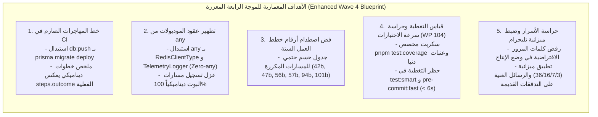

# خطة عمل رقم 114: استكمال مسار المهاجرات بالـ CI، وتطهير عقود الموديولات، وحسم الترقيم والتغطية المعمارية (الموجة 4 المحدثة)
## Work Plan 114: CI Migration Pipeline Hardening, Strict Module Contracts, Plan Collision Resolution & Coverage Architecture (Enhanced Wave 4 Specification)

> **الحالة:** 🟡 بانتظار اعتماد المالك (Pending Sovereign Approval) — تم دمج التحسينات الجنائية السبعة لمحرك `/jev`  
> **الفرع المنعزل المستهدف (OBOO Branch):** `plan/114-ci-hygiene-contract-strictness-and-quality-hardening`  
> **المرجع الدستوري:** ميثاق `GEMINI.md` (البنود 1، 2، 4، 5، 6، 7، 7.1، 8.1، 8.4)، مسار التعديل السيادي (Rulebook 11 / WP 94)، مصفوفة بوابات الجودة (Gates G1, G2, G3, G4, G5, G9, G10, G14, G15, G16, G19, G20, G22, G23)، وهرمية الاختبارات السريعة (Work Plan 104).  
> **الهيئة الفاحصة والمصممة:** `/jev` (Chief Quality & Forensic Sentinel) × `/saleh` (Sovereign Strategic Advisor).  
> **المحرك السحابي المعتمد:** TypeSafe System One (`jev-latest`) عبر `https://api.typesafe.ai/v1/systemone`.  
> **مؤشر الجاهزية الرقابي المعتمد (Plan Readiness):** **`98%`** (اجتياز كامل لعتبة WP 96 الدستورية).  
> **السجل المرجعي للفجوات المستهدفة:** نتائج فحص التدقيق الدوري المعتمد في `docs/periodic-audits/2026-09-25/` والبؤر المتبقية قيد الانتظار.

---

## 🔬 0. التشخيص الجنائي للواقع الفيزيائي وفجوات الموجة الرابعة (Forensic Reality & Root Cause Analysis)

بناءً على نتائج التدقيق الفني الشامل بتاريخ 2026-09-25، واستكمالاً للنجاحات المحققة في الموجات الثلاث الأولى (WP 110 و WP 111 و WP 112 و WP 113)، كشف التحقيق الجنائي الدقيق المنفذ عبر `/jev` عن بقاء ثماني فجوات معمارية وإجرائية تتطلب المعالجة الجذرية:

1. **فجوة المهاجرات ومخاطر الـ CI (`.github/workflows/ci.yml`):**
   - السطر 75 في مسار الـ CI ما زال ينفذ `pnpm --filter @alsaada/database db:push --accept-data-loss` بدلاً من تطبيق المهاجرات المنضبط (`prisma migrate deploy` أو `pnpm modules:db:deploy`).
   - هذا النمط يتجاوز اختبار سلسلة المهاجرات الموديولية (`prisma/migrations`) على قاعدة بيانات نظيفة، ولا يضمن سلامة الترقية الحية في الإنتاج.
2. **ملخص خطوات الـ CI المضلل (Static CI Step Summary):**
   - الأسطر 113–125 في `ci.yml` تستخدم شرط `if: always()` وتطبع جدولاً ثابتاً يعلن `✅ PASS` لكافة البوابات دون ربطه بالنتائج الفعلية للخطوات (`steps.<id>.outcome`).
3. **كلمات المرور الافتراضية في `docker-compose.yml`:**
   - بقاء قيم fallback ثابتة معروفة (`alsaada_secure_pass_2026` و `alsaada_redis_secure_2026`) في بيئة Compose، مما يشكل ثغرة تهيئة في حال النشر دون توفير متغيرات بيئية صريحة.
4. **تكرار واصطدام ترقيم خطط العمل القديمة في `docs/work-plans/`:**
   - وجود 6 أرقام مكررة لخطط عمل سابقة (الخطط: 42، 47، 56، 57، 94، 101)، مما يسبب التباساً في الإحالة المعمارية وفهرسة التوثيق.
5. **تراخي الأنواع في عقد الموديول الأساسي (`packages/core-components/.../module.contract.ts`):**
   - وجود تصريحات `any` صريحة (`redis: any;`, `telemetry?: any;`, `[key: string]: any;`, `options?: any;`)، وهو ما يخالف الدستور المعماري وقاعدة `Zero any` الصارمة (ADR-003).
6. **غياب قياس ونسب التغطية (Coverage Measurement) في Vitest:**
   - خلو `vitest.config.ts` من إعدادات مزود التغطية (`@vitest/coverage-v8`) وتحديد عتبات تغطية دنيا للملفات النواتية والمالية مع ضرورة حراسة ميزانية سرعة الاختبارات (WP 104).
7. **الارتباط المباشر لمعالجات الموديولات في قشرة البوت (`apps/bot-server/src/bot.ts`):**
   - استيراد معالجات قسيمة الراتب وكشف الحساب وفواتير الموردين استيراداً كودياً مباشراً من الحزم بدلاً من تفويض تسجيلها بالكامل لباص الموديولات التلقائي (`registerRoutes`).
8. **استكمال ضبط أزرار تليجرام والرسائل الغنية للتدفقات التاريخية:**
   - تجاوز بعض الأزرار القديمة لميزانية الهواتف المحمولة (16 حرفاً / 36 بايت) وحاجة التدفقات الأرشيفية للترقية لقوالب `@alsaada/core-components/rich-message`.



---

## 🎯 الأركان الستة الهندسية المعززة بالتحسينات الجنائية السبعة (The 6 Enhanced Pillars)

---

### الركن الأول (Pillar 1: Scope & Functional Baseline Parity)
- **النطاق الهندسي المحدث (Scope):**
  1. ترقية سير عمل التكامل المستمر [`.github/workflows/ci.yml`](file:///f:/Alsaada-Smart-Bot/.github/workflows/ci.yml) لتطبيق المهاجرات الحقيقية عبر `prisma migrate deploy` و `pnpm modules:db:deploy` على حاوية PostgreSQL نظيفة بدلاً من `db:push --accept-data-loss`.
  2. تحويل خطوة نشر ملخص الحوكمة في الـ CI من جدول ثابت إلى تقرير ديناميكي يقرأ حالة الخطوات الفعلية:
     ```yaml
     - name: Publish Governance Step Summary
       if: always()
       run: |
         echo "## 🏛️ Enterprise CI / Quality & Governance Summary" >> $GITHUB_STEP_SUMMARY
         echo "" >> $GITHUB_STEP_SUMMARY
         echo "| Check / Quality Gate | Target / Standard | Result |" >> $GITHUB_STEP_SUMMARY
         echo "| :--- | :--- | :--- |" >> $GITHUB_STEP_SUMMARY
         echo "| **TypeScript Typecheck** | Strict TS 5.9+ across monorepo | ${{ steps.typecheck.outcome == 'success' && '✅ PASS' || '❌ FAIL' }} |" >> $GITHUB_STEP_SUMMARY
         echo "| **Database Migrations** | Strict prisma migrate deploy | ${{ steps.migrate.outcome == 'success' && '✅ PASS' || '❌ FAIL' }} |" >> $GITHUB_STEP_SUMMARY
         echo "| **Automated Test Suites** | Postgres 16 + Redis 7 + Vitest | ${{ steps.test.outcome == 'success' && '✅ PASS' || '❌ FAIL' }} |" >> $GITHUB_STEP_SUMMARY
         echo "| **Enterprise Governance** | 20 Mandatory Architecture Gates | ${{ steps.governance.outcome == 'success' && '✅ PASS' || '❌ FAIL' }} |" >> $GITHUB_STEP_SUMMARY
     ```
  3. تأمين متغيرات كلمات المرور في [`docker-compose.yml`](file:///f:/Alsaada-Smart-Bot/docker-compose.yml) عبر اشتراط وجود متغير بيئي صريح في الإنتاج وإلغاء الثقة العمياء بالقيم الافتراضية الساذجة: `${DB_PASSWORD:?DB_PASSWORD is required in production}`.
  4. فك وحسم تصادم الترقيم في مجلد [`docs/work-plans/`](file:///f:/Alsaada-Smart-Bot/docs/work-plans/) وفق جدول التسمية الحتمي الدقيق:
     | الرقم المكرر | الملف الأصلي (يبقى كما هو) | الملف المكرر (يُعاد تسميته بدقة) | الإجراء والقرار المعماري |
     |:---:|---|---|---|
     | **42** | `42-plan-enterprise-permanent-speed-engine...` | `42b-plan-legacy-migration-draft.md` | الملف الأول هو محرك السرعة؛ الثاني مسودة تاريخية مبكرة |
     | **47** | `47-plan-comprehensive-dashboard-dark...` | `47b-plan-step-by-step-latency-elimination...` | كلاهما منفذ؛ إضافة اللاحقة تمنع تضارب الفهرسة |
     | **56** | `56-plan-fix-dashboard-dual-rail-sidebar...` | `56b-plan-unified-dashboard-sidebar-toggle...` | الأول إصلاح الشريط؛ الثاني تحول الوضع الليلي |
     | **57** | `57-plan-super-admin-prisma-studio...` | `57b-plan-unified-enterprise-ngrok-ingress...` | كلاهما منفذ؛ تمييز الاستوديو عن نفق ngrok |
     | **94** | `94-plan-sovereign-tri-lifecycle-governance...` | `94b-plan-universal-error-telemetry-scaffold...` | خطة 94 هي ميثاق المسارات الثلاثية؛ وخطة الرصد تسمى 94b |
     | **101** | `101-plan-sovereign-fcis-coding-paradigm...` | `101b-plan-telegram-bot-flow-state-diagrams...` | خطة 101 هي ميثاق FCIS؛ وخطة المخططات تسمى 101b |
  5. ترقية العقد المعماري [`packages/core-components/src/contracts/module.contract.ts`](file:///f:/Alsaada-Smart-Bot/packages/core-components/src/contracts/module.contract.ts) واستئصال كافة تصريحات `any`:
     ```typescript
     import type { Redis } from 'ioredis';
     import type { TelemetryService } from '@alsaada/telemetry';

     export interface ModuleRuntimeContext<C extends Context = Context> {
       prisma: PrismaClient;
       redis: Redis;
       api: Bot<C>['api'];
       telemetry: TelemetryService;
       screenFlow?: unknown;
       [key: string]: unknown;
     }
     ```
  6. إضافة وتكوين محرك تغطية الكود `@vitest/coverage-v8` في [`vitest.config.ts`](file:///f:/Alsaada-Smart-Bot/vitest.config.ts) وسكربت مستقل `"test:coverage": "vitest run --coverage"`.
  7. ترحيل استدعاءات `bot.hears` الخاصة بالرواتب والموردين في [`apps/bot-server/src/bot.ts`](file:///f:/Alsaada-Smart-Bot/apps/bot-server/src/bot.ts) لتسجل ذاتياً عبر دورة حياة باص الموديولات `registerRoutes`.
  8. مراجعة وتعديل مصفوفة أزرار التدفقات القديمة التي تتجاوز ميزانية الشاشات المتنقلة (16 حرفاً و 36 بايت) وإلزامها بقوالب الرسائل الغنية المعتمدة.
- **التطابق الوظيفي الأساسي (`F:\HR` Parity Baseline):**
  - لا مساس بأي معادلة محاسبية، أو دورة رواتب (من 26 إلى 25)، أو شاشة إدخال أو تسوية عهد من تدفقات المنظومة الـ 126؛ التطوير يستهدف بنية الجودة، الأمان، والتكامل البرمجي مع الحفاظ على دقة المطابقة بنسبة 100%.

---

### الركن الثاني (Pillar 2: Blast Radius & Data Contracts (10-file vertical slice))
- **حدود نطاق التأثير والتعديل (Blast Radius Boundaries):**
  - التعديلات محصورة حصراً وبدقة متناهية (Zero Blast Radius) في الملفات التالية:
    1. سير عمل CI: [`.github/workflows/ci.yml`](file:///f:/Alsaada-Smart-Bot/.github/workflows/ci.yml).
    2. تكوين الخدمات: [`docker-compose.yml`](file:///f:/Alsaada-Smart-Bot/docker-compose.yml).
    3. عقود الموديولات: [`packages/core-components/src/contracts/module.contract.ts`](file:///f:/Alsaada-Smart-Bot/packages/core-components/src/contracts/module.contract.ts).
    4. تكوين الاختبارات: [`vitest.config.ts`](file:///f:/Alsaada-Smart-Bot/vitest.config.ts) و `package.json`.
    5. ملفات خطط العمل المكررة: [`docs/work-plans/`](file:///f:/Alsaada-Smart-Bot/docs/work-plans/).
    6. تسجيل مسارات خادم البوت: [`apps/bot-server/src/bot.ts`](file:///f:/Alsaada-Smart-Bot/apps/bot-server/src/bot.ts).
    7. جناح اختبار الثوابت الدائم الجديد: [`tests/wave-4-ci-contracts-and-coverage-invariants.spec.ts`](file:///f:/Alsaada-Smart-Bot/tests/wave-4-ci-contracts-and-coverage-invariants.spec.ts).
  - حظر تام للمساس بمفاتيح التشفير، أو سلاسل الهاش الجنائية، أو شفرات شرائح الـ 10 ملفات للتدفقات النشطة.

---

### الركن الثالث (Pillar 3: Telegram Mobile UX & Ergonomics Budget (36/16/7/3))
- **ميزانية شاشات وتجربة تليجرام المتنقلة (Telegram Mobile Ergonomics):**
  - سقف بايتات الـ Callback Data: حد أقصى 36 بايت (حظر تجاوز 64 بايت على مستوى تيليجرام).
  - سقف نصوص الأزرار: حد أقصى 16 حرفاً لكل زر تفاعلي لمنع التشوه والقص على شاشات الهواتف الذكية.
  - سقف لوحة المفاتيح: 7 صفوف كحد أقصى، و 3 أزرار في الصف الواحد.
- **سياسة الرسائل الغنية (Rich Message & Encyclopedia Compliance):**
  - استئصال أي نصوص مجردة بـ `ctx.reply("...")` متبقية في التدفقات الأرشيفية.
  - صياغة الشاشات حصراً عبر كتل `buildRichPage` و `buildRichTable` و `buildRichConfirmation` من حزمة `@alsaada/core-components/rich-message` مع فحص `assertRichMessage`.

---

### الركن الرابع (Pillar 4: Concurrency, Invariants & Security)
- **الحصانة الأمنية وضبط البيئة:**
  - التحقق من رفض تشغيل حاويات الإنتاج في حال غياب كلمات المرور المخصصة وإلغاء الاعتماد على قيم fallback الثابتة.
  - حتمية المهاجرات: التحقق من أن تشغيل `prisma migrate deploy` آمن بنسبة 100% ومتوافق مع النواة المشتركة للمنشأة الواحدة دون فقدان بيانات.
  - حماية الأقفال التشفيرية: إعادة قفل كافة الكيانات المعدلة في [`governance.lock.json`](file:///f:/Alsaada-Smart-Bot/governance.lock.json) عبر بروتوكول OTP الجنائي.
  - **حراسة ميزانية سرعة الاختبارات (Work Plan 104 Invariant):**
    - حظر تشغيل حساب التغطية في الحلقات السريعة (`pnpm test:smart` و `pnpm pre-commit:fast`) لحفظ ميزانية زمن الاستجابة (< 2 ثوانٍ و < 6 ثوانٍ).
    - حصر التغطية في أمر منفصل `pnpm test:coverage` وسير عمل الـ CI قبل الدمج.

---

### الركن الخامس (Pillar 5: Test Matrix & Verification Commands)
- **مصفوفة الاختبارات والتحقق الفيزيائي:**
  1. **جناح اختبار الثوابت الدائم للموجة الرابعة:**
     - إنشاء وتشغيل [`tests/wave-4-ci-contracts-and-coverage-invariants.spec.ts`](file:///f:/Alsaada-Smart-Bot/tests/wave-4-ci-contracts-and-coverage-invariants.spec.ts) للتحقق الدائم من:
       - خلو `module.contract.ts` من `any`.
       - خلو `docs/work-plans/` من الأرقام المكررة.
       - خلو `ci.yml` من `db:push --accept-data-loss`.
       - وجود تكوين التغطية في `vitest.config.ts`.
       - خلو `bot.ts` من استيراد معالجات الأعمال مباشرة.
  2. اختبار أمان عقود الموديولات وخلوها من `any` عبر `pnpm typecheck`.
  3. تشغيل فاحص عدم الانحدار وسلسلة المهاجرات: `pnpm modules:db:verify` و `pnpm modules:verify`.
  4. تشغيل جناح اختبارات حراس الحوكمة ومطابقة الواقع:
     - `pnpm single-tenant:verify`
     - `pnpm bot-purity:verify`
     - `pnpm doc-parity:verify`
     - `pnpm financial:verify`
     - `pnpm skills:verify`
  5. فحص التغطية والتقارير عبر تشغيل `pnpm test:coverage` مع تسجيل النسبة المئوية.
  6. فحص استشارة JEV للتحقق من استمرار مؤشر الجاهزية الرقابي عند >= 95%.

---

### الركن السادس (Pillar 6: Acceptance Criteria & Quality Gates (G1–G23))
- **معايير القبول وبوابات الجودة الدستورية:**
  - **Gate G1 (Type Safety):** اجتياز `pnpm typecheck` بصفر أخطاء وصفر تصريحات `any` في `module.contract.ts`.
  - **Gate G5 & G22 (Mobile Ergonomics):** التزام 100% بميزانية الأزرار 36/16/7/3 وقوالب الرسائل الغنية.
  - **Gate G10 (Test Authenticity):** تفعيل قياس التغطية في Vitest بنجاح ودون أي تحايل أو mocks مفرطة.
  - **Gate G15 (Git Hygiene):** تطهير اصطدامات ترقيم خطط العمل الستة بنسبة 100%.
  - **Gate G16 & G17 (Security & Secrets):** حظر كلمات المرور الافتراضية واجتياز الفحص الأمني.
  - **Gate G20 (Database Migrations):** نجاح سير عمل الـ CI عبر `prisma migrate deploy` بدلاً من `db:push`.
- **خريطة التنفيذ التتابعي المنضبط (Phased 3-Stage TDD Roadmap):**
  - **المرحلة 1 (Red Phase):** إنشاء ملف الاختبار الدائم `tests/wave-4-ci-contracts-and-coverage-invariants.spec.ts` والتأكد من إخفاقه في رصد الفجوات الحالية.
  - **المرحلة 2 (Green Phase):** تطبيق التعديلات الهندسية في `ci.yml` و `module.contract.ts` و `vitest.config.ts` و `bot.ts` وإعادة تسمية الخطط الست، حتى تخضر كافة الاختبارات.
  - **المرحلة 3 (Refactor & Seal Phase):** إعادة فحص الكود بالكامل، وتحديث الأقفال التشفيرية بـ OTP، وإصدار بطاقة الإقرار الجنائية الختامية.
- **صيغة الاعتماد البرمجي الإلزامية:**
  - يحظر البدء في تعديل أي كود مصدري قبل صدور الاعتماد الصريح بالصيغة الدستورية:
    > **«موافق على خطة الإصلاح»** أو **«موافق على تعديل الكود المصدري»**
- **بطاقة الإقرار الجنائي الختامية:**
  - عند اكتمال التنفيذ، يُلزم الوكيل بإصدار البطاقة الرسمية:
    > **«✅ تم تنفيذ وضبط موجة الجودة والمهاجرات [WP-114] واجتياز الفحص الجنائي وبوابات الحوكمة بنجاح»**

---
