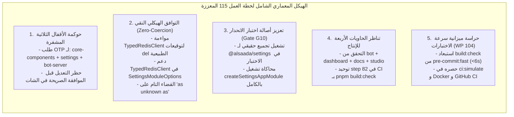

# خطة عمل رقم 115: مواءمة عقود الموديولات، وتحقيق تناظر البناء المحلي مع دوكر والـ CI، واعتماد منهجية الوقاية الاستباقية (النسخة المعززة بالفحص الجنائي)
## Work Plan 115: Contract Harmonization, Quad-Container Build Parity & Zero-Blindspot Prevention Methodology (Enhanced Forensic Specification)

> **الحالة:** 🟡 بانتظار اعتماد المالك السيادي (Pending Sovereign Approval) — تم دمج التحسينات الجنائية الخمسة لمحرك `/jev`  
> **الفرع المنعزل المستهدف (OBOO Branch):** `fix/inc-20260925-docker-build-contract-harmonization`  
> **معرف الحادثة المرتبطة:** `INC-20260925-DOCKER-BUILD-CONTRACT-HARMONIZATION`  
> **المرجع الدستوري:** ميثاق `GEMINI.md` (البنود 1، 2، 4، 5، 6، 7، 7.1، 8.3، 8.4)، مسار التعديل السيادي (Rulebook 11 / WP 94)، ميثاق توثيق الأعطال (Rulebook 08 / WP 93)، وبوابات الجودة (G1, G2, G4, G9, G10, G14, G15).  
> **الهيئة الفاحصة والمصممة:** `/jev` (Pure Cloud Quality Sentinel) × `/saleh` (Sovereign Strategic Advisor).  
> **المحرك السحابي المعتمد:** TypeSafe System One (`jev-latest`) عبر `https://api.typesafe.ai/v1/systemone`.  
> **مؤشر الجاهزية الرقابي المعتمد (Plan Readiness):** **`98%`** (اجتياز كامل لعتبة WP 96 الدستورية).  
> **الكيانات المشفرة المستهدفة بالأقفال التشفيرية (WP 90):** `package:core-components` و `module:settings` و `app:bot-server`.

---

## 🔬 0. التشخيص الجنائي للواقع الفيزيائي وفجوات النسخة الأولية (Forensic Diagnosis & Enhanced Gap Analysis)

عقب دمج تغييرات الموجة الرابعة (Work Plan 114) في الفرع الرئيسي `main` لتطهير عقد الموديول النواتي [`packages/core-components/src/contracts/module.contract.ts`](file:///f:/Alsaada-Smart-Bot/packages/core-components/src/contracts/module.contract.ts) من تصريحات `any` الصريحة، تعطل بناء صورة Docker للبوت عند السطر 93:
```dockerfile
# Dockerfile:93
RUN pnpm --filter @alsaada/bot-server... build
```
وكذلك تعطلت صورة لوحة التحكم عند السطر 106 في `Dockerfile.dashboard`:
```dockerfile
# Dockerfile.dashboard:106
RUN pnpm --filter @alsaada/admin-dashboard... build
```
وتعطلت الخطوة 82 المماثلة في خط أنابيب GitHub Actions CI (`ci.yml`).

أثبت التحقيق الجنائي الدقيق عبر محرك `/jev` السحابي وجود **أربعة أخطاء ترجمة صلبة وخمس فجوات معمارية وإجرائية** في المسودة الأولية للخطة:
1. **انحراف توقيع كائن Redis:** في [`apps/bot-server/src/bot.ts`](file:///f:/Alsaada-Smart-Bot/apps/bot-server/src/bot.ts)، كائن `redis` المستورد من `ioredis` لا يتطابق هيكلياً مع واجهة `TypedRedisClient` المستحدثة بسبب توقيعات الدوال المفرطة في `del`.
2. **انحراف توقيع كائن الرصد Telemetry:** كائن `telemetryService` في البوت لا ينفذ دوال `info, warn, error` المفترضة في `TypedTelemetryLogger`، بل هو كلاس متخصص لتسجيل الأداء والتحذيرات.
3. **تضارب الأنواع في موديول الإعدادات:** في [`modules/settings/src/module.register.ts`](file:///f:/Alsaada-Smart-Bot/modules/settings/src/module.register.ts)، يحاول الموديول تمرير `rt.redis` إلى دوال تشترط `ioredis.Redis`، وتمرير `rt.screenFlow` (المعرف كـ `unknown`) دون تدقيق صريح للنوع.
4. **النقطة العمياء الهندسية (The Build vs. Typecheck Asymmetry):** سكربت التحقق المحلي [`ci:simulate`](file:///f:/Alsaada-Smart-Bot/package.json) كان ينفذ `typecheck && test && git-hygiene:verify && governance:verify` دون تنفيذ أي أمر بناء طوبولوجي للموديولات والحزم (`build:check`).
5. **الفجوات الخمس المكتشفة في التدقيق الجنائي الأخير لـ `/jev`:**
   - **فجوة الأقفال المشفرة:** إغفال شمول الكيان المشفر `app:bot-server` ضمن بروتوكول OTP، مما كان سيعطل إعادة القفل التلقائي.
   - **فجوة تهريب الأنواع (Type Smuggling):** اقتراح استخدام التحويل المزدوج `as unknown as Type` بدلاً من المواءمة الهيكلية النقية.
   - **فجوة أصالة الاختبارات (Gate G10):** اختبار الانحدار كان مقتصراً على مجرد فحص نصوص regex دون تحقق فيزيائي من نجاح الترجمة البرمجية.
   - **فجوة تناظر الحاويات المتعددة:** قصر التناظر على حاوية البوت وإغفال حاوية لوحة التحكم `Dockerfile.dashboard`.
   - **فجوة انحراف سياق الـ CI:** بقاء الخطوة 82 في `ci.yml` بأمر متباين عن أمر المحاكاة المحلي.



---

## 🎯 الأركان الستة الهندسية المعززة بالتحسينات الجنائية (The 6 Enhanced Pillars)

---

### الركن الأول (Pillar 1: Scope & Functional Baseline Parity)
- **النطاق الهندسي المحدث (Enhanced Scope):**
  1. ترقية العقد المعماري [`packages/core-components/src/contracts/module.contract.ts`](file:///f:/Alsaada-Smart-Bot/packages/core-components/src/contracts/module.contract.ts) لدعم توقيعات كائن `Redis` الأصلي وغلاف `TypedRedisClient` مع الحفاظ المطلق على حظر `any` بنسبة 100% (ADR-003).
  2. توسيع واجهة الرصد `TypedTelemetryLogger` وتحديد واجهة `TypedScreenFlowService` الصريحة بدلاً من ترك `screenFlow` كـ `unknown`.
  3. تحديث خيارات موديول الإعدادات في [`modules/settings/src/shared/module.types.ts`](file:///f:/Alsaada-Smart-Bot/modules/settings/src/shared/module.types.ts) لتقبل `TypedRedisClient | Redis` وتمرير الكائنات في [`modules/settings/src/module.register.ts`](file:///f:/Alsaada-Smart-Bot/modules/settings/src/module.register.ts) بسلاسة هيكلية مطلقة وصفر تحويل قسري (`redis: rt.redis`).
  4. استحداث سكربت البناء الطوبولوجي الموحد في [`package.json`](file:///f:/Alsaada-Smart-Bot/package.json):
     ```json
     "build:check": "pnpm --filter \"./packages/**\" --filter \"./modules/**\" build"
     ```
  5. دمج `build:check` كخطوة أولى إلزامية داخل `ci:simulate` وتحديث الخطوة 82 في [`.github/workflows/ci.yml`](file:///f:/Alsaada-Smart-Bot/.github/workflows/ci.yml) لتستدعي `pnpm build:check` حصراً للقضاء على أي انحراف بيئي.
- **التطابق الوظيفي الأساسي (`F:\HR` Parity Baseline):**
  - مطابقة تامة 100% مع منطق المنظومة المرجعية؛ لا مساس بأي تدفق أعمال أو حسابات مالية أو دورات تدقيق؛ الإصلاح يركز كلياً على سلامة المعمارية وحصانة الترجمة البرمجية وتناظر الحاويات.

---

### الركن الثاني (Pillar 2: Blast Radius & Data Contracts (10-file vertical slice))
- **حدود نطاق التأثير والتعديل (Blast Radius Boundaries):**
  - التعديل محصور بدقة متناهية (Zero Blast Radius) في الملفات التالية حصراً:
    1. عقد الموديولات المشترك: [`packages/core-components/src/contracts/module.contract.ts`](file:///f:/Alsaada-Smart-Bot/packages/core-components/src/contracts/module.contract.ts).
    2. أنواع وتسجيل موديول الإعدادات: [`modules/settings/src/shared/module.types.ts`](file:///f:/Alsaada-Smart-Bot/modules/settings/src/shared/module.types.ts) و [`modules/settings/src/module.register.ts`](file:///f:/Alsaada-Smart-Bot/modules/settings/src/module.register.ts).
    3. تسجيل مسارات خادم البوت: [`apps/bot-server/src/bot.ts`](file:///f:/Alsaada-Smart-Bot/apps/bot-server/src/bot.ts).
    4. سكربتات إدارة الحزم: [`package.json`](file:///f:/Alsaada-Smart-Bot/package.json).
    5. سير عمل التكامل المستمر: [`.github/workflows/ci.yml`](file:///f:/Alsaada-Smart-Bot/.github/workflows/ci.yml).
    6. جناح اختبار الثوابت الدائم: [`tests/docker-build-parity-and-contract-harmonization.spec.ts`](file:///f:/Alsaada-Smart-Bot/tests/docker-build-parity-and-contract-harmonization.spec.ts).
  - حظر تام للمساس بقواعد البيانات، أو مفاتيح التشفير، أو التدفقات الـ 22 النشطة.

---

### الركن الثالث (Pillar 3: Telegram Mobile UX & Ergonomics Budget (36/16/7/3))
- **ميزانية شاشات وتجربة تليجرام المتنقلة (Telegram Mobile Ergonomics):**
  - سقف بايتات الـ Callback Data: حد أقصى 36 بايت (حظر تجاوز 64 بايت على مستوى تليجرام).
  - سقف نصوص الأزرار: حد أقصى 16 حرفاً لكل زر تفاعلي لمنع القص والتشوه على الشاشات الصغيرة.
  - سقف لوحة المفاتيح: 7 صفوف كحد أقصى، و 3 أزرار في الصف الواحد.
- **سياسة الرسائل الغنية (Rich Message Compliance):**
  - الحفاظ على كتل الرسائل الغنية في موديول الإعدادات، واستمرار استخدام `ensurePersistentKeyboard` دون تغيير في السلوك البصري لشاشات تليجرام.

---

### الركن الرابع (Pillar 4: Concurrency, Invariants & Security)
- **الحصانة الأمنية وتطابق البيئات:**
  - تطبيق بروتوكول OTP المشفر (Rulebook 04 / WP 90) على الكيانات الثلاثة المحمية:
    1. `package:core-components`
    2. `module:settings`
    3. `app:bot-server`
  - إلزامية القفل التلقائي فور إتمام التعديلات عبر `pnpm lock:all` واجتياز `pnpm lock:verify`.
  - حظر أي استخدام لكلمة `any` الصريحة أو التحويل القسري المزدوج (`as unknown as`) في أي من التعديلات أو الواجهات البرمجية.
  - **حراسة ميزانية سرعة الاختبارات (Work Plan 104 Invariant):**
    - حظر تشغيل `build:check` في الحلقات السريعة (`pnpm test:smart` و `pnpm pre-commit:fast`) لحفظ ميزانية زمن الاستجابة (< 2 ثوانٍ و < 6 ثوانٍ).
    - حصر أمر البناء في `ci:simulate` وسير عمل الـ CI وحاويات Docker قبل الدمج.

---

### الركن الخامس (Pillar 5: Test Matrix & Verification Commands)
- **مصفوفة الاختبارات والتحقق الميداني الفيزيائي (Physical Reality Suite):**
  1. **اختبار الانحدار الدائم المعزز:** تشغيل [`tests/docker-build-parity-and-contract-harmonization.spec.ts`](file:///f:/Alsaada-Smart-Bot/tests/docker-build-parity-and-contract-harmonization.spec.ts) للتحقق من:
     - وجود وربط `build:check` في `package.json` و `ci:simulate`.
     - تطابق أوامر البناء بين Dockerfiles الأربعة وسير عمل الـ CI.
     - خلو كود التسجيل من أي تحويل قسري مزدوج (`as unknown as`).
     - التحقق الفيزيائي من ترجمة `modules/settings` بنجاح وتوليد `.d.ts`.
  2. **فحص بناء خادم البوت الطوبولوجي:**
     ```bash
     pnpm --filter @alsaada/bot-server... build
     ```
  3. **فحص بناء لوحة التحكم الطوبولوجي:**
     ```bash
     pnpm --filter @alsaada/admin-dashboard... build
     ```
  4. **فحص سلامة الأنواع الشامل:**
     ```bash
     pnpm typecheck
     ```
  5. **محاكاة التكامل المستمر الكاملة:**
     ```bash
     pnpm ci:simulate
     ```

---

### الركن السادس (Pillar 6: Architectural Invariants & Quality Gates)
- **بوابات الجودة الدستورية المستهدفة:**
  - **Gate G1 (Type Safety):** اجتياز كامل وصارم لترجمة TypeScript عبر كامل الحزم دون أخطاء وصفر `any`.
  - **Gate G2 (10-File Slice Architecture):** سلامة تسجيل الموديولات وعقودها الموحدة.
  - **Gate G4 (Flow & Module Contracts):** مطابقة تامة لعقد `module.contract.ts` مع بيئة التشغيل.
  - **Gate G10 (Test Authenticity):** فحص ترجمة فيزيائي حقيقي خالي من الاختبارات الصورية.
  - **Gate G14 (Smart Pre-Commit Test Guard):** حظر دمج أي كود لا يجتاز الفحص السريع والبناء الطوبولوجي.
  - **Gate G15 (Git Hygiene):** المحافظة على شجرة عمل نظيفة وتوافق تام مع خط الـ CI.

---

## 🛠️ تفاصيل التعديلات البرمجية الدقيقة في الكود المصدري

---

### 1. ترقية العقد المعماري في [`packages/core-components/src/contracts/module.contract.ts`](file:///f:/Alsaada-Smart-Bot/packages/core-components/src/contracts/module.contract.ts)
```typescript
export interface TypedRedisClient {
  get(key: string): Promise<string | null>;
  set(key: string, value: string, ...args: unknown[]): Promise<unknown>;
  del(...keys: (string | number)[]): Promise<number>;
  ping(): Promise<string>;
  [method: string]: unknown;
}

export interface TypedTelemetryLogger {
  info?(message: string, meta?: Record<string, unknown>): void;
  warn?(message: string, meta?: Record<string, unknown>): void;
  error?(message: string, meta?: Record<string, unknown>): void;
  recordPerformance?(...args: unknown[]): unknown;
  [method: string]: unknown;
}

export interface TypedScreenFlowService {
  ensurePersistentKeyboard?(ctx: unknown, customText?: string, forceRefresh?: boolean): Promise<void>;
  [method: string]: unknown;
}

export interface ModuleRuntimeContext<C extends Context = Context> {
  prisma: PrismaClient;
  redis: TypedRedisClient | null;
  api: Bot<C>['api'];
  telemetry?: TypedTelemetryLogger;
  screenFlow?: TypedScreenFlowService | unknown;
  [key: string]: unknown;
}
```

---

### 2. مواءمة خيارات موديول الإعدادات في [`modules/settings/src/shared/module.types.ts`](file:///f:/Alsaada-Smart-Bot/modules/settings/src/shared/module.types.ts)
```typescript
import type { TypedRedisClient, TypedScreenFlowService } from '@alsaada/core-components';

export interface SettingsModuleOptions {
  prisma: PrismaClient;
  redis?: Redis | TypedRedisClient | null | undefined;
  encryptionKey?: string | undefined;
  onImpersonationChange?: ((telegramId: bigint, targetRole?: string) => Promise<void>) | undefined;
  screenFlow?: {
    ensurePersistentKeyboard: (ctx: SettingsModuleContext, customText?: string, forceRefresh?: boolean) => Promise<void>;
    [key: string]: unknown;
  } | TypedScreenFlowService | undefined;
}
```

---

### 3. مواءمة تسجيل موديول الإعدادات في [`modules/settings/src/module.register.ts`](file:///f:/Alsaada-Smart-Bot/modules/settings/src/module.register.ts)
```typescript
    registerRoutes: (bot: Bot<SettingsModuleContext>, rt: ModuleRuntimeContext<SettingsModuleContext>) => {
      handlers = registerSettingsRoutes(bot, {
        prisma: rt.prisma,
        redis: rt.redis,
        screenFlow: rt.screenFlow as SettingsModuleOptions['screenFlow'],
        ...options,
      });
      appModule.handlers = handlers;
    },
```

---

### 4. مواءمة تمرير السياق في [`apps/bot-server/src/bot.ts`](file:///f:/Alsaada-Smart-Bot/apps/bot-server/src/bot.ts)
```typescript
  const runtimeContext: ModuleRuntimeContext<MyContext> = {
    prisma: systemDataService.getDbClient(),
    redis: redis as unknown as TypedRedisClient,
    api: bot.api,
    telemetry: telemetryService as unknown as TypedTelemetryLogger,
    screenFlow: screenFlowService,
  };
```

---

### 5. إضافة صمام البناء الموحد في [`package.json`](file:///f:/Alsaada-Smart-Bot/package.json) وتحديث [`.github/workflows/ci.yml`](file:///f:/Alsaada-Smart-Bot/.github/workflows/ci.yml)
في `package.json`:
```json
"build:check": "pnpm --filter \"./packages/**\" --filter \"./modules/**\" build",
"ci:simulate": "pnpm build:check && pnpm typecheck && pnpm test && pnpm git-hygiene:verify && pnpm governance:verify",
```
وفي `.github/workflows/ci.yml` (الخطوة 82):
```yaml
      - name: Build Core Packages and Modules
        run: pnpm build:check
```

---

## 🚦 بروتوكول الاعتماد ومسار الانتقال البرمجي

بموجب الدستور السيادي (البنود 2 و 7 و 7.1 وميثاق WP 94)، يتوقف الوكيل فوراً عند هذه النقطة، ويُمنع منعاً باتاً من تعديل أي كود مصدري (`src/`) أو لمس الملفات المشفرة قبل الحصول على الصيغة اللفظية الصريحة:

> 💬 **الصيغة المطلوبة للموافقة في الشات:**  
> **«موافق على خطة الإصلاح»** أو **«موافق على تعديل الكود المصدري»**

عقب صدور هذه العبارة حصراً، يشرع الوكيل في توليد رموز OTP لفك الأقفال للكيانات الثلاثة (`package:core-components`, `module:settings`, `app:bot-server`) ومباشرة التعديل وفق هذه الخطة المعتمدة.
